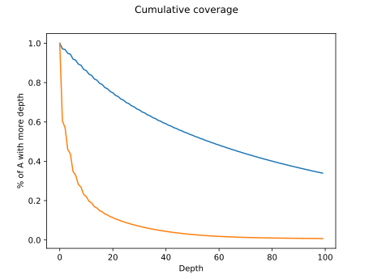

# Проверка покрытия экзомных районов ридами библиотеки

## Основное

Выяснить, насколько каждая буква районов в bad track (Roch MedExome target capture) покрывается ридами наших библиотек.
Это нужно для корректировки методики секвенирования.

**TODO**: Поискать программы, которые вычисляют coverage.

## Ход работы

1. Target capture можно скачать [отсюда](https://sequencing.roche.com/en/products-solutions/by-category/target-enrichment/hybridization/seqcap-ez-medexomekit.html) (раздел Design files).
Были использованы hg19 capture targets.

2. Для анализа coverage была выбрана утилита *bedtools*.
Плюсы её в том, что она есть в репозиториях убунты.

```
$ sudo apt install bedtools
```

*bedtools* оказался весьма глючной тулзой.
В общем, описываю порядок колдунства:

* Вытащить из заголовка sam-файла порядок хромосом.
Что-то типа такого: `@SQ	SN:chr1	LN:249250621`.
Очистить их от мусора (оставив только имена) и сохранить в *names.txt*.

* Отсортировать bed-файл, используя *names.txt*:

```
$ bedtools sort -faidx ./names.txt -i ./MedExome_hg19_capture_targets.bed > MedExome_hg19_capture_targets.sorted.bed
```

* сделать из hg19 fa.fai-файл (подробно о компиляции индекса [здесь](./BiblExome.md)).
* подключить fa.fai и отсортированный bed-файл:

```
bedtools coverage -hist -sorted -g /dev/datasets/FairWind/hg19.fa.fai -a /dev/datasets/FairWind/trimmed/MedExome_hg19_capture_targets.sorted.bed -b /dev/datasets/FairWind/trimmed/bams/sample-1-1.sorted.bam > ./coverage_report.txt
```

Ты можешь попробовать посчитать coverage без -sorted, мой юный друг, но помни -- в этом случае bam-файл уходит в оперативку полностью и процесс рискует убицца.
Да, чуваки как-то не подумали.

3. Нужные нам результаты оказались в конце - раздел `all`.
Обработка производилась с помощью скрипта *kovoer.py*:

```python
import pickle
import pandas as pd
import matplotlib.pyplot as plt

with open("../_pickles/csv/hist_coverage_[all].pd.pickle", 'rb') as f:
    hist = pickle.load(f)

hist = hist.apply(pd.to_numeric, errors='ignore')

print("Pickle loaded.", end="\n")

percents = hist['% of A at depth'].tolist()

plt.plot(percents[:100])
plt.ylabel('% from A at depth')
plt.xlabel('Depth')
plt.savefig("./coverage_100.svg")

print("Coverage is ready.", end="\n")

cover_50 = 0
cover_75 = 0
cover_90 = 0
cover_95 = 0

cumulate = []
for it in range(len(percents)):
    summa = sum(percents[it:])
    cumulate += [summa]
    if summa > 0.5: cover_50 = it
    if summa > 0.75: cover_75 = it
    if summa > 0.9: cover_90 = it
    if summa > 0.95: cover_95 = it

plt.clf()

plt.plot(cumulate[:100])
plt.ylabel('% of A with more depth')
plt.xlabel('Depth')
plt.savefig("./cumulate_100.svg")

print("Cumulate is ready.", end="\n")

print(f"Non-coverage = {percents[0] * 100}%", end="\n")
print(f"Median = depth {cover_50}", end="\n")
print(f"Cover 75% = depth {cover_75}", end="\n")
print(f"Cover 90% = depth {cover_90}", end="\n")
print(f"Cover 95% = depth {cover_95}", end="\n")
```

### Покрытие всего генома

1. bed-файл для hg19:

```
$ awk '{print $1 "\t0\t" $2}' human_hg19.fa.fai > human_hg19.bed
```

2. Дальше запускается *bedtools* так же, как и выше.

### Результаты

```
CAPTURE DATA
Non-coverage = 2.8359699999999997%
Median = depth 56
Middle = depth 106.64814649999987
Cover 75% = depth 19
Cover 90% = depth 6
Cover 95% = depth 2

HG19 DATA
Non-coverage = 39.479150000000004%
Median = depth 2
Middle = depth 8.624028099999986
Cover 75% = depth 0
Cover 90% = depth 0
Cover 95% = depth 0
```


Любопытна форма графика -- чётные значения всегда больше нечётных.
Было высказано предположение, что это из-за короткого insert-size -- парные риды частично перекрывают друг друга.



Синий -- capture, красный -- hg19.

Полные данные bedtools coverage -- [capture](./scripts_results/hist_coverage.txt), [hg19](./scripts_results/hist_hg19.txt).

## Покрытие букв возле сайтов рестрикции

В разработке.
