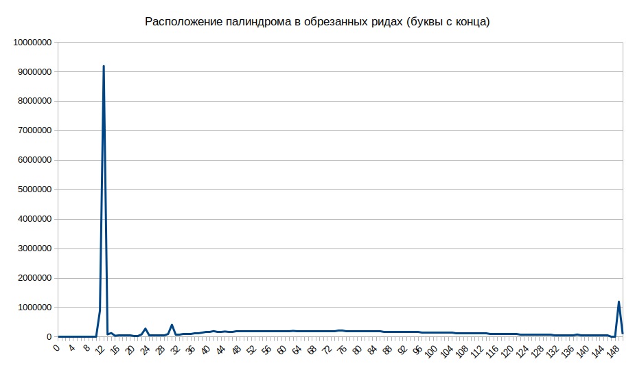

# Неизвестный палиндром

В результатах Exo-C с помощью приложения *FastQC* был обнаружен неизвестный палиндромный участок `CTCAGCGCTGAG`.
Частота его встречаемости, согласно данным скрипта *palindrome.py*, составляет 22.69%, в начале (5' конец, вторая позиция) - 6.88%.

```python
import gzip
import sys

def Out(found_, total_):
    print("Found: %d | Total: %d" % (found_, total_), end='\r')

filename = './sample.fastq.gz'

input0 = gzip.open(filename, 'r')
output0 = open('./output.fq', 'w')

new_found_land = ""
counter = 0
total = 0
found = 0

for line in input0:

    Out(found, total)

    counter += 1
    if counter == 5:
        counter = 1
    if counter < 1:
        continue

    tyk = line.decode().find("CTCAGCGCTGAG")

    if (counter == 2) and (tyk == -1):
        new_found_land = ""
        counter = -2
        total += 1
        continue

    new_found_land += line.decode("utf-8")

    if counter == 4:
        output0.write(new_found_land)
        new_found_land = ""
        found += 1
        total += 1

print('\n')

input0.close()
output0.close()
```

Было решено узнать, что собой представляет этот участок.

## Основная гипотеза

Палиндром является сдвоенным фрагментом blunt-адаптера, по какой-то причине потерявшим конец.

## Ход работы

С помощью *cutadapt* были найдены последовательности, содержащие искомый палиндром.

```
$ cutadapt -g ^CCTCAGCGCTGAG --trimmed-only -o ./output.ca.fastq ./sample.fastq.gz

This is cutadapt 1.18 with Python 3.7.3
Command line parameters: -g ^CCTCAGCGCTGAG --trimmed-only -o ./output.ca.fastq ./sample.fastq.gz
Processing reads on 1 core in single-end mode ...
Finished in 1481.04 s (12 us/read; 5.19 M reads/minute).

=== Summary ===

Total reads processed:             128,195,237
Reads with adapters:                10,090,133 (7.9%)
Reads written (passing filters):    10,090,133 (7.9%)

Total basepairs processed: 19,229,285,550 bp
Total written (filtered):  1,383,201,351 bp (7.2%)

=== Adapter 1 ===

Sequence: CCTCAGCGCTGAG; Type: anchored 5'; Length: 13; Trimmed: 10090133 times.

No. of allowed errors:
0-9 bp: 0; 10-13 bp: 1

Overview of removed sequences
length  count   expect  max.err error counts
12      938313  7.6     1       0 938313
13      9066637 1.9     1       8892621 174016
14      85183   1.9     1       0 85183
```

Далее результаты были снова обработаны с помощью *FastQC* ([данные здесь](http://htmlpreview.github.io/?https://github.com/regnveig/labjournal/blob/master/FastQC_results/fastqc_190718_1327.html)).
Программа обнаружила 3 длинных оверрепрезентированных последовательности, две из которых были определены как **TruSeq Adapter**, и одну неизвестную последовательность.
Их частоты составляют 0.2% (для TruSeq-адаптеров) и 0.1% (неизвестная последовательность) среди ридов, содержащих искомый палиндром.

Далее последовательности были выровнены относительно друг друга.

```
-----------------------------GAGATCGGAAGAGCACACGTCTGAACTCCAGTCACATCACGATCTCGTAT
------------------GGATCCCTCAGCAGATCGGAAGAGCACACGTCTGAACTCCAGTCACATCA
GGATCCCTCAGCGCTGAGGGATCCCTCAGCAGATCGGAAGAGCACACGTC
```

Искомый палиндром был обнаружен в третьей (неизвестной) последовательности - GGATCC**CTCAGCGCTGAG**GGATCCCTCAGCAGATCGGAAGAGCACACGTC.
Также выяснено, что палиндром является частью ещё более крупного палиндрома, входящего в эту последовательность - GGATCCCTCAGCGCTGAGGGATCC.

В сочетании с вырезанным нами палиндромом он даёт ещё более длинный палиндром - **CCTCAGC***GCTGAGG*GATC**CCTCAGC***GCTGAGG*GATC**CCTCAGC**AGATCGGAAGAGCACACGTCTGAACTCCAGTCACATCACGATCTCGTAT

Было решено построить детально модель HiC и секвенирования по методике, чтобы понять, что произошло.

## Модель HiC и секвенирования

Методика описана в следующих статьях: [принципиальная схема](https://www.ncbi.nlm.nih.gov/pubmed/25437436), [подробная инструкция](https://www.ncbi.nlm.nih.gov/pubmed/29382556).

1. Фиксация, выделение ядер
2. Разрезание хроматина ДНКазой I
3. Обработка ДНК-полимеразой, фрагментом Кленова (5'→3' полимеразная активность, корректорная 3'→5' кусь-активность)
4. dA-tailing - фрагмент Кленова, dATP
5. ДНК-лигаза, Т-tailed биотин-меченый bridge-адаптер, blunt-ended Bridge безбиотиновый

```
bridge                      blunt

 P        Biot
 |        |
 5-GCTGAGGGATC-3           5-GCTGAGGGAC-3
3-TCGACTCC-5               3-CGACTCC-5

reversed 
         :egdirB             :tnulB
    5-CCTCAGCT-3             5-CCTCAGC-3
3-CTAGGGAGTCG-5           3-CAGGGAGTCG-5
     |      |
     Biot   P
     
     
Products of adapter ligation:

(genome-A-)Bridge/GATC/egdirB-(T-genome):
        (A)GCTGAGG/GATC/CCTCAGC(T)
just sequence, palyndromic: AGCTGAGGGATCCCTCAGCT

(genome-A-)Bridge---egdirB(T-genome):
        (A)GCTGAGG-CCTCAGC(T)
just sequence, palyndromic: AGCTGAGGCCTCAGCT

(remove GATC)egdirB(remove T)-(remove T)Bridge(remove GATC):
             CCTCAGC-------------------GCTGAGG
just sequence, palyndromic: CCTCAGCGCTGAGG

       tnulB-Blunt:
(GTC)CCTCAGC-GCTGAGG(GAC)
Just sequence (palyndromic): GTCCCTCAGCGCTGAGGGAC

```


6. Полинуклеотидкиназа (прикрепляет фосфат к 5'), затем лигаза
7. Растворение белков и очистка ДНК
8. ДНК-полимераза, dATP, dGTP - достраивание цепей
9. Фрагментация ДНК до размеров 100-300

Далее методика меняется на протокол NEBNext Ultra II ([ссылка](http://www.bea.ki.se/documents/datasheet_NEB_Ultra%20II%20DNA.pdf)).

...

**Гипотезы**
1. Наш палиндром `CTCAGCGCTGAG` (23% ридов) может быть либо стыком 
egdirB(remove T)-(remove T)Bridge

либо

tnulB-Blunt

Различить эти два сценария можно только анализируя буквы до/после найденного палиндрома. А в случае, если они "обкусаны", вообще нельзя.

2. Длинная оверепрезентированная последовательность (**CCTCAGC***GCTGAGG*GATC**CCTCAGC***GCTGAGG*GATC**CCTCAGC**AGATCGGAAGAGCACACGTCTGAACTCCAGTCACATCACGATCTCGTAT) набиолее вероятно обарзовалась так: сначала слиплись две последовательности Bridge, образовав egdirB(remove T)-(remove T)Bridge-GATC. Затем, они слиплись друг с другом по липким GATC концам.

Т.е. сначала бриджи слиплись друг с другом "спинками", а потом два таких соеденились по липкому концу.

egdirB(remove T)-(remove T)Bridge-GATC-egdirB(remove T)-(remove T)Bridge

## Промежуточная задача

Поискать bridge и blunt-адаптеры в библиотеке.
Bridge - `AGCTGAGGGATC`, blunt - `GCTGAGGGAC` и палиндром-содержащий участок `CCTCAGCGCTGAGGGAC`.
Найти их общее количество, а также распределение по позициям в риде.

Обработка была произведена с помощью скрипта `palindrome2.py`.

```python
import gzip
import sys
import pandas as pd
import string

def Out(found_, total_):
    print("Found: %d | Total: %d (%4f%%)" % (found_, total_, found_ * 100 / total_), end='\r')

filename = './sample.fastq.gz'
seq = 'CCTCAGCGCTGAGGGAC'
comment = "Double Blunt adapter"

print(f"\nHi there.\nWe're looking for: {seq} ({comment})\n")

input0 = gzip.open(filename, 'r')

counter = 0
total = 1
found = 0
tyk = 0
df = pd.DataFrame({
'position' : [0],
'count' : [0]
})

for line in input0:

    Out(found, total)

    counter += 1
    if counter == 5:
        counter = 1
    if counter < 1:
        continue

    if (counter == 2):
        tyk = line.decode("utf-8").find(seq)
        if (tyk == -1):
            counter = -2
            total += 1
            continue


    if counter == 4:
        if df.loc[df['position'] == tyk].empty:
            df = df.append({'position': tyk, 'count': 1}, ignore_index=True)
        else:
            df.at[df.loc[df['position'] == tyk].index[0], 'count'] += 1

        found += 1
        total += 1

output0 = open('./report_' + seq + '.txt', 'w')
df.sort_values(by=['position'], ascending=True).to_string(output0)
print('\n')

input0.close()
output0.close()
```

Результаты:

* Двойной blunt-адаптер встречается в 0.6% ридов.
Пики наблюдаются на позициях 0, 11, небольшой пик на 18 ([данные](./scripts_results/report_palindrome_doubleblunt_190719.txt)).

```
$ python3 ./palindrome_doubleblunt.py

Hi there.
We're looking for: CCTCAGCGCTGAGGGAC (Double Blunt adapter)

Found: 775465 | Total: 128195238 (0.604909%)
```


* Одиночный blunt-адаптер встречается в 1.42% ридов.
Пики на позициях 0, 7 и 18 ([данные](./scripts_results/report_palindrome_blunt_190719.txt)).

```
$ python3 ./palindrome_blunt.py

Hi there.
We're looking for: GCTGAGGGAC (Blunt adapter)

Found: 1816057 | Total: 128195238 (1.416634%)
```


* bridge-адаптер встречается в 20% ридов.
В начале его почти нет, повышение на позиции 8, пики на 18, 26 и 32, затем спад до конца ([данные](./scripts_results/report_palindrome_bridge_190722.txt)).

```
$ python3 ./palindrome_bridge.py

Hi there.
We're looking for: AGCTGAGGGATC (Bridge adapter)

Found: 26622524 | Total: 128195238 (20.767171%)
```


Таблица ODS с данными, [если вдруг понадобится](./scripts_results/palindrome2_results_190722.ods).

**TODO:**

поискать ешё димеры egdirb-bridge-GATC

Или, что может быть ещё лучше, проанализировать контент букв до и после *CTCAGCGCTGAG*

## Анализ букв до и после палиндрома

Сбор данных производился скриптом `palida.py`.
Данные записывались в трёхмерный массив: (число_позиций_в_риде, по_5_позиций_до_и_после_палиндрома, нуклеотиды).

```python
import gzip
import sys
import numpy as np
import string

def Out(total_):
    print("Total: %d" % (total_), end='\r')

filename = './sample.fastq.gz'
seq = "CTCAGCGCTGAG"
length = len(seq)
poses = list([-5, -4, -3, -2, -1, length + 1, length + 2, length + 3, length + 4, length + 5])
nuc = list('ATGCN0')
a = np.zeros(shape=(150,10,6))

print(f"\nPalindrome deep analysis.\nMaking a dump...\n")

input0 = gzip.open(filename, 'r')

counter = 0
total = 0
tyk = 0

for line in input0:

    Out(total)

    counter += 1
    if counter == 5:
        counter = 1

    if (counter == 2):
        line_d = line.decode("utf-8")
        tyk = line_d.find(seq)
        if not (tyk == -1):
            for i in range(10):
                pos_abs = tyk + poses[i]
                if (pos_abs < 0) or (pos_abs > 149):
                    a[tyk, i, nuc.index('0')] += 1
                else:
                    a[tyk, i, nuc.index(line_d[pos_abs])] += 1

        total += 1

print(np.sum(a, axis = (1, 2)))
np.save('./this.dump', a)

print('\n')

input0.close()
```

Заодно были получены данные по распределению палиндрома в геноме: два пика на 1 и 12 ([данные](./scripts_results/report_palida_190722.txt)).


Результаты были проанализированы в трёх точках: на двух пиках (1 и 12), а также на плато (60) - [данные](./scripts_results/report_palida_analysis_190722.txt).


Из этого можно сделать следующие выводы:

1. Скорее всего, я накосячил в скрипте с длиной палиндрома.
Надо было прибавлять не `len(str)`, а `len(str) - 1`.

2. Во всех трёх позициях до и после палиндрома встречаются фиксированные сочетания букв.
    * Позиция 1: С**CTCAGCGCTGAG**_GATCC
    * Позиция 12: GATCC**CTCAGCGCTGAG**_GATCC
    * Позиция 60: GATCC**CTCAGCGCTGAG**. За ней следует что-то такое: _(G|A)(G|A)(T|A)(T|C)C.

Результаты не совсем ясно показывают ситуацию, поэтому решено было ещё раз запустить скрипт, взяв на этот раз 20 букв по периметру палиндрома вместо 5 ([данные](./scripts_results/report_palida_analysis20_190722.txt)).
Также был исправлен косяк с длиной палиндрома.


Последовательности:

* Позиция 1: C**CTCAGCGCTGAG**GGATCCCTCAGC
* Позиция 12: GCTGAGGGATCC**CTCAGCGCTGAG**GGATCCCTCAGC___
* Позиция 60: ___GCTGAGGGATCC**CTCAGCGCTGAG**G(A|G)(G|A)(A|T)(C|T)CGGAAGAGCACACGT

Выравнивание 1 и 12 позиций:
Можно утверждать, что в начале ридов есть большой процент **egdirb-bridge-GATC-egdirb-bridge-GATC-egdirb**:

```
CCTCAGCGCTGAGGGATCCCTCAGC
-------GCTGAGGGATCCCTCAGCGCTGAGGGATCCCTCAGC
CCTCAGCGCTGAGGGATCCCTCAGCGCTGAGGGATCCCTCAGCGCTGAGGGATC
```

В позиции 60 после палиндрома идёт нечто похожее на первый TruSeq-адаптер:

```
---------------------------GAGATCGGAAGAGCACACGTCTGAACTCCAGTCACATCACGATCTCGTAT
___GCTGAGGGATCCCTCAGCGCTGAGGAGATCGGAAGAGCACACGT
                            GATC
```

Второй вариант позиции 60 похож на те, что встречаются в позициях 1 и 12.

```
---GCTGAGGGATCCCTCAGCGCTGAGGGATCCctcagc___
___GCTGAGGGATCCCTCAGCGCTGAGGGATCCggaagagcacacgt

```
Т.е. можно утверждать, что в позиции 60 есть доля как **bridge-GATC-egdirb-bridge-TruSeq**, так и просто bridge-GATC-egdirb-bridge-GATC.

Таблица ODS, [если понадобится](./scripts_results/palida_results_190722.ods).

### TODO

1. Поискать палиндром с A|T в середине.
2. Поискать палиндром в прочих сэмплах, а также в данных из статей.
3. Отрезать с помощью *cutadapt* Иллюминовские адаптеры, посмотреть распределение палиндрома по %.
4. Если будет время -- написать для *cutadapt* штуку, убирающую вакханалию.

## Анализ прочих библиотек

Палиндром с A|T в середине почти не встречается.
Их количество примерно одинаковое и не превышает 300 на 1000000 (0,03%).

Затем были исследованы прочие сэмплы (из каждого взято по 1 млн ридов).
Получены следующие результаты:

* Значительное, но непостоянное количество палиндрома (~4-30%) обнаружено только в сэмплах под номером 1.
В сэмплах 2 палиндрома почти нет (до 10-20 на 1 млн).
**Поправка:** Сэмпл 2 из другого секвенирования, к текущему опыту не имеет отношения.


Таблица ODS, [если понадобится](./scripts_results/paliall_190729.ods).

### Промежуточная задача -- работа с *fastq_dump*

Данные из статей можно найти [здесь](https://www.ncbi.nlm.nih.gov/sra?term=SRP041253).

Для получения результатов из статьи понадобился инструмент *fastq_dump*.
Установка из сырцов оказачалась чересчур муторной, поэтому я нашёл скомпилированный вариант *sratoolkit*:

```
$ wget "http://ftp-trace.ncbi.nlm.nih.gov/sra/sdk/current/sratoolkit.current-centos_linux64.tar.gz"
```

Для задачи нам требовался всего 1 млн ридов, не было смысла выкачивать данные целиком.

```
$ cd ./bin
$ ./fastq-dump -Z --split-3 SRR1248196 | head -n 4000000 > [output_path]/SRR1248196_short.fastq
```

Файлы были обработаны с помощью скрипта *ash.py*:

```python
import sys
import pandas as pd
import string

def Out(found_, total_):
    print("Found: %d | Total: %d (%4f%%)" % (found_, total_, found_ * 100 / total_), end='\r')

filelist = ['SRR1248196', 'SRR1248194', 'SRR1248191', 'SRR1248188', 'SRR1248183', 'SRR1248180', 'SRR1248178', 'SRR1248176']
seq = 'CTCAGCGCTGAG'

print(f"\nHi there.\nWe're looking for: {seq}\n")

for file_sn in filelist:

    print(f"Open {file_sn}...\n")

    input0 = open('/dev/datasets/ngs_data/article_DNAaseHiC_data/' + file_sn + '_1M_short.fastq', 'r')

    counter = 0
    total = 1
    found = 0
    tyk = 0
    df = pd.DataFrame({
        'count' : [0] * 150
    })

    for line in input0:

        Out(found, total)

        counter += 1
        if counter == 5:
            counter = 1

        if (counter == 2):
            total += 1
            tyk = line.find(seq)
            if (tyk != -1):
                df.at[tyk, 'count'] += 1
                found += 1

    output0 = open('./report_' + file_sn + '.txt', 'w')
    df.to_string(output0)
    print('\n')

    input0.close()
    output0.close()
```

Результаты:

| Образец    | Расшифровка                        | Палиндром (на 1М ридов) | %    |
|------------|------------------------------------|-------------------------|------|
| SRR1248196 | targetedDNaseHiC-lincRNA-K562-rep2 | 113523                  | 11.3 |
| SRR1248194 | targetedDNaseHiC-lincRNA-K562-rep1 | 148812                  | 14.8 |
| SRR1248191 | targetedDNaseHiC-lincRNA-H1-rep2   | 108244                  | 10.8 |
| SRR1248188 | targetedDNaseHiC-lincRNA-H1-rep1   | 120374                  | 12.0 |
| SRR1248183 | targetedDNaseHiC-pe-K562-rep1      | 191774                  | 19.1 |
| SRR1248180 | targetedDNaseHiC-pe-H1-rep1        | 145528                  | 14.5 |
| SRR1248178 | DNaseHiC-WG-K562                   | 175093                  | 17.5 |
| SRR1248176 | DNaseHiC-WG-H1                     | 88565                   | 8.8  |

Что интересно -- в данных из статей палиндром почти не встречается на протяжении рида, он чётко собран в два пика на позициях 1 и 12.


Таблица ODS, [если понадобится](./scripts_results/ash_190730.ods).

### Распределение палиндрома в обрезанных ридах

Адаптеры Illumina обрезались инструментом *cutadapt*.
Код предоставлен Е. Можейко.

```
$ cutadapt -m 8 -j 10 -a AGATCGGAAGAGCACACGTCTGAACTCCAGTCAC -A AGATCGGAAGAGCGTCGTGTAGGGAAAGAGTGTAGATCTCGGTGGTCGCCGTATCATT -o ./sample-1-1_R1_cut.fastq -p ./sample-1-1_R2_cut.fastq /dev/datasets/ngs_data/ExoC_Belopuz/30-213832944/sample-1-1_R1_001.fastq.gz /dev/datasets/ngs_data/ExoC_Belopuz/30-213832944/sample-1-1_R2_001.fastq.gz

This is cutadapt 1.18 with Python 3.7.3
Command line parameters: -m 8 -j 10 -a AGATCGGAAGAGCACACGTCTGAACTCCAGTCAC -A AGATCGGAAGAGCGTCGTGTAGGGAAAGAGTGTAGATCTCGGTGGTCGCCGTATCATT -o ./sample-1-1_R1_cut.fastq -p ./sample-1-1_R2_cut.fastq /dev/datasets/ngs_data/ExoC_Belopuz/30-213832944/sample-1-1_R1_001.fastq.gz /dev/datasets/ngs_data/ExoC_Belopuz/30-213832944/sample-1-1_R2_001.fastq.gz
Processing reads on 10 cores in paired-end mode ...
Finished in 899.01 s (7 us/read; 8.56 M reads/minute).

=== Summary ===

Total read pairs processed:        128,195,237
  Read 1 with adapter:             103,462,552 (80.7%)
  Read 2 with adapter:             102,619,842 (80.0%)
Pairs that were too short:               1,779 (0.0%)
Pairs written (passing filters):   128,193,458 (100.0%)

Total basepairs processed: 38,458,571,100 bp
  Read 1: 19,229,285,550 bp
  Read 2: 19,229,285,550 bp
Total written (filtered):  28,148,496,493 bp (73.2%)
  Read 1: 14,055,065,633 bp
  Read 2: 14,093,430,860 bp

=== First read: Adapter 1 ===

Sequence: AGATCGGAAGAGCACACGTCTGAACTCCAGTCAC; Type: regular 3'; Length: 34; Trimmed: 103462552 times.

No. of allowed errors:
0-9 bp: 0; 10-19 bp: 1; 20-29 bp: 2; 30-34 bp: 3

Bases preceding removed adapters:
  A: 23.2%
  C: 26.9%
  G: 34.0%
  T: 15.9%
  none/other: 0.0%

Overview of removed sequences
length  count   expect  max.err error counts
3       1087309 2003050.6       0       1087309
4       756299  500762.6        0       756299
5       719939  125190.7        0       719939
6       714792  31297.7 0       714792
7       725753  7824.4  0       725753
8       743811  1956.1  0       743811
9       764032  489.0   0       761670 2362
10      809373  122.3   1       780088 29285
11      826462  30.6    1       793544 32918
12      846937  7.6     1       812412 34525
13      868073  1.9     1       831797 36276
14      885982  0.5     1       847531 38451
15      908154  0.1     1       866670 41484
16      926412  0.0     1       882667 43745
17      948342  0.0     1       902474 45868
18      971803  0.0     1       923617 47431 755
19      991375  0.0     1       937380 51529 2466
20      1020720 0.0     2       954706 53869 12145
21      1039500 0.0     2       970226 56908 12366
22      1058298 0.0     2       986278 59444 12576
23      1082678 0.0     2       1007063 60698 14917
24      1102479 0.0     2       1023755 64902 13822
25      1120923 0.0     2       1039396 66139 15388
26      1143655 0.0     2       1059157 69843 14655
27      1161670 0.0     2       1073938 71165 15872 695
28      1180446 0.0     2       1089207 74208 16039 992
29      1196892 0.0     2       1100706 77425 16552 2209
30      1223245 0.0     3       1118962 79587 16894 7802
31      1238951 0.0     3       1129609 84242 17925 7175
32      1260716 0.0     3       1148679 85586 18429 8022
33      1275702 0.0     3       1161836 87908 18726 7232
34      1292580 0.0     3       1177130 90216 18235 6999
35      1305425 0.0     3       1188212 91302 18719 7192
36      1316808 0.0     3       1200072 90846 18619 7271
37      1331817 0.0     3       1216665 84517 18599 12036
38      1339609 0.0     3       1223857 85604 18557 11591
39      1356133 0.0     3       1239757 85870 18757 11749
40      1362933 0.0     3       1245935 87221 18576 11201
41      1382079 0.0     3       1263771 88012 18628 11668
42      1385297 0.0     3       1267685 87731 18295 11586
43      1391549 0.0     3       1275026 86958 18104 11461
44      1399229 0.0     3       1282867 87460 17302 11600
45      1397767 0.0     3       1281922 87147 17846 10852
46      1398169 0.0     3       1282172 86198 17283 12516
47      1400625 0.0     3       1285654 84476 17126 13369
48      1404325 0.0     3       1290013 83694 16725 13893
49      1402435 0.0     3       1292388 82040 15986 12021
50      1403413 0.0     3       1293649 83866 15630 10268
51      1400785 0.0     3       1292870 82149 15736 10030
52      1389451 0.0     3       1282957 81499 15262 9733
53      1380998 0.0     3       1277252 78726 14932 10088
54      1374833 0.0     3       1270883 78365 14963 10622
55      1363253 0.0     3       1260772 76720 14449 11312
56      1349915 0.0     3       1249793 75340 14307 10475
57      1338811 0.0     3       1241014 73852 14001 9944
58      1331851 0.0     3       1235505 73456 13834 9056
59      1323077 0.0     3       1227119 73027 13834 9097
60      1310235 0.0     3       1217114 70024 13217 9880
61      1286414 0.0     3       1197396 66357 12869 9792
62      1274133 0.0     3       1185054 67288 12232 9559
63      1252160 0.0     3       1165115 65165 12310 9570
64      1237228 0.0     3       1153480 62886 11529 9333
65      1216258 0.0     3       1134870 61275 11340 8773
66      1198122 0.0     3       1118889 61127 10457 7649
67      1182711 0.0     3       1104672 60467 10636 6936
68      1157880 0.0     3       1082109 58970 10381 6420
69      1139944 0.0     3       1065018 57213 10552 7161
70      1110319 0.0     3       1037388 55689 10323 6919
71      1091533 0.0     3       1020131 53765 9903 7734
72      1063275 0.0     3       995224 52210 9268 6573
73      1037688 0.0     3       971543 50743 9243 6159
74      1017656 0.0     3       954185 49601 8646 5224
75      980112  0.0     3       919702 46561 8348 5501
76      951032  0.0     3       892175 45152 8188 5517
77      923975  0.0     3       866529 44553 7889 5004
78      899369  0.0     3       844045 43283 7353 4688
79      871364  0.0     3       817743 41922 7232 4467
80      856827  0.0     3       804586 40600 7012 4629
81      827925  0.0     3       777263 39576 6847 4239
82      786795  0.0     3       738750 37766 6354 3925
83      753346  0.0     3       707345 36310 6003 3688
84      725791  0.0     3       680477 35920 5760 3634
85      694098  0.0     3       651038 34178 5487 3395
86      671896  0.0     3       630117 33013 5370 3396
87      641934  0.0     3       601884 31851 5070 3129
88      621658  0.0     3       583302 30473 4762 3121
89      591567  0.0     3       555756 28768 4286 2757
90      573794  0.0     3       538209 27965 4239 3381
91      542420  0.0     3       509430 26192 4002 2796
92      521159  0.0     3       489554 25293 3751 2561
93      493057  0.0     3       463906 23437 3478 2236
94      464349  0.0     3       436722 22271 3325 2031
95      433750  0.0     3       407625 20915 3268 1942
96      414453  0.0     3       389739 19672 3068 1974
97      394487  0.0     3       370916 18528 2959 2084
98      373898  0.0     3       351505 17585 2792 2016
99      353790  0.0     3       332605 16529 2546 2110
100     335933  0.0     3       316332 15414 2359 1828
101     309533  0.0     3       291238 14365 2175 1755
102     288656  0.0     3       271954 13472 1939 1291
103     267149  0.0     3       251460 12547 1831 1311
104     251098  0.0     3       236181 12126 1679 1112
105     227937  0.0     3       214201 10900 1625 1211
106     213525  0.0     3       201029 10213 1458 825
107     235406  0.0     3       220103 12051 2008 1244
108     183894  0.0     3       173023 8664 1336 871
109     162375  0.0     3       152759 7722 1164 730
110     143877  0.0     3       135350 6729 1036 762
111     124809  0.0     3       117545 5716 873 675
112     103343  0.0     3       97485 4698 644 516
113     88450   0.0     3       83354 4122 579 395
114     72781   0.0     3       68581 3287 475 438
115     60442   0.0     3       56998 2693 406 345
116     47345   0.0     3       44632 2173 307 233
117     36925   0.0     3       34824 1668 266 167
118     29404   0.0     3       27610 1440 210 144
119     20221   0.0     3       19017 940 154 110
120     15279   0.0     3       14427 653 116 83
121     11959   0.0     3       11301 520 89 49
122     9218    0.0     3       8661 422 74 61
123     7672    0.0     3       7173 378 81 40
124     10488   0.0     3       9842 500 89 57
125     54072   0.0     3       50889 2515 386 282
126     13338   0.0     3       12582 560 103 93
127     3599    0.0     3       3375 169 22 33
128     2487    0.0     3       2311 133 18 25
129     2331    0.0     3       2180 110 24 17
130     3272    0.0     3       3059 166 34 13
131     2297    0.0     3       2167 98 15 17
132     13967   0.0     3       11254 1874 526 313
133     1808    0.0     3       1682 90 20 16
134     2816    0.0     3       2642 137 23 14
135     1174    0.0     3       1087 71 7 9
136     33257   0.0     3       30826 1874 272 285
137     5156    0.0     3       4865 240 26 25
138     986     0.0     3       917 52 8 9
139     358     0.0     3       343 13 0 2
140     188     0.0     3       178 10
141     165     0.0     3       158 6 1
142     157     0.0     3       147 9 0 1
143     668     0.0     3       648 18 2
144     58      0.0     3       53 4 1
145     26      0.0     3       26
146     29      0.0     3       28 0 1
147     23      0.0     3       22 0 1
148     25      0.0     3       24 1
149     14      0.0     3       8 4 1 1
150     270     0.0     3       15 239 15 1

=== Second read: Adapter 2 ===

Sequence: AGATCGGAAGAGCGTCGTGTAGGGAAAGAGTGTAGATCTCGGTGGTCGCCGTATCATT; Type: regular 3'; Length: 58; Trimmed: 102619842 times.

No. of allowed errors:
0-9 bp: 0; 10-19 bp: 1; 20-29 bp: 2; 30-39 bp: 3; 40-49 bp: 4; 50-58 bp: 5

Bases preceding removed adapters:
  A: 24.6%
  C: 27.1%
  G: 32.1%
  T: 16.1%
  none/other: 0.0%

Overview of removed sequences
length  count   expect  max.err error counts
3       1133293 2003050.6       0       1133293
4       764692  500762.6        0       764692
5       725577  125190.7        0       725577
6       706646  31297.7 0       706646
7       714736  7824.4  0       714736
8       731542  1956.1  0       731542
9       751134  489.0   0       748875 2259
10      803671  122.3   1       766651 37020
11      820150  30.6    1       779060 41090
12      840406  7.6     1       798647 41759
13      860709  1.9     1       817142 43567
14      878406  0.5     1       833834 44572
15      896531  0.1     1       838965 57566
16      914210  0.0     1       855693 58517
17      936273  0.0     1       876462 59811
18      953925  0.0     1       882003 69770 2152
19      974256  0.0     1       900334 72550 1372
20      1008871 0.0     2       910029 71271 27571
21      1027054 0.0     2       925974 79604 21476
22      1045582 0.0     2       942272 81534 21776
23      1070230 0.0     2       966159 81303 22768
24      1089499 0.0     2       983035 84021 22443
25      1105856 0.0     2       993548 88055 24253
26      1128750 0.0     2       1012733 89555 26462
27      1146007 0.0     2       1029387 89680 26785 155
28      1164272 0.0     2       1043899 90524 27207 2642
29      1180769 0.0     2       1057084 96257 26357 1071
30      1211831 0.0     3       1076530 96116 26595 12590
31      1225899 0.0     3       1077124 103715 29558 15502
32      1247603 0.0     3       1097889 97175 28864 23675
33      1261864 0.0     3       1110162 106885 30495 14322
34      1278048 0.0     3       1125238 107794 29788 15228
35      1290277 0.0     3       1136578 109904 29804 13991
36      1301135 0.0     3       1146687 110224 30097 14104 23
37      1315926 0.0     3       1160061 110286 30123 14157 1299
38      1322737 0.0     3       1167184 109581 30362 14467 1143
39      1339216 0.0     3       1182080 109978 30254 13721 3183
40      1353019 0.0     4       1189593 111457 30177 13658 8134
41      1371542 0.0     4       1206751 112024 30182 13961 8624
42      1374358 0.0     4       1209047 111640 30798 14066 8807
43      1379583 0.0     4       1211660 112044 28943 16001 10935
44      1386940 0.0     4       1219866 108848 31025 14294 12907
45      1385365 0.0     4       1219093 108305 28513 18346 11101 7
46      1384179 0.0     4       1212512 110850 34988 15241 10295 293
47      1386309 0.0     4       1214387 108723 35712 15832 10885 770
48      1389236 0.0     4       1215321 107910 26604 21293 14079 4029
49      1387104 0.0     4       1215923 113994 31609 14456 9797 1325
50      1393525 0.0     5       1216999 113570 31607 14946 8729 7674
51      1390530 0.0     5       1216865 113410 31823 14125 8590 5717
52      1378513 0.0     5       1196301 116539 31425 17285 9990 6973
53      1369775 0.0     5       1187783 114214 30996 18124 11255 7403
54      1362726 0.0     5       1178720 115760 29716 19059 11744 7727
55      1351510 0.0     5       1170955 119362 32258 14703 8512 5720
56      1337647 0.0     5       1157829 119124 32176 14521 8446 5551
57      1326269 0.0     5       1149469 116398 31897 14421 8391 5693
58      1319095 0.0     5       1140082 117833 32158 14893 8532 5597
59      1310590 0.0     5       1135691 115083 31409 14530 8279 5598
60      1298230 0.0     5       1125829 114284 30734 14105 7986 5292
61      1274591 0.0     5       1105822 113289 29172 13482 7778 5048
62      1262582 0.0     5       1097810 110735 28170 13023 7686 5158
63      1240994 0.0     5       1082052 106833 27381 12719 7245 4764
64      1226288 0.0     5       1072115 103709 26711 12100 7055 4598
65      1205709 0.0     5       1057063 99218 26144 12041 6771 4472
66      1188003 0.0     5       1039680 100197 25877 11328 6570 4351
67      1172879 0.0     5       1029326 97345 24499 11260 6268 4181
68      1148466 0.0     5       1009748 93574 24178 10858 6070 4038
69      1130661 0.0     5       994773 92405 23523 10228 5787 3945
70      1101462 0.0     5       969355 90096 22534 10034 5712 3731
71      1083213 0.0     5       955129 87164 22313 9628 5404 3575
72      1055121 0.0     5       930169 85187 21890 9271 5079 3525
73      1030105 0.0     5       910306 81838 20934 8692 5142 3193
74      1010313 0.0     5       892811 80016 20249 9044 4899 3294
75      973382  0.0     5       858034 79720 19630 8262 4616 3120
76      944447  0.0     5       836686 74158 18285 7845 4401 3072
77      917791  0.0     5       811789 73135 17702 7978 4271 2916
78      893470  0.0     5       792122 69673 17225 7529 4101 2820
79      865921  0.0     5       767233 68333 16787 7117 3946 2505
80      851706  0.0     5       754614 67661 16486 6681 3726 2538
81      823202  0.0     5       733292 62841 14682 6429 3585 2373
82      782532  0.0     5       696334 60089 14616 6044 3210 2239
83      749148  0.0     5       666998 57846 13279 5759 3106 2160
84      722218  0.0     5       644478 54225 13030 5449 2957 2079
85      690639  0.0     5       617129 51741 12092 4920 2884 1873
86      668798  0.0     5       598922 49319 11535 4655 2568 1799
87      638957  0.0     5       571509 47731 10957 4598 2498 1664
88      618968  0.0     5       553920 46259 10290 4401 2427 1671
89      589247  0.0     5       530570 41352 9497 4074 2225 1529
90      571737  0.0     5       514516 40786 8943 3879 2138 1475
91      540373  0.0     5       487010 37879 8493 3675 2007 1309
92      519359  0.0     5       468446 36234 8102 3523 1797 1257
93      491453  0.0     5       444251 33374 7661 3295 1698 1174
94      462874  0.0     5       418875 31382 6971 2988 1565 1093
95      432427  0.0     5       392164 28604 6530 2651 1435 1043
96      413291  0.0     5       374600 27711 6243 2420 1429 888
97      393283  0.0     5       356253 26656 5827 2359 1334 854
98      372986  0.0     5       338370 25001 5411 2195 1225 784
99      352907  0.0     5       320225 23615 5117 2107 1131 712
100     335156  0.0     5       304487 22239 4833 1903 971 723
101     308869  0.0     5       280794 20360 4365 1782 915 653
102     288072  0.0     5       262043 19034 3909 1657 891 538
103     266743  0.0     5       242833 17510 3683 1395 830 492
104     250679  0.0     5       228397 16278 3365 1376 751 512
105     227673  0.0     5       206927 15326 3077 1268 660 415
106     213379  0.0     5       194564 13906 2811 1130 602 366
107     235402  0.0     5       215007 15067 3000 1210 682 436
108     183856  0.0     5       168075 11706 2363 898 473 341
109     162353  0.0     5       148455 10315 2117 760 416 290
110     143872  0.0     5       131665 9060 1868 694 364 221
111     124799  0.0     5       114013 8038 1598 612 316 222
112     103417  0.0     5       94878 6419 1252 447 253 168
113     88526   0.0     5       81232 5385 1120 421 223 145
114     72936   0.0     5       66908 4422 936 347 190 133
115     60578   0.0     5       55744 3633 706 251 153 91
116     47520   0.0     5       43749 2784 534 213 128 112
117     37131   0.0     5       34037 2223 489 204 107 71
118     29811   0.0     5       27270 1760 401 190 126 64
119     20448   0.0     5       18834 1144 234 108 70 58
120     15530   0.0     5       14134 970 208 99 62 57
121     12227   0.0     5       11152 687 188 77 56 67
122     9451    0.0     5       8577 578 133 69 52 42
123     7950    0.0     5       7174 492 111 70 55 48
124     10791   0.0     5       9896 596 120 80 48 51
125     54456   0.0     5       50737 2783 510 208 126 92
126     13603   0.0     5       12580 670 160 77 53 63
127     3809    0.0     5       3388 230 72 45 32 42
128     2676    0.0     5       2346 171 53 34 40 32
129     2481    0.0     5       2223 132 45 25 28 28
130     3408    0.0     5       3088 182 51 36 26 25
131     2377    0.0     5       2187 115 18 23 15 19
132     16365   0.0     5       14071 922 437 386 285 264
133     1893    0.0     5       1716 103 29 21 10 14
134     2883    0.0     5       2685 131 20 15 17 15
135     1230    0.0     5       1125 59 15 10 13 8
136     33502   0.0     5       32026 1084 216 87 41 48
137     5196    0.0     5       4897 253 18 11 9 8
138     1007    0.0     5       908 81 5 8 3 2
139     367     0.0     5       346 11 2 2 4 2
140     194     0.0     5       181 5 5 0 1 2
141     173     0.0     5       158 9 2 1 3
142     163     0.0     5       147 12 1 0 0 3
143     670     0.0     5       628 34 5 1 1 1
144     59      0.0     5       44 13 2
145     29      0.0     5       26 3
146     33      0.0     5       29 2 1 0 1
147     25      0.0     5       22 0 0 1 2
148     27      0.0     5       25 0 2
149     15      0.0     5       6 6 1 1 0 1
150     901     0.0     5       405 405 62 10 13 6

```

Обработка библиотеки с обрезанными адаптерами производилась с помощью модифицированного скрипта *ash.py*.

Результаты:

* По процентам от длины рида палиндром чётко распределяется в начале и в конце обрезанных ридов.
* По абсолютным значениям (с конца рида) палиндром чётко расположен на конце.
Также небольшой пик есть в начале длинных ридов, ещё пара следует за основным на конце.




Таблица ODS, [если понадобится](./scripts_results/ash_per_cent_190731.ods).

### Выводы

Основная масса палиндрома находится не в начале, а в конце обрезанных ридов, т.е. сразу за адаптером Illumina.
Сравнив количество ридов, полученных старым алгоритмом, и количество ридов в конце, было выявлено, что эти числа равны -- примерно 9 млн.
Гипотеза -- это одни и те же риды.
То есть основную массу палиндрома составляет один дуплет Bridge-адаптера, присоединённый к адаптеру Illumina.

**TODO**: 

1. Распределение обрезанных ридов по длине (с палиндромом и без).
2. Если риды с палиндромом информативны, найти способ обрезать палиндром и определить стыки генома.
