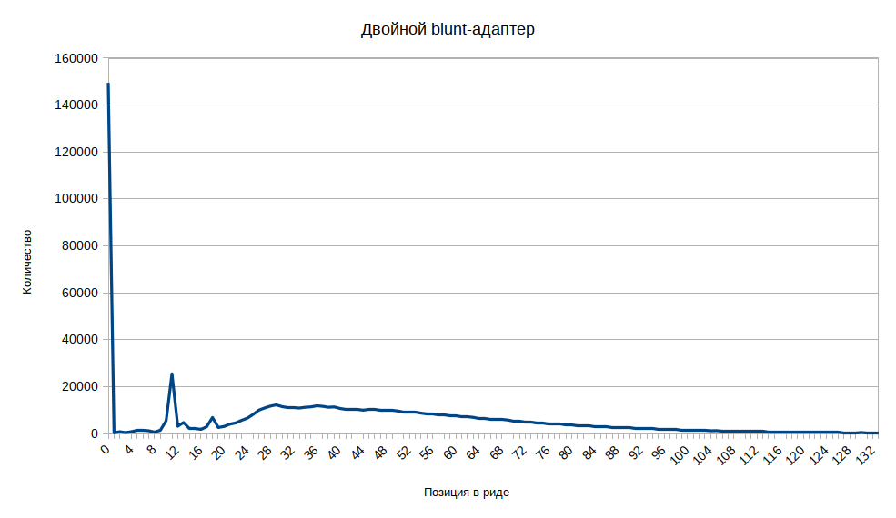

# Неизвестный палиндром

В результатах Exo-C с помощью приложения *FastQC* был обнаружен неизвестный палиндромный участок `CTCAGCGCTGAG`.
Частота его встречаемости, согласно данным скрипта *palindrome.py*, составляет 22.69%, в начале (5' конец, вторая позиция) - 6.88%.

```python
import gzip
import sys

def Out(found_, total_):
    print("Found: %d | Total: %d" % (found_, total_), end='\r')

filename = './sample.fastq.gz'

input0 = gzip.open(filename, 'r')
output0 = open('./output.fq', 'w')

new_found_land = ""
counter = 0
total = 0
found = 0

for line in input0:

    Out(found, total)

    counter += 1
    if counter == 5:
        counter = 1
    if counter < 1:
        continue

    tyk = line.decode().find("CTCAGCGCTGAG")

    if (counter == 2) and (tyk == -1):
        new_found_land = ""
        counter = -2
        total += 1
        continue

    new_found_land += line.decode("utf-8")

    if counter == 4:
        output0.write(new_found_land)
        new_found_land = ""
        found += 1
        total += 1

print('\n')

input0.close()
output0.close()
```

Было решено узнать, что собой представляет этот участок.

## Основная гипотеза

Палиндром является сдвоенным фрагментом blunt-адаптера, по какой-то причине потерявшим конец.

## Ход работы

С помощью *cutadapt* были найдены последовательности, содержащие искомый палиндром.

```
$ cutadapt -g ^CCTCAGCGCTGAG --trimmed-only -o ./output.ca.fastq ./sample.fastq.gz

This is cutadapt 1.18 with Python 3.7.3
Command line parameters: -g ^CCTCAGCGCTGAG --trimmed-only -o ./output.ca.fastq ./sample.fastq.gz
Processing reads on 1 core in single-end mode ...
Finished in 1481.04 s (12 us/read; 5.19 M reads/minute).

=== Summary ===

Total reads processed:             128,195,237
Reads with adapters:                10,090,133 (7.9%)
Reads written (passing filters):    10,090,133 (7.9%)

Total basepairs processed: 19,229,285,550 bp
Total written (filtered):  1,383,201,351 bp (7.2%)

=== Adapter 1 ===

Sequence: CCTCAGCGCTGAG; Type: anchored 5'; Length: 13; Trimmed: 10090133 times.

No. of allowed errors:
0-9 bp: 0; 10-13 bp: 1

Overview of removed sequences
length  count   expect  max.err error counts
12      938313  7.6     1       0 938313
13      9066637 1.9     1       8892621 174016
14      85183   1.9     1       0 85183
```

Далее результаты были снова обработаны с помощью *FastQC* ([данные здесь](http://htmlpreview.github.io/?https://github.com/regnveig/labjournal/blob/master/FastQC_results/fastqc_190718_1327.html)).
Программа обнаружила 3 длинных оверрепрезентированных последовательности, две из которых были определены как **TruSeq Adapter**, и одну неизвестную последовательность.
Их частоты составляют 0.2% (для TruSeq-адаптеров) и 0.1% (неизвестная последовательность) среди ридов, содержащих искомый палиндром.

Далее последовательности были выровнены относительно друг друга.

```
-----------------------------GAGATCGGAAGAGCACACGTCTGAACTCCAGTCACATCACGATCTCGTAT
------------------GGATCCCTCAGCAGATCGGAAGAGCACACGTCTGAACTCCAGTCACATCA
GGATCCCTCAGCGCTGAGGGATCCCTCAGCAGATCGGAAGAGCACACGTC
```

Искомый палиндром был обнаружен в третьей (неизвестной) последовательности - GGATCC**CTCAGCGCTGAG**GGATCCCTCAGCAGATCGGAAGAGCACACGTC.
Также выяснено, что палиндром является частью ещё более крупного палиндрома, входящего в эту последовательность - GGATCCCTCAGCGCTGAGGGATCC.

В сочетании с вырезанным нами палиндромом он даёт ещё более длинный палиндром - **CCTCAGC***GCTGAGG*GATC**CCTCAGC***GCTGAGG*GATC**CCTCAGC**AGATCGGAAGAGCACACGTCTGAACTCCAGTCACATCACGATCTCGTAT

Было решено построить детально модель HiC и секвенирования по методике, чтобы понять, что произошло.

## Модель HiC и секвенирования

Методика описана в следующих статьях: [принципиальная схема](https://www.ncbi.nlm.nih.gov/pubmed/25437436), [подробная инструкция](https://www.ncbi.nlm.nih.gov/pubmed/29382556).

1. Фиксация, выделение ядер
2. Разрезание хроматина ДНКазой I
3. Обработка ДНК-полимеразой, фрагментом Кленова (5'→3' полимеразная активность, корректорная 3'→5' кусь-активность)
4. dA-tailing - фрагмент Кленова, dATP
5. ДНК-лигаза, Т-tailed биотин-меченый bridge-адаптер, blunt-ended Bridge безбиотиновый

```
bridge                      blunt

 P        Biot
 |        |
 5-GCTGAGGGATC-3           5-GCTGAGGGAC-3
3-TCGACTCC-5               3-CGACTCC-5

reversed 
         :egdirB             :tnulB
    5-CCTCAGCT-3             5-CCTCAGC-3
3-CTAGGGAGTCG-5           3-CAGGGAGTCG-5
     |      |
     Biot   P
     
     
Products of adapter ligation:

(genome-A-)Bridge/GATC/egdirB-(T-genome):
        (A)GCTGAGG/GATC/CCTCAGC(T)
just sequence, palyndromic: AGCTGAGGGATCCCTCAGCT

(genome-A-)Bridge---egdirB(T-genome):
        (A)GCTGAGG-CCTCAGC(T)
just sequence, palyndromic: AGCTGAGGCCTCAGCT

(remove GATC)egdirB(remove T)-(remove T)Bridge(remove GATC):
             CCTCAGC-------------------GCTGAGG
just sequence, palyndromic: CCTCAGCGCTGAGG

       tnulB-Blunt:
(GTC)CCTCAGC-GCTGAGG(GAC)
Just sequence (palyndromic): GTCCCTCAGCGCTGAGGGAC

```


6. Полинуклеотидкиназа (прикрепляет фосфат к 5'), затем лигаза
7. Растворение белков и очистка ДНК
8. ДНК-полимераза, dATP, dGTP - достраивание цепей
9. Фрагментация ДНК до размеров 100-300

Далее методика меняется на протокол NEBNext Ultra II ([ссылка](http://www.bea.ki.se/documents/datasheet_NEB_Ultra%20II%20DNA.pdf)).

...

**Гипотезы**
1. Наш палиндром `CTCAGCGCTGAG` (23% ридов) может быть либо стыком 
egdirB(remove T)-(remove T)Bridge

либо

tnulB-Blunt

Различить эти два сценария можно только анализируя буквы до/после найденного палиндрома. А в случае, если они "обкусаны", вообще нельзя.

2. Длинная оверепрезентированная последовательность (**CCTCAGC***GCTGAGG*GATC**CCTCAGC***GCTGAGG*GATC**CCTCAGC**AGATCGGAAGAGCACACGTCTGAACTCCAGTCACATCACGATCTCGTAT) набиолее вероятно обарзовалась так: сначала слиплись две последовательности Bridge, образовав egdirB(remove T)-(remove T)Bridge-GATC. Затем, они слиплись друг с другом по липким GATC концам.

Т.е. сначала бриджи слиплись друг с другом "спинками", а потом два таких соеденились по липкому концу.

egdirB(remove T)-(remove T)Bridge-GATC-egdirB(remove T)-(remove T)Bridge

## Промежуточная задача

Поискать bridge и blunt-адаптеры в библиотеке.
Bridge - `AGCTGAGGGATC`, blunt - `GCTGAGGGAC` и палиндром-содержащий участок `CCTCAGCGCTGAGGGAC`.
Найти их общее количество, а также распределение по позициям в риде.

Обработка была произведена с помощью скрипта `palindrome2.py`.

```python
import gzip
import sys
import pandas as pd
import string

def Out(found_, total_):
    print("Found: %d | Total: %d (%4f%%)" % (found_, total_, found_ * 100 / total_), end='\r')

filename = './sample.fastq.gz'
seq = 'CCTCAGCGCTGAGGGAC'
comment = "Double Blunt adapter"

print(f"\nHi there.\nWe're looking for: {seq} ({comment})\n")

input0 = gzip.open(filename, 'r')

counter = 0
total = 1
found = 0
tyk = 0
df = pd.DataFrame({
'position' : [0],
'count' : [0]
})

for line in input0:

    Out(found, total)

    counter += 1
    if counter == 5:
        counter = 1
    if counter < 1:
        continue

    if (counter == 2):
        tyk = line.decode("utf-8").find(seq)
        if (tyk == -1):
            counter = -2
            total += 1
            continue


    if counter == 4:
        if df.loc[df['position'] == tyk].empty:
            df = df.append({'position': tyk, 'count': 1}, ignore_index=True)
        else:
            df.at[df.loc[df['position'] == tyk].index[0], 'count'] += 1

        found += 1
        total += 1

output0 = open('./report_' + seq + '.txt', 'w')
df.sort_values(by=['position'], ascending=True).to_string(output0)
print('\n')

input0.close()
output0.close()
```

Результаты:

* Двойной blunt-адаптер встречается в 0.6% ридов.
Пики наблюдаются на позициях 0, 11, небольшой пик на 18 ([данные](./scripts_results/report_palindrome_doubleblunt_190719.txt)).

```
$ python3 ./palindrome_doubleblunt.py

Hi there.
We're looking for: CCTCAGCGCTGAGGGAC (Double Blunt adapter)

Found: 775465 | Total: 128195238 (0.604909%)
```



* Одиночный blunt-адаптер встречается в 1.42% ридов.
Пики на позициях 0, 7 и 18 ([данные](./scripts_results/report_palindrome_blunt_190719.txt)).

```
$ python3 ./palindrome_blunt.py

Hi there.
We're looking for: GCTGAGGGAC (Blunt adapter)

Found: 1816057 | Total: 128195238 (1.416634%)
```


* bridge-адаптер встречается в 20% ридов.
В начале его почти нет, повышение на позиции 8, пики на 18, 26 и 32, затем спад до конца ([данные](./scripts_results/report_palindrome_bridge_190722.txt)).

```
$ python3 ./palindrome_bridge.py

Hi there.
We're looking for: AGCTGAGGGATC (Bridge adapter)

Found: 26622524 | Total: 128195238 (20.767171%)
```


Таблица ODS с данными, [если вдруг понадобится](./scripts_results/palindrome2_results_190722.ods).

**TODO:**

поискать ешё димеры egdirb-bridge-GATC

Или, что может быть ещё лучше, проанализировать контент букв до и после *CTCAGCGCTGAG*

## Анализ букв до и после палиндрома

Сбор данных производился скриптом `palida.py`.
Данные записывались в трёхмерный массив: (число_позиций_в_риде, по_5_позиций_до_и_после_палиндрома, нуклеотиды).

```python
import gzip
import sys
import numpy as np
import string

def Out(total_):
    print("Total: %d" % (total_), end='\r')

filename = './sample.fastq.gz'
seq = "CTCAGCGCTGAG"
length = len(seq)
poses = list([-5, -4, -3, -2, -1, length + 1, length + 2, length + 3, length + 4, length + 5])
nuc = list('ATGCN0')
a = np.zeros(shape=(150,10,6))

print(f"\nPalindrome deep analysis.\nMaking a dump...\n")

input0 = gzip.open(filename, 'r')

counter = 0
total = 0
tyk = 0

for line in input0:

    Out(total)

    counter += 1
    if counter == 5:
        counter = 1

    if (counter == 2):
        line_d = line.decode("utf-8")
        tyk = line_d.find(seq)
        if not (tyk == -1):
            for i in range(10):
                pos_abs = tyk + poses[i]
                if (pos_abs < 0) or (pos_abs > 149):
                    a[tyk, i, nuc.index('0')] += 1
                else:
                    a[tyk, i, nuc.index(line_d[pos_abs])] += 1

        total += 1

print(np.sum(a, axis = (1, 2)))
np.save('./this.dump', a)

print('\n')

input0.close()
```

Заодно были получены данные по распределению палиндрома в геноме: два пика на 1 и 12 ([данные](./scripts_results/report_palida_190722.txt)).


Результаты были проанализированы в трёх точках: на двух пиках (1 и 12), а также на плато (60) - [данные](./scripts_results/report_palida_analysis_190722.txt).


Из этого можно сделать следующие выводы:

1. Скорее всего, я накосячил в скрипте с длиной палиндрома.
Надо было прибавлять не `len(str)`, а `len(str) - 1`.

2. Во всех трёх позициях до и после палиндрома встречаются фиксированные сочетания букв.
    * Позиция 1: С**CTCAGCGCTGAG**_GATCC
    * Позиция 12: GATCC**CTCAGCGCTGAG**_GATCC
    * Позиция 60: GATCC**CTCAGCGCTGAG**. За ней следует что-то такое: _(G|A)(G|A)(T|A)(T|C)C.

Результаты не совсем ясно показывают ситуацию, поэтому решено было ещё раз запустить скрипт, взяв на этот раз 20 букв по периметру палиндрома вместо 5 ([данные](./scripts_results/report_palida_analysis20_190722.txt)).
Также был исправлен косяк с длиной палиндрома.


Последовательности:

* Позиция 1: C**CTCAGCGCTGAG**GGATCCCTCAGC
* Позиция 12: GCTGAGGGATCC**CTCAGCGCTGAG**GGATCCCTCAGC___
* Позиция 60: ___GCTGAGGGATCC**CTCAGCGCTGAG**G(A|G)(G|A)(A|T)(C|T)CGGAAGAGCACACGT

Выравнивание 1 и 12 позиций:
Можно утверждать, что в начале ридов есть большой процент **egdirb-bridge-GATC-egdirb-bridge-GATC-egdirb**:

```
CCTCAGCGCTGAGGGATCCCTCAGC
-------GCTGAGGGATCCCTCAGCGCTGAGGGATCCCTCAGC
CCTCAGCGCTGAGGGATCCCTCAGCGCTGAGGGATCCCTCAGCGCTGAGGGATC
```

В позиции 60 после палиндрома идёт нечто похожее на первый TruSeq-адаптер:

```
---------------------------GAGATCGGAAGAGCACACGTCTGAACTCCAGTCACATCACGATCTCGTAT
___GCTGAGGGATCCCTCAGCGCTGAGGAGATCGGAAGAGCACACGT
                            GATC
```

Второй вариант позиции 60 похож на те, что встречаются в позициях 1 и 12.

```
---GCTGAGGGATCCCTCAGCGCTGAGGGATCCctcagc___
___GCTGAGGGATCCCTCAGCGCTGAGGGATCCggaagagcacacgt

```
Т.е. можно утверждать, что в позиции 60 есть доля как **bridge-GATC-egdirb-bridge-TruSeq**, так и просто bridge-GATC-egdirb-bridge-GATC.

Таблица ODS, [если понадобится](./scripts_results/palida_results_190722.ods).

### TODO

1. Поискать палиндром с A|T в середине.
2. Поискать палиндром в прочих сэмплах, а также в данных из статей.
3. Отрезать с помощью *cutadapt* Иллюминовские адаптеры, посмотреть распределение палиндрома по %.
4. Если будет время -- написать для *cutadapt* штуку, убирающую вакханалию.

## Анализ прочих библиотек

Палиндром с A|T в середине почти не встречается.
Их количество примерно одинаковое и не превышает 300 на 1000000 (0,03%).

Затем были исследованы прочие сэмплы (из каждого взято по 1 млн ридов).
Получены следующие результаты:

* Значительное, но непостоянное количество палиндрома (~4-30%) обнаружено только в сэмплах под номером 1.
В сэмплах 2 палиндрома почти нет (до 10-20 на 1 млн).
**Поправка:** Сэмпл 2 из другого секвенирования, к текущему опыту не имеет отношения.


Таблица ODS, [если понадобится](./scripts_results/paliall_190729.ods).

### Промежуточная задача -- работа с *fastq_dump*

Данные из статей можно найти [здесь](https://www.ncbi.nlm.nih.gov/sra?term=SRP041253).

Для получения результатов из статьи понадобился инструмент *fastq_dump*.
Установка из сырцов оказачалась чересчур муторной, поэтому я нашёл скомпилированный вариант *sratoolkit*:

```
$ wget "http://ftp-trace.ncbi.nlm.nih.gov/sra/sdk/current/sratoolkit.current-centos_linux64.tar.gz"
```

Для задачи нам требовался всего 1 млн ридов, не было смысла выкачивать данные целиком.

```
$ cd ./bin
$ ./fastq-dump -Z --split-3 SRR1248196 | head -n 4000000 > [output_path]/SRR1248196_short.fastq
```

Файлы были обработаны с помощью скрипта *ash.py*:

```python
import sys
import pandas as pd
import string

def Out(found_, total_):
    print("Found: %d | Total: %d (%4f%%)" % (found_, total_, found_ * 100 / total_), end='\r')

filelist = ['SRR1248196', 'SRR1248194', 'SRR1248191', 'SRR1248188', 'SRR1248183', 'SRR1248180', 'SRR1248178', 'SRR1248176']
seq = 'CTCAGCGCTGAG'

print(f"\nHi there.\nWe're looking for: {seq}\n")

for file_sn in filelist:

    print(f"Open {file_sn}...\n")

    input0 = open('/dev/datasets/ngs_data/article_DNAaseHiC_data/' + file_sn + '_1M_short.fastq', 'r')

    counter = 0
    total = 1
    found = 0
    tyk = 0
    df = pd.DataFrame({
        'count' : [0] * 150
    })

    for line in input0:

        Out(found, total)

        counter += 1
        if counter == 5:
            counter = 1

        if (counter == 2):
            total += 1
            tyk = line.find(seq)
            if (tyk != -1):
                df.at[tyk, 'count'] += 1
                found += 1

    output0 = open('./report_' + file_sn + '.txt', 'w')
    df.to_string(output0)
    print('\n')

    input0.close()
    output0.close()
```

Результаты:

| Образец    | Расшифровка                        | Палиндром (на 1М ридов) | %    |
|------------|------------------------------------|-------------------------|------|
| SRR1248196 | targetedDNaseHiC-lincRNA-K562-rep2 | 113523                  | 11.3 |
| SRR1248194 | targetedDNaseHiC-lincRNA-K562-rep1 | 148812                  | 14.8 |
| SRR1248191 | targetedDNaseHiC-lincRNA-H1-rep2   | 108244                  | 10.8 |
| SRR1248188 | targetedDNaseHiC-lincRNA-H1-rep1   | 120374                  | 12.0 |
| SRR1248183 | targetedDNaseHiC-pe-K562-rep1      | 191774                  | 19.1 |
| SRR1248180 | targetedDNaseHiC-pe-H1-rep1        | 145528                  | 14.5 |
| SRR1248178 | DNaseHiC-WG-K562                   | 175093                  | 17.5 |
| SRR1248176 | DNaseHiC-WG-H1                     | 88565                   | 8.8  |

Что интересно -- в данных из статей палиндром почти не встречается на протяжении рида, он чётко собран в два пика на позициях 1 и 12.


Таблица ODS, [если понадобится](./scripts_results/ash_190730.ods).
