# Проверка покрытия экзомных районов ридами библиотеки

## Основное

Выяснить, насколько каждая буква районов в bad track (Roch MedExome target capture) покрывается ридами наших библиотек.
Это нужно для корректировки методики секвенирования.

**TODO**: Поискать программы, которые вычисляют coverage.

## Ход работы

1. Target capture можно скачать [отсюда](https://sequencing.roche.com/en/products-solutions/by-category/target-enrichment/hybridization/seqcap-ez-medexomekit.html) (раздел Design files).
Были использованы hg19 capture targets.

2. Для анализа coverage была выбрана утилита *bedtools*.
Плюсы её в том, что она есть в репозиториях убунты.

```
$ sudo apt install bedtools
```

*bedtools* оказался весьма глючной тулзой.
В общем, описываю порядок колдунства:

* Вытащить из заголовка sam-файла порядок хромосом.
Что-то типа такого: `@SQ	SN:chr1	LN:249250621`.
Очистить их от мусора (оставив только имена) и сохранить в *names.txt*.

* Отсортировать bed-файл, используя *names.txt*:

```
$ bedtools sort -faidx ./names.txt -i ./MedExome_hg19_capture_targets.bed > MedExome_hg19_capture_targets.sorted.bed
```

* сделать из hg19 fa.fai-файл (подробно о компиляции индекса [здесь](./BiblExome.md)).
* подключить fa.fai и отсортированный bed-файл:

```
bedtools coverage -hist -sorted -g /dev/datasets/FairWind/hg19.fa.fai -a /dev/datasets/FairWind/trimmed/MedExome_hg19_capture_targets.sorted.bed -b /dev/datasets/FairWind/trimmed/bams/sample-1-1.sorted.bam > ./coverage_report.txt
```

Ты можешь попробовать посчитать coverage без -sorted, мой юный друг, но помни -- в этом случае bam-файл уходит в оперативку полностью и процесс рискует убицца.
Да, чуваки как-то не подумали.

3. Нужные нам результаты оказались в конце - раздел `all`.
Обработка производилась с помощью скрипта *kovoer.py*:

```python
import pickle
import pandas as pd
import matplotlib.pyplot as plt

with open("../_pickles/csv/hist_coverage_[all].pd.pickle", 'rb') as f:
    hist = pickle.load(f)

hist = hist.apply(pd.to_numeric, errors='ignore')

print("Pickle loaded.", end="\n")

percents = hist['% of A at depth'].tolist()

plt.plot(percents[:100])
plt.ylabel('% from A at depth')
plt.xlabel('Depth')
plt.savefig("./coverage_100.svg")

print("Coverage is ready.", end="\n")

cover_50 = 0
cover_75 = 0
cover_90 = 0
cover_95 = 0

cumulate = []
for it in range(len(percents)):
    summa = sum(percents[it:])
    cumulate += [summa]
    if summa > 0.5: cover_50 = it
    if summa > 0.75: cover_75 = it
    if summa > 0.9: cover_90 = it
    if summa > 0.95: cover_95 = it

plt.clf()

plt.plot(cumulate[:100])
plt.ylabel('% of A with more depth')
plt.xlabel('Depth')
plt.savefig("./cumulate_100.svg")

print("Cumulate is ready.", end="\n")

print(f"Non-coverage = {percents[0] * 100}%", end="\n")
print(f"Median = depth {cover_50}", end="\n")
print(f"Cover 75% = depth {cover_75}", end="\n")
print(f"Cover 90% = depth {cover_90}", end="\n")
print(f"Cover 95% = depth {cover_95}", end="\n")
```

### Покрытие всего генома

1. bed-файл для hg19:

```
$ awk '{print $1 "\t0\t" $2}' human_hg19.fa.fai > human_hg19.bed
```

2. Дальше запускается *bedtools* так же, как и выше.

### Результаты

```
CAPTURE DATA
Non-coverage = 2.8359699999999997%
Median = depth 56
Middle = depth 106.64814649999987
Cover 75% = depth 19
Cover 90% = depth 6
Cover 95% = depth 2

HG19 DATA
Non-coverage = 39.479150000000004%
Median = depth 2
Middle = depth 8.624028099999986
Cover 75% = depth 0
Cover 90% = depth 0
Cover 95% = depth 0
```


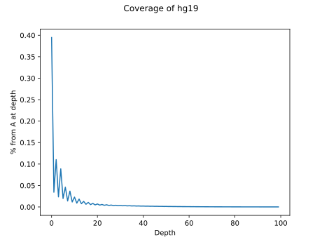

Любопытна форма графика -- чётные значения всегда больше нечётных.
Было высказано предположение, что это из-за короткого insert-size -- парные риды частично перекрывают друг друга.


Синий -- capture, красный -- hg19.

Полные данные bedtools coverage -- [capture](./scripts_results/hist_coverage.txt), [hg19](./scripts_results/hist_hg19.txt).

### Результаты после переработки методов обрезки

Удаление дупликатов с помощью *PicardTools*:

```
Non-coverage = 2.82994%
Median = depth 23
Middle = depth 29.127398900000014
Cover 75% = depth 9
Cover 90% = depth 4
Cover 95% = depth 2
```

Полные данные:

```
Non-coverage = 2.82837%
Median = depth 33
Middle = depth 60.58574159999994
Cover 75% = depth 12
Cover 90% = depth 4
Cover 95% = depth 2
```

Графики по полным данным:

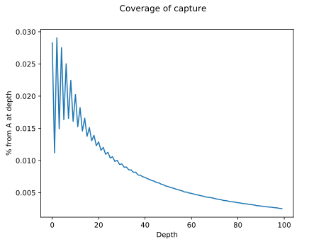
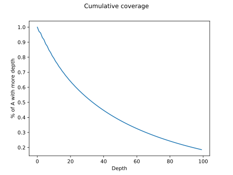

**ANSWER:** Было решено взять DEPTH=10, QUAL=30 для наших библиотек, чтобы покрыть 80% данных.

## Покрытие букв возле сайтов рестрикции

**TODO:**

1. Найти координаты сайтов рестрикции (хороший код [здесь](https://github.com/aidenlab/juicer/blob/master/PBS/scripts/generate_site_positions.py)).
2. Получить coverage для каждой буквы.
3. Совместить полученные массивы.

### Ход работы

* Coverage для каждой буквы был получен с помощью *bedtools*:

```
$ bedtools coverage -d -sorted -g /dev/datasets/FairWind/_db/hg19/hg19.fa.fai -a /dev/datasets/FairWind/_db/hg19/hg19.bed -b /dev/datasets/FairWind/_results/cut_and_split/bam/sample-1-1_sorted.bam > /dev/datasets/FairWind/_results/cut_and_split/coverage/hg19_coverage_each.txt
```

В результате получается агроменный файлище в 100 Гб весом.
Будьте осторожны, друзья.

* grep coverage.
Очень медленный способ, рекомендую написать что-то побыстрее.
`chr_list` был выдернут из fa.fai, кажется.
Или даже из заголовка sam-файла.

```bash
#!/bin/bash

INPUT_FILE='./main_table.txt'
OUTPUT_FOLDER='./grep_coverage'

chrs=`cat ./chr_list`

for chr in $chrs
do
grep -oP "(?<="$chr"\t).*$" $INPUT_FILE | grep -oP '\d+$' - > $OUTPUT_FOLDER/"$chr".txt;
echo "$chr" is done.
done
```

upd: написал побыстрее.

```python
import time

chrom = 'huita'
print(f"{chrom} is started ... ", end="")
f = open("/dev/datasets/FairWind/_results/bowtie/coverage/grep_coverage_exoc/.txt", 'wt')
start_time = time.time()

for line in open('/dev/datasets/FairWind/_results/bowtie/coverage/1-2_hg19_coverage_each.txt', 'rt'):
    
    lst = line.split('\t')
    
    if lst[0] != chrom:
        chrom = lst[0]
        f.close()
        print(f"Done [%.2f sec]" % (time.time() - start_time), end="\n")
        f = open("/dev/datasets/FairWind/_results/bowtie/coverage/grep_coverage_exoc/" + chrom + ".txt", 'wt')
        print(f"{chrom} is started ... ", end="")
        start_time = time.time()
    
    coverage = lst[-1]
    f.write(coverage)

f.close()
print(f"Done [%.2f sec]" % (time.time() - start_time), end="\n")
```

* Разбор расстояний от сайтов рестрикции.
Очень шустрый код, рекомендую юзать.

```python
import sys
import math
import subprocess
import re

def processing(chrseq, teststring, filename):
    
    print(f"Start {filename} ... ", end='')
    chrseq = chrseq.upper()
    parts = list(map(len, re.split(teststring, chrseq)));
    if len(parts) <= 1: 
        print("No seqs.", end='\n')
        return False
    
    lst = []
    
    lst += range(int(parts[0]), 0, -1)
    lst += [0] * len(teststring)
    
    for part in parts[1:-1]:
        if part > 1:
            if (part % 2) == 0:
                lst += range(1, int(part / 2) + 1)
                lst += range(int(part / 2), 0, -1)
            else:
                lst += range(1, int(math.floor(part / 2)) + 1)
                lst += range(int(math.ceil(part / 2)), 0, -1)
        elif part == 1:
            lst += [1]
        elif part == 0:
            pass
        
        lst += [0] * len(teststring)
        
    lst += range(1, int(parts[-1]) + 1)
    
    with open(filename, 'wt') as f:
        for item in lst:
            f.write("%d\n" % item)
    
    del lst
    
    print(f"Done.", end='\n')
    

site_r = 'DpnII'
teststring = 'GATC'

genome = 'hg19'
filename = '/dev/datasets/FairWind/_db/hg19/hg19.fa'
outpath = '/dev/datasets/FairWind/_results/bowtie/coverage/restrict/'


chrom = ''
chrseq = ''

for line in open(filename, mode='rt'):

    if line[0] == '>':
        
        processing(chrseq, teststring, outpath + chrom + '.txt')
        
        chrom = line[1:-1]
        chrseq = ''
    else:
        chrseq += line[0:-1]

processing(chrseq, teststring, outpath + chrom + '.txt')
```

* Слияние. Слияние производилось скриптом *merge_coverage.py*:

```python
import pandas as pd
import numpy as np
import time
from multiprocessing import cpu_count, Pool
import functools
import pickle
import matplotlib.pyplot as plt

def chrom_handler(chrom):
    start_time = time.time()
    
    coverage = pd.read_csv('/dev/datasets/FairWind/_results/bowtie/coverage/grep_coverage/' + chrom + '.txt', header=None, names=['coverage'])
    restrict = pd.read_csv('/dev/datasets/FairWind/_results/bowtie/coverage/restrict/' + chrom + '.txt', header=None, names=['restrict'])
    
    main_table = pd.concat([coverage, restrict], axis=1)
    del coverage
    del restrict
    main_table = main_table.apply(pd.to_numeric, errors='ignore')
    main_table = main_table.groupby(['restrict']).mean()
    
    print(f"{chrom} is done [%.2f sec]" % (time.time() - start_time), end="\n")
    
    return main_table

THREADS_NUM = cpu_count()

chr_list = []
for line in open('/dev/datasets/FairWind/_results/bowtie/coverage/chr_list', 'rt'):
    chr_list += [line[:-1]]

pool = Pool(THREADS_NUM)

results = pool.map(chrom_handler, chr_list)

pool.close()
pool.join()
del pool

start_time = time.time()
large_table = pd.concat(results, axis=1)
del results
print(f"Concat is done [%f sec]" % (time.time() - start_time), end="\n")

# large_table = large_table[:1000000]

start_time = time.time()
large_table = large_table.apply(np.nanmean, axis=1)
print(f"Merging is done [%.2f sec]" % (time.time() - start_time), end="\n")

start_time = time.time()
with open("/dev/datasets/FairWind/_results/bowtie/coverage/merged_table.pickle", 'wb') as f:
    pickle.dump(large_table, f)
print(f"Pickling merged is done [%f sec]" % (time.time() - start_time), end="\n")

start_time = time.time()
large_table.to_csv("/dev/datasets/FairWind/_results/bowtie/coverage/merged_table.csv", sep='\t')
print(f"Pickling merged is done [%f sec]" % (time.time() - start_time), end="\n")

plt.plot(list(large_table[:500]))
plt.ylabel('Depth average')
plt.xlabel('Distance from restriction site, b')
plt.suptitle('Distance coverage')
plt.savefig("/dev/datasets/FairWind/_results/bowtie/coverage/distance_coverage_500.svg")
```

## Результаты

Зависимость покрытия букв от расстояния от сайтов рестрикции показана на графиках.

### HiC

Как видно из результатов, покрытие даёт большой пик на расстоянии от 0 до 100 букв, затем мы наблюдаем значительную гористость на расстоянии 1500-2500 букв.
После 5000 букв график уверенно выходит на ноль.

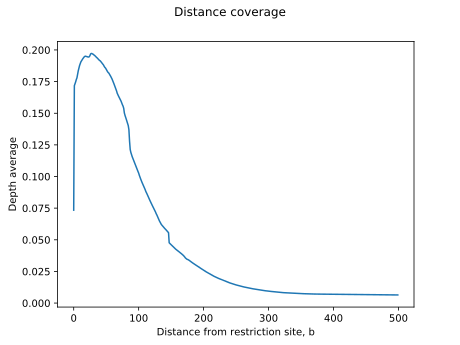
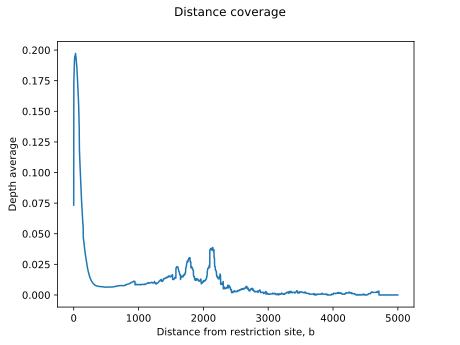

### ExoC

На данных ExoC мы не видим пика возле начала оси.
Но зато присутсвует гористость на 500-4000, по амплитуде совпадающая с таковой на графике HiC.

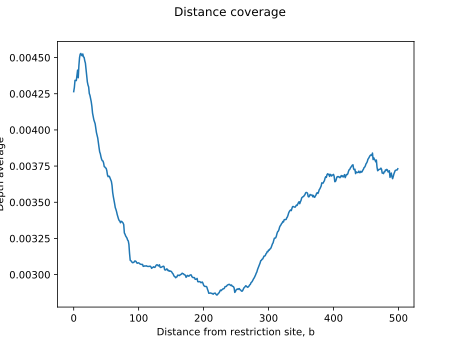
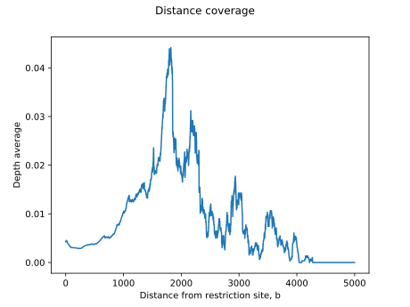

**TODO:**

* Посчитать количество букв, удалённых от сайтов рестрикции на одинаковое расстояние.
* hist на экзом:
    * По 60М ридов для каждой библиотеки;
    * Максимальное равное количество уникально выровненных ридов из sam-файла (XS:i: и samtools view -F);
    * Для образца 1-2 взять сабсемплы в диапазоне 20-120М (с шагом в 20М).

## Количество букв на расстояние

Данные подсчитывались изменённым скриптом *merge_coverage.py*.
На графике видно, что на расстоянии более 1000 букв количество букв практически равно нулю.
Это говорит о том, что любые пики дальше 1000 букв -- просто шум.

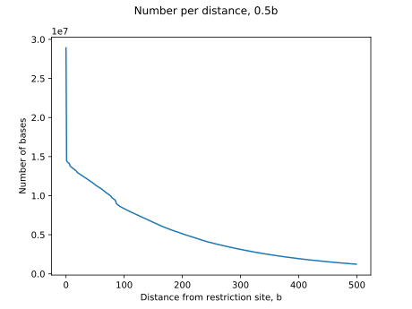
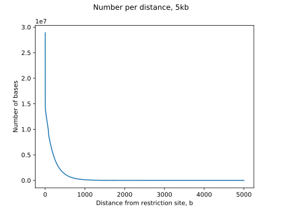

То же самое в логарифмической шкале:

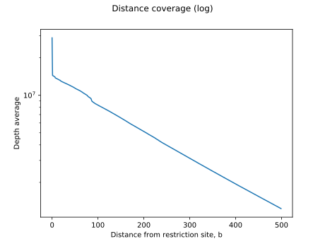
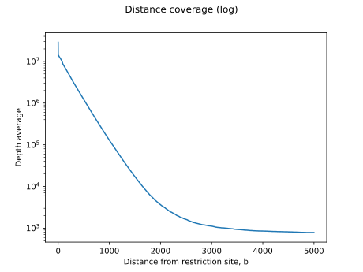

## Hist на экзом (60М ридов из FASTQ)

Результаты представлены в таблице:

| Sample     |   Non-coverage, % |   Middle |   Median |   Coverage 75% |   Coverage 90% |   Coverage 95% |
|------------|-------------------|----------|----------|----------------|----------------|----------------|
| sample-1-1 |           7.17945 |  28.3712 |       15 |              5 |              2 |              0 |
| sample-1-2 |           4.86821 |  27.4454 |       16 |              6 |              2 |              1 |
| sample-1-3 |           0.09345 |  48.895  |       38 |             24 |             15 |             10 |
| sample-1-4 |           5.90608 |  51.3707 |       17 |              5 |              1 |              0 |
| sample-1-5 |           0.87883 |  51.8552 |       33 |             15 |              7 |              4 |
| sample-1-6 |           1.60058 |  41.0072 |       26 |             12 |              5 |              3 |
| sample-1-7 |           6.04041 |  25.3044 |       15 |              6 |              2 |              0 |
| sample-1-8 |           5.53867 |  25.9506 |       15 |              6 |              2 |              0 |
| sample-1-9 |           3.46649 |  30.8405 |       18 |              8 |              3 |              1 |

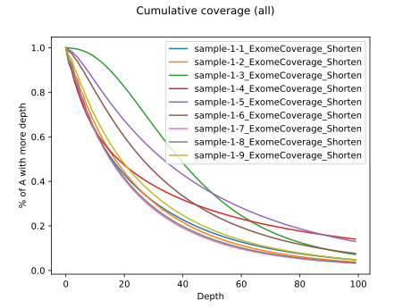

## Hist на экзом (20-120М, sample 1-2)

| Reads, M               |   Non-coverage, % |   Middle |   Median |   Coverage 75% |   Coverage 90% |   Coverage 95% |
|------------------------|-------------------|----------|----------|----------------|----------------|----------------|
| 20                     |          23.9881  |  3.83179 |        2 |              1 |              0 |              0 |
| 40                     |          13.0478  |  7.67164 |        4 |              1 |              0 |              0 |
| 60                     |           8.54857 | 11.5001  |        7 |              2 |              1 |              0 |
| 80                     |           6.14526 | 15.3319  |        9 |              3 |              1 |              0 |
| 100                    |           4.69735 | 19.1662  |       11 |              4 |              1 |              1 |
| 120                    |           3.71846 | 22.9875  |       13 |              5 |              2 |              1 |

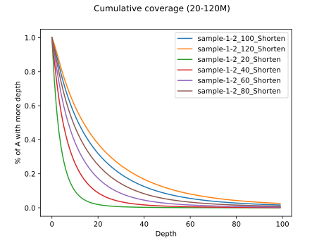

**TODO:** Прогнать таким же образом 90М ридов из ExoC Динары.

## ExoC 90M

Была выбрана библиотека 38_S4, т.к. в ней нашлось 90М ридов (89,4М, если честно).
У них были обрезаны адаптеры Illumina.

| Sample |   Non-coverage, % |   Middle |   Median |   Coverage 75% |   Coverage 90% |   Coverage 95% |
|--------|-------------------|----------|----------|----------------|----------------|----------------|
| 38_S4  |           0.07963 |  167.552 |      129 |             83 |             54 |             40 |

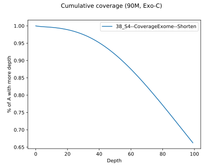

## Сравнение покрытия по дальности от сайтов рестрикции (один график)

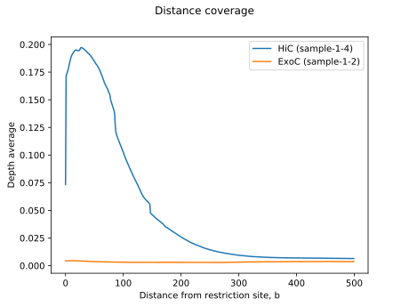
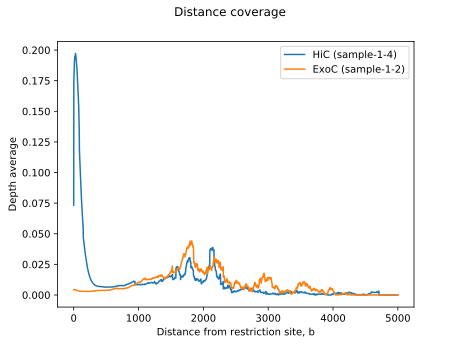

Было решено взять данные ExoC из другой библиотеки, в которой coverage сравним с таковым в библиотеке HiC.
Однако получившийся результат нас обескуражил:

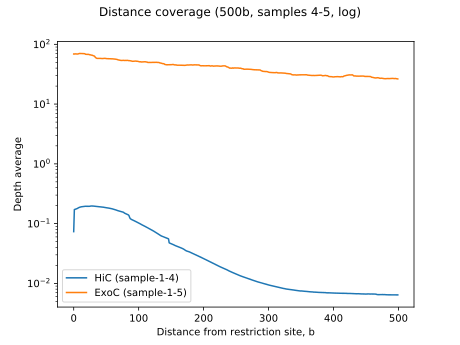
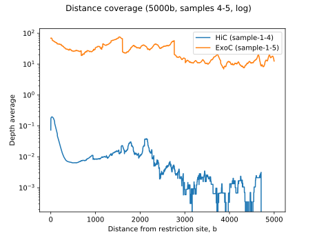
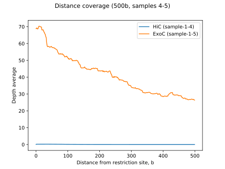
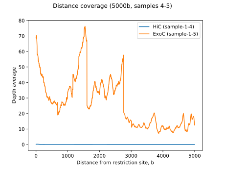

Чтобы понять, что не так, мы решили проверить coverage у 60М выборок библиотек 1-4 и 1-5.
Результаты:

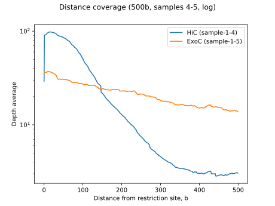
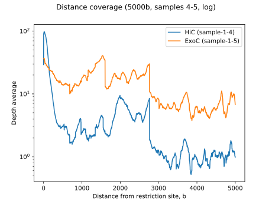
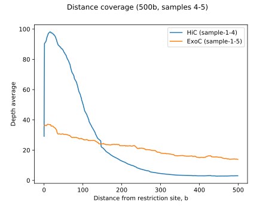
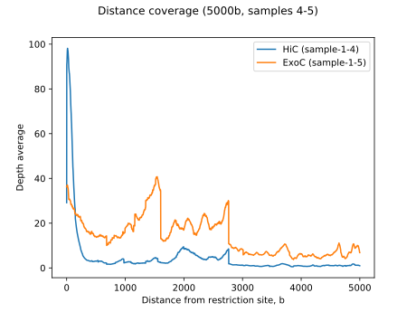

