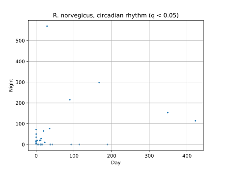
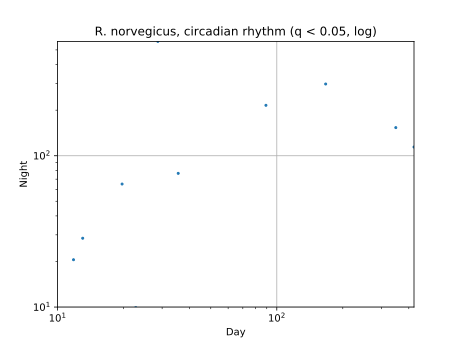
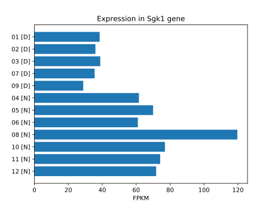
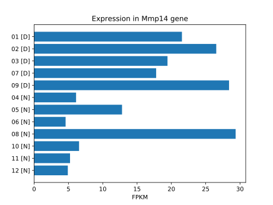
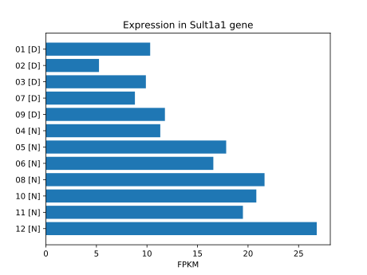

# Draft results (Andre Felipe Rodrigues)

## Updates

**10.10:** 4 groups comparison added ([here](../labjournal/scripts_results/merged_data_4gr.csv)).

**15.10:** Corrected results (sample 8 in the right group) - [here](../labjournal/scripts_results/4gr_data_v2.csv).

## Infographics

## Infinity fold change

### Genes which stopped work at night

| Gene ID     | NCBI ID      |       Day |   Night |  log2 (fold change) |   q       | Gene description |
|:------------|:-------------|:---------:|:-------:|:-------------------:|:---------:|:---|
| XLOC_005100 | -            | 189.105   |       0 |                -inf | 0.0232269 | - |
| XLOC_002266 | NM_001277154 | 114.4     |       0 |                -inf | 0.0232269 | RN serine/arginine repetitive matrix 2 (Srrm2) |
| XLOC_011074 | NM_024349    |  92.7481  |       0 |                -inf | 0.0232269 | RN adenylate kinase 1 (Ak1) |
| XLOC_017099 | NM_001013165 |  42.6763  |       0 |                -inf | 0.0232269 | RN leucine rich repeat containing 23 (Lrrc23) |
| XLOC_002641 | NM_080583    |  37.359   |       0 |                -inf | 0.0232269 | RN adaptor related protein complex 2 subunit beta 1 (Ap2b1) |
| XLOC_017100 | NM_001013165 |  37.0375  |       0 |                -inf | 0.0232269 | RN leucine rich repeat containing 23 (Lrrc23) |
| XLOC_005723 | -            |  16.8746  |       0 |                -inf | 0.0232269 | - |
| XLOC_005619 | NM_001271241 |  15.1175  |       0 |                -inf | 0.0232269 | RN heterogeneous nuclear ribonucleoproteins C1/C2-like (LOC100911576) |
| XLOC_017752 | NM_001025728 |  13.3092  |       0 |                -inf | 0.0232269 | RN SWI/SNF related, matrix associated, actin dependent regulator of chromatin, subfamily b, member 1 (Smarcb1) |
| XLOC_000883 | NM_001107463 |  11.3395  |       0 |                -inf | 0.0232269 | RN VPS37C, ESCRT-I subunit (Vps37c) |
| XLOC_004838 | -            |  11.0581  |       0 |                -inf | 0.0232269 | - |
| XLOC_002640 | -            |  11.0254  |       0 |                -inf | 0.0232269 | - |
| XLOC_005461 | -            |   5.85781 |       0 |                -inf | 0.0232269 | - |
| XLOC_006483 | NM_001106055 |   4.15659 |       0 |                -inf | 0.0232269 | RN MYC binding protein 2 (Mycbp2) |

### Genes which started work at night

| Gene ID     | NCBI ID      |   Day |    Night |  log2 (fold change) |   q       | Gene description |
|:------------|:-------------|:-----:|:--------:|:-------------------:|:---------:|:---|
| XLOC_000169 | NM_001304816 |     0 | 72.053   |                 inf | 0.0232269 | RN paternally expressed 3 (Peg3) |
| XLOC_000668 | NM_012700    |     0 | 50.3297  |                 inf | 0.0232269 | RN syntaxin 1B (Stx1b) |
| XLOC_013338 | NM_001109616 |     0 | 35.5273  |                 inf | 0.0232269 | RN family with sequence similarity 219, member A (Fam219a) |
| XLOC_017751 | NM_001025728 |     0 | 17.1773  |                 inf | 0.0232269 | RN SWI/SNF related, matrix associated, actin dependent regulator of chromatin, subfamily b, member 1 (Smarcb1) |
| XLOC_012607 | NM_001134716 |     0 | 17.0699  |                 inf | 0.0232269 | RN C-type lectin domain family 12, member A (Clec12a) |
| XLOC_010242 | -            |     0 | 14.8634  |                 inf | 0.0232269 | - |
| XLOC_015082 | NM_053331    |     0 | 13.4997  |                 inf | 0.0232269 | RN thioredoxin 2 (Txn2) |
| XLOC_017361 | NM_001107920 |     0 | 12.8896  |                 inf | 0.0232269 | RN mitogen activated protein kinase kinase kinase 7 (Map3k7) |
| XLOC_006079 | NM_001107262 |     0 | 12.5023  |                 inf | 0.0232269 | RN spalt-like transcription factor 2 (Sall2) |
| XLOC_016089 | NM_001105997 |     0 | 12.4545  |                 inf | 0.0232269 | RN mitochondrial ribosomal protein L1 (Mrpl1) |
| XLOC_002121 | -            |     0 |  4.16469 |                 inf | 0.0232269 | - |
| XLOC_015909 | NM_012794    |     0 |  2.79158 |                 inf | 0.0232269 | RN glycosylation dependent cell adhesion molecule 1 (Glycam1) |
| XLOC_016036 | NM_001108137 |     0 |  2.75054 |                 inf | 0.0232269 | RN membrane frizzled-related protein (Mfrp) |

## Fold change 2^(1..8)

### Genes with increased expression at night

| Gene ID     | NCBI ID      |   Day    |    Night |  log2 (fold change) |   q       | Gene description |
|:------------|:-------------|:--------:|:--------:|:-------------------:|:---------:|:---|
| XLOC_007781 | NM_001101000 | 28.6775  | 569.142  |             4.3108  | 0.0232269 | RN microtubule-associated protein, RP/EB family, member 2 (Mapre2) |
| XLOC_017757 | NM_031138    |  2.30196 |  19.4957 |             3.08222 | 0.0232269 | RN ubiquitin-conjugating enzyme E2B (Ube2b) |
| XLOC_015224 | NM_022215    | 19.7019  |  64.983  |             1.72173 | 0.0232269 | RN glycerol-3-phosphate dehydrogenase 1 (Gpd1) |
| XLOC_017755 | -            | 89.2291  | 215.293  |             1.27071 | 0.0232269 | - |
| XLOC_014627 | NM_053595    | 13.0296  |  28.4926 |             1.1288  | 0.0232269 | RN placental growth factor (Pgf) |
| XLOC_001103 | NM_001193569 | 35.525   |  76.4545 |             1.10577 | 0.0232269 | RN serum/glucocorticoid regulated kinase 1 (Sgk1) |
| XLOC_001784 | NM_031834    |  9.21026 |  19.2096 |             1.06052 | 0.0232269 | RN sulfotransferase family 1A member 1 (Sult1a1) |

### Genes with decreased expression at night

| Gene ID     | NCBI ID   |   Day    |    Night  |  log2 (fold change) |   q       | Gene description |
|:------------|:----------|:--------:|:---------:|:-------------------:|:---------:|:---|
| XLOC_006726 | -         | 422.419  | 114.129   |            -1.88801 | 0.0232269 | - |
| XLOC_006086 | NM_031056 |  22.7404 |   9.93753 |            -1.1943  | 0.0232269 | RN matrix metallopeptidase 14 (Mmp14) |
| XLOC_009955 | NM_030832 | 348.916  | 153.316   |            -1.18637 | 0.0232269 | RN fatty acid binding protein 7 (Fabp7) |

## Expression per rat

Full data are available [here](../labjournal/scripts_results/andre_s_animals.csv).

The candidates we chose are following:

1. Sgk1 (XLOC_001103, NM_001193569), most likely.

2. Mmp14 (XLOC_006086, NM_031056).

3. Sult1a1 (XLOC_001784, NM_031834), least likely; 
nevertheless, may play a part in circadian rhythm regulation.

**Note.**
We have the impression that the 8th animal spoils the whole point in Sgk1 and Mmp14 expression.
Maybe it makes sense to remove this sample from the comparison.
