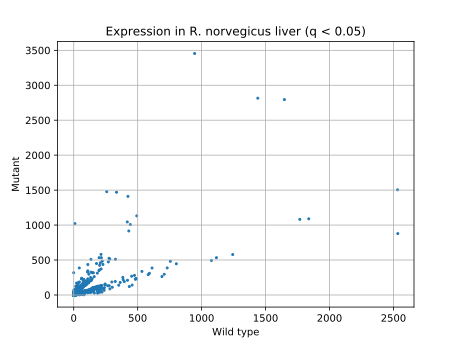
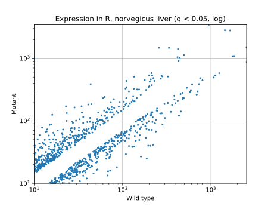

# Draft results (FatimannusaQadri)

**23.09:** NCBI codes added.

## Infinity fold change

### Genes which started work in mutants

| Cuff ID     | NCBI ID      | WT  | Mutant     | Fold change | q        |
|:------------|:-------------|:---:|:----------:|:-----------:|:--------:|
| XLOC_014279 | NM_053621    | 0.0 | 317.915009 | inf         | 0.000914 |
| XLOC_014365 | -            | 0.0 | 3.170720   | inf         | 0.006213 |
| XLOC_019088 | -            | 0.0 | 3.067730   | inf         | 0.009537 |
| XLOC_010932 | -            | 0.0 | 2.055790   | inf         | 0.000914 |
| XLOC_011264 | NM_001127652 | 0.0 | 1.710050   | inf         | 0.000914 |
| XLOC_022004 | -            | 0.0 | 1.450680   | inf         | 0.000914 |
| XLOC_014084 | NM_031577    | 0.0 | 1.351500   | inf         | 0.000914 |
| XLOC_003081 | NM_019174    | 0.0 | 1.238400   | inf         | 0.000914 |
| XLOC_019549 | NM_001013247 | 0.0 | 1.127030   | inf         | 0.000914 |
| XLOC_013848 | NM_019183    | 0.0 | 1.071980   | inf         | 0.000914 |
| XLOC_011263 | NM_001127652 | 0.0 | 1.009560   | inf         | 0.029060 |
| XLOC_016051 | -            | 0.0 | 0.888906   | inf         | 0.000914 |
| XLOC_011265 | NM_053721    | 0.0 | 0.868083   | inf         | 0.000914 |
| XLOC_001184 | NM_001106361 | 0.0 | 0.830649   | inf         | 0.000914 |
| XLOC_007381 | -            | 0.0 | 0.815152   | inf         | 0.011067 |
| XLOC_005610 | -            | 0.0 | 0.756804   | inf         | 0.000914 |
| XLOC_004482 | -            | 0.0 | 0.683683   | inf         | 0.000914 |
| XLOC_012266 | -            | 0.0 | 0.597145   | inf         | 0.000914 |
| XLOC_006229 | NM_019344    | 0.0 | 0.491085   | inf         | 0.000914 |
| XLOC_005609 | -            | 0.0 | 0.478454   | inf         | 0.000914 |

### Genes which stopped work in mutants

| Cuff ID     | NCBI ID      | WT       | Mut | Fold change | q        |
|:------------|:-------------|:--------:|:---:|:-----------:|:--------:|
| XLOC_021385 | NM_022946    | 1.287030 | 0.0 | -inf        | 0.000914 |
| XLOC_008696 | -            | 1.202040 | 0.0 | -inf        | 0.000914 |
| XLOC_014363 | NM_031651    | 1.055120 | 0.0 | -inf        | 0.000914 |
| XLOC_010132 | -            | 1.019710 | 0.0 | -inf        | 0.000914 |
| XLOC_011045 | -            | 0.709557 | 0.0 | -inf        | 0.002437 |
| XLOC_009417 | NM_053789    | 0.674614 | 0.0 | -inf        | 0.000914 |
| XLOC_015564 | -            | 0.491164 | 0.0 | -inf        | 0.000914 |

## Fold change 2^(1..8)

CSV tables: [decreased](../scripts_results/genes_minus_diff.csv) and [increased](../scripts_results/genes_plus_diff.csv) expression.

## Significant genes (q < 0.05) with WT and/or Mut expression level >1000

| Cuff ID     | NCBI ID      | WT          | Mutant     | Fold change | q       | Gene description |
|:------------|:-------------|:-----------:|:-----------:|:---------:|:--------:|:---|
| XLOC_013923 | NM_017016    | 9.969800    | 1020.400024 | 6.677350  | 0.000914 | Rattus norvegicus histidine decarboxylase (Hdc), mRNA |
| XLOC_013547 | NM_013157    | 258.191986  | 1477.660034 | 2.516800  | 0.000914 ||
| XLOC_006778 | NM_013144    | 334.798004  | 1469.750000 | 2.134210  | 0.000914 ||
| XLOC_015152 | NM_021261    | 945.752991  | 3454.659912 | 1.869010  | 0.000914 ||
| XLOC_020821 | NM_017072    | 424.191010  | 1410.849976 | 1.733780  | 0.006804 ||
| XLOC_017303 | NM_182474    | 418.816986  | 1045.040039 | 1.319170  | 0.013562 ||
| XLOC_005197 | NM_017233    | 493.239990  | 1131.560059 | 1.197950  | 0.006213 ||
| XLOC_015733 | NM_053288    | 442.756989  | 1007.700012 | 1.186480  | 0.000914 ||
| XLOC_004892 | -            | 1439.410034 | 2815.189941 | 0.967753  | 0.000914 ||
| XLOC_003558 | -            | 1647.420044 | 2795.000000 | 0.762638  | 0.030886 ||
| XLOC_008458 | NM_001079898 | 1767.699951 | 1081.689941 | -0.708582 | 0.047844 ||
| XLOC_011710 | NM_053587    | 2532.290039 | 1504.050049 | -0.751593 | 0.049207 ||
| XLOC_008451 | NM_173329    | 1837.780029 | 1089.339966 | -0.754512 | 0.031166 ||
| XLOC_006340 | NM_017170    | 1115.989990 | 533.198975  | -1.065580 | 0.000914 ||
| XLOC_005382 | NM_013105    | 1243.369995 | 578.583008  | -1.103660 | 0.002437 ||
| XLOC_008791 | -            | 1077.089966 | 493.636993  | -1.125620 | 0.000914 ||
| XLOC_014542 | NM_012556    | 2533.929932 | 878.020996  | -1.529050 | 0.000914 ||
