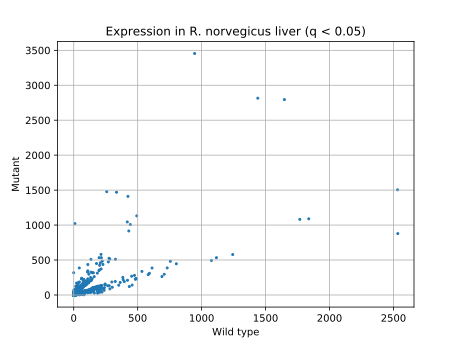
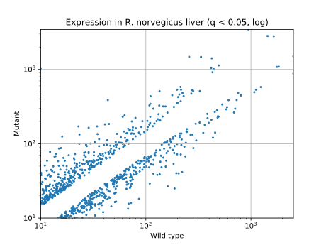
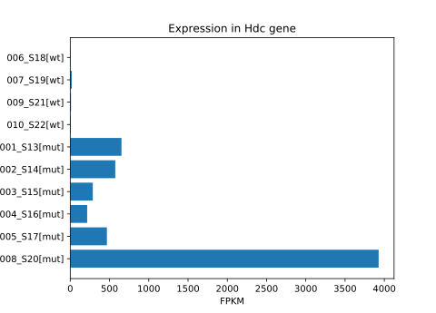
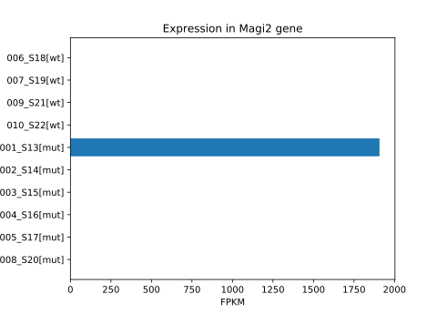
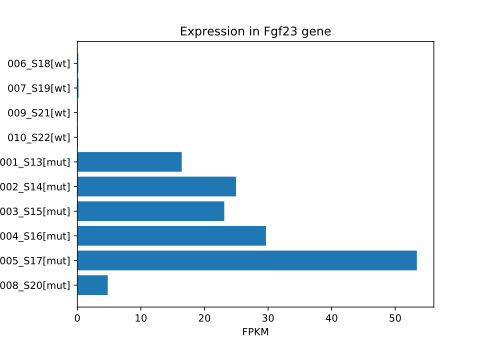
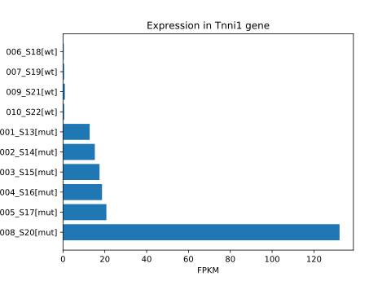
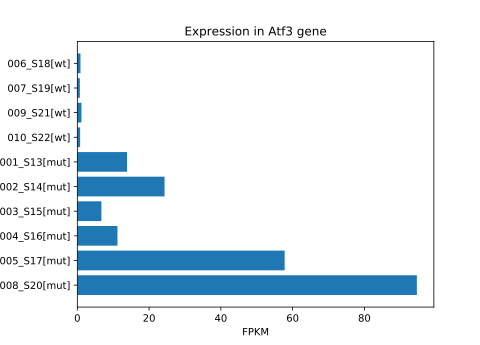
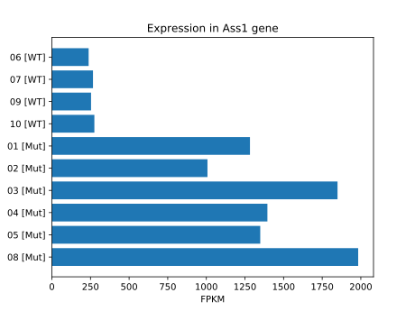
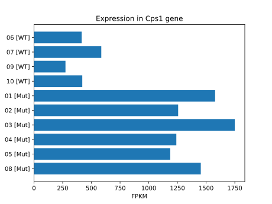
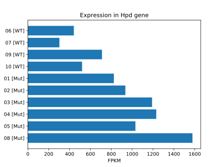

# Results (Fatimannusa Qadri)

## Updates

**23.09:** NCBI codes added.

**25.09:** Additional task #1 complete.

**01.10:** Additional task #2 complete.

**03.10:** Full list of **named** genes with expression significantly changed ([link](../labjournal/scripts_results/sayeeda_AllGenesDiff_named.csv)).

## Infographics

## Infinity fold change

### Genes which started work in mutants

| Cuff ID     | NCBI ID      | WT  | Mutant     | Fold change | q        | Gene description |
|:------------|:-------------|:---:|:----------:|:-----------:|:--------:|:---|
| XLOC_014279 | NM_053621    | 0.0 | 317.915009 | inf         | 0.000914 | RN membrane associated guanylate kinase, WW and PDZ domain containing 2 (Magi2) |
| XLOC_014365 | -            | 0.0 | 3.170720   | inf         | 0.006213 | - |
| XLOC_019088 | -            | 0.0 | 3.067730   | inf         | 0.009537 | - |
| XLOC_010932 | -            | 0.0 | 2.055790   | inf         | 0.000914 | - |
| XLOC_011264 | NM_001127652 | 0.0 | 1.710050   | inf         | 0.000914 | RN creatine kinase, mitochondrial 2 (Ckmt2) |
| XLOC_022004 | -            | 0.0 | 1.450680   | inf         | 0.000914 | - |
| XLOC_014084 | NM_031577    | 0.0 | 1.351500   | inf         | 0.000914 | RN growth hormone releasing hormone (Ghrh) |
| XLOC_003081 | NM_019174    | 0.0 | 1.238400   | inf         | 0.000914 | RN carbonic anhydrase 4 (Ca4) |
| XLOC_019549 | NM_001013247 | 0.0 | 1.127030   | inf         | 0.000914 | RN sarcolipin (Sln) |
| XLOC_013848 | NM_019183    | 0.0 | 1.071980   | inf         | 0.000914 | RN actin, alpha, cardiac muscle 1 (Actc1) |
| XLOC_011263 | NM_001127652 | 0.0 | 1.009560   | inf         | 0.029060 | RN creatine kinase, mitochondrial 2 (Ckmt2) |
| XLOC_016051 | -            | 0.0 | 0.888906   | inf         | 0.000914 | - |
| XLOC_011265 | NM_053721    | 0.0 | 0.868083   | inf         | 0.000914 | RN RAS protein-specific guanine nucleotide-releasing factor 2 (Rasgrf2) |
| XLOC_001184 | NM_001106361 | 0.0 | 0.830649   | inf         | 0.000914 | RN paired box 2 (Pax2) |
| XLOC_007381 | -            | 0.0 | 0.815152   | inf         | 0.011067 | - |
| XLOC_005610 | -            | 0.0 | 0.756804   | inf         | 0.000914 | - |
| XLOC_004482 | -            | 0.0 | 0.683683   | inf         | 0.000914 | - |
| XLOC_012266 | -            | 0.0 | 0.597145   | inf         | 0.000914 | - |
| XLOC_006229 | NM_019344    | 0.0 | 0.491085   | inf         | 0.000914 | RN regulator of G-protein signaling 8 (Rgs8) |
| XLOC_005609 | -            | 0.0 | 0.478454   | inf         | 0.000914 | - |

### Genes which stopped work in mutants

| Cuff ID     | NCBI ID      | WT       | Mut | Fold change | q        | Gene description |
|:------------|:-------------|:--------:|:---:|:-----------:|:--------:|:---|
| XLOC_021385 | NM_022946    | 1.287030 | 0.0 | -inf        | 0.000914 | RN DLG associated protein 1 (Dlgap1), transcript variant 1 |
| XLOC_008696 | -            | 1.202040 | 0.0 | -inf        | 0.000914 | - |
| XLOC_014363 | NM_031651    | 1.055120 | 0.0 | -inf        | 0.000914 | RN solute carrier family 13 member 1 (Slc13a1) |
| XLOC_010132 | -            | 1.019710 | 0.0 | -inf        | 0.000914 | - |
| XLOC_011045 | -            | 0.709557 | 0.0 | -inf        | 0.002437 | - |
| XLOC_009417 | NM_053789    | 0.674614 | 0.0 | -inf        | 0.000914 | RN interleukin 17B (Il17b) |
| XLOC_015564 | -            | 0.491164 | 0.0 | -inf        | 0.000914 | - |

## Fold change 2^(1..8)

CSV tables: [decreased](../labjournal/scripts_results/genes_minus_diff.csv) and [increased](../labjournal/scripts_results/genes_plus_diff.csv) expression.

## Significant genes (q < 0.05) with WT and/or Mut expression level >1000

| Cuff ID     | NCBI ID      | WT          | Mutant     | Fold change | q       | Gene description |
|:------------|:-------------|:-----------:|:-----------:|:---------:|:--------:|:---|
| XLOC_013923 | NM_017016    | 9.969800    | 1020.400024 | 6.677350  | 0.000914 | RN histidine decarboxylase (Hdc) |
| XLOC_013547 | NM_013157    | 258.191986  | 1477.660034 | 2.516800  | 0.000914 | RN argininosuccinate synthase 1 (Ass1) |
| XLOC_006778 | NM_013144    | 334.798004  | 1469.750000 | 2.134210  | 0.000914 | RN insulin-like growth factor binding protein 1 (Igfbp1) |
| XLOC_015152 | NM_021261    | 945.752991  | 3454.659912 | 1.869010  | 0.000914 | RN thymosin, beta 10 (Tmsb10) |
| XLOC_020821 | NM_017072    | 424.191010  | 1410.849976 | 1.733780  | 0.006804 | RN carbamoyl-phosphate synthase 1 (Cps1) |
| XLOC_017303 | NM_182474    | 418.816986  | 1045.040039 | 1.319170  | 0.013562 | RN Serine protease inhibitor (LOC299282) |
| XLOC_005197 | NM_017233    | 493.239990  | 1131.560059 | 1.197950  | 0.006213 | RN 4-hydroxyphenylpyruvate dioxygenase (Hpd) |
| XLOC_015733 | NM_053288    | 442.756989  | 1007.700012 | 1.186480  | 0.000914 | RN orosomucoid 1 (Orm1) |
| XLOC_004892 | -            | 1439.410034 | 2815.189941 | 0.967753  | 0.000914 | - |
| XLOC_003558 | -            | 1647.420044 | 2795.000000 | 0.762638  | 0.030886 | - |
| XLOC_008458 | NM_001079898 | 1767.699951 | 1081.689941 | -0.708582 | 0.047844 | RN defensin RatNP-3 precursor (RatNP-3b) |
| XLOC_011710 | NM_053587    | 2532.290039 | 1504.050049 | -0.751593 | 0.049207 | RN S100 calcium binding protein A9 (S100a9) |
| XLOC_008451 | NM_173329    | 1837.780029 | 1089.339966 | -0.754512 | 0.031166 | RN defensin alpha 5 (Defa5) |
| XLOC_006340 | NM_017170    | 1115.989990 | 533.198975  | -1.065580 | 0.000914 | RN amyloid P component, serum (Apcs) |
| XLOC_005382 | NM_013105    | 1243.369995 | 578.583008  | -1.103660 | 0.002437 | RN cytochrome P450, family 3, subfamily a, polypeptide 23/polypeptide 1 (Cyp3a23/3a1) |
| XLOC_008791 | -            | 1077.089966 | 493.636993  | -1.125620 | 0.000914 | - |
| XLOC_014542 | NM_012556    | 2533.929932 | 878.020996  | -1.529050 | 0.000914 | RN fatty acid binding protein 1 (Fabp1) |

## Preliminary findings

* Histidine decarboxylase (Hdc) expression increased from 10 to 1020 (2^6 times).

* Membrane associated guanylate kinase (Magi2) expression increased from zero to 317.

* Fibroblast growth factor 23 (Fgf23) expression increased from 0.1 to 25 (2^7 times)

* Troponin I1, slow skeletal type (Tnni1) expression increased from 0.6 to 36 (2^6 times).
Also, increase of muscular actin and similar proteins was been noticed;
looks like dysplastic processes.

* Activating transcription factor 3 (Atf3) expression increased from 0.8 to 34 (2^5 times).

## Additional task #1: Check 3 genes

Genes to analyze: 

* Ass1: argininosuccinate synthase 1
* Cps1: carbamoyl-phosphate synthase 1
* Hpd: 4-hydroxyphenylpyruvate dioxygenase

### Results

Data from the main table:

| Cuff ID     | NCBI ID      | WT          | Mutant     | Fold change | q       | Gene description |
|:------------|:-------------|:-----------:|:-----------:|:---------:|:--------:|:---|
| XLOC_020821 | NM_017072    | 424.191010  | 1410.849976 | 1.733780  | 0.006804 | RN carbamoyl-phosphate synthase 1 (Cps1) |
| XLOC_013547 | NM_013157    | 258.191986  | 1477.660034 | 2.516800  | 0.000914 | RN argininosuccinate synthase 1 (Ass1) |
| XLOC_005197 | NM_017233    | 493.239990  | 1131.560059 | 1.197950  | 0.006213 | RN 4-hydroxyphenylpyruvate dioxygenase (Hpd) |

Expression by sample:

|             |   06 [WT] |   07 [WT] |   09 [WT] |   10 [WT] |   01 [Mut] |   02 [Mut] |   03 [Mut] |   04 [Mut] |   05 [Mut] |   08 [Mut] |
|:------------|:---------:|:---------:|:---------:|:---------:|:----------:|:----------:|:----------:|:----------:|:----------:|:----------:|
| XLOC_020821 |   415.49  |   586.337 |   274.289 |   420.647 |   1578.35  |   1256.19  |    1749.49 |    1240.31 |    1187.27 |    1453.47 |
| XLOC_013547 |   237.933 |   266.112 |   253.619 |   275.102 |   1282.35  |   1007.28  |    1849.16 |    1395.27 |    1348.92 |    1982.95 |
| XLOC_005197 |   440.646 |   302.332 |   710.436 |   519.548 |    824.243 |    934.666 |    1190.5  |    1230.86 |    1031.07 |    1578.01 |

## Additional task #2: Filter SNPs

BAM-files were filtered with *bcftools* using the following parameters:

* Coverage depth > 20
* Quality > 30

Then we found all SNPs which are both homozygous in mutant animals and heterozygous (or absent) in wild type rats.

Mutations list:

| Chrom | Position | Ref | Alt | NCBI ID      | Type             |
|:------|:--------:|:---:|:---:|:-------------|:-----------------|
| chr15 | 18451435 | C   | T   | NM_145770    | Exon, non-coding |
| chr15 | 18451520 | T   | C   | NM_145770    | Synonim          |
| chr15 | 18459764 | T   | C   | NM_145770    | Synonim          |
| chr15 | 18464400 | G   | A   | NM_145770    | Synonim          |
| chr15 | 19721602 | G   | T   | NM_001134757 | Exon, non-coding |
| chr15 | 19721772 | G   | T   | NM_001134757 | Exon, non-coding |
| chr15 | 41065107 | G   | A   | -            | Not a gene       |
| chr15 | 41065578 | C   | T   | -            | Not a gene       |
| chr15 | 41065705 | C   | T   | -            | Not a gene       |
| chr15 | 41065845 | G   | A   | -            | Not a gene       |
| chr15 | 41065967 | T   | C   | -            | Not a gene       |
| chr15 | 41066164 | A   | G   | -            | Not a gene       |
| chr15 | 41139326 | G   | A   | NM_031052    | Synonim          |
| chr15 | 41668764 | G   | A   | NM_001108381 | Synonim          |
| chr15 | 41691466 | C   | T   | NM_001108381 | Synonim          |

Genes list:

| NCBI ID      | Description |
|:-------------|:---|
| NM_145770    | RN acyl-CoA oxidase 2 (Acox2) |
| NM_001134757 | RN glucosamine-phosphate N-acetyltransferase 1 (Gnpnat1) |
| NM_001108381 | RN EBP like (Ebpl) |
| NM_031052    | RN mitochondrial intermediate peptidase (Mipep) |
