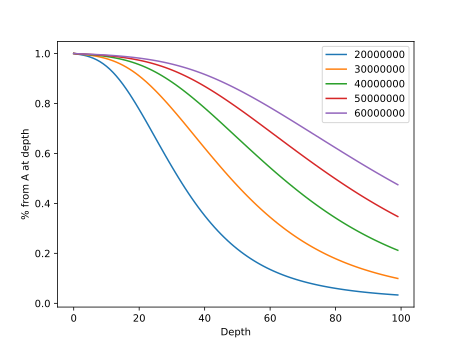

# Поток

## Калибровка по данным Динары

**Образец:** 104_S3

**Read length:** 100bp

| Parameter       | 20000000 | 30000000 | 40000000 | 50000000 | 60000000 |
|:----------------|:---------|:---------|:---------|:---------|:---------|
| Non-coverage, % | 0.24     | 0.15     | 0.12     | 0.1      | 0.08     |
| Coverage 50%    | 32       | 47       | 63       | 79       | 95       |
| Coverage 75%    | 21       | 31       | 42       | 53       | 64       |
| Coverage 90%    | 13       | 20       | 28       | 35       | 43       |
| Coverage 95%    | 9        | 15       | 21       | 26       | 32       |
| Twilight coverage | 39.01  | 58.37    | 77.79    | 97.33    | 116.7    |

Approximately 90M *paired* reads for coverage 50, and 140M reads for coverage 80.

## New pipeline

### CNNScoreVariants

Стандартные настройки из коробки, образец `DCSAN1-QUAR1`:

| Type | Variants, % |
|:-----|:------------|
| PASS | 97.56 |
| SNP, tranche 99.90-99.95 | 0.41 |
| SNP, tranche 99.95-100.00 | 1.38 |
| INDEL, tranche 99.00-99.40 | 0.2 |
| INDEL, tranche 99.40-100.00 | 0.41 |

### Выравнивание ExoC и экзомных данных

| DAEC         | Total reads | Mapped reads | Mapped, % | Dups, % |
|:-------------|:---------:|:---------:|:----:|:----:|
| DCSAN1-QUAR1 | 208134630 | 207667640 | 99.78 | 16.68 |
| DCVAS3-QUAR3 | 230354075 | 229876689 | 99.79 | 16.92 |
| DCPRI5-QUAR5 | 198787976 | 198323723 | 99.77 | 16.05 |
| DCZAV6-QUAR6 | 196678550 | 196206187 | 99.76 | 14.95 |
| DCKRO7-QUAR7 | 292527874 | 292000834 | 99.82 | 16.79 |
| DCNAR8-QUAR8 | 205238727 | 204720972 | 99.75 | 15.45 |
| DCBIK9-QUAR9 | 203790298 | 203282238 | 99.75 | 15.43 |
| DCAHM10-QUAR10 | 202982989 | 202447159 | 99.74 | 17.48 |
| DCFED13-JULTH13 | 28194084 | 27024078 | 95.85 | 21.14 |
| DCOKU14-JULTH14 | 22028447 | 20099966 | 91.25 | 17.91 |
| DCPOP15-JULTH15 | 25728092 | 24568400 | 95.49 | 21.10 |
| DCDOR16-JULTH16 | 47833422 | 46551207 | 97.32 | 24.89 |
| DCZHB17-JULTH17 | 41744634 | 40457040 | 96.92 | 22.62 |
| DCAXE18-JULTH18 | 41979205 | 40865335 | 97.35 | 23.19 |
| DCTEP19-JULTH19 | 37339154 | 36433593 | 97.57 | 22.55 |
| DCROM20-JULTH20 | 45361684 | 44214499 | 97.47 | 23.46 |
| DCROM21-JULTH21 | 51501581 | 50098022 | 97.27 | 23.36 |
| DCROM22-JULTH22 | 39146278 | 38124375 | 97.39 | 22.39 |
| DCMIH23-JULTH23 | 294037471 | 292820060 | 99.59 | 30.74 |

Покрытие (E - экзом, NE - не-экзом):

| DAEC | E, DP>=10, % | E, average | NE, average | E, median | NE, median | Average enrichment | Median enrichment | E, non-covered, % | NE, non-covered, % |
|:-----|:---:|:----:|:---:|:---:|:----:|:-----:|:-----:|:-------:|:------:|
| DCSAN1-QUAR1 | 65.87 | 0.01198 | 0.00050 | 11 | 6 | x24 | x2 | 1.39 | 10.45 |
| DCVAS3-QUAR3 | 64.08 | 0.01369 | 0.00048 | 11 | 7 | x28 | x2 | 1.41 | 10.09 |
| DCPRI5-QUAR5 | 54.74 | 0.01219 | 0.00043 | 10 | 6 | x28 | x2 | 1.38 | 10.17 |
| DCZAV6-QUAR6 | 68.56 | 0.01251 | 0.00049 | 12 | 6 | x25 | x2 | 1.42 | 10.99 |
| DCKRO7-QUAR7 | 81.84 | 0.01209 | 0.00052 | 14 | 8 | x23 | x2 | 1.31 | 9.57 |
| DCNAR8-QUAR8 | 72.15 | 0.00943 | 0.00051 | 14 | 5 | x18 | x3 | 1.74 | 14.28 |
| DCBIK9-QUAR9 | 64.90 | 0.01080 | 0.00045 | 11 | 6 | x24 | x2 | 1.41 | 10.62 |
| DCAHM10-QUAR10 | 67.25 | 0.01043 | 0.00042 | 12 | 5 | x24 | x2 | 1.43 | 11.83 |
| DCFED13-JULTH13 | 20.50 | 0.00349 | 0.00011 | 5 | 0 | x29 | x5 | 10.41 | 82.33 |
| DCOKU14-JULTH14 | 10.10 | 0.00374 | 0.00013 | 3 | 0 | x28 | x3 | 13.17 | 86.11 |
| DCPOP15-JULTH15 | 60.63 | 0.01110 | 0.00017 | 12 | 0 | x64 | x12 | 1.87 | 79.50 |
| DCDOR16-JULTH16 | 79.35 | 0.01329 | 0.00020 | 18 | 0 | x65 | x18 | 1.53 | 69.50 |
| DCZHB17-JULTH17 | 64.01 | 0.00872 | 0.00017 | 13 | 0 | x50 | x13 | 2.53 | 69.71 |
| DCAXE18-JULTH18 | 72.46 | 0.00780 | 0.00018 | 15 | 0 | x41 | x15 | 1.85 | 69.18 |
| DCTEP19-JULTH19 | 68.34 | 0.00974 | 0.00015 | 14 | 0 | x63 | x14 | 1.91 | 70.64 |
| DCROM20-JULTH20 | 61.92 | 0.00776 | 0.00017 | 12 | 0 | x44 | x12 | 2.95 | 69.15 |
| DCROM21-JULTH21 | 72.85 | 0.00765 | 0.00017 | 16 | 0 | x45 | x16 | 2.08 | 64.58 |
| DCROM22-JULTH22 | 54.70 | 0.00791 | 0.00016 | 10 | 0 | x47 | x10 | 3.68 | 72.01 |
| DCMIH23-JULTH23 | 98.74 | 0.03467 | 0.00048 | 233 | 2 | x71 | x116 | 0.89 | 26.94 |
