# Ноябрьские данные BGI HiC

## Образцы

Скачать можно [здесь](http://genedev.bionet.nsc.ru/site/hic_out/2019-11-09-BGI-ExoC/data/results/).

Команда:

```bash
wget -r ftp://genedev.bionet.nsc.ru/site/hic_out/2019-11-09-BGI-ExoC/data/results
```

| #   | Sample                    |
|:---:|:--------------------------|
| 2   | #8 (Нарышкина), DNase     |
| 4   | Паша                      |
| 5   | #3 (Васильева), DNase     |
| 6   | MNase 0.5 (длинные)       |
| 7   | #9 (Бикмухаметова), DNase | 
| 15  | MNase 2 (короткие)        |
| 19  | K562 – DNase              |

Адаптеры:

1. Bridge

```
 P        Biot
 |        |
 5-GCTGAGGGATC-3
3-TCGACTCC-5  
```

2. Blunt

```
5-CAGTGGCGAC-3
3-GTCACCG-5   
```

**TODO:**

* Количество ридов в каждом файле
* % адаптеров и расположение
* MNAse-Hi-C и DNAse-Hi-C прогнать через FastQC
* Обрезать адаптеры
* anal_seqs

## Первичный анализ

### Количество ридов в каждом файле

Команда:

```bash
for file in ./*/*.fq.gz; do ( length=$(echo "print("$(zcat $file | wc -l)" / 4)" | python3); echo "| "$file" | "$length" |"; ) done
```
| Библиотека                                 | Ридов     |
|--------------------------------------------|-----------|
| ./15/191107_X603_FCH5KNCCCX2_L5_15_1.fq.gz | 61403140  |
| ./15/191107_X603_FCH5KNCCCX2_L5_15_2.fq.gz | 61403140  |
| ./19/191107_X603_FCH5KNCCCX2_L5_19_1.fq.gz | 60389488  |
| ./19/191107_X603_FCH5KNCCCX2_L5_19_2.fq.gz | 60389488  |
| ./2/191107_X603_FCH5KNCCCX2_L5_2_1.fq.gz   | 59088991  |
| ./2/191107_X603_FCH5KNCCCX2_L5_2_2.fq.gz   | 59088991  |
| ./4/191107_X603_FCH5KNCCCX2_L5_4_1.fq.gz   | 25522262  |
| ./4/191107_X603_FCH5KNCCCX2_L5_4_2.fq.gz   | 25522262  |
| ./5/191107_X603_FCH5KNCCCX2_L5_5_1.fq.gz   | 138769927 |
| ./5/191107_X603_FCH5KNCCCX2_L5_5_2.fq.gz   | 138769927 |
| ./6/191107_X603_FCH5KNCCCX2_L5_6_1.fq.gz   | 15847105  |
| ./6/191107_X603_FCH5KNCCCX2_L5_6_2.fq.gz   | 15847105  |
| ./7/191107_X603_FCH5KNCCCX2_L5_7_1.fq.gz   | 121075216 |
| ./7/191107_X603_FCH5KNCCCX2_L5_7_2.fq.gz   | 121075216 |

### % адаптеров и расположение

Команда.
Нет, это не призыв сотоны из глубин ада, это всего лишь pipe в два параллельных процесса:

```bash
bridge="GCTGAGGGATC"; blunt="CAGTGGCGAC"; error=0.2; null="/dev/null"; output="/dev/datasets/FairWind/_results/November/adapters"; for file in ./*/*.fq.gz; do ( str=$(echo $file | tr '/' '_' ); str=${str:2:-6}; mkfifo pipe_$str; cat pipe_$str | (cutadapt -j 1 -b $bridge -O 9 -e $error -o $null - > $output/"$str"_bridge.txt) & (zcat $file | head -4000000) | tee pipe_$str | (cutadapt -j 1 -b $blunt -O 8 -e $error -o $null - > $output/"$str"_blunt.txt); rm pipe_$str; echo $file is done. ) & done
```

Подготовка таблиц:

```bash
for file in ./*bridge.txt; do (tail -146 $file > $file.csv) done
for file in ./*bridge.txt; do (tail -144 $file > $file.csv) done
```

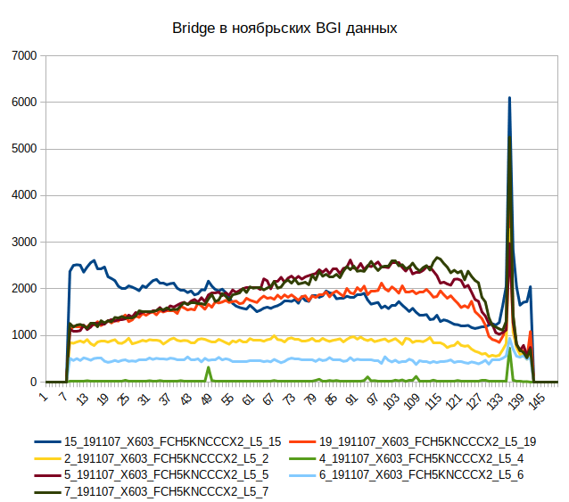
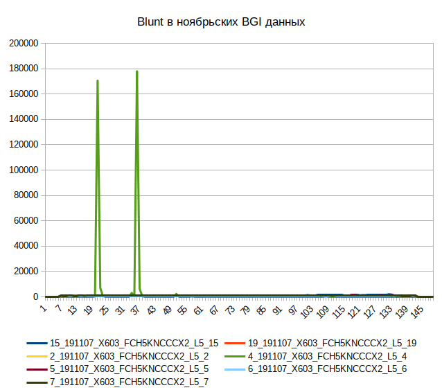

Тот же график без выброса в 4 библиотеке:

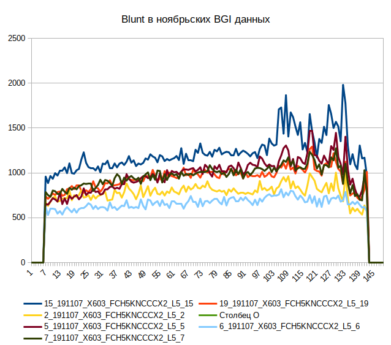

Таблица ODS, [если понадобится](./scripts_results/November_cutadapt_reports.ods).

### FastQC

Команда:

```bash
fastqc -o /dev/datasets/FairWind/_results/November/fastqc -t 10 /dev/datasets/ngs_data/November_BGI_HiC/*/*.fq.gz
```

Данные:

| #  | FastQC Results |
|:---|:----|
| 2  | [R1](http://htmlpreview.github.io/?https://github.com/regnveig/labjournal/blob/master/labjournal/FastQC_results/fastqc_November/191107_X603_FCH5KNCCCX2_L5_2_1_fastqc.html), [R2](http://htmlpreview.github.io/?https://github.com/regnveig/labjournal/blob/master/labjournal/FastQC_results/fastqc_November/191107_X603_FCH5KNCCCX2_L5_2_2_fastqc.html) |
| 4  | [R1](http://htmlpreview.github.io/?https://github.com/regnveig/labjournal/blob/master/labjournal/FastQC_results/fastqc_November/191107_X603_FCH5KNCCCX2_L5_4_1_fastqc.html), [R2](http://htmlpreview.github.io/?https://github.com/regnveig/labjournal/blob/master/labjournal/FastQC_results/fastqc_November/191107_X603_FCH5KNCCCX2_L5_4_2_fastqc.html) |
| 5  | [R1](http://htmlpreview.github.io/?https://github.com/regnveig/labjournal/blob/master/labjournal/FastQC_results/fastqc_November/191107_X603_FCH5KNCCCX2_L5_5_1_fastqc.html), [R2](http://htmlpreview.github.io/?https://github.com/regnveig/labjournal/blob/master/labjournal/FastQC_results/fastqc_November/191107_X603_FCH5KNCCCX2_L5_5_2_fastqc.html) |
| 6  | [R1](http://htmlpreview.github.io/?https://github.com/regnveig/labjournal/blob/master/labjournal/FastQC_results/fastqc_November/191107_X603_FCH5KNCCCX2_L5_6_1_fastqc.html), [R2](http://htmlpreview.github.io/?https://github.com/regnveig/labjournal/blob/master/labjournal/FastQC_results/fastqc_November/191107_X603_FCH5KNCCCX2_L5_6_2_fastqc.html) |
| 7  | [R1](http://htmlpreview.github.io/?https://github.com/regnveig/labjournal/blob/master/labjournal/FastQC_results/fastqc_November/191107_X603_FCH5KNCCCX2_L5_7_1_fastqc.html), [R2](http://htmlpreview.github.io/?https://github.com/regnveig/labjournal/blob/master/labjournal/FastQC_results/fastqc_November/191107_X603_FCH5KNCCCX2_L5_7_2_fastqc.html) |
| 15 | [R1](http://htmlpreview.github.io/?https://github.com/regnveig/labjournal/blob/master/labjournal/FastQC_results/fastqc_November/191107_X603_FCH5KNCCCX2_L5_15_1_fastqc.html), [R2](http://htmlpreview.github.io/?https://github.com/regnveig/labjournal/blob/master/labjournal/FastQC_results/fastqc_November/191107_X603_FCH5KNCCCX2_L5_15_2_fastqc.html) |
| 19 | [R1](http://htmlpreview.github.io/?https://github.com/regnveig/labjournal/blob/master/labjournal/FastQC_results/fastqc_November/191107_X603_FCH5KNCCCX2_L5_19_1_fastqc.html), [R2](http://htmlpreview.github.io/?https://github.com/regnveig/labjournal/blob/master/labjournal/FastQC_results/fastqc_November/191107_X603_FCH5KNCCCX2_L5_19_2_fastqc.html) |

### Обрезка адаптеров

```bash
boomer;
Logo "Illuminaless (cutadapt)";
THREADS=10;
OUTPUT_FOLDER='/dev/datasets/FairWind/_results/November/Illuminaless';
mkdir -p $OUTPUT_FOLDER;
illumina1='AGATCGGAAGAGCACACGTCTGAACTCCAGTCAC';
illumina2='AGATCGGAAGAGCGTCGTGTAGGGAAAGAGTGTAGATCTCGGTGGTCGCCGTATCATT';
r1=(/dev/datasets/ngs_data/November_BGI_HiC/*/*1.fq.gz);
r2=(/dev/datasets/ngs_data/November_BGI_HiC/*/*2.fq.gz);
for var in ${!r1[*]};
do {
start_time=$(StartTime);
r1_output=$OUTPUT_FOLDER/$(FileBase ${r1[var]})_Illuminaless.fq.gz;
r2_output=$OUTPUT_FOLDER/$(FileBase ${r2[var]})_Illuminaless.fq.gz;
fb=$(FileBase ${r1[var]});
report=$OUTPUT_FOLDER/${fb::-2}_report.txt;
cutadapt -m 8 -j $THREADS -a $illumina1 -A $illumina2 -o $r1_output -p $r2_output ${r1[var]} ${r2[var]} > $report;
echo "File "${fb::-2}" is done "$(Timestamp $start_time)"";
} done;
Seal $OUTPUT_FOLDER
```

Содержание адаптеров Illumina:

| #  | Adapter %, 3' | Adapter %, 5' |
|:---|:-------------:|:-------------:|
| 2  | 20.2          | 20.2          |
| 4  | 1.6           | 1.6           |
| 5  | 42.8          | 42.7          |
| 6  | 14.5          | 14.6          |
| 7  | 37.4          | 37.3          |
| 15 | 28.1          | 28.1          |
| 19 | 40.0          | 39.9          |

### Анализ паттернов

Последовательности:

| Name           | Seq         |
|:---------------|:------------|
| -bridge--gatc- | GCTGAGGGATC |
| -bridge-       | GCTGAGG     |
| -gatc--egdirb- | GATCCCTCAGC |
| -egdirb-       | CCTCAGC     |
| -blunt--gac-   | CAGTGGCGAC  |
| -blunt-        | CAGTGGC     |
| -gtc--tnulb-   | GTCGCCACTG  |
| -tnulb-        | GCCACTG     |

[2](./scripts_results/November_PatternAnalysis/191107_X603_FCH5KNCCCX2_L5_2_1_Illuminaless_PatternAnalysis.csv),
[4](./scripts_results/November_PatternAnalysis/191107_X603_FCH5KNCCCX2_L5_4_1_Illuminaless_PatternAnalysis.csv),
[5](./scripts_results/November_PatternAnalysis/191107_X603_FCH5KNCCCX2_L5_5_1_Illuminaless_PatternAnalysis.csv),
[6](./scripts_results/November_PatternAnalysis/191107_X603_FCH5KNCCCX2_L5_6_1_Illuminaless_PatternAnalysis.csv),
[7](./scripts_results/November_PatternAnalysis/191107_X603_FCH5KNCCCX2_L5_7_1_Illuminaless_PatternAnalysis.csv),
[15](./scripts_results/November_PatternAnalysis/191107_X603_FCH5KNCCCX2_L5_15_1_Illuminaless_PatternAnalysis.csv),
[19](./scripts_results/November_PatternAnalysis/191107_X603_FCH5KNCCCX2_L5_19_1_Illuminaless_PatternAnalysis.csv).

Дополнительно. Анализ на bgg/eg:

| Filename                                     | BGG     | EG     |
|:---------------------------------------------|:-------:|:------:|
| 191107_X603_FCH5KNCCCX2_L5_2_1_Illuminaless  | 13.6813 | 0.6994 |
| 191107_X603_FCH5KNCCCX2_L5_4_1_Illuminaless  | 0.0846  | 0.0056 |
| 191107_X603_FCH5KNCCCX2_L5_5_1_Illuminaless  | 13.6073 | 0.4824 |
| 191107_X603_FCH5KNCCCX2_L5_6_1_Illuminaless  | 0.9521  | 0.2045 |
| 191107_X603_FCH5KNCCCX2_L5_7_1_Illuminaless  | 9.3949  | 0.6838 |
| 191107_X603_FCH5KNCCCX2_L5_15_1_Illuminaless | 5.2202  | 2.4024 |
| 191107_X603_FCH5KNCCCX2_L5_19_1_Illuminaless | 10.4418 | 0.9529 |

### Анализ паттернов с необрезанным Illumina

| Name           | Seq         |
|:---------------|:------------|
| -illumina-     | AGATCGGAAG  |
| -bridge--gatc- | GCTGAGGGATC |
| -bridge-       | GCTGAGG     |
| -gatc--egdirb- | GATCCCTCAGC |
| -egdirb-       | CCTCAGC     |
| -blunt--gac-   | CAGTGGCGAC  |
| -blunt-        | CAGTGGC     |
| -gtc--tnulb-   | GTCGCCACTG  |
| -tnulb-        | GCCACTG     |

Данные: [2](./scripts_results/November_PatternAnalysis_NotCut/191107_X603_FCH5KNCCCX2_L5_2_1_PatternAnalysis.csv),
[4](./scripts_results/November_PatternAnalysis_NotCut/191107_X603_FCH5KNCCCX2_L5_4_1_PatternAnalysis.csv),
[5](./scripts_results/November_PatternAnalysis_NotCut/191107_X603_FCH5KNCCCX2_L5_5_1_PatternAnalysis.csv),
[6](./scripts_results/November_PatternAnalysis_NotCut/191107_X603_FCH5KNCCCX2_L5_6_1_PatternAnalysis.csv),
[7](./scripts_results/November_PatternAnalysis_NotCut/191107_X603_FCH5KNCCCX2_L5_7_1_PatternAnalysis.csv),
[15](./scripts_results/November_PatternAnalysis_NotCut/191107_X603_FCH5KNCCCX2_L5_15_1_PatternAnalysis.csv),
[19](./scripts_results/November_PatternAnalysis_NotCut/191107_X603_FCH5KNCCCX2_L5_19_1_PatternAnalysis.csv).

BGG/EG:

| Filename                      | BGG     | EG     |
|:------------------------------|:-------:|:------:|
| 191107_X603_FCH5KNCCCX2_L5_15 | 5.2202  | 2.4021 |
| 191107_X603_FCH5KNCCCX2_L5_19 | 10.4409 | 0.9525 |
| 191107_X603_FCH5KNCCCX2_L5_2  | 13.6808 | 0.6995 |
| 191107_X603_FCH5KNCCCX2_L5_4  | 0.0844  | 0.0056 |
| 191107_X603_FCH5KNCCCX2_L5_5  | 13.6072 | 0.4824 |
| 191107_X603_FCH5KNCCCX2_L5_6  | 0.9521  | 0.2043 |
| 191107_X603_FCH5KNCCCX2_L5_7  | 9.3947  | 0.6837 |

### Анализ только данных с обрезанным Illumina

[2](./scripts_results/November_PatternAnalysis_CutOnly/191107_X603_FCH5KNCCCX2_L5_2_1_Illuminaless_PatternAnalysis.csv),
[4](./scripts_results/November_PatternAnalysis_CutOnly/191107_X603_FCH5KNCCCX2_L5_4_1_Illuminaless_PatternAnalysis.csv),
[5](./scripts_results/November_PatternAnalysis_CutOnly/191107_X603_FCH5KNCCCX2_L5_5_1_Illuminaless_PatternAnalysis.csv),
[6](./scripts_results/November_PatternAnalysis_CutOnly/191107_X603_FCH5KNCCCX2_L5_6_1_Illuminaless_PatternAnalysis.csv),
[7](./scripts_results/November_PatternAnalysis_CutOnly/191107_X603_FCH5KNCCCX2_L5_7_1_Illuminaless_PatternAnalysis.csv),
[15](./scripts_results/November_PatternAnalysis_CutOnly/191107_X603_FCH5KNCCCX2_L5_15_1_Illuminaless_PatternAnalysis.csv),
[19](./scripts_results/November_PatternAnalysis_CutOnly/191107_X603_FCH5KNCCCX2_L5_19_1_Illuminaless_PatternAnalysis.csv).

BGG/EG:

| Filename                                     | BGG     | EG     |
|:---------------------------------------------|:-------:|:------:|
| 191107_X603_FCH5KNCCCX2_L5_15_1_Illuminaless | 4.5230  | 2.3629 |
| 191107_X603_FCH5KNCCCX2_L5_19_1_Illuminaless | 9.452   | 0.789  |
| 191107_X603_FCH5KNCCCX2_L5_2_1_Illuminaless  | 13.1569 | 0.647  |
| 191107_X603_FCH5KNCCCX2_L5_4_1_Illuminaless  | 0.029   | 0.002  |
| 191107_X603_FCH5KNCCCX2_L5_5_1_Illuminaless  | 12.8570 | 0.371  |
| 191107_X603_FCH5KNCCCX2_L5_6_1_Illuminaless  | 0.8140  | 0.153  |
| 191107_X603_FCH5KNCCCX2_L5_7_1_Illuminaless  | 8.254   | 0.5500 |

### Дополнительный анализ А-тейлинга

[2](./scripts_results/November_PatternAnalysis_Cut_A-tail/191107_X603_FCH5KNCCCX2_L5_2_1_Illuminaless_PatternAnalysis.csv),
[5](./scripts_results/November_PatternAnalysis_Cut_A-tail/191107_X603_FCH5KNCCCX2_L5_5_1_Illuminaless_PatternAnalysis.csv),
[6](./scripts_results/November_PatternAnalysis_Cut_A-tail/191107_X603_FCH5KNCCCX2_L5_6_1_Illuminaless_PatternAnalysis.csv),
[7](./scripts_results/November_PatternAnalysis_Cut_A-tail/191107_X603_FCH5KNCCCX2_L5_7_1_Illuminaless_PatternAnalysis.csv),
[15](./scripts_results/November_PatternAnalysis_Cut_A-tail/191107_X603_FCH5KNCCCX2_L5_15_1_Illuminaless_PatternAnalysis.csv),
[19](./scripts_results/November_PatternAnalysis_Cut_A-tail/191107_X603_FCH5KNCCCX2_L5_19_1_Illuminaless_PatternAnalysis.csv).

### Анализ контекста в геноме после бриджа

```bash
boomer;
Logo "Cut BG";
THREADS=10;
INPUT_FOLDER='/dev/datasets/FairWind/_results/November/November_BGG_100k';
OUTPUT_FOLDER='/dev/datasets/FairWind/_results/November/November_BGG_100k_bgless';
mkdir -p $OUTPUT_FOLDER;
for var in 2 5 6 7 15 19;
do {
start_time=$(StartTime);
cutadapt -m 11 -e 0 -j $THREADS -g GCTGAGGGATC -o $OUTPUT_FOLDER/191107_X603_FCH5KNCCCX2_L5_"$var"_1_Illuminaless_BGG-100k.fastq.gz $INPUT_FOLDER/191107_X603_FCH5KNCCCX2_L5_"$var"_1_Illuminaless_BGG-100k.fastq;
echo "Lib "$var" is done "$(Timestamp $start_time)"";
} done;
Seal $OUTPUT_FOLDER
```

Выравнивание:
```bash
boomer;
Logo "Align BG";
THREADS=10;
GENOME="/dev/datasets/FairWind/_db/hg19/hg19.fa"
INPUT_DIR="/dev/datasets/FairWind/_results/November/November_BGG_100k_bgless";
BAM_DIR="/dev/datasets/FairWind/_results/November/November_BGG_bam";
mkdir -p $BAM_DIR;
for var in 2 5 6 7 15 19;
do {
start_time=$(StartTime);
bwa mem -t $THREADS -v 1 $GENOME $INPUT_DIR/191107_X603_FCH5KNCCCX2_L5_"$var"_1_Illuminaless_BGG-100k.fastq.gz | samtools view -bS -@ $THREADS - | samtools sort -@ $THREADS -O BAM - > $BAM_DIR/191107_X603_FCH5KNCCCX2_L5_"$var"_BGG-100k_sorted.bam;
echo "Sample "$var" is ready "$(Timestamp $start_time)"";
} done;
BamIndex $BAM_DIR/*.bam
```

Дальнейший анализ производился питоновским скриптом.

Результаты.
На графике показано распределение букв в контексте, отличном от GATC, в Forward- и Reverse-ридах соответственно.

1. 191107_X603_FCH5KNCCCX2_L5_2_BGG-100k. GATC: F = 28.8%, R = 28.6%
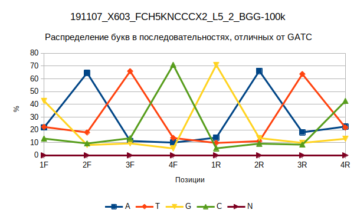
2. 191107_X603_FCH5KNCCCX2_L5_5_BGG-100k. GATC: F = 33.8%, R = 33.6%
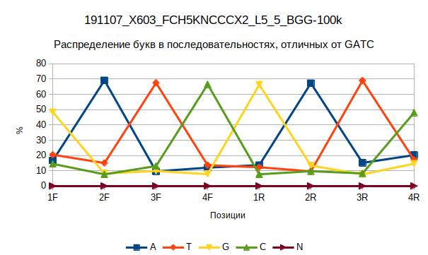
3. 191107_X603_FCH5KNCCCX2_L5_6_BGG-100k. GATC: F = 13.1%, R = 12.7%
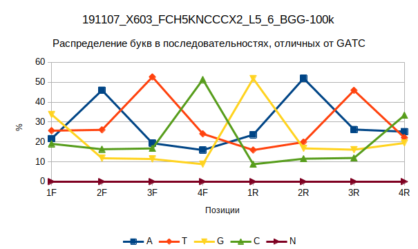
4. 191107_X603_FCH5KNCCCX2_L5_7_BGG-100k. GATC: F = 12.8%, R = 12.8%
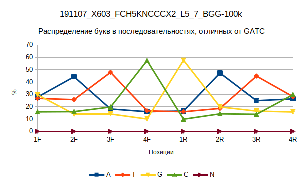
5. 191107_X603_FCH5KNCCCX2_L5_15_BGG-100k. GATC: F = 8.8%, R = 8.5%
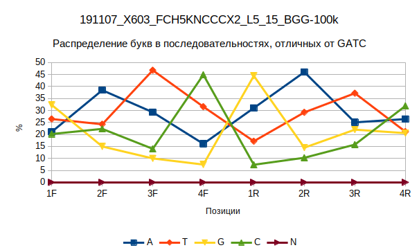
6. 191107_X603_FCH5KNCCCX2_L5_19_BGG-100k. GATC: F = 10.8%, R = 10.6%
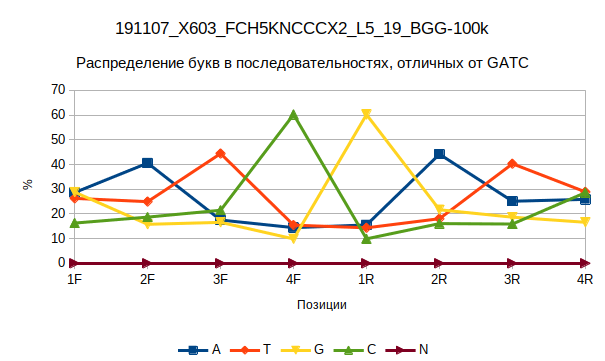

**Вывод:** в геноме практически всегда есть GATC. 
Скорее всего, бридж залипает именно на него.

### Буква перед бриджом

Команда:

```bash
boomer;
echo "| Sample | A | T | G | C |";
for file in /dev/datasets/FairWind/_results/November/Illuminaless/*1_Illuminaless.fq.gz;
do {
At=$(zcat $file | head -1000000 | grep AGCTGAGG | wc -l);
Tt=$(zcat $file | head -1000000 | grep TGCTGAGG | wc -l);
Gt=$(zcat $file | head -1000000 | grep GGCTGAGG | wc -l);
Ct=$(zcat $file | head -1000000 | grep CGCTGAGG | wc -l);
AllBridge=$(zcat $file | head -1000000 | grep GCTGAGG | wc -l);
StartBridge=$(zcat $file | head -1000000 | grep ^GCTGAGG | wc -l);
NBridge=$(zcat $file | head -1000000 | grep NGCTGAGG | wc -l);
Nb=$(( AllBridge - StartBridge - NBridge ));
Ap=$(( At * 100 / Nb ));
Tp=$(( Tt * 100 / Nb ));
Gp=$(( Gt * 100 / Nb ));
Cp=$(( Ct * 100 / Nb ));
echo "| "$(FileBase $file)" | "$Ap" | "$Tp" | "$Gp" | "$Cp" |";
} done
```

Результаты.
В сумме получается >100% из-за особенностей округления.

| Sample                                       | A   | T   | G   | C   |
|:---------------------------------------------|:---:|:---:|:---:|:---:|
| 191107_X603_FCH5KNCCCX2_L5_15_1_Illuminaless | 33  | 5   | 65  | 2   |
| 191107_X603_FCH5KNCCCX2_L5_19_1_Illuminaless | 25  | 11  | 66  | 4   |
| 191107_X603_FCH5KNCCCX2_L5_2_1_Illuminaless  | 24  | 16  | 66  | 4   |
| 191107_X603_FCH5KNCCCX2_L5_4_1_Illuminaless  | 40  | 14  | 48  | 4   |
| 191107_X603_FCH5KNCCCX2_L5_5_1_Illuminaless  | 25  | 16  | 60  | 5   |
| 191107_X603_FCH5KNCCCX2_L5_6_1_Illuminaless  | 26  | 10  | 64  | 2   |
| 191107_X603_FCH5KNCCCX2_L5_7_1_Illuminaless  | 22  | 11  | 68  | 4   |

### Анализ контекста вокруг бриджа в ридах

Суммарная статистика:

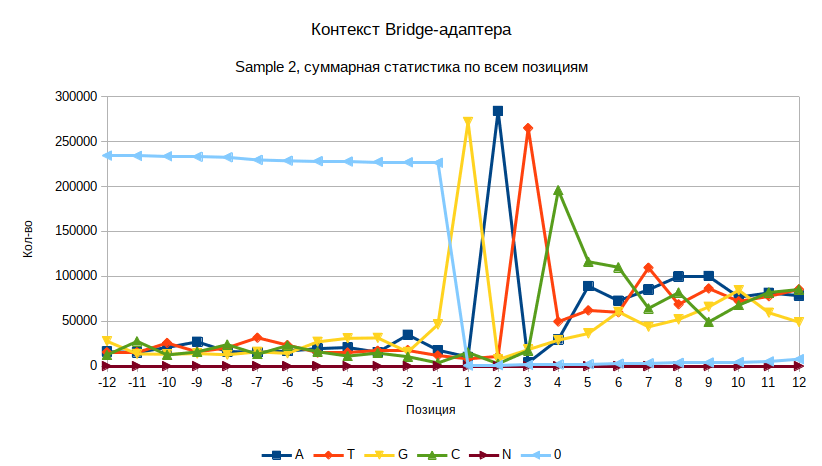

Выборочные позиции:

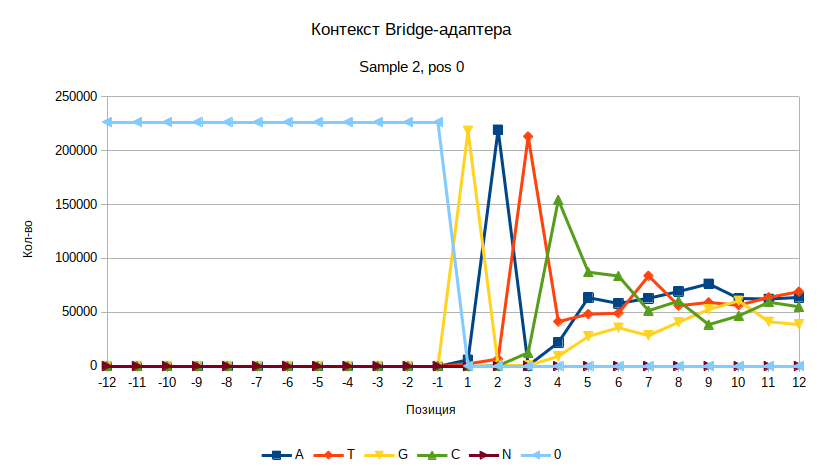
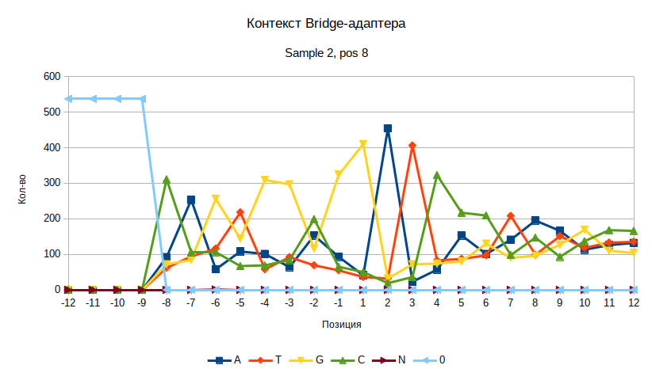
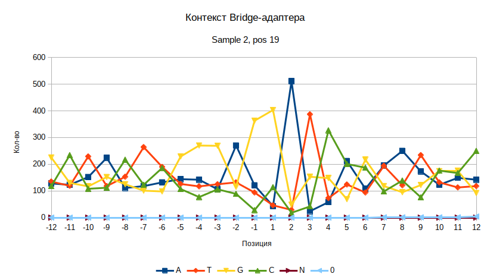
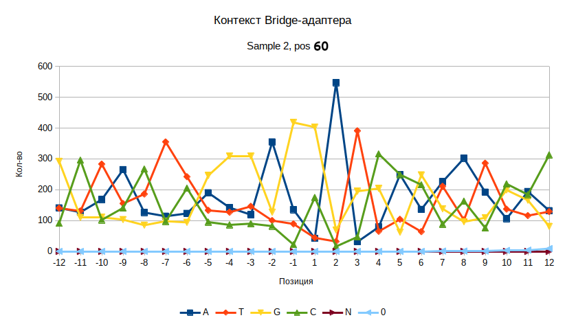

### Такая же статистика для старого образца 1-2, на ридах вида `-genome--bridge--gatc--genome-`

Суммарная статистика:

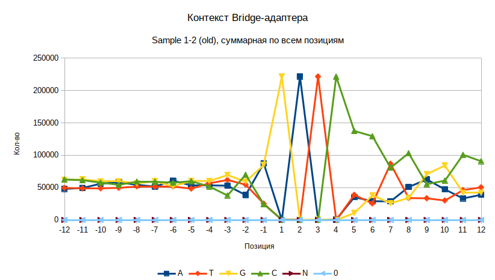

Выборочные позиции:

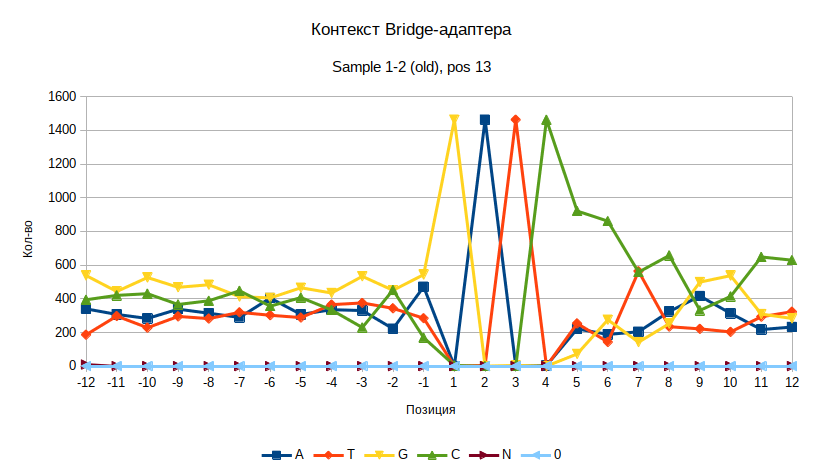
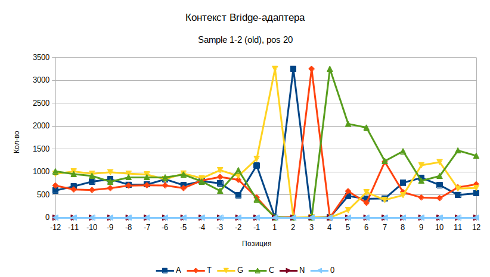
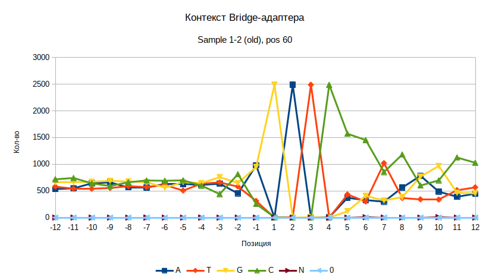

### Расширенный контекст

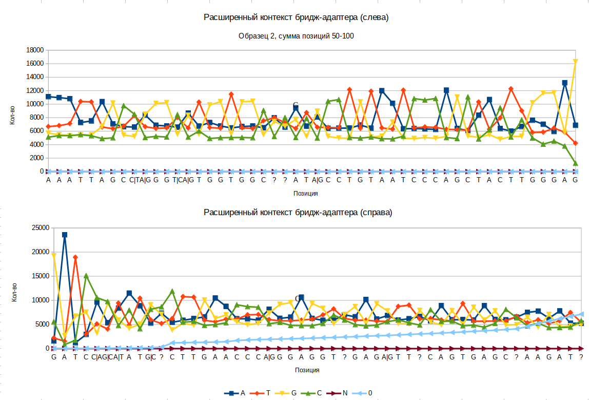

Предполагаемая последовательность:

```
AAATTAGC(C|T)(A|G)GG(T|C)(A|G)TGGTGGC??AT(A|G)CCTGTAATCCCAGCTACTTGGGAG[GCTGAGG]GATC(C|A)(G|C)(A|T)AT(G|C)?CTTGAACCC(A|G)GGAGGT?GAG(A|G)TT?CAGTGAGC?AAGAT?
```

Искалась последовательность `AAATTAGCCGGGCATGGTGGCACATGCCTGTAATCCCAGCTACTTGGGAGGCTGAGGGATCCCTATGCCTTGAACCCAGGAGGTGGAGGTTGCAGTGAGCTAAGATC`.

Результаты поиска в BLAT:

| SCORE | START | END | QSIZE | IDENTITY | CHROM | STRAND | START | END | SPAN |
|-----|-----|-----|-----|--------|-------|-----|-----------|-----------|-----|
| 78 | 10 | 107 | 107 | 89.8 | chr4 | - | 71782348 | 71782445 | 98 |
| 75 | 1 | 101 | 107 | 87.2 | chr8 | - | 98848478 | 98848578 | 101 |
| 71 | 1 | 107 | 107 | 83.2 | chr6 | - | 88530757 | 88530863 | 107 |
| 62 | 26 | 106 | 107 | 88.9 | chrX | - | 140191751 | 140191964 | 214 |
| 59 | 1 | 83 | 107 | 85.6 | chr5 | - | 22575761 | 22575843 | 83 |
| 59 | 26 | 107 | 107 | 86.5 | chr4 | + | 124446919 | 124447135 | 217 |
| 58 | 27 | 107 | 107 | 86.1 | chr5 | + | 21179386 | 21179600 | 215 |
| 53 | 35 | 107 | 107 | 86.4 | chrY | + | 1483483 | 1483555 | 73 |
| 53 | 35 | 107 | 107 | 86.4 | chrX | + | 1533483 | 1533555 | 73 |
| 51 | 24 | 107 | 107 | 85.0 | chr11 | + | 43682411 | 43682629 | 219 |
| 50 | 1 | 76 | 107 | 82.9 | chr14 | + | 72523879 | 72523954 | 76 |
| 40 | 68 | 107 | 107 | 100.0 | chr4 | - | 85825457 | 85825496 | 40 |
 | 32 | 16 | 52 | 107 | 94.5 | chr19 | + | 40810978 | 40811014 | 37 |

## Данные Сальникова

1. Создание bed-файла
2. Компиляция индекса

```bash
bowtie2-build --threads 12 /dev/datasets/FairWind/Pavel/seq.fa /dev/datasets/FairWind/Pavel/bt_index/bt_index
```

3. Выравнивание

```bash
bt_index="/dev/datasets/FairWind/Pavel/bt_index/bt_index";
r1="/dev/datasets/ngs_data/November_BGI_HiC/4/191107_X603_FCH5KNCCCX2_L5_4_1.fq.gz";
r2="/dev/datasets/ngs_data/November_BGI_HiC/4/191107_X603_FCH5KNCCCX2_L5_4_2.fq.gz";
threads=10;

bowtie2 --local --very-sensitive-local -p $threads -x $bt_index \
	-1 $r1 -2 $r2 | tee /dev/datasets/FairWind/Pavel/seq.sam | samtools view -bS \
	-@ $threads - | samtools sort -@ $threads -O BAM - > /dev/datasets/FairWind/Pavel/seq.bam;
```

Отчёт:

```
25522262 reads; of these:
  25522262 (100.00%) were paired; of these:
    1304780 (5.11%) aligned concordantly 0 times
    23954718 (93.86%) aligned concordantly exactly 1 time
    262764 (1.03%) aligned concordantly >1 times
    ----
    1304780 pairs aligned concordantly 0 times; of these:
      99765 (7.65%) aligned discordantly 1 time
    ----
    1205015 pairs aligned 0 times concordantly or discordantly; of these:
      2410030 mates make up the pairs; of these:
        2350786 (97.54%) aligned 0 times
        58692 (2.44%) aligned exactly 1 time
        552 (0.02%) aligned >1 times
95.39% overall alignment rate
```

Разброс по позициям выравнивания в референсе:

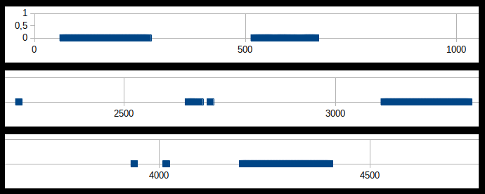

### Данные

Баркоды:

| F\R     | ATGC | CATG | GCAT | TGCA |
|---------|------|------|------|------|
| ATGC    | -    | 1    | 2    | 3    |
| CATG    | 4    | 5    | 6    | 7    |
| GCAT    | 8    | 9    | 10   | 11   |
| TGCA    | 12   | 13   | 14   | 15   |
| CGTAf   | 16   | 17   | 18   | 19   |

Праймеры:

| Name | Sequence                 | Start | End  | Dir    |
|:-----|:-------------------------|:-----:|:----:|:------:|
| L2F  | AGCACGTGGGGTGAGAG        | 75    | 91   | F      | 
| L2R  | TGCTCAAGTAGACCTAATGTGG   | 279   | 300  | R      |
| R2F  | ACCTCATGATCCAAGGGTACCTCC | 4207  | 4230 | F      |
| R2R  | TCGCCTGGAATCCTCCAGCT     | 4416  | 4435 | R      |
| M2F  | AGAGTGTGGCTGGGTACCTG     | 3123  | 3142 | F      | 
| M2R  | CTTGGCCACACAGGTGTAGTT    | 3329  | 3349 | R      |

Сайты CTCF:

| Name   | Sequence             | Start | End  |
|:-------|:---------------------|:-----:|:----:|
| L2CTCF | CCACCAGCAGGGGCTGCAGT | 176   | 195  |
| M2CTCF | CTCCCACCAGAGGGCACCCG | 3221  | 3240 |
| R2CTCF | GTGGCCACTAGGGGGCAGGG | 4325  | 4344 |

**TODO:**

1. Рассортировать парные риды:
	* По позициям начала (посадки праймера);
	* По совпадению с этими позициями (оверлап 8 букв);
	* По strand.
2. Дополнительно: понять, из-за чего 0.35% ридов выровнялись дискордантно.
3. Дополнительно: узнать, почему позиции выравнивания представляют отрезки, а не точки (кол-во ридов на позицию).

### Сортировка

Команда:

```bash
boomer;
threads=10;
output_dir="/dev/datasets/FairWind/Pavel/bam";
Logo "Sorting Pavel";
mkdir -p $output_dir;
for file in /dev/datasets/FairWind/Pavel/sorted/*.sam;
do {
start_time=$(StartTime);
samtools view -bS -@ $threads $file | samtools sort -@ $threads -O BAM - > $output_dir/$(FileBase $file)_sorted.bam;
echo "File "$(FileBase $file)" is ready "$(Timestamp $start_time)"";
} done;
BamIndex $output_dir/*.bam;
Seal "$output_dir";
```
