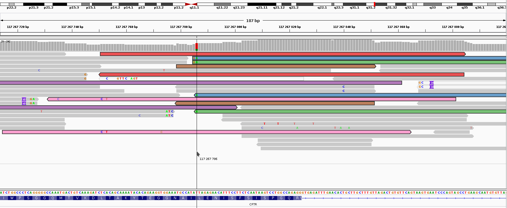
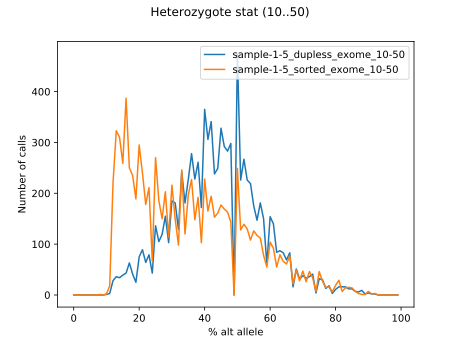
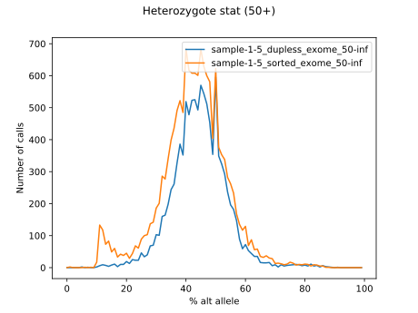
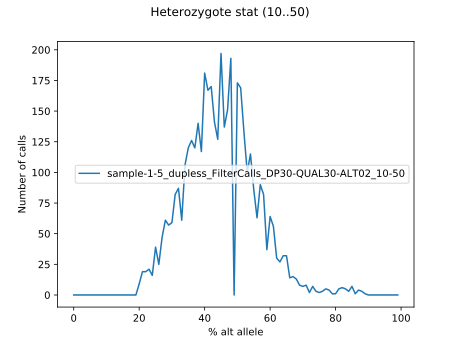
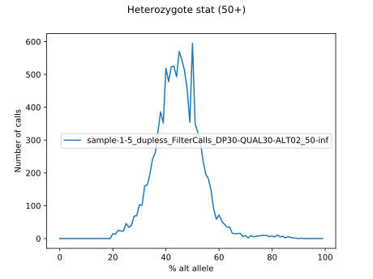
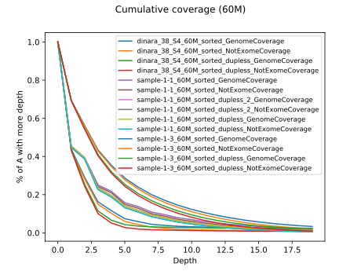
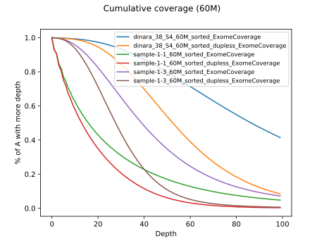

# Поиск мутаций

Наши библиотеки были обработаны *bcftools* с параметрами Depth = 10, Qual = 30.

```
$ bcftools mpileup -f {genome} {input_filename} | bcftools call -cv -Ou | bcftools filter -i \"DP>{depth} & %QUAL>{quality}\" > {output_filename}
```

Файлы получились чересчур большими, поэтому было решено дополнительно отфильтровать их на экзом (несортированный bed-файл MedExome TargetCapture):

```
vcftools --vcf {input_filename} --bed {region} --out {output_filename} --recode
```

Далее библиотеки обрабатывались в VEP со всеми возможными параметрами.

## Нейрофиброматоз I типа у пациента 1-9

**Гены (hg19):**

* NF1, chr17:29,421,945-29,709,134
* NF2, chr22:29,999,545-30,094,589

### NF1

Результаты поиска [здесь](./scripts_results/1-9_NF1_search.csv).
Они были пропущены через VEP со всеми возможными параметрами.
Результаты [здесь](./scripts_results/1-9_NF1_vep.csv).

Ничего значимого не найдено.

### NF2

Результаты поиска [здесь](./scripts_results/1-9_NF2_search.csv).
Они были пропущены через VEP со всеми возможными параметрами.
Результаты [здесь](./scripts_results/1-9_NF2_vep.csv).

Ничего значимого не найдено.

## Ген CFTR у пациента 1-1

CFTR: chr7:117,120,148- 117,307,162

### Результаты

Миссенс-мутация в chr7:117,267,786.
Глубина покрытия участка - 16, мутация видна в 4 ридах (25%), после эмпирического анализа на ПЦР-дубликаты - в 1 из 5.
Данные частоты по популяциям отсутствуют во всех БД.
Скорее всего, ошибка секвенирования.



Все прочие мутации имеют низкий импакт и/или высокую частоту встречаемости в популяции.
[Полные результаты](./scripts_results/1-1_CFTR_vep.csv).

## Братья с умственной отсталостью

Были смержены таблицы, а затем вручную отобраны гены, связанные с умственной отсталостью и агрессией.
Все они были вручную проверены в IGV.

| Chrom | Position  | Ref | Alt | Genotype | Type | Symbol | Phenotypes_x | Total AF |
|:------|:----------|:---:|:---:|:---------|:-----|:-------|:-------------|:--------:|
| chr10 | 283578    | G   | T   | 0/1 | missense | ZMYND11 | Mental retardation, AD | 0.00016 |
| chr10 | 131639111 | C   | T   | 0/1 | missense | EBF3 | Hypotonia, ataxia, and delayed development syndrome, AD | 0.00012 |
| chr16 | 3819294   | C   | T   | 0/1 | missense | CREBBP | Menke-Hennekam syndrome 1, 618332 (3); Rubinstein-Taybi syndrome 1, AD | 0.00823 |
| chr17 | 7750177   | T(ACC)x13 | T(ACC)x15 | 0/1 | inframe insertion | KDM6B | Neurodevelopmental disorder with coarse facies and mild distal skeletal abnormalities, AD | - |
| chr17 | 17697093  | CCA(GCA)x13 | CCA(GCA)x12 | 0/1 | inframe deletion | RAI1 | Smith-Magenis syndrome, AD, Isolated cases | - |
| chr2 | 165984281  | T   | C   | 0/1 | missense | SCN3A | Epilepsy, familial focal, with variable foci, AD; Epileptic encephalopathy, early infantile, AD | 0.00023 |
| chr20 | 57428804  | A   | G   | 0/1 | missense | GNAS | McCune-Albright syndrome, somatic, mosaic; Osseous heteroplasia, progressive, AD; Pituitary adenoma, multiple types, somatic; Pseudohypoparathyroidism, AD; | 0.00699 |
| chr22 | 51135989  | GTT | G, GCCCCTT, GCCCCGCGCCCGGCCCCTT | 1/1 | splice acceptor, frameshift | SHANK3 | Phelan-McDermid syndrome, AD; Schizophrenia, AD  | - |

## Мутации из отчёта

1. Sample 1-1:
	* Chr4:62129501-62308035 -- не найдено.
	* Chr14:22598026-22964922 -- не найдено.

2. Sample 1-2:
	* Chr14:20253739-20376267 -- не найдено.

3. Samples 1-34 & 1-5:
	* Chr2:242886386-243007359 -- не найдено.
	* Chr6:32485173-32604038 -- не найдено.
	* Chr14:22536979-22964922 -- chr14:22934907, missense, TRDC. Вряд ли связан с заболеванием.

# Протокол подготовки таблиц

1. Что делать с ПЦР-дубликатами?

Было решено всё-таки применить PicardTools и посмотреть результаты.

```bash
PicardCommandLine MarkDuplicates REMOVE_DUPLICATES=true \
	M=/dev/datasets/FairWind/_results/bowtie/duplicates_experiment/sample-1-5_metrics.txt \
	I=/dev/datasets/FairWind/_results/bowtie/bam/sample-1-5_sorted.bam \
	O=/dev/datasets/FairWind/_results/bowtie/duplicates_experiment/sample-1-5_dupless.bam
```

Ради эксперимента был почищен сэмпл 1-5, в результате получилось 26% дубликатов, что совпадает с данными полученными при очистке PicardTools других библиотек.

2. Обе библиотеки -- с дубликатами и без -- были подвергнуты Filter Call и отфильтрованы на экзом.
Для обеих минимальная глубина была взята 10.

```bash
bcftools mpileup --threads 12 -f /dev/datasets/FairWind/_db/hg19/hg19.fa /dev/datasets/FairWind/_results/bowtie/duplicates_experiment/sample-1-5_dupless.bam | bcftools call --threads 12 -cv -Ou | bcftools filter --threads 12 -i "DP>10 & QUAL>30" | vcftools --vcf - --recode --recode-INFO-all --bed /dev/datasets/FairWind/_db/MedExome_hg19_capture_targets.sorted.bed --out /dev/datasets/FairWind/_results/bowtie/duplicates_experiment/sample-1-5_dupless_exome.vcf
```

Результаты проверки гетерозиготных снипов:




В результате решено применить PicardTools, затем отфильтровать следующим образом: DP>30, QUAL>30, количество альт. аллеля -- не менее 20%.

Результаты были проверены скриптом.
На графике видно, что новое выражение действительно отсекает аллели <20%.
Тем не менее возникают некоторые вопросы касательно фильтрации: несмотря на то, что мы применили более жёсткую фильтрацию, объём файлов получился в 2-3 раза больше.




**upd:** Причина выяснена.
В старых файлах vcftools автоматически чистил поле INFO, в новых оно сохранно.
Сравнение по количеству строк:

| Sample       | Dups, % | DP>10 & %QUAL>30 | Dupless, DP>30 & %QUAL>30 & ((DP4[2]+DP4[3])/DP)>0.2 | Rate    |
|:-------------|--------:|-----------------:|-----------------------------------------------------:|--------:|
| sample-1-1   | 26,9342 | 564762           | 15539                                                | 0,02751 |
| sample-1-2   | 25,4489 | 651248           | 17189                                                | 0,02639 |
| sample-1-3-4 | 49,5173 | 1759190          | 30187                                                | 0,01715 |
| sample-1-5   | 26,9395 | 856959           | 23989                                                | 0,02799 |
| sample-1-6   | 26,8407 | 817575           | 20357                                                | 0,02489 |
| sample-1-7-8 | 25,4693 | 671131           | 17653                                                | 0,02630 |
| sample-1-9   | 26,8077 | 786237           | 19742                                                | 0,02510 |

## Данные из Томска

В процессе выяснилось, что есть специальные инструменты для лучшего анализа bam-файлов.
Например, Qualimap.

Qualimap требует какие-то библиотеки R.
Я их установил и забыл, поэтому подробно писать не буду.

Qualimap отказался кушать наш target capture, поэтому пришлось произвести сервировку блюда:

```bash
awk 'BEGIN{OFS="\t"}{print $1,$2,$3,$4,0,"."}' MedExome_hg19_capture_targets.sorted.bed > MedExome_hg19_capture_targets_sorted_FOR_HIS_MAGESTY_QUALIMAP.bed
```

Настройка:

```bash
#!/bin/bash

QUALIMAP_FOLDER="/dev/datasets/FairWind/_tools/qualimap_v2.2.1"
INPUT_FOLDER="/dev/datasets/FairWind/_results/60m/PRIMARY_ANALYSIS_13D/bam_sorted"
REPORT_FOLDER="/dev/datasets/FairWind/_results/60m/PRIMARY_ANALYSIS_13D/qualimap_reports"
EXOME="/dev/datasets/FairWind/_db/MedExome_hg19_capture_targets_sorted_FOR_HIS_MAGESTY_QUALIMAP.bed"

mkdir -l $REPORT_FOLDER

for name in 'dinara_38_S4_60M_sorted' 'dinara_38_S4_60M_sorted_dupless' 'sample-1-1_60M_sorted' 'sample-1-1_60M_sorted_dupless' 'sample-1-3_60M_sorted' 'sample-1-3_60M_sorted_dupless'
do

# SKIP DUPLICATES
$QUALIMAP_FOLDER/qualimap bamqc -bam $INPUT_FOLDER/"$name".bam --java-mem-size=20G \
	-c --feature-file $EXOME --outside-stats \
	-outdir $REPORT_FOLDER -outfile "$name"_report_skipdup.pdf -outformat PDF \
	--skip-duplicated --skip-dup-mode 2 ;

# NOT SKIP
$QUALIMAP_FOLDER/qualimap bamqc -bam $INPUT_FOLDER/"$name".bam --java-mem-size=20G \
	-c --feature-file $EXOME --outside-stats \
	-outdir $REPORT_FOLDER -outfile "$name"_report_notskip.pdf -outformat PDF ;

echo "$name" is ready.

done 
```

Отчёты по файлам доступны здесь ([архив](./scripts_results/reports_60Mtest.zip))

## 1-9

Из библиотек с удалёнными дубликатами были получены 4 мутации с низкой или неизвестной встречаемостью по БД.
Их импакт оценивается как LOW или MODIFIER.

Две мутации подтверждены эмпирически (цифры со слэшем -- глубина в необработанных bam-файлах и с удалёнными дубликатами соответственно):

| CHROM | POS      | REF | ALT | DP    | REF_DP | ALT_DP |
|:------|:---------|:---:|:---:|:-----:|:------:|:------:|
| chr17 | 29615616 | A   | G   | 71/46 | 37/21  | 34/25  |
| chr22 | 30067246 | G   | A   | 30/23 | 14/11  | 16/12  |

Ещё две -- сомнительно:

* chr22:30024129, CTGTGTGTGTGTGTGTGTGTGTGTGTGTGTGTGTGTGTGTGTGTGT>CTGTGTGTGTGTGTGTGTGTGTGTGTGTGTGTGTGTGTGTGTGTGTGTGT
* chr22:30060360, CCACACACACACACACACACACACACACACACACACA>CCACACACACACACACACACACACACACACACACA

## Дубликаты

Выяснилось, что оценка количества дубликатов сильно разнится.

Было решено найти способ, который находил бы максимальное количество.

1. Смена стратегии PicardTools

Picard был запущен с параметром `DUPLICATE_SCORING_STRATEGY=TOTAL_MAPPED_REFERENCE_LENGTH`.
Но смена стратегии ничего не дала.
Более того, смена стратегии нахождения дубликатов даже уменьшила их количество -- 17% против 26%.

## Покрытие

Подготовка:

```bash
for file in /dev/datasets/FairWind/_results/60m/PRIMARY_ANALYSIS_13D/coverage/full/*.txt; do grep "^all" $file > "$file".all; done
```

Результаты:

1. Геном:

| Sample                                           |   Non-coverage, % |   Middle |   Median |   Coverage 75% |   Coverage 90% |   Coverage 95% |
|:-------------------------------------------------|:-----------------:|:--------:|:--------:|:--------------:|:--------------:|:--------------:|
| dinara_38_S4_60M                                 |           56.0558 |  3.29033 |        0 |              0 |              0 |              0 |
| dinara_38_S4_60M_dupless                         |           56.0618 |  1.98961 |        0 |              0 |              0 |              0 |
| sample-1-1_60M                                   |           54.5764 |  2.65077 |        0 |              0 |              0 |              0 |
| sample-1-1_60M_dupless                           |           54.5796 |  2.18179 |        0 |              0 |              0 |              0 |
| sample-1-3_60M                                   |           30.5193 |  4.47836 |        2 |              0 |              0 |              0 |
| sample-1-3_60M_dupless                           |           30.5225 |  3.60706 |        2 |              0 |              0 |              0 |

2. Не экзом:

| Sample                                           |   Non-coverage, % |   Middle |   Median |   Coverage 75% |   Coverage 90% |   Coverage 95% |
|:-------------------------------------------------|:-----------------:|:--------:|:--------:|:--------------:|:--------------:|:--------------:|
| dinara_38_S4_60M                                 |           56.7183 |  1.62982 |        0 |              0 |              0 |              0 |
| dinara_38_S4_60M_dupless                         |           56.7244 |  1.15082 |        0 |              0 |              0 |              0 |
| sample-1-1_60M                                   |           55.1877 |  2.25654 |        0 |              0 |              0 |              0 |
| sample-1-1_60M_dupless                           |           55.1908 |  1.94458 |        0 |              0 |              0 |              0 |
| sample-1-3_60M                                   |           30.7146 |  3.80275 |        2 |              0 |              0 |              0 |
| sample-1-3_60M_dupless                           |           30.7179 |  3.20984 |        2 |              0 |              0 |              0 |

3. Экзом:

| Sample                                           |   Non-coverage, % |    Middle |   Median |   Coverage 75% |   Coverage 90% |   Coverage 95% |
|--------------------------------------------------|-------------------|-----------|----------|----------------|----------------|----------------|
| dinara_38_S4_60M                                 |           0.10141 | 111.993   |       86 |             55 |             35 |             26 |
| dinara_38_S4_60M_dupless                         |           0.10143 |  56.5586  |       52 |             36 |             25 |             19 |
| sample-1-1_60M                                   |           7.17837 |  28.3723  |       15 |              5 |              2 |              0 |
| sample-1-1_60M_dupless                           |           7.18048 |  17.8307  |       12 |              5 |              2 |              0 |
| sample-1-3_60M                                   |           0.09335 |  48.8947  |       38 |             24 |             15 |             10 |
| sample-1-3_60M_dupless                           |           0.09346 |  30.0374  |       27 |             18 |             12 |              9 |






## Удаление пробелов из имен

Команда:

```bash
INPUT_FOLDER="/dev/datasets/FairWind/_results/cut/illuminaless"; OUTPUT_FOLDER="/dev/datasets/FairWind/_results/cut/illuminaless_SL"; mkdir -p $OUTPUT_FOLDER; cd $INPUT_FOLDER; for file in *.fastq.gz; do (zcat $INPUT_FOLDER/$file | grep -oh "^[^ ]*" | gzip -c - > $OUTPUT_FOLDER/$file; echo $file is done.); done;
```
