# Неизвестный палиндром

В результатах Exo-C с помощью приложения *FastQC* был обнаружен неизвестный палиндромный участок `CTCAGCGCTGAG`.
Частота его встречаемости, согласно данным скрипта *palindrome.py*, составляет 22.69%, в начале (5' конец, вторая позиция) - 6.88%.

```python
import gzip
import sys

def Out(found_, total_):
    print("Found: %d | Total: %d" % (found_, total_), end='\r')

filename = './sample.fastq.gz'

input0 = gzip.open(filename, 'r')
output0 = open('./output.fq', 'w')

new_found_land = ""
counter = 0
total = 0
found = 0

for line in input0:

    Out(found, total)

    counter += 1
    if counter == 5:
        counter = 1
    if counter < 1:
        continue

    tyk = line.decode().find("CTCAGCGCTGAG")

    if (counter == 2) and (tyk == -1):
        new_found_land = ""
        counter = -2
        total += 1
        continue

    new_found_land += line.decode("utf-8")

    if counter == 4:
        output0.write(new_found_land)
        new_found_land = ""
        found += 1
        total += 1

print('\n')

input0.close()
output0.close()
```

Было решено узнать, что собой представляет этот участок.

## Основная гипотеза

Палиндром является сдвоенным фрагментом blunt-адаптера, по какой-то причине потерявшим конец.

## Ход работы

С помощью *cutadapt* были найдены последовательности, содержащие искомый палиндром.

```
$ cutadapt -g ^CCTCAGCGCTGAG --trimmed-only -o ./output.ca.fastq ./sample.fastq.gz

This is cutadapt 1.18 with Python 3.7.3
Command line parameters: -g ^CCTCAGCGCTGAG --trimmed-only -o ./output.ca.fastq ./sample.fastq.gz
Processing reads on 1 core in single-end mode ...
Finished in 1481.04 s (12 us/read; 5.19 M reads/minute).

=== Summary ===

Total reads processed:             128,195,237
Reads with adapters:                10,090,133 (7.9%)
Reads written (passing filters):    10,090,133 (7.9%)

Total basepairs processed: 19,229,285,550 bp
Total written (filtered):  1,383,201,351 bp (7.2%)

=== Adapter 1 ===

Sequence: CCTCAGCGCTGAG; Type: anchored 5'; Length: 13; Trimmed: 10090133 times.

No. of allowed errors:
0-9 bp: 0; 10-13 bp: 1

Overview of removed sequences
length  count   expect  max.err error counts
12      938313  7.6     1       0 938313
13      9066637 1.9     1       8892621 174016
14      85183   1.9     1       0 85183
```

Далее результаты были снова обработаны с помощью *FastQC* ([данные здесь](http://htmlpreview.github.io/?https://github.com/regnveig/labjournal/blob/master/FastQC_results/fastqc_190718_1327.html)).
Программа обнаружила 3 длинных оверрепрезентированных последовательности, две из которых были определены как **TruSeq Adapter**, и одну неизвестную последовательность.
Их частоты составляют 0.2% (для TruSeq-адаптеров) и 0.1% (неизвестная последовательность) среди ридов, содержащих искомый палиндром.

Далее последовательности были выровнены относительно друг друга.

```
-----------------------------GAGATCGGAAGAGCACACGTCTGAACTCCAGTCACATCACGATCTCGTAT
------------------GGATCCCTCAGCAGATCGGAAGAGCACACGTCTGAACTCCAGTCACATCA
GGATCCCTCAGCGCTGAGGGATCCCTCAGCAGATCGGAAGAGCACACGTC
```

Искомый палиндром был обнаружен в третьей (неизвестной) последовательности - GGATCC**CTCAGCGCTGAG**GGATCCCTCAGCAGATCGGAAGAGCACACGTC.
Также выяснено, что палиндром является частью ещё более крупного палиндрома, входящего в эту последовательность - GGATCCCTCAGCGCTGAGGGATCC.

В сочетании с вырезанным нами палиндромом он даёт ещё более длинный палиндром - **CCTCAGC***GCTGAGG*GATC**CCTCAGC***GCTGAGG*GATC**CCTCAGC**AGATCGGAAGAGCACACGTCTGAACTCCAGTCACATCACGATCTCGTAT

Было решено построить детально модель HiC и секвенирования по методике, чтобы понять, что произошло.

## Модель HiC и секвенирования

Методика описана в следующих статьях: [принципиальная схема](https://www.ncbi.nlm.nih.gov/pubmed/25437436), [подробная инструкция](https://www.ncbi.nlm.nih.gov/pubmed/29382556).

1. Фиксация, выделение ядер
2. Разрезание хроматина ДНКазой I
3. Обработка ДНК-полимеразой, фрагментом Кленова (5'→3' полимеразная активность, корректорная 3'→5' кусь-активность)
4. dA-tailing - фрагмент Кленова, dATP
5. ДНК-лигаза, Т-tailed биотин-меченый bridge-адаптер, blunt-ended Bridge безбиотиновый

```
bridge                      blunt

 P        Biot
 |        |
 5-GCTGAGGGATC-3           5-GCTGAGGGAC-3
3-TCGACTCC-5               3-CGACTCC-5

reversed 
         :egdirB             :tnulB
    5-CCTCAGCT-3             5-CCTCAGC-3
3-CTAGGGAGTCG-5           3-CAGGGAGTCG-5
     |      |
     Biot   P
     
     
Products of adapter ligation:

(genome-A-)Bridge/GATC/egdirB-(T-genome):
        (A)GCTGAGG/GATC/CCTCAGC(T)
just sequence, palyndromic: AGCTGAGGGATCCCTCAGCT

(genome-A-)Bridge---egdirB(T-genome):
        (A)GCTGAGG-CCTCAGC(T)
just sequence, palyndromic: AGCTGAGGCCTCAGCT

(remove GATC)egdirB(remove T)-(remove T)Bridge(remove GATC):
             CCTCAGC-------------------GCTGAGG
just sequence, palyndromic: CCTCAGCGCTGAGG

       tnulB-Blunt:
(GTC)CCTCAGC-GCTGAGG(GAC)
Just sequence (palyndromic): GTCCCTCAGCGCTGAGGGAC

```


6. Полинуклеотидкиназа (прикрепляет фосфат к 5'), затем лигаза
7. Растворение белков и очистка ДНК
8. ДНК-полимераза, dATP, dGTP - достраивание цепей
9. Фрагментация ДНК до размеров 100-300

Далее методика меняется на протокол NEBNext Ultra II ([ссылка](http://www.bea.ki.se/documents/datasheet_NEB_Ultra%20II%20DNA.pdf)).

...

**Гипотезы**
1. Наш палиндром `CTCAGCGCTGAG` (23% ридов) может быть либо стыком 
egdirB(remove T)-(remove T)Bridge

либо

tnulB-Blunt

Различить эти два сценария можно только анализируя буквы до/после найденного палиндрома. А в случае, если они "обкусаны", вообще нельзя.

2. Длинная оверепрезентированная последовательность (**CCTCAGC***GCTGAGG*GATC**CCTCAGC***GCTGAGG*GATC**CCTCAGC**AGATCGGAAGAGCACACGTCTGAACTCCAGTCACATCACGATCTCGTAT) набиолее вероятно обарзовалась так: сначала слиплись две последовательности Bridge, образовав egdirB(remove T)-(remove T)Bridge-GATC. Затем, они слиплись друг с другом по липким GATC концам.

Т.е. сначала бриджи слиплись друг с другом "спинками", а потом два таких соеденились по липкому концу.

egdirB(remove T)-(remove T)Bridge-GATC-egdirB(remove T)-(remove T)Bridge

## Промежуточная задача

Поискать bridge и blunt-адаптеры в библиотеке.
Bridge - `AGCTGAGGGATC`, blunt - `GCTGAGGGAC` и палиндром-содержащий участок `CCTCAGCGCTGAGGGAC`.
Найти их общее количество, а также распределение по позициям в риде.

Обработка была произведена с помощью скрипта `palindrome2.py`.

```python
import gzip
import sys
import pandas as pd
import string

def Out(found_, total_):
    print("Found: %d | Total: %d (%4f%%)" % (found_, total_, found_ * 100 / total_), end='\r')

filename = './sample.fastq.gz'
seq = 'CCTCAGCGCTGAGGGAC'
comment = "Double Blunt adapter"

print(f"\nHi there.\nWe're looking for: {seq} ({comment})\n")

input0 = gzip.open(filename, 'r')

counter = 0
total = 1
found = 0
tyk = 0
df = pd.DataFrame({
'position' : [0],
'count' : [0]
})

for line in input0:

    Out(found, total)

    counter += 1
    if counter == 5:
        counter = 1
    if counter < 1:
        continue

    if (counter == 2):
        tyk = line.decode("utf-8").find(seq)
        if (tyk == -1):
            counter = -2
            total += 1
            continue


    if counter == 4:
        if df.loc[df['position'] == tyk].empty:
            df = df.append({'position': tyk, 'count': 1}, ignore_index=True)
        else:
            df.at[df.loc[df['position'] == tyk].index[0], 'count'] += 1

        found += 1
        total += 1

output0 = open('./report_' + seq + '.txt', 'w')
df.sort_values(by=['position'], ascending=True).to_string(output0)
print('\n')

input0.close()
output0.close()
```

Результаты:

* Двойной blunt-адаптер встречается в 0.6% ридов.
Пики наблюдаются на позициях 0, 11, небольшой пик на 18 ([данные](./scripts_results/report_palindrome_doubleblunt_190719.txt)).

```
$ python3 ./palindrome_doubleblunt.py

Hi there.
We're looking for: CCTCAGCGCTGAGGGAC (Double Blunt adapter)

Found: 775465 | Total: 128195238 (0.604909%)
```

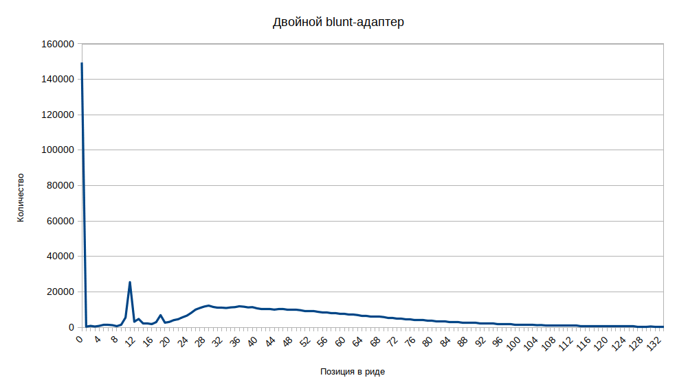

* Одиночный blunt-адаптер встречается в 1.42% ридов.
Пики на позициях 0, 7 и 18 ([данные](./scripts_results/report_palindrome_blunt_190719.txt)).

```
$ python3 ./palindrome_blunt.py

Hi there.
We're looking for: GCTGAGGGAC (Blunt adapter)

Found: 1816057 | Total: 128195238 (1.416634%)
```


* bridge-адаптер встречается в 20% ридов.
В начале его почти нет, повышение на позиции 8, пики на 18, 26 и 32, затем спад до конца ([данные](./scripts_results/report_palindrome_bridge_190722.txt)).

```
$ python3 ./palindrome_bridge.py

Hi there.
We're looking for: AGCTGAGGGATC (Bridge adapter)

Found: 26622524 | Total: 128195238 (20.767171%)
```


Таблица ODS с данными, [если вдруг понадобится](./scripts_results/palindrome2_results_190722.ods).

**TODO:**

поискать ешё димеры egdirb-bridge-GATC

Или, что может быть ещё лучше, проанализировать контент букв до и после *CTCAGCGCTGAG*

## Анализ букв до и после палиндрома

Сбор данных производился скриптом `palida.py`.
Данные записывались в трёхмерный массив: (число_позиций_в_риде, по_5_позиций_до_и_после_палиндрома, нуклеотиды).

```python
import gzip
import sys
import numpy as np
import string

def Out(total_):
    print("Total: %d" % (total_), end='\r')

filename = './sample.fastq.gz'
seq = "CTCAGCGCTGAG"
length = len(seq)
poses = list([-5, -4, -3, -2, -1, length + 1, length + 2, length + 3, length + 4, length + 5])
nuc = list('ATGCN0')
a = np.zeros(shape=(150,10,6))

print(f"\nPalindrome deep analysis.\nMaking a dump...\n")

input0 = gzip.open(filename, 'r')

counter = 0
total = 0
tyk = 0

for line in input0:

    Out(total)

    counter += 1
    if counter == 5:
        counter = 1

    if (counter == 2):
        line_d = line.decode("utf-8")
        tyk = line_d.find(seq)
        if not (tyk == -1):
            for i in range(10):
                pos_abs = tyk + poses[i]
                if (pos_abs < 0) or (pos_abs > 149):
                    a[tyk, i, nuc.index('0')] += 1
                else:
                    a[tyk, i, nuc.index(line_d[pos_abs])] += 1

        total += 1

print(np.sum(a, axis = (1, 2)))
np.save('./this.dump', a)

print('\n')

input0.close()
```

Заодно были получены данные по распределению палиндрома в геноме: два пика на 1 и 12 ([данные](./scripts_results/report_palida_190722.txt)).

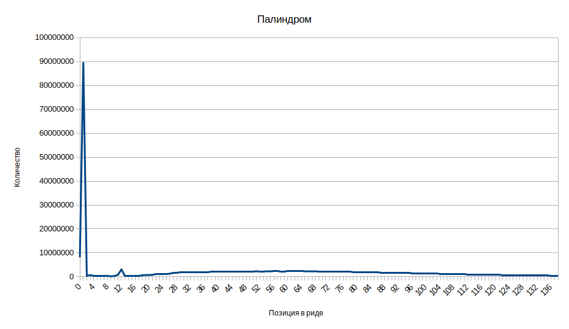

Результаты были проанализированы в трёх точках: на двух пиках (1 и 12), а также на плато (60) - [данные](./scripts_results/report_palida_analysis_190722.txt).

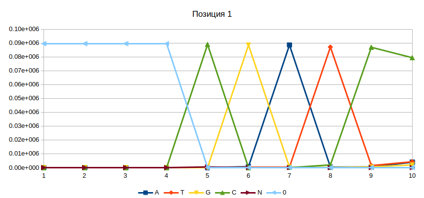
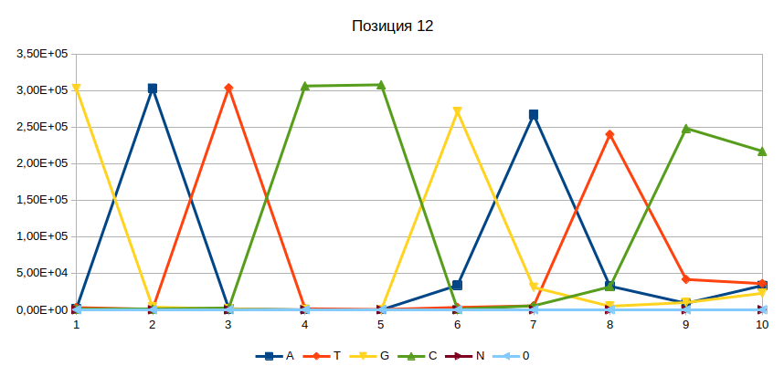
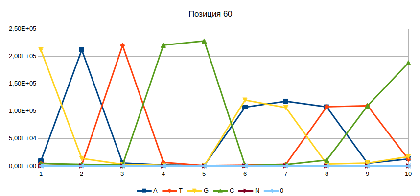

Из этого можно сделать следующие выводы:

1. Скорее всего, я накосячил в скрипте с длиной палиндрома.
Надо было прибавлять не `len(str)`, а `len(str) - 1`.

2. Во всех трёх позициях до и после палиндрома встречаются фиксированные сочетания букв.
    * Позиция 1: С**CTCAGCGCTGAG**_GATCC
    * Позиция 12: GATCC**CTCAGCGCTGAG**_GATCC
    * Позиция 60: GATCC**CTCAGCGCTGAG**. За ней следует что-то такое: _(G|A)(G|A)(T|A)(T|C)C.

Результаты не совсем ясно показывают ситуацию, поэтому решено было ещё раз запустить скрипт, взяв на этот раз 20 букв по периметру палиндрома вместо 5 ([данные](./scripts_results/report_palida_analysis20_190722.txt)).
Также был исправлен косяк с длиной палиндрома.

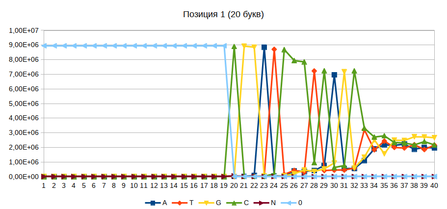
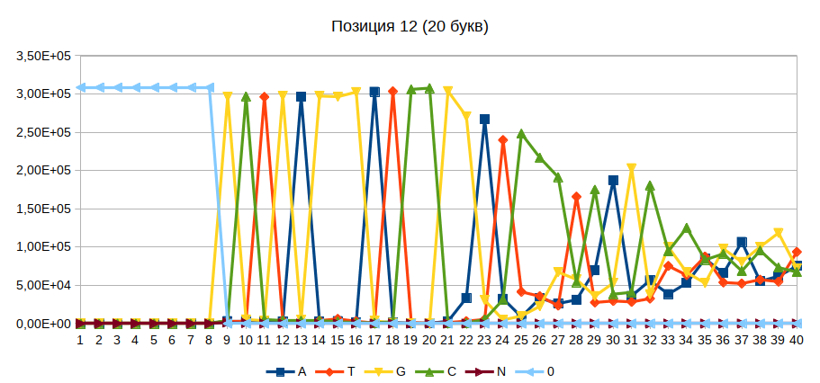
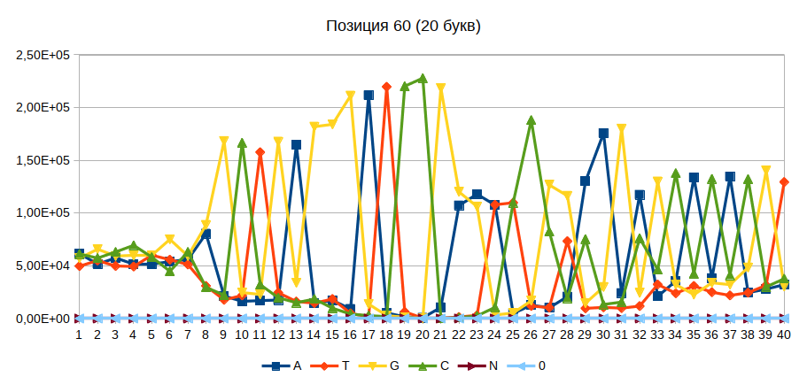

Последовательности:

* Позиция 1: C**CTCAGCGCTGAG**GGATCCCTCAGC
* Позиция 12: GCTGAGGGATCC**CTCAGCGCTGAG**GGATCCCTCAGC___
* Позиция 60: ___GCTGAGGGATCC**CTCAGCGCTGAG**G(A|G)(G|A)(A|T)(C|T)CGGAAGAGCACACGT

Выравнивание 1 и 12 позиций:
Можно утверждать, что в начале ридов есть большой процент **egdirb-bridge-GATC-egdirb-bridge-GATC-egdirb**:

```
CCTCAGCGCTGAGGGATCCCTCAGC
-------GCTGAGGGATCCCTCAGCGCTGAGGGATCCCTCAGC
CCTCAGCGCTGAGGGATCCCTCAGCGCTGAGGGATCCCTCAGCGCTGAGGGATC
```

В позиции 60 после палиндрома идёт нечто похожее на первый TruSeq-адаптер:

```
---------------------------GAGATCGGAAGAGCACACGTCTGAACTCCAGTCACATCACGATCTCGTAT
___GCTGAGGGATCCCTCAGCGCTGAGGAGATCGGAAGAGCACACGT
                            GATC
```

Второй вариант позиции 60 похож на те, что встречаются в позициях 1 и 12.

```
---GCTGAGGGATCCCTCAGCGCTGAGGGATCCctcagc___
___GCTGAGGGATCCCTCAGCGCTGAGGGATCCggaagagcacacgt

```
Т.е. можно утверждать, что в позиции 60 есть доля как **bridge-GATC-egdirb-bridge-TruSeq**, так и просто bridge-GATC-egdirb-bridge-GATC.

Таблица ODS, [если понадобится](./scripts_results/palida_results_190722.ods).

### TODO

1. Поискать палиндром с A|T в середине.
2. Поискать палиндром в прочих сэмплах, а также в данных из статей.
3. Отрезать с помощью *cutadapt* Иллюминовские адаптеры, посмотреть распределение палиндрома по %.
4. Если будет время -- написать для *cutadapt* штуку, убирающую вакханалию.

## Анализ прочих библиотек

Палиндром с A|T в середине почти не встречается.
Их количество примерно одинаковое и не превышает 300 на 1000000 (0,03%).

Затем были исследованы прочие сэмплы (из каждого взято по 1 млн ридов).
Получены следующие результаты:

* Значительное, но непостоянное количество палиндрома (~4-30%) обнаружено только в сэмплах под номером 1.
В сэмплах 2 палиндрома почти нет (до 10-20 на 1 млн).
**Поправка:** Сэмпл 2 из другого секвенирования, к текущему опыту не имеет отношения.

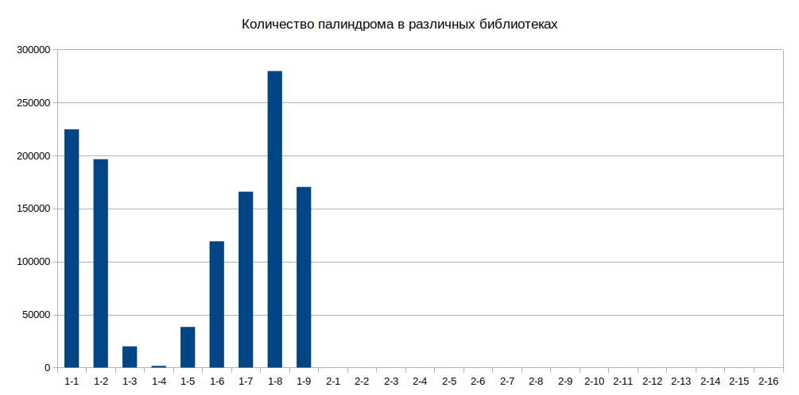

Таблица ODS, [если понадобится](./scripts_results/paliall_190729.ods).

### Промежуточная задача -- работа с *fastq_dump*

Данные из статей можно найти [здесь](https://www.ncbi.nlm.nih.gov/sra?term=SRP041253).

Для получения результатов из статьи понадобился инструмент *fastq_dump*.
Установка из сырцов оказачалась чересчур муторной, поэтому я нашёл скомпилированный вариант *sratoolkit*:

```
$ wget "http://ftp-trace.ncbi.nlm.nih.gov/sra/sdk/current/sratoolkit.current-centos_linux64.tar.gz"
```

Для задачи нам требовался всего 1 млн ридов, не было смысла выкачивать данные целиком.

```
$ cd ./bin
$ ./fastq-dump -Z --split-3 SRR1248196 | head -n 4000000 > [output_path]/SRR1248196_short.fastq
```

Файлы были обработаны с помощью скрипта *ash.py*:

```python
import sys
import pandas as pd
import string

def Out(found_, total_):
    print("Found: %d | Total: %d (%4f%%)" % (found_, total_, found_ * 100 / total_), end='\r')

filelist = ['SRR1248196', 'SRR1248194', 'SRR1248191', 'SRR1248188', 'SRR1248183', 'SRR1248180', 'SRR1248178', 'SRR1248176']
seq = 'CTCAGCGCTGAG'

print(f"\nHi there.\nWe're looking for: {seq}\n")

for file_sn in filelist:

    print(f"Open {file_sn}...\n")

    input0 = open('/dev/datasets/ngs_data/article_DNAaseHiC_data/' + file_sn + '_1M_short.fastq', 'r')

    counter = 0
    total = 1
    found = 0
    tyk = 0
    df = pd.DataFrame({
        'count' : [0] * 150
    })

    for line in input0:

        Out(found, total)

        counter += 1
        if counter == 5:
            counter = 1

        if (counter == 2):
            total += 1
            tyk = line.find(seq)
            if (tyk != -1):
                df.at[tyk, 'count'] += 1
                found += 1

    output0 = open('./report_' + file_sn + '.txt', 'w')
    df.to_string(output0)
    print('\n')

    input0.close()
    output0.close()
```

Результаты:

| Образец    | Расшифровка                        | Палиндром (на 1М ридов) | %    |
|------------|------------------------------------|-------------------------|------|
| SRR1248196 | targetedDNaseHiC-lincRNA-K562-rep2 | 113523                  | 11.3 |
| SRR1248194 | targetedDNaseHiC-lincRNA-K562-rep1 | 148812                  | 14.8 |
| SRR1248191 | targetedDNaseHiC-lincRNA-H1-rep2   | 108244                  | 10.8 |
| SRR1248188 | targetedDNaseHiC-lincRNA-H1-rep1   | 120374                  | 12.0 |
| SRR1248183 | targetedDNaseHiC-pe-K562-rep1      | 191774                  | 19.1 |
| SRR1248180 | targetedDNaseHiC-pe-H1-rep1        | 145528                  | 14.5 |
| SRR1248178 | DNaseHiC-WG-K562                   | 175093                  | 17.5 |
| SRR1248176 | DNaseHiC-WG-H1                     | 88565                   | 8.8  |

Что интересно -- в данных из статей палиндром почти не встречается на протяжении рида, он чётко собран в два пика на позициях 1 и 12.

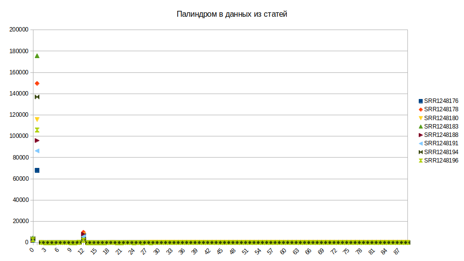

Таблица ODS, [если понадобится](./scripts_results/ash_190730.ods).

### Распределение палиндрома в обрезанных ридах

Адаптеры Illumina обрезались инструментом *cutadapt*.
Код предоставлен Е. Можейко.

```
$ cutadapt -m 8 -j 10 -a AGATCGGAAGAGCACACGTCTGAACTCCAGTCAC -A AGATCGGAAGAGCGTCGTGTAGGGAAAGAGTGTAGATCTCGGTGGTCGCCGTATCATT -o ./sample-1-1_R1_cut.fastq -p ./sample-1-1_R2_cut.fastq /dev/datasets/ngs_data/ExoC_Belopuz/30-213832944/sample-1-1_R1_001.fastq.gz /dev/datasets/ngs_data/ExoC_Belopuz/30-213832944/sample-1-1_R2_001.fastq.gz
```

<details> 
<summary>Результаты</summary>
<pre>
This is cutadapt 1.18 with Python 3.7.3
Command line parameters: -m 8 -j 10 -a AGATCGGAAGAGCACACGTCTGAACTCCAGTCAC -A AGATCGGAAGAGCGTCGTGTAGGGAAAGAGTGTAGATCTCGGTGGTCGCCGTATCATT -o ./sample-1-1_R1_cut.fastq -p ./sample-1-1_R2_cut.fastq /dev/datasets/ngs_data/ExoC_Belopuz/30-213832944/sample-1-1_R1_001.fastq.gz /dev/datasets/ngs_data/ExoC_Belopuz/30-213832944/sample-1-1_R2_001.fastq.gz
Processing reads on 10 cores in paired-end mode ...
Finished in 899.01 s (7 us/read; 8.56 M reads/minute).

=== Summary ===

Total read pairs processed:        128,195,237
  Read 1 with adapter:             103,462,552 (80.7%)
  Read 2 with adapter:             102,619,842 (80.0%)
Pairs that were too short:               1,779 (0.0%)
Pairs written (passing filters):   128,193,458 (100.0%)

Total basepairs processed: 38,458,571,100 bp
  Read 1: 19,229,285,550 bp
  Read 2: 19,229,285,550 bp
Total written (filtered):  28,148,496,493 bp (73.2%)
  Read 1: 14,055,065,633 bp
  Read 2: 14,093,430,860 bp

=== First read: Adapter 1 ===

Sequence: AGATCGGAAGAGCACACGTCTGAACTCCAGTCAC; Type: regular 3'; Length: 34; Trimmed: 103462552 times.

No. of allowed errors:
0-9 bp: 0; 10-19 bp: 1; 20-29 bp: 2; 30-34 bp: 3

Bases preceding removed adapters:
  A: 23.2%
  C: 26.9%
  G: 34.0%
  T: 15.9%
  none/other: 0.0%

Overview of removed sequences
length  count   expect  max.err error counts
3       1087309 2003050.6       0       1087309
4       756299  500762.6        0       756299
5       719939  125190.7        0       719939
6       714792  31297.7 0       714792
7       725753  7824.4  0       725753
8       743811  1956.1  0       743811
9       764032  489.0   0       761670 2362
10      809373  122.3   1       780088 29285
11      826462  30.6    1       793544 32918
12      846937  7.6     1       812412 34525
13      868073  1.9     1       831797 36276
14      885982  0.5     1       847531 38451
15      908154  0.1     1       866670 41484
16      926412  0.0     1       882667 43745
17      948342  0.0     1       902474 45868
18      971803  0.0     1       923617 47431 755
19      991375  0.0     1       937380 51529 2466
20      1020720 0.0     2       954706 53869 12145
21      1039500 0.0     2       970226 56908 12366
22      1058298 0.0     2       986278 59444 12576
23      1082678 0.0     2       1007063 60698 14917
24      1102479 0.0     2       1023755 64902 13822
25      1120923 0.0     2       1039396 66139 15388
26      1143655 0.0     2       1059157 69843 14655
27      1161670 0.0     2       1073938 71165 15872 695
28      1180446 0.0     2       1089207 74208 16039 992
29      1196892 0.0     2       1100706 77425 16552 2209
30      1223245 0.0     3       1118962 79587 16894 7802
31      1238951 0.0     3       1129609 84242 17925 7175
32      1260716 0.0     3       1148679 85586 18429 8022
33      1275702 0.0     3       1161836 87908 18726 7232
34      1292580 0.0     3       1177130 90216 18235 6999
35      1305425 0.0     3       1188212 91302 18719 7192
36      1316808 0.0     3       1200072 90846 18619 7271
37      1331817 0.0     3       1216665 84517 18599 12036
38      1339609 0.0     3       1223857 85604 18557 11591
39      1356133 0.0     3       1239757 85870 18757 11749
40      1362933 0.0     3       1245935 87221 18576 11201
41      1382079 0.0     3       1263771 88012 18628 11668
42      1385297 0.0     3       1267685 87731 18295 11586
43      1391549 0.0     3       1275026 86958 18104 11461
44      1399229 0.0     3       1282867 87460 17302 11600
45      1397767 0.0     3       1281922 87147 17846 10852
46      1398169 0.0     3       1282172 86198 17283 12516
47      1400625 0.0     3       1285654 84476 17126 13369
48      1404325 0.0     3       1290013 83694 16725 13893
49      1402435 0.0     3       1292388 82040 15986 12021
50      1403413 0.0     3       1293649 83866 15630 10268
51      1400785 0.0     3       1292870 82149 15736 10030
52      1389451 0.0     3       1282957 81499 15262 9733
53      1380998 0.0     3       1277252 78726 14932 10088
54      1374833 0.0     3       1270883 78365 14963 10622
55      1363253 0.0     3       1260772 76720 14449 11312
56      1349915 0.0     3       1249793 75340 14307 10475
57      1338811 0.0     3       1241014 73852 14001 9944
58      1331851 0.0     3       1235505 73456 13834 9056
59      1323077 0.0     3       1227119 73027 13834 9097
60      1310235 0.0     3       1217114 70024 13217 9880
61      1286414 0.0     3       1197396 66357 12869 9792
62      1274133 0.0     3       1185054 67288 12232 9559
63      1252160 0.0     3       1165115 65165 12310 9570
64      1237228 0.0     3       1153480 62886 11529 9333
65      1216258 0.0     3       1134870 61275 11340 8773
66      1198122 0.0     3       1118889 61127 10457 7649
67      1182711 0.0     3       1104672 60467 10636 6936
68      1157880 0.0     3       1082109 58970 10381 6420
69      1139944 0.0     3       1065018 57213 10552 7161
70      1110319 0.0     3       1037388 55689 10323 6919
71      1091533 0.0     3       1020131 53765 9903 7734
72      1063275 0.0     3       995224 52210 9268 6573
73      1037688 0.0     3       971543 50743 9243 6159
74      1017656 0.0     3       954185 49601 8646 5224
75      980112  0.0     3       919702 46561 8348 5501
76      951032  0.0     3       892175 45152 8188 5517
77      923975  0.0     3       866529 44553 7889 5004
78      899369  0.0     3       844045 43283 7353 4688
79      871364  0.0     3       817743 41922 7232 4467
80      856827  0.0     3       804586 40600 7012 4629
81      827925  0.0     3       777263 39576 6847 4239
82      786795  0.0     3       738750 37766 6354 3925
83      753346  0.0     3       707345 36310 6003 3688
84      725791  0.0     3       680477 35920 5760 3634
85      694098  0.0     3       651038 34178 5487 3395
86      671896  0.0     3       630117 33013 5370 3396
87      641934  0.0     3       601884 31851 5070 3129
88      621658  0.0     3       583302 30473 4762 3121
89      591567  0.0     3       555756 28768 4286 2757
90      573794  0.0     3       538209 27965 4239 3381
91      542420  0.0     3       509430 26192 4002 2796
92      521159  0.0     3       489554 25293 3751 2561
93      493057  0.0     3       463906 23437 3478 2236
94      464349  0.0     3       436722 22271 3325 2031
95      433750  0.0     3       407625 20915 3268 1942
96      414453  0.0     3       389739 19672 3068 1974
97      394487  0.0     3       370916 18528 2959 2084
98      373898  0.0     3       351505 17585 2792 2016
99      353790  0.0     3       332605 16529 2546 2110
100     335933  0.0     3       316332 15414 2359 1828
101     309533  0.0     3       291238 14365 2175 1755
102     288656  0.0     3       271954 13472 1939 1291
103     267149  0.0     3       251460 12547 1831 1311
104     251098  0.0     3       236181 12126 1679 1112
105     227937  0.0     3       214201 10900 1625 1211
106     213525  0.0     3       201029 10213 1458 825
107     235406  0.0     3       220103 12051 2008 1244
108     183894  0.0     3       173023 8664 1336 871
109     162375  0.0     3       152759 7722 1164 730
110     143877  0.0     3       135350 6729 1036 762
111     124809  0.0     3       117545 5716 873 675
112     103343  0.0     3       97485 4698 644 516
113     88450   0.0     3       83354 4122 579 395
114     72781   0.0     3       68581 3287 475 438
115     60442   0.0     3       56998 2693 406 345
116     47345   0.0     3       44632 2173 307 233
117     36925   0.0     3       34824 1668 266 167
118     29404   0.0     3       27610 1440 210 144
119     20221   0.0     3       19017 940 154 110
120     15279   0.0     3       14427 653 116 83
121     11959   0.0     3       11301 520 89 49
122     9218    0.0     3       8661 422 74 61
123     7672    0.0     3       7173 378 81 40
124     10488   0.0     3       9842 500 89 57
125     54072   0.0     3       50889 2515 386 282
126     13338   0.0     3       12582 560 103 93
127     3599    0.0     3       3375 169 22 33
128     2487    0.0     3       2311 133 18 25
129     2331    0.0     3       2180 110 24 17
130     3272    0.0     3       3059 166 34 13
131     2297    0.0     3       2167 98 15 17
132     13967   0.0     3       11254 1874 526 313
133     1808    0.0     3       1682 90 20 16
134     2816    0.0     3       2642 137 23 14
135     1174    0.0     3       1087 71 7 9
136     33257   0.0     3       30826 1874 272 285
137     5156    0.0     3       4865 240 26 25
138     986     0.0     3       917 52 8 9
139     358     0.0     3       343 13 0 2
140     188     0.0     3       178 10
141     165     0.0     3       158 6 1
142     157     0.0     3       147 9 0 1
143     668     0.0     3       648 18 2
144     58      0.0     3       53 4 1
145     26      0.0     3       26
146     29      0.0     3       28 0 1
147     23      0.0     3       22 0 1
148     25      0.0     3       24 1
149     14      0.0     3       8 4 1 1
150     270     0.0     3       15 239 15 1

=== Second read: Adapter 2 ===

Sequence: AGATCGGAAGAGCGTCGTGTAGGGAAAGAGTGTAGATCTCGGTGGTCGCCGTATCATT; Type: regular 3'; Length: 58; Trimmed: 102619842 times.

No. of allowed errors:
0-9 bp: 0; 10-19 bp: 1; 20-29 bp: 2; 30-39 bp: 3; 40-49 bp: 4; 50-58 bp: 5

Bases preceding removed adapters:
  A: 24.6%
  C: 27.1%
  G: 32.1%
  T: 16.1%
  none/other: 0.0%

Overview of removed sequences
length  count   expect  max.err error counts
3       1133293 2003050.6       0       1133293
4       764692  500762.6        0       764692
5       725577  125190.7        0       725577
6       706646  31297.7 0       706646
7       714736  7824.4  0       714736
8       731542  1956.1  0       731542
9       751134  489.0   0       748875 2259
10      803671  122.3   1       766651 37020
11      820150  30.6    1       779060 41090
12      840406  7.6     1       798647 41759
13      860709  1.9     1       817142 43567
14      878406  0.5     1       833834 44572
15      896531  0.1     1       838965 57566
16      914210  0.0     1       855693 58517
17      936273  0.0     1       876462 59811
18      953925  0.0     1       882003 69770 2152
19      974256  0.0     1       900334 72550 1372
20      1008871 0.0     2       910029 71271 27571
21      1027054 0.0     2       925974 79604 21476
22      1045582 0.0     2       942272 81534 21776
23      1070230 0.0     2       966159 81303 22768
24      1089499 0.0     2       983035 84021 22443
25      1105856 0.0     2       993548 88055 24253
26      1128750 0.0     2       1012733 89555 26462
27      1146007 0.0     2       1029387 89680 26785 155
28      1164272 0.0     2       1043899 90524 27207 2642
29      1180769 0.0     2       1057084 96257 26357 1071
30      1211831 0.0     3       1076530 96116 26595 12590
31      1225899 0.0     3       1077124 103715 29558 15502
32      1247603 0.0     3       1097889 97175 28864 23675
33      1261864 0.0     3       1110162 106885 30495 14322
34      1278048 0.0     3       1125238 107794 29788 15228
35      1290277 0.0     3       1136578 109904 29804 13991
36      1301135 0.0     3       1146687 110224 30097 14104 23
37      1315926 0.0     3       1160061 110286 30123 14157 1299
38      1322737 0.0     3       1167184 109581 30362 14467 1143
39      1339216 0.0     3       1182080 109978 30254 13721 3183
40      1353019 0.0     4       1189593 111457 30177 13658 8134
41      1371542 0.0     4       1206751 112024 30182 13961 8624
42      1374358 0.0     4       1209047 111640 30798 14066 8807
43      1379583 0.0     4       1211660 112044 28943 16001 10935
44      1386940 0.0     4       1219866 108848 31025 14294 12907
45      1385365 0.0     4       1219093 108305 28513 18346 11101 7
46      1384179 0.0     4       1212512 110850 34988 15241 10295 293
47      1386309 0.0     4       1214387 108723 35712 15832 10885 770
48      1389236 0.0     4       1215321 107910 26604 21293 14079 4029
49      1387104 0.0     4       1215923 113994 31609 14456 9797 1325
50      1393525 0.0     5       1216999 113570 31607 14946 8729 7674
51      1390530 0.0     5       1216865 113410 31823 14125 8590 5717
52      1378513 0.0     5       1196301 116539 31425 17285 9990 6973
53      1369775 0.0     5       1187783 114214 30996 18124 11255 7403
54      1362726 0.0     5       1178720 115760 29716 19059 11744 7727
55      1351510 0.0     5       1170955 119362 32258 14703 8512 5720
56      1337647 0.0     5       1157829 119124 32176 14521 8446 5551
57      1326269 0.0     5       1149469 116398 31897 14421 8391 5693
58      1319095 0.0     5       1140082 117833 32158 14893 8532 5597
59      1310590 0.0     5       1135691 115083 31409 14530 8279 5598
60      1298230 0.0     5       1125829 114284 30734 14105 7986 5292
61      1274591 0.0     5       1105822 113289 29172 13482 7778 5048
62      1262582 0.0     5       1097810 110735 28170 13023 7686 5158
63      1240994 0.0     5       1082052 106833 27381 12719 7245 4764
64      1226288 0.0     5       1072115 103709 26711 12100 7055 4598
65      1205709 0.0     5       1057063 99218 26144 12041 6771 4472
66      1188003 0.0     5       1039680 100197 25877 11328 6570 4351
67      1172879 0.0     5       1029326 97345 24499 11260 6268 4181
68      1148466 0.0     5       1009748 93574 24178 10858 6070 4038
69      1130661 0.0     5       994773 92405 23523 10228 5787 3945
70      1101462 0.0     5       969355 90096 22534 10034 5712 3731
71      1083213 0.0     5       955129 87164 22313 9628 5404 3575
72      1055121 0.0     5       930169 85187 21890 9271 5079 3525
73      1030105 0.0     5       910306 81838 20934 8692 5142 3193
74      1010313 0.0     5       892811 80016 20249 9044 4899 3294
75      973382  0.0     5       858034 79720 19630 8262 4616 3120
76      944447  0.0     5       836686 74158 18285 7845 4401 3072
77      917791  0.0     5       811789 73135 17702 7978 4271 2916
78      893470  0.0     5       792122 69673 17225 7529 4101 2820
79      865921  0.0     5       767233 68333 16787 7117 3946 2505
80      851706  0.0     5       754614 67661 16486 6681 3726 2538
81      823202  0.0     5       733292 62841 14682 6429 3585 2373
82      782532  0.0     5       696334 60089 14616 6044 3210 2239
83      749148  0.0     5       666998 57846 13279 5759 3106 2160
84      722218  0.0     5       644478 54225 13030 5449 2957 2079
85      690639  0.0     5       617129 51741 12092 4920 2884 1873
86      668798  0.0     5       598922 49319 11535 4655 2568 1799
87      638957  0.0     5       571509 47731 10957 4598 2498 1664
88      618968  0.0     5       553920 46259 10290 4401 2427 1671
89      589247  0.0     5       530570 41352 9497 4074 2225 1529
90      571737  0.0     5       514516 40786 8943 3879 2138 1475
91      540373  0.0     5       487010 37879 8493 3675 2007 1309
92      519359  0.0     5       468446 36234 8102 3523 1797 1257
93      491453  0.0     5       444251 33374 7661 3295 1698 1174
94      462874  0.0     5       418875 31382 6971 2988 1565 1093
95      432427  0.0     5       392164 28604 6530 2651 1435 1043
96      413291  0.0     5       374600 27711 6243 2420 1429 888
97      393283  0.0     5       356253 26656 5827 2359 1334 854
98      372986  0.0     5       338370 25001 5411 2195 1225 784
99      352907  0.0     5       320225 23615 5117 2107 1131 712
100     335156  0.0     5       304487 22239 4833 1903 971 723
101     308869  0.0     5       280794 20360 4365 1782 915 653
102     288072  0.0     5       262043 19034 3909 1657 891 538
103     266743  0.0     5       242833 17510 3683 1395 830 492
104     250679  0.0     5       228397 16278 3365 1376 751 512
105     227673  0.0     5       206927 15326 3077 1268 660 415
106     213379  0.0     5       194564 13906 2811 1130 602 366
107     235402  0.0     5       215007 15067 3000 1210 682 436
108     183856  0.0     5       168075 11706 2363 898 473 341
109     162353  0.0     5       148455 10315 2117 760 416 290
110     143872  0.0     5       131665 9060 1868 694 364 221
111     124799  0.0     5       114013 8038 1598 612 316 222
112     103417  0.0     5       94878 6419 1252 447 253 168
113     88526   0.0     5       81232 5385 1120 421 223 145
114     72936   0.0     5       66908 4422 936 347 190 133
115     60578   0.0     5       55744 3633 706 251 153 91
116     47520   0.0     5       43749 2784 534 213 128 112
117     37131   0.0     5       34037 2223 489 204 107 71
118     29811   0.0     5       27270 1760 401 190 126 64
119     20448   0.0     5       18834 1144 234 108 70 58
120     15530   0.0     5       14134 970 208 99 62 57
121     12227   0.0     5       11152 687 188 77 56 67
122     9451    0.0     5       8577 578 133 69 52 42
123     7950    0.0     5       7174 492 111 70 55 48
124     10791   0.0     5       9896 596 120 80 48 51
125     54456   0.0     5       50737 2783 510 208 126 92
126     13603   0.0     5       12580 670 160 77 53 63
127     3809    0.0     5       3388 230 72 45 32 42
128     2676    0.0     5       2346 171 53 34 40 32
129     2481    0.0     5       2223 132 45 25 28 28
130     3408    0.0     5       3088 182 51 36 26 25
131     2377    0.0     5       2187 115 18 23 15 19
132     16365   0.0     5       14071 922 437 386 285 264
133     1893    0.0     5       1716 103 29 21 10 14
134     2883    0.0     5       2685 131 20 15 17 15
135     1230    0.0     5       1125 59 15 10 13 8
136     33502   0.0     5       32026 1084 216 87 41 48
137     5196    0.0     5       4897 253 18 11 9 8
138     1007    0.0     5       908 81 5 8 3 2
139     367     0.0     5       346 11 2 2 4 2
140     194     0.0     5       181 5 5 0 1 2
141     173     0.0     5       158 9 2 1 3
142     163     0.0     5       147 12 1 0 0 3
143     670     0.0     5       628 34 5 1 1 1
144     59      0.0     5       44 13 2
145     29      0.0     5       26 3
146     33      0.0     5       29 2 1 0 1
147     25      0.0     5       22 0 0 1 2
148     27      0.0     5       25 0 2
149     15      0.0     5       6 6 1 1 0 1
150     901     0.0     5       405 405 62 10 13 6
</pre>
</details>

Обработка библиотеки с обрезанными адаптерами производилась с помощью модифицированного скрипта *ash.py*.

Результаты:

* По процентам от длины рида палиндром чётко распределяется в начале и в конце обрезанных ридов.
* По абсолютным значениям (с конца рида) палиндром чётко расположен на конце.
Также небольшой пик есть в начале длинных ридов, ещё пара следует за основным на конце.

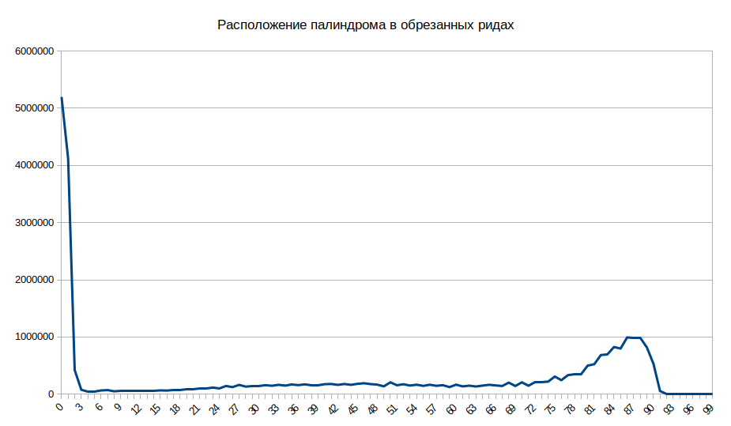

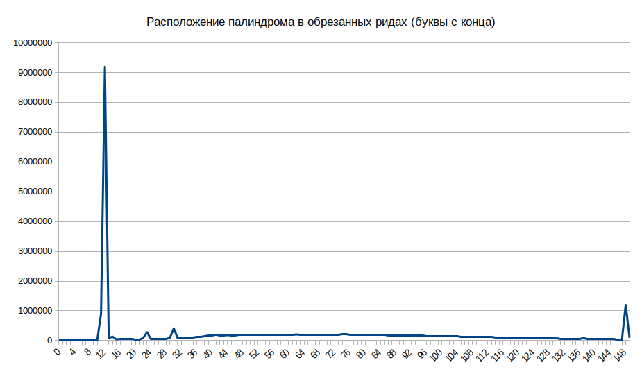

Таблица ODS, [если понадобится](./scripts_results/ash_per_cent_190731.ods).

### Выводы

Основная масса палиндрома находится не в начале, а в конце обрезанных ридов, т.е. сразу за адаптером Illumina.
Сравнив количество ридов, полученных старым алгоритмом, и количество ридов в конце, было выявлено, что эти числа равны -- примерно 9 млн.
Гипотеза -- это одни и те же риды.
То есть основную массу палиндрома составляет один дуплет Bridge-адаптера, присоединённый к адаптеру Illumina.

**TODO**: 

1. Распределение обрезанных ридов по длине (с палиндромом и без).
2. Если риды с палиндромом информативны, найти способ обрезать палиндром и определить стыки генома.

## Распределение обрезанных ридов по длине

Распределение по длине ридов с палиндромом и без него почти не отличается на длинах больше 40 букв.
Короткие риды имеют пики на 12, 24 буквах (с палиндромом) и 16 букв (без палиндрома).

Общий вывод: риды с палиндромом информативны и требуют обработки.

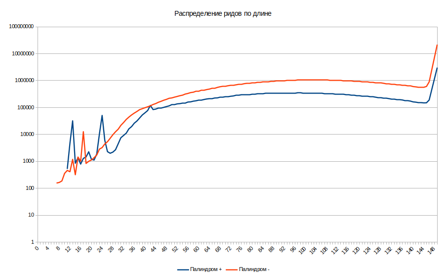

Таблица ODS, [если понадобится](./scripts_results/ash_length_190802.ods).

## Структура ридов

Была проанализирована структура ридов по общим частям bridge- и blunt-адаптеров, а также по липкому концу bridge.
Анализ производился скриптом *anal_seqs.py*:

```python
import gzip
import sys
import pandas as pd
import numpy as np
import string
import re

def Out(total_):
    print("Total: %d" % (total_), end='\r')


filename = '../trimmed/sample-1-1_R1_cut.fastq'
output_file = './sample-1-1_cut_statistics.txt'
seqs = pd.DataFrame(np.array([['-bridge-', 'GCTGAGG'], ['-egdirb-', 'CCTCAGC'], ['-gatc-', 'GATC']]), columns=['name', 'seq'])
genome = '-genome-'

print(f"\nHi there.\nWe're mapping reads with:\n")
print(seqs)

input0 = open(filename, 'r')

counter = 0
total = 0
tyk = 0
main_list = []
main_table = pd.DataFrame(columns=['count', 'mask'])

pd.set_option('max_colwidth',1000)

for line in input0:
    Out(total)

    counter += 1
    if counter == 5:
        counter = 1

    if (counter == 2):
        line = line[0:-1]
        for index, row in seqs.iterrows():
            line = line.replace(row['seq'], row['name'])
        for it in range(10):
            its = str(it + 1)
            line = re.sub("(^|-)[ATGCN]{" + its + "}($|-)", "--[" + its + "]--", line)

        line = re.sub(r"[ATGCN]{11,}", genome, line)
        # optimization
        line = line.replace('ome--gatc--gen', '')
        line = re.sub(r"^-gatc--genome-", genome, line)
        line = re.sub(r"-genome--gatc-$", genome, line)

        main_list.append(line)
        total += 1

shorted_list = list(set(main_list))
for note in shorted_list:
    main_table = main_table.append(pd.Series([main_list.count(note), note], index=['count', 'mask']), ignore_index=True)

output0 = open(output_file, 'w')
main_table.sort_values(by=['count'], ascending=False).to_string(output0)
print('\n')

input0.close()
output0.close()
```

### Данные статей

Были проанализированы наиболее частые сочетания, в сумме покрывающие 91% ридов ([анализ](./scripts_results/anal_seqs_190805.ods), [полные данные](./scripts_results/anal_seqs_190805.txt)).

**Примечание.** bridge в контексте результатов скрипта -- общая часть bridge и blunt-адаптера (GCTGAGG).
egdirb -- обратная последовательность (CCTCAGC).

Предположительно риды, содержащие HiC, составляют в сумме 16,3% всех ридов.
Прочих -- 75%.

| Reads, % | Sample                                                | Hypothesis                       |
|----------|-------------------------------------------------------|----------------------------------|
| 56,0679  | -genome-                                              | Dangling ends                    |
| 2,9728   | -egdirb-bridge-genome-                                | Dangling ends                    |
| 2,9213   | -egdirb-genome-                                       | Dangling ends                    |
| 1,7065   | -egdirb-bridge-gatc-egdirb-genome-                    | Dangling ends                    |
| 1,2703   | -egdirb-bridge-gatc-genome-                           | Dangling ends                    |
| 1,0760   | -bridge-gatc-egdirb-genome-                           | Dangling ends                    |
| 0,4808   | -bridge-genome-                                       | Dangling ends                    |
| 0,4787   | -bridge-gatc-genome-                                  | Dangling ends                    |
| 0,3564   | -bridge-gatc-egdirb-bridge-gatc-egdirb-genome-        | Dangling ends                    |
| 0,2460   | -genome-bridge-[2]-                                   | Dangling ends                    |
| 0,2444   | -genome-bridge-                                       | Dangling ends                    |
| 0,2364   | -genome-bridge-[1]-                                   | Dangling ends                    |
| 0,2326   | -genome-bridge-[3]-                                   | Dangling ends                    |
| 0,2231   | -genome-bridge-gatc-[6]-                              | Dangling ends                    |
| 0,2219   | -genome-bridge-gatc-[5]-                              | Dangling ends                    |
| 0,2217   | -genome-bridge-gatc-[3]-                              | Dangling ends                    |
| 0,2168   | -genome-bridge-gatc-[1]-                              | Dangling ends                    |
| 0,2160   | -genome-bridge-gatc-[4]-                              | Dangling ends                    |
| 0,2152   | -genome-bridge-gatc-[2]-                              | Dangling ends                    |
| 0,2091   | -[6]-gatc-genome-                                     | Dangling ends                    |
| 0,2083   | -genome-bridge-gatc-                                  | Dangling ends                    |
| 0,2073   | -genome-bridge-gatc-egdirb-[4]-                       | Dangling ends                    |
| 0,2068   | -genome-bridge-gatc-egdirb-[6]-                       | Dangling ends                    |
| 0,2068   | -genome-bridge-gatc-egdirb-[2]-                       | Dangling ends                    |
| 0,2048   | -genome-bridge-gatc-egdirb-[3]-                       | Dangling ends                    |
| 0,2044   | -genome-bridge-gatc-egdirb-                           | Dangling ends                    |
| 0,2039   | -[5]-gatc-genome-                                     | Dangling ends                    |
| 0,2039   | -genome-bridge-gatc-egdirb-[1]-                       | Dangling ends                    |
| 0,2011   | -genome-bridge-gatc-egdirb-[9]-                       | Dangling ends                    |
| 0,2002   | -genome-bridge-gatc-egdirb-[10]-                      | Dangling ends                    |
| 0,1985   | -genome-bridge-gatc-egdirb-[8]-                       | Dangling ends                    |
| 0,1966   | -genome-bridge-gatc-egdirb-[5]-                       | Dangling ends                    |
| 0,1952   | -genome-bridge-gatc-egdirb-[7]-                       | Dangling ends                    |
| 0,1918   | -[3]-gatc-genome-                                     | Dangling ends                    |
| 0,1911   | -[4]-gatc-genome-                                     | Dangling ends                    |
| 0,1683   | -[1]-gatc-genome-                                     | Dangling ends                    |
| 0,1557   | -[6]-bridge-genome-                                   | Dangling ends                    |
| 0,1543   | -genome-gatc-[1]-                                     | Dangling ends                    |
| 0,1525   | -genome-gatc-[4]-                                     | Dangling ends                    |
| 0,1515   | -genome-gatc-[2]-                                     | Dangling ends                    |
| 0,1503   | -genome-gatc-[3]-                                     | Dangling ends                    |
| 0,1481   | -bridge-gatc-egdirb-bridge-genome-                    | Dangling ends                    |
| 0,1450   | -genome-gatc-[6]-                                     | Dangling ends                    |
| 0,1438   | -genome-gatc-[5]-                                     | Dangling ends                    |
| 0,1392   | -genome-gatc-[9]-                                     | Dangling ends                    |
| 0,1381   | -[8]-gatc-genome-                                     | Dangling ends                    |
| 0,1373   | -genome-gatc-[10]-                                    | Dangling ends                    |
| 0,1369   | -[7]-gatc-genome-                                     | Dangling ends                    |
| 0,1362   | -genome-gatc-[8]-                                     | Dangling ends                    |
| 0,1356   | -[10]-gatc-genome-                                    | Dangling ends                    |
| 0,1354   | -[2]-gatc-genome-                                     | Dangling ends                    |
| 0,1340   | -[9]-gatc-genome-                                     | Dangling ends                    |
| 0,1339   | -genome-gatc-[7]-                                     | Dangling ends                    |
| 10,6878  | -genome-bridge-gatc-egdirb-genome-                    | HiC reads                        |
| 0,2155   | -genome-bridge-gatc-egdirb-bridge-genome-             | HiC reads (?)                    |
| 0,1584   | -genome-bridge-[6]-gatc-genome-                       | HiC reads (?)                    |
| 0,1570   | -genome-gatc-[6]-egdirb-genome-                       | HiC reads (?)                    |
| 1,7158   | -genome-bridge-genome-                                | HiC reads (blunt-ligated?)       |
| 1,1809   | -genome-egdirb-genome-                                | HiC reads (blunt-ligated?)       |
| 0,1547   | -genome-bridge-gatc-egdirb-bridge-gatc-egdirb-genome- | HiC reads (bouble double bridge) |
| 0,5971   | -genome-gatc-egdirb-genome-                           | HiC reads (mutation in bridge)   |
| 0,7807   | -genome-bridge-gatc-genome-                           | HiC reads (mutation in egdirb)   |
| 0,2059   | -genome-bridge-[3]-egdirb-genome-                     | HiC reads (mutation in gatc)     |
| 0,1077   | -genome-bridge-[4]-egdirb-genome-                     | HiC reads (mutation in gatc)     |
| 0,3715   | -egdirb-genome-bridge-gatc-egdirb-genome-             | HiC reads with blunt on 3`       |


В таблице не учитывалось прочтение с двух сторон.

### Наши данные

Данные брались из библиотеки 1-1 с обрезанными адаптерами.
Были проанализированы 489 сочетаний, покрывающих 88% ридов ([здесь](./scripts_results/anal_seqs_190806.txt)).
В таблице приведены 60, покрывающие 75% ридов.

| Reads, % | Sample                                                |
|----------|-------------------------------------------------------|
| 23,20194 | -genome-bridge-gatc-egdirb-genome-                    |
| 15,50944 | -genome-                                              |
| 3,73333  | -genome-bridge-gatc-egdirb-bridge-                    |
| 3,61272  | -egdirb-bridge-gatc-egdirb-genome-                    |
| 2,56678  | -genome-gatc-egdirb-genome-                           |
| 2,54688  | -genome-bridge-gatc-genome-                           |
| 2,02632  | -bridge-gatc-genome-                                  |
| 1,58390  | -genome-gatc-egdirb-                                  |
| 1,49109  | -genome-gatc-egdirb-bridge-                           |
| 1,41024  | -genome-egdirb-genome-                                |
| 1,36357  | -genome-bridge-gatc-egdirb-                           |
| 1,29837  | -egdirb-bridge-gatc-genome-                           |
| 1,23978  | -bridge-gatc-egdirb-genome-                           |
| 1,23920  | -genome-bridge-genome-                                |
| 1,00218  | -genome-egdirb-bridge-gatc-egdirb-genome-             |
| 0,86352  | -genome-bridge-gatc-egdirb-bridge-gatc-genome-        |
| 0,78528  | -genome-gatc-egdirb-bridge-gatc-egdirb-genome-        |
| 0,72874  | -genome-bridge-gatc-egdirb-bridge-genome-             |
| 0,53927  | -egdirb-genome-bridge-gatc-egdirb-genome-             |
| 0,51149  | -genome-bridge-gatc-egdirb-genome-bridge-             |
| 0,47763  | -genome-bridge-gatc-egdirb-[6]-                       |
| 0,41552  | -[6]-bridge-gatc-egdirb-genome-                       |
| 0,39511  | -genome-bridge-gatc-egdirb-genome-bridge-genome-      |
| 0,39456  | -genome-egdirb-genome-bridge-gatc-egdirb-genome-      |
| 0,39380  | -[6]-gatc-genome-                                     |
| 0,37381  | -genome-bridge-[4]-egdirb-genome-                     |
| 0,36194  | -genome-egdirb-bridge-                                |
| 0,35317  | -genome-bridge-genome-bridge-gatc-egdirb-genome-      |
| 0,35200  | -genome-bridge-gatc-egdirb-genome-egdirb-genome-      |
| 0,27980  | -genome-gatc-[6]-                                     |
| 0,27597  | -bridge-genome-                                       |
| 0,26824  | -genome-egdirb-                                       |
| 0,21815  | -egdirb-bridge-genome-                                |
| 0,18650  | -genome-bridge-[6]-gatc-genome-                       |
| 0,18044  | -genome-gatc-[6]-egdirb-genome-                       |
| 0,17581  | -genome-bridge-gatc-egdirb-[7]-                       |
| 0,17463  | -egdirb-bridge-gatc-egdirb-bridge-gatc-egdirb-genome- |
| 0,17014  | -[5]-gatc-genome-                                     |
| 0,15565  | -genome-bridge-gatc-egdirb-bridge-gatc-egdirb-genome- |
| 0,15035  | -genome-gatc-[5]-                                     |
| 0,14549  | -genome-bridge-gatc-[5]-bridge-genome-                |
| 0,14409  | -genome-gatc-egdirb-[6]-                              |
| 0,14056  | -genome-bridge-gatc-egdirb-bridge-gatc-egdirb-bridge- |
| 0,13987  | -genome-gatc-egdirb-bridge-gatc-genome-               |
| 0,13694  | -[3]-gatc-genome-                                     |
| 0,13615  | -egdirb-genome-                                       |
| 0,13576  | -genome-gatc-[3]-                                     |
| 0,13476  | -genome-bridge-                                       |
| 0,13124  | -genome-bridge-gatc-[6]-                              |
| 0,12458  | -genome-egdirb-bridge-gatc-genome-                    |
| 0,12144  | -genome-bridge-[6]-gatc-egdirb-genome-                |
| 0,11740  | -egdirb-bridge-gatc-egdirb-genome-bridge-genome-      |
| 0,11503  | -egdirb-bridge-gatc-egdirb-genome-egdirb-genome-      |
| 0,10941  | -genome-egdirb-genome-bridge-gatc-egdirb-bridge-      |
| 0,10790  | -[7]-gatc-genome-                                     |
| 0,10744  | -bridge-gatc-genome-bridge-genome-                    |
| 0,10626  | -genome-gatc-[1]-                                     |
| 0,10625  | -[6]-bridge-gatc-genome-                              |
| 0,10571  | -genome-bridge-gatc-egdirb-[10]-                      |
| 0,10445  | -genome-gatc-[4]-                                     |

Как видно из результатов, значительное количество представляют обычные HiC-риды, у которых требуется только удалить мостик `-bridge-gatc-egdirb-`.
Это сочетания, в сумме составляющие 28%:

```
-genome-bridge-gatc-egdirb-genome-
-genome-gatc-egdirb-genome-
-genome-bridge-gatc-genome-
-genome-bridge-[4]-egdirb-genome-

```
Прочие же требуют предварительной обработки перед выравниванием.

## Обрезка с помощью *cutadapt*

Был запущен *cutadapt* со следующими параметрами:

```
$ cutadapt -m 8 -j 10 -e 0.2 -O 7 -a GCTGAGGGATCCCTCAGCGCTGAGGGATCCCTCAGCX -g XGCTGAGGGATCCCTCAGCGCTGAGGGATCCCTCAGC -A GCTGAGGGATCCCTCAGCGCTGAGGGATCCCTCAGCX -G XGCTGAGGGATCCCTCAGCGCTGAGGGATCCCTCAGC -o ./sample-1-1_R1_STUFFLESS.fastq -p ./sample-1-1_R2_STUFFLESS.fastq ./sample-1-1_R1_cut.fastq ./sample-1-1_R2_cut.fastq
```

<details> 
<summary>Результаты</summary>
<pre>
This is cutadapt 1.18 with Python 3.7.3
Command line parameters: -m 8 -j 10 -e 0.2 -O 7 -a GCTGAGGGATCCCTCAGCGCTGAGGGATCCCTCAGCX -g XGCTGAGGGATCCCTCAGCGCTGAGGGATCCCTCAGC -A GCTGAGGGATCCCTCAGCGCTGAGGGATCCCTCAGCX -G XGCTGAGGGATCCCTCAGCGCTGAGGGATCCCTCAGC -o ./sample-1-1_R1_STUFFLESS.fastq -p ./sample-1-1_R2_STUFFLESS.fastq ./sample-1-1_R1_cut.fastq ./sample-1-1_R2_cut.fastq
Processing reads on 10 cores in paired-end mode ...
Finished in 1361.45 s (11 us/read; 5.65 M reads/minute).

=== Summary ===

Total read pairs processed:        128,193,458
  Read 1 with adapter:              42,012,899 (32.8%)
  Read 2 with adapter:              41,873,093 (32.7%)
Pairs that were too short:             260,472 (0.2%)
Pairs written (passing filters):   127,932,986 (99.8%)

Total basepairs processed: 28,148,496,493 bp
  Read 1: 14,055,065,633 bp
  Read 2: 14,093,430,860 bp
Total written (filtered):  26,366,780,265 bp (93.7%)
  Read 1: 13,163,760,019 bp
  Read 2: 13,203,020,246 bp

=== First read: Adapter 1 ===

Sequence: GCTGAGGGATCCCTCAGCGCTGAGGGATCCCTCAGC; Type: non-internal 3'; Length: 36; Trimmed: 22558677 times.

No. of allowed errors:
0-4 bp: 0; 5-9 bp: 1; 10-14 bp: 2; 15-19 bp: 3; 20-24 bp: 4; 25-29 bp: 5; 30-34 bp: 6; 35-36 bp: 7

Bases preceding removed adapters:
  A: 38.3%
  C: 11.3%
  G: 36.3%
  T: 13.7%
  none/other: 0.3%

Overview of removed sequences
length  count   expect  max.err error counts
6       563762  31297.2 1       0 563762
7       1948315 7824.3  1       1558363 389952
8       301134  1956.1  1       61425 156903 82806
9       331463  489.0   1       107722 170997 52744
10      158959  122.3   2       68392 21980 68587
11      145287  30.6    2       77326 18415 49546
12      139527  7.6     2       87616 16840 32808 2263
13      143672  1.9     2       96311 17286 20591 9484
14      158815  0.5     2       103281 18226 17141 20167
15      189850  0.1     3       76490 15964 20561 76835
16      484532  0.0     3       94385 26595 165922 196494 1136
17      928222  0.0     3       180102 342850 188831 212462 3977
18      2960965 0.0     3       2145342 317040 158824 332219 7540
19      370176  0.0     3       42761 49808 83418 169592 24597
20      176195  0.0     4       31705 33550 39755 35053 30569 5563
21      243432  0.0     4       32166 27626 31813 38643 81756 31428
22      331878  0.0     4       39146 15194 47337 83611 96350 50240
23      761425  0.0     4       40863 40361 198574 201204 178532 101891
24      2037410 0.0     4       639824 517241 276156 206512 254332 142114 1231
25      7664577 0.0     5       5938396 737258 295879 294547 257459 137939 3099
26      453538  0.0     5       35217 61333 46045 130631 109930 61457 8925
27      248187  0.0     5       72777 31100 12012 15094 39082 63179 14943
28      157082  0.0     5       26739 5941 3298 5875 22358 66342 24992 1537
29      142477  0.0     5       26359 7839 3248 4375 13083 48940 32867 5766
30      144287  0.0     6       32220 7146 3619 3679 9151 36363 42835 9274
31      138384  0.0     6       24681 6604 3669 3669 7495 25124 48479 18663
32      137641  0.0     6       20421 5895 2738 4037 10854 17887 49249 26560
33      111404  0.0     6       4826 3196 3493 7727 11587 18003 34261 28311
34      133926  0.0     6       6364 6541 15991 14728 17178 17309 26622 29193
35      161090  0.0     7       11564 35604 13631 13165 20840 19635 19972 26679
36      194902  0.0     7       70866 24000 11267 15431 20094 17127 16026 20091
37      65015   0.0     7       0 5124 2911 11036 10952 10356 11054 13582
38      42058   0.0     7       0 0 4179 2321 6106 8915 9939 10598
39      31050   0.0     7       0 0 0 3746 2518 7169 8666 8951
40      26034   0.0     7       0 0 0 0 4307 3310 9159 9258
41      21535   0.0     7       0 0 0 0 0 4288 4744 12503
42      41978   0.0     7       0 0 0 0 0 0 26357 15621
43      268493  0.0     7       0 0 0 0 0 0 0 268493

=== First read: Adapter 2 ===

Sequence: GCTGAGGGATCCCTCAGCGCTGAGGGATCCCTCAGC; Type: non-internal 5'; Length: 36; Trimmed: 19454222 times.

No. of allowed errors:
0-4 bp: 0; 5-9 bp: 1; 10-14 bp: 2; 15-19 bp: 3; 20-24 bp: 4; 25-29 bp: 5; 30-34 bp: 6; 35-36 bp: 7

Overview of removed sequences
length  count   expect  max.err error counts
6       145435  31297.2 1       0 145435
7       1867577 7824.3  1       1608051 259526
8       218377  1956.1  1       10378 148702 59297
9       259795  489.0   1       71765 155413 32617
10      88214   122.3   2       26731 11616 49867
11      80174   30.6    2       33942 7097 39135
12      75951   7.6     2       44680 6428 22951 1892
13      74724   1.9     2       50199 6852 11885 5788
14      93867   0.5     2       52941 4719 8507 27700
15      278269  0.1     3       24694 3922 17129 232524
16      517942  0.0     3       39380 15014 245050 218132 366
17      766568  0.0     3       120074 298331 151997 195289 877
18      2710084 0.0     3       2002140 152517 137433 416511 1483
19      328598  0.0     3       21904 70283 71727 162259 2425
20      275029  0.0     4       14529 33919 40161 72841 13505 100074
21      254394  0.0     4       11684 14442 34270 46840 98531 48627
22      252636  0.0     4       16728 5873 37471 90691 70052 31821
23      390866  0.0     4       18464 25228 165129 88186 70798 23061
24      1271556 0.0     4       591444 379409 114558 84824 76302 24957 62
25      6603684 0.0     5       5864743 310911 121540 168840 99362 38105 183
26      465031  0.0     5       26743 60753 62632 94729 136041 83759 374
27      399975  0.0     5       56535 4368 32747 56937 118619 128531 2238
28      382515  0.0     5       20282 3623 1767 38403 106094 205290 6806 250
29      216959  0.0     5       24121 5827 1843 2400 50490 112350 15810 4118
30      201139  0.0     6       30107 5722 2139 1956 6246 118647 29632 6690
31      119245  0.0     6       26126 4167 2063 1738 5462 26560 40593 12536
32      110496  0.0     6       18268 3598 2153 2522 6428 21130 39941 16456
33      79756   0.0     6       2556 2009 2856 5880 5126 12185 30113 19031
34      85207   0.0     6       4958 5555 14739 6292 5461 7024 20835 20343
35      113901  0.0     7       12623 38681 8162 6366 6766 6915 13440 20948
36      151455  0.0     7       79916 18015 5628 5975 7927 8001 10812 15181
37      50969   0.0     7       0 2691 2131 5652 8154 9863 10214 12264
38      47358   0.0     7       0 0 2480 2443 7185 10639 12972 11639
39      44816   0.0     7       0 0 0 2217 4574 10689 13643 13693
40      38733   0.0     7       0 0 0 0 2946 5466 14330 15991
41      36344   0.0     7       0 0 0 0 0 5130 8954 22260
42      57631   0.0     7       0 0 0 0 0 0 34501 23130
43      298952  0.0     7       0 0 0 0 0 0 0 298952

=== Second read: Adapter 3 ===

Sequence: GCTGAGGGATCCCTCAGCGCTGAGGGATCCCTCAGC; Type: non-internal 3'; Length: 36; Trimmed: 18852162 times.

No. of allowed errors:
0-4 bp: 0; 5-9 bp: 1; 10-14 bp: 2; 15-19 bp: 3; 20-24 bp: 4; 25-29 bp: 5; 30-34 bp: 6; 35-36 bp: 7

Bases preceding removed adapters:
  A: 38.2%
  C: 11.1%
  G: 37.0%
  T: 13.3%
  none/other: 0.4%

Overview of removed sequences
length  count   expect  max.err error counts
6       531503  31297.2 1       0 531503
7       1652679 7824.3  1       1318268 334411
8       287151  1956.1  1       51854 152541 82756
9       321279  489.0   1       104537 164985 51757
10      151632  122.3   2       65026 19567 67039
11      134678  30.6    2       71457 14932 48289
12      126895  7.6     2       81109 14245 29599 1942
13      128269  1.9     2       86725 14300 18995 8249
14      138603  0.5     2       90740 14164 15542 18157
15      172637  0.1     3       68166 12360 19503 72608
16      430859  0.0     3       81796 21932 139577 186644 910
17      771680  0.0     3       153661 221739 186258 207359 2663
18      2510133 0.0     3       1805945 199239 175507 323897 5545
19      332717  0.0     3       40055 43725 66173 161247 21517
20      165445  0.0     4       32148 31602 37408 33226 26494 4567
21      198819  0.0     4       29545 25939 30435 36024 60183 16693
22      257008  0.0     4       35867 12175 40913 67483 68093 32477
23      541478  0.0     4       36507 25011 142725 150001 122406 64828
24      1511429 0.0     4       539446 326838 212381 158739 180422 92309 1294
25      6259377 0.0     5       5084357 437566 226156 228235 186942 93152 2969
26      355043  0.0     5       27890 48111 34405 96971 89528 49603 8535
27      211428  0.0     5       54944 25115 9569 12342 34992 59914 14552
28      143720  0.0     5       21487 4835 2903 4971 21037 63207 23992 1288
29      132892  0.0     5       24142 6422 2654 3816 12069 46933 31767 5089
30      130691  0.0     6       28058 5726 3014 3086 8127 34576 40300 7804
31      125094  0.0     6       24040 4639 2816 2778 6084 23386 45388 15963
32      121479  0.0     6       18797 4419 2416 3090 9397 15154 45126 23080
33      97267   0.0     6       4671 2706 3233 7021 9568 14756 30900 24412
34      116070  0.0     6       6422 5829 16236 12200 14021 13475 22618 25269
35      144429  0.0     7       12297 36394 12281 12352 17205 14542 16353 23005
36      184612  0.0     7       83884 17357 9026 13678 16407 13750 13018 17492
37      55576   0.0     7       0 4371 2192 9039 9182 9290 9518 11984
38      39364   0.0     7       0 0 4334 1901 5244 8178 9679 10028
39      30452   0.0     7       0 0 0 3703 2190 6871 8554 9134
40      26369   0.0     7       0 0 0 0 4214 3025 9277 9853
41      20955   0.0     7       0 0 0 0 0 4365 4312 12278
42      39733   0.0     7       0 0 0 0 0 0 26495 13238
43      252717  0.0     7       0 0 0 0 0 0 0 252717

=== Second read: Adapter 4 ===

Sequence: GCTGAGGGATCCCTCAGCGCTGAGGGATCCCTCAGC; Type: non-internal 5'; Length: 36; Trimmed: 23020931 times.

No. of allowed errors:
0-4 bp: 0; 5-9 bp: 1; 10-14 bp: 2; 15-19 bp: 3; 20-24 bp: 4; 25-29 bp: 5; 30-34 bp: 6; 35-36 bp: 7

Overview of removed sequences
length  count   expect  max.err error counts
6       154084  31297.2 1       0 154084
7       2174357 7824.3  1       1870891 303466
8       223046  1956.1  1       14934 149137 58975
9       250118  489.0   1       66725 151352 32041
10      87705   122.3   2       23473 12691 51541
11      83423   30.6    2       33397 9275 40751
12      81942   7.6     2       45391 8614 25833 2104
13      83717   1.9     2       53878 9513 14243 6083
14      105453  0.5     2       59972 7535 10545 27401
15      284529  0.1     3       27475 5868 18429 232757
16      553574  0.0     3       46246 18649 271685 216548 446
17      923427  0.0     3       141661 460172 127749 192958 887
18      3052269 0.0     3       2312010 186791 139922 411666 1880
19      392335  0.0     3       21446 136698 70942 160301 2948
20      341674  0.0     4       11141 33914 59210 71563 18205 147641
21      350524  0.0     4       11709 14690 33249 67835 140543 82498
22      345861  0.0     4       19367 6810 41571 113575 106587 57951
23      547460  0.0     4       20237 42752 219666 119115 104033 41657
24      1666398 0.0     4       696910 572972 138529 109716 104526 43649 96
25      7768324 0.0     5       6668465 482725 181237 229294 141130 65179 294
26      678910  0.0     5       33739 150672 79943 121716 171140 121095 605
27      519262  0.0     5       73978 7222 51245 71139 146508 166732 2438
28      480088  0.0     5       25260 5432 2268 59192 127248 253284 7121 283
29      260395  0.0     5       26166 7357 2522 2798 70058 130246 16423 4825
30      238572  0.0     6       35137 7162 2688 2557 6893 144063 31482 8590
31      134901  0.0     6       30626 5587 2432 2361 6046 28471 44044 15334
32      125517  0.0     6       21598 4382 2370 2750 7790 24349 42703 19575
33      90255   0.0     6       3175 2469 3016 6144 6509 14557 32269 22116
34      95214   0.0     6       5592 6390 14152 7786 6476 8533 23210 23075
35      121868  0.0     7       13195 37774 8543 7021 7602 8517 15385 23831
36      157290  0.0     7       71253 22896 7915 7025 9154 9175 12741 17131
37      60239   0.0     7       0 3990 2718 6608 9150 11259 12080 14434
38      53651   0.0     7       0 0 2585 2538 7838 11947 15154 13589
39      51157   0.0     7       0 0 0 2274 5163 11595 16194 15931
40      43132   0.0     7       0 0 0 0 3202 5974 15600 18356
41      40876   0.0     7       0 0 0 0 0 5448 10103 25325
42      63936   0.0     7       0 0 0 0 0 0 37036 26900
43      335448  0.0     7       0 0 0 0 0 0 0 335448
</pre>
</details>


Результаты анализа обрезанных библиотек скриптом `anal_seqs.py`, покрытие -- 84,8% ([данные](./scripts_results/anal_seqs_STUFFLESS_190807.txt)):

| Reads, % | Sample                                                |
|----------|-------------------------------------------------------|
| 37,76377 | -genome-                                              |
| 24,25352 | -genome-bridge-gatc-egdirb-genome-                    |
| 2,70439  | -genome-gatc-egdirb-genome-                           |
| 2,65510  | -genome-bridge-gatc-genome-                           |
| 2,18447  | -genome-egdirb-genome-                                |
| 1,99945  | -genome-bridge-genome-                                |
| 1,01344  | -genome-egdirb-bridge-gatc-egdirb-genome-             |
| 0,92177  | -bridge-gatc-genome-                                  |
| 0,87586  | -genome-bridge-gatc-egdirb-bridge-gatc-genome-        |
| 0,79379  | -genome-gatc-egdirb-bridge-gatc-egdirb-genome-        |
| 0,73573  | -genome-bridge-gatc-egdirb-bridge-genome-             |
| 0,66350  | -genome-gatc-egdirb-                                  |
| 0,40780  | -genome-bridge-gatc-egdirb-genome-bridge-genome-      |
| 0,40720  | -genome-egdirb-genome-bridge-gatc-egdirb-genome-      |
| 0,40271  | -genome-egdirb-                                       |
| 0,39904  | -genome-bridge-[4]-egdirb-genome-                     |
| 0,36564  | -[6]-gatc-genome-                                     |
| 0,36071  | -genome-bridge-genome-bridge-gatc-egdirb-genome-      |
| 0,34996  | -genome-bridge-gatc-egdirb-genome-egdirb-genome-      |
| 0,34249  | -bridge-genome-                                       |
| 0,29278  | -genome-bridge-[6]-gatc-genome-                       |
| 0,28617  | -genome-gatc-[6]-egdirb-genome-                       |
| 0,28472  | -genome-gatc-[6]-                                     |
| 0,26801  | -egdirb-genome-                                       |
| 0,24271  | -[5]-gatc-genome-                                     |
| 0,21115  | -genome-bridge-                                       |
| 0,20791  | -[3]-gatc-genome-                                     |
| 0,19732  | -genome-gatc-[3]-                                     |
| 0,19691  | -genome-gatc-[1]-                                     |
| 0,19076  | -genome-gatc-[5]-                                     |
| 0,17192  | -genome-egdirb-[10]-                                  |
| 0,17128  | -[1]-gatc-genome-                                     |
| 0,16179  | -genome-gatc-[4]-                                     |
| 0,16143  | -genome-bridge-gatc-egdirb-bridge-gatc-egdirb-genome- |
| 0,15928  | -[7]-gatc-genome-                                     |
| 0,15167  | -genome-bridge-gatc-[5]-bridge-genome-                |
| 0,14709  | -genome-gatc-[7]-                                     |
| 0,14257  | -genome-gatc-egdirb-bridge-gatc-genome-               |
| 0,14095  | -[10]-bridge-genome-                                  |
| 0,13987  | -[4]-gatc-genome-                                     |
| 0,12811  | -genome-egdirb-bridge-gatc-genome-                    |
| 0,12592  | -genome-bridge-[6]-gatc-egdirb-genome-                |
| 0,12279  | -[2]-gatc-genome-                                     |
| 0,12147  | -[10]-gatc-genome-                                    |
| 0,11880  | -genome-gatc-[10]-                                    |
| 0,11577  | -genome-gatc-[2]-                                     |
| 0,10882  | -genome-gatc-[9]-                                     |
| 0,10835  | -[9]-gatc-genome-                                     |
| 0,10728  | -[6]-bridge-genome-                                   |
| 0,10710  | -genome-gatc-[8]-                                     |
| 0,10689  | -[8]-gatc-genome-                                     |

## Альтернативная методика обрезки

Была предложена Е. Можейко.
С помощью *cutadapt* поочерёдно отрезались составные части палиндрома.

```bash
#!/bin/bash
#PBS -q xl230g9q -l select=1:ncpus=4:mem=80gb,walltime=20:0:0
cd /mnt/scratch/ws/eamozheiko/201908091448ws2/fastq/exoC/s1/sample1_cutadapt/
source ~/ExoC/bin/activate
#time cutadapt -m 8 -a GCTGAGGX -A GCTGAGGX -o file1_cut_R1_test.fastq.gz -p file1_cut_R2_test.fastq.gz file1_cut_R1.fastq.gz file1_cut_R2.fastq.gz
time cutadapt -m 1 -e 0.2 -O 7 -a GCTGAGGGATCCCTCAGCGCTGAGGGATCCCTCAGCX -g XGCTGAGGGATCCCTCAGCGCTGAGGGATCCCTCAGC -A GCTGAGGGATCCCTCAGCGCTGAGGGATCCCTCAGCX -G XGCTGAGGGATCCCTCAGCGCTGAGGGATCCCTCAGC -o file1_cut_R1_test1.fastq.gz -p file1_cut_R2_test1.fastq.gz file1_cut_R1.fastq.gz file1_cut_R2.fastq.gz
##1
time cutadapt -m 1 -e 0.2 -O 7 -a GCTGAGGX -g XGCTGAGG -A GCTGAGGX -G XGCTGAGG -o file1_cut_R1_test2.fastq.gz -p file1_cut_R2_test2.fastq.gz file1_cut_R1_test1.fastq.gz file1_cut_R2_test1.fastq.gz
time cutadapt -m 1 -e 0.2 -O 7 -a CCTCAGCX -g XCCTCAGC -A CCTCAGCX -G XCCTCAGC -o file1_cut_R1_test1.fastq.gz -p file1_cut_R2_test1.fastq.gz file1_cut_R1_test2.fastq.gz file1_cut_R2_test2.fastq.gz
time cutadapt -m 1 -e 0.2 -O 7 -a GATCCCTCAGCX -g XCCTCAGCGATC -A GATCCCTCAGCX -G XCCTCAGCGATC -o file1_cut_R1_test2.fastq.gz -p file1_cut_R2_test2.fastq.gz file1_cut_R1_test1.fastq.gz file1_cut_R2_test1.fastq.gz
time cutadapt -m 1 -e 0.2 -O 7 -a GATCGCTGAGGX -g XGCTGAGGGATC -A GATCGCTGAGGX -G XGCTGAGGGATC -o file1_cut_R1_test1.fastq.gz -p file1_cut_R2_test1.fastq.gz file1_cut_R1_test2.fastq.gz file1_cut_R2_test2.fastq.gz
##2
time cutadapt -m 1 -e 0.2 -O 7 -a GCTGAGGX -g XGCTGAGG -A GCTGAGGX -G XGCTGAGG -o file1_cut_R1_test2.fastq.gz -p file1_cut_R2_test2.fastq.gz file1_cut_R1_test1.fastq.gz file1_cut_R2_test1.fastq.gz
time cutadapt -m 1 -e 0.2 -O 7 -a CCTCAGCX -g XCCTCAGC -A CCTCAGCX -G XCCTCAGC -o file1_cut_R1_test1.fastq.gz -p file1_cut_R2_test1.fastq.gz file1_cut_R1_test2.fastq.gz file1_cut_R2_test2.fastq.gz
time cutadapt -m 1 -e 0.2 -O 7 -a GATCCCTCAGCX -g XCCTCAGCGATC -A GATCCCTCAGCX -G XCCTCAGCGATC -o file1_cut_R1_test2.fastq.gz -p file1_cut_R2_test2.fastq.gz file1_cut_R1_test1.fastq.gz file1_cut_R2_test1.fastq.gz
time cutadapt -m 1 -e 0.2 -O 7 -a GATCGCTGAGGX -g XGCTGAGGGATC -A GATCGCTGAGGX -G XGCTGAGGGATC -o file1_cut_R1_test1.fastq.gz -p file1_cut_R2_test1.fastq.gz file1_cut_R1_test2.fastq.gz file1_cut_R2_test2.fastq.gz

#time cutadapt -a GCTGAGGX -o output.fastq.gz file1_cut_R2.fastq.gz
#time cutadapt -a CCTCAGC -o output.fastq.gz output.fastq.gz
#time cutadapt -a GATCCCTCAGC -o output.fastq.gz output.fastq.gz
#time cutadapt -a GATCGCTGAGG -o output.fastq.gz output.fastq.gz

#time cutadapt -a AACCGGTT -o output.fastq.gz output.fastq.gz
#time cutadapt -a AACCGGTT -o output.fastq.gz output.fastq.gz
#time cutadapt -a AACCGGTT -o output.fastq.gz output.fastq.gz
#time cutadapt -a AACCGGTT -o output.fastq.gz output.fastq.gz

```

Результаты анализа скриптом *anal_seqs.py* ([данные](./scripts_results/anal_seqs_alternative_190808.txt)).
В таблице приведены 45 значений, покрывающих 86% ридов.

| Reads, % | Sample                                                |
|----------|-------------------------------------------------------|
| 41,79254 | -genome-                                              |
| 24,56759 | -genome-bridge-gatc-egdirb-genome-                    |
| 2,73849  | -genome-gatc-egdirb-genome-                           |
| 2,68458  | -genome-bridge-gatc-genome-                           |
| 2,28994  | -genome-egdirb-genome-                                |
| 2,13361  | -genome-bridge-genome-                                |
| 1,02473  | -genome-egdirb-bridge-gatc-egdirb-genome-             |
| 0,88564  | -genome-bridge-gatc-egdirb-bridge-gatc-genome-        |
| 0,80228  | -genome-gatc-egdirb-bridge-gatc-egdirb-genome-        |
| 0,74462  | -genome-bridge-gatc-egdirb-bridge-genome-             |
| 0,40450  | -genome-bridge-gatc-egdirb-genome-bridge-genome-      |
| 0,40409  | -genome-bridge-[4]-egdirb-genome-                     |
| 0,40307  | -genome-egdirb-genome-bridge-gatc-egdirb-genome-      |
| 0,36261  | -genome-bridge-genome-bridge-gatc-egdirb-genome-      |
| 0,35143  | -genome-bridge-gatc-egdirb-genome-egdirb-genome-      |
| 0,31383  | -genome-bridge-[6]-gatc-genome-                       |
| 0,30503  | -genome-gatc-[6]-egdirb-genome-                       |
| 0,21100  | -genome-gatc-[1]-                                     |
| 0,19663  | -genome-egdirb-[10]-                                  |
| 0,18595  | -[1]-gatc-genome-                                     |
| 0,16318  | -genome-bridge-gatc-egdirb-bridge-gatc-egdirb-genome- |
| 0,15838  | -genome-gatc-[6]-                                     |
| 0,15340  | -genome-bridge-gatc-[5]-bridge-genome-                |
| 0,14750  | -[10]-bridge-genome-                                  |
| 0,14419  | -genome-gatc-egdirb-bridge-gatc-genome-               |
| 0,14182  | -[6]-gatc-genome-                                     |
| 0,13823  | -[5]-gatc-genome-                                     |
| 0,13130  | -[10]-gatc-genome-                                    |
| 0,12975  | -genome-egdirb-bridge-gatc-genome-                    |
| 0,12888  | -genome-gatc-[10]-                                    |
| 0,12801  | -[3]-gatc-genome-                                     |
| 0,12723  | -genome-bridge-[6]-gatc-egdirb-genome-                |
| 0,12450  | -genome-gatc-[4]-                                     |
| 0,12415  | -[2]-gatc-genome-                                     |
| 0,12241  | -genome-gatc-[3]-                                     |
| 0,11702  | -genome-gatc-[9]-                                     |
| 0,11670  | -[9]-gatc-genome-                                     |
| 0,11252  | -[4]-gatc-genome-                                     |
| 0,11223  | -genome-gatc-[8]-                                     |
| 0,11152  | -[8]-gatc-genome-                                     |
| 0,10806  | -genome-gatc-[5]-                                     |
| 0,10478  | -[6]-bridge-genome-                                   |
| 0,10463  | -[6]-egdirb-genome-                                   |
| 0,10460  | -genome-bridge-[6]-                                   |
| 0,10115  | -[7]-gatc-genome-                                     |

## Альтернативный вариант №2 (сочетание двух методик)

С учётом предыдущих результатов был разработан третий вариант.

```bash
#!/bin/bash

THREADS=12

INPUT_R1='/dev/datasets/ngs_data/ExoC_Belopuz/30-213832944/sample-1-1_R1_001.fastq.gz'
INPUT_R2='/dev/datasets/ngs_data/ExoC_Belopuz/30-213832944/sample-1-1_R2_001.fastq.gz'
FILE_NAME='sample-1-1'
OUTPUT_FOLDER='/dev/datasets/FairWind/trimmed'

illumina1='AGATCGGAAGAGCACACGTCTGAACTCCAGTCAC'
illumina2='AGATCGGAAGAGCGTCGTGTAGGGAAAGAGTGTAGATCTCGGTGGTCGCCGTATCATT'

bridge='GCTGAGG'
egdirb='CCTCAGC'
gatc='GATC'

double_seq="$bridge""$gatc""$egdirb""$bridge""$gatc""$egdirb"

double_2_left="$bridge""$gatc""$egdirb""$bridge"
double_2_right="$egdirb""$bridge""$gatc""$egdirb"

## CUT ILLUMINA

cutadapt -m 8 -j $THREADS -a $illumina1 -A $illumina2 \
    -o $OUTPUT_FOLDER/"$FILE_NAME"_R1_TEMP1.fastq.gz \
    -p $OUTPUT_FOLDER/"$FILE_NAME"_R2_TEMP1.fastq.gz \
    $INPUT_R1 \
    $INPUT_R2;

## CUT BRIDGE ENDS

# 1. Cut bouble double bridge

cutadapt -m 8 -e 0.2 -O 7 -j $THREADS -a "$double_seq"X -g X"$double_seq" -A "$double_seq"X -G X"$double_seq" \
    -o $OUTPUT_FOLDER/"$FILE_NAME"_R1_TEMP0.fastq.gz \
    -p $OUTPUT_FOLDER/"$FILE_NAME"_R2_TEMP0.fastq.gz \
       $OUTPUT_FOLDER/"$FILE_NAME"_R1_TEMP1.fastq.gz \
       $OUTPUT_FOLDER/"$FILE_NAME"_R2_TEMP1.fastq.gz;
       
# 2. Cut double bridge + bridge

cutadapt -m 8 -e 0.2 -O 7 -j $THREADS -a "$double_2_right"X -g X"$double_2_left" -A "$double_2_right"X -G X"$double_2_left" \
    -o $OUTPUT_FOLDER/"$FILE_NAME"_R1_BridgeCutEndN2.fastq.gz \
    -p $OUTPUT_FOLDER/"$FILE_NAME"_R2_BridgeCutEndN2.fastq.gz \
       $OUTPUT_FOLDER/"$FILE_NAME"_R1_TEMP0.fastq.gz \
       $OUTPUT_FOLDER/"$FILE_NAME"_R2_TEMP0.fastq.gz;

# 3. Remove temp files

rm -rf -v $OUTPUT_FOLDER/"$FILE_NAME"_R*_TEMP*.fastq.gz;
```

<details> 
<summary>Результаты</summary>
<pre>
This is cutadapt 1.18 with Python 3.7.3
Command line parameters: -m 8 -j 12 -a AGATCGGAAGAGCACACGTCTGAACTCCAGTCAC -A AGATCGGAAGAGCGTCGTGTAGGGAAAGAGTGTAGATCTCGGTGGTCGCCGTATCATT -o /dev/datasets/FairWind/trimmed/sample-1-1_R1_TEMP1.fastq.gz -p /dev/datasets/FairWind/trimmed/sample-1-1_R2_TEMP1.fastq.gz /dev/datasets/ngs_data/ExoC_Belopuz/30-213832944/sample-1-1_R1_001.fastq.gz /dev/datasets/ngs_data/ExoC_Belopuz/30-213832944/sample-1-1_R2_001.fastq.gz
Processing reads on 12 cores in paired-end mode ...
Finished in 5550.33 s (43 us/read; 1.39 M reads/minute).

=== Summary ===

Total read pairs processed:        128,195,237
  Read 1 with adapter:             103,462,552 (80.7%)
  Read 2 with adapter:             102,619,842 (80.0%)
Pairs that were too short:               1,779 (0.0%)
Pairs written (passing filters):   128,193,458 (100.0%)

Total basepairs processed: 38,458,571,100 bp
  Read 1: 19,229,285,550 bp
  Read 2: 19,229,285,550 bp
Total written (filtered):  28,148,496,493 bp (73.2%)
  Read 1: 14,055,065,633 bp
  Read 2: 14,093,430,860 bp

=== First read: Adapter 1 ===

Sequence: AGATCGGAAGAGCACACGTCTGAACTCCAGTCAC; Type: regular 3'; Length: 34; Trimmed: 103462552 times.

No. of allowed errors:
0-9 bp: 0; 10-19 bp: 1; 20-29 bp: 2; 30-34 bp: 3

Bases preceding removed adapters:
  A: 23.2%
  C: 26.9%
  G: 34.0%
  T: 15.9%
  none/other: 0.0%

Overview of removed sequences
length  count   expect  max.err error counts
3       1087309 2003050.6       0       1087309
4       756299  500762.6        0       756299
5       719939  125190.7        0       719939
6       714792  31297.7 0       714792
7       725753  7824.4  0       725753
8       743811  1956.1  0       743811
9       764032  489.0   0       761670 2362
10      809373  122.3   1       780088 29285
11      826462  30.6    1       793544 32918
12      846937  7.6     1       812412 34525
13      868073  1.9     1       831797 36276
14      885982  0.5     1       847531 38451
15      908154  0.1     1       866670 41484
16      926412  0.0     1       882667 43745
17      948342  0.0     1       902474 45868
18      971803  0.0     1       923617 47431 755
19      991375  0.0     1       937380 51529 2466
20      1020720 0.0     2       954706 53869 12145
21      1039500 0.0     2       970226 56908 12366
22      1058298 0.0     2       986278 59444 12576
23      1082678 0.0     2       1007063 60698 14917
24      1102479 0.0     2       1023755 64902 13822
25      1120923 0.0     2       1039396 66139 15388
26      1143655 0.0     2       1059157 69843 14655
27      1161670 0.0     2       1073938 71165 15872 695
28      1180446 0.0     2       1089207 74208 16039 992
29      1196892 0.0     2       1100706 77425 16552 2209
30      1223245 0.0     3       1118962 79587 16894 7802
31      1238951 0.0     3       1129609 84242 17925 7175
32      1260716 0.0     3       1148679 85586 18429 8022
33      1275702 0.0     3       1161836 87908 18726 7232
34      1292580 0.0     3       1177130 90216 18235 6999
35      1305425 0.0     3       1188212 91302 18719 7192
36      1316808 0.0     3       1200072 90846 18619 7271
37      1331817 0.0     3       1216665 84517 18599 12036
38      1339609 0.0     3       1223857 85604 18557 11591
39      1356133 0.0     3       1239757 85870 18757 11749
40      1362933 0.0     3       1245935 87221 18576 11201
41      1382079 0.0     3       1263771 88012 18628 11668
42      1385297 0.0     3       1267685 87731 18295 11586
43      1391549 0.0     3       1275026 86958 18104 11461
44      1399229 0.0     3       1282867 87460 17302 11600
45      1397767 0.0     3       1281922 87147 17846 10852
46      1398169 0.0     3       1282172 86198 17283 12516
47      1400625 0.0     3       1285654 84476 17126 13369
48      1404325 0.0     3       1290013 83694 16725 13893
49      1402435 0.0     3       1292388 82040 15986 12021
50      1403413 0.0     3       1293649 83866 15630 10268
51      1400785 0.0     3       1292870 82149 15736 10030
52      1389451 0.0     3       1282957 81499 15262 9733
53      1380998 0.0     3       1277252 78726 14932 10088
54      1374833 0.0     3       1270883 78365 14963 10622
55      1363253 0.0     3       1260772 76720 14449 11312
56      1349915 0.0     3       1249793 75340 14307 10475
57      1338811 0.0     3       1241014 73852 14001 9944
58      1331851 0.0     3       1235505 73456 13834 9056
59      1323077 0.0     3       1227119 73027 13834 9097
60      1310235 0.0     3       1217114 70024 13217 9880
61      1286414 0.0     3       1197396 66357 12869 9792
62      1274133 0.0     3       1185054 67288 12232 9559
63      1252160 0.0     3       1165115 65165 12310 9570
64      1237228 0.0     3       1153480 62886 11529 9333
65      1216258 0.0     3       1134870 61275 11340 8773
66      1198122 0.0     3       1118889 61127 10457 7649
67      1182711 0.0     3       1104672 60467 10636 6936
68      1157880 0.0     3       1082109 58970 10381 6420
69      1139944 0.0     3       1065018 57213 10552 7161
70      1110319 0.0     3       1037388 55689 10323 6919
71      1091533 0.0     3       1020131 53765 9903 7734
72      1063275 0.0     3       995224 52210 9268 6573
73      1037688 0.0     3       971543 50743 9243 6159
74      1017656 0.0     3       954185 49601 8646 5224
75      980112  0.0     3       919702 46561 8348 5501
76      951032  0.0     3       892175 45152 8188 5517
77      923975  0.0     3       866529 44553 7889 5004
78      899369  0.0     3       844045 43283 7353 4688
79      871364  0.0     3       817743 41922 7232 4467
80      856827  0.0     3       804586 40600 7012 4629
81      827925  0.0     3       777263 39576 6847 4239
82      786795  0.0     3       738750 37766 6354 3925
83      753346  0.0     3       707345 36310 6003 3688
84      725791  0.0     3       680477 35920 5760 3634
85      694098  0.0     3       651038 34178 5487 3395
86      671896  0.0     3       630117 33013 5370 3396
87      641934  0.0     3       601884 31851 5070 3129
88      621658  0.0     3       583302 30473 4762 3121
89      591567  0.0     3       555756 28768 4286 2757
90      573794  0.0     3       538209 27965 4239 3381
91      542420  0.0     3       509430 26192 4002 2796
92      521159  0.0     3       489554 25293 3751 2561
93      493057  0.0     3       463906 23437 3478 2236
94      464349  0.0     3       436722 22271 3325 2031
95      433750  0.0     3       407625 20915 3268 1942
96      414453  0.0     3       389739 19672 3068 1974
97      394487  0.0     3       370916 18528 2959 2084
98      373898  0.0     3       351505 17585 2792 2016
99      353790  0.0     3       332605 16529 2546 2110
100     335933  0.0     3       316332 15414 2359 1828
101     309533  0.0     3       291238 14365 2175 1755
102     288656  0.0     3       271954 13472 1939 1291
103     267149  0.0     3       251460 12547 1831 1311
104     251098  0.0     3       236181 12126 1679 1112
105     227937  0.0     3       214201 10900 1625 1211
106     213525  0.0     3       201029 10213 1458 825
107     235406  0.0     3       220103 12051 2008 1244
108     183894  0.0     3       173023 8664 1336 871
109     162375  0.0     3       152759 7722 1164 730
110     143877  0.0     3       135350 6729 1036 762
111     124809  0.0     3       117545 5716 873 675
112     103343  0.0     3       97485 4698 644 516
113     88450   0.0     3       83354 4122 579 395
114     72781   0.0     3       68581 3287 475 438
115     60442   0.0     3       56998 2693 406 345
116     47345   0.0     3       44632 2173 307 233
117     36925   0.0     3       34824 1668 266 167
118     29404   0.0     3       27610 1440 210 144
119     20221   0.0     3       19017 940 154 110
120     15279   0.0     3       14427 653 116 83
121     11959   0.0     3       11301 520 89 49
122     9218    0.0     3       8661 422 74 61
123     7672    0.0     3       7173 378 81 40
124     10488   0.0     3       9842 500 89 57
125     54072   0.0     3       50889 2515 386 282
126     13338   0.0     3       12582 560 103 93
127     3599    0.0     3       3375 169 22 33
128     2487    0.0     3       2311 133 18 25
129     2331    0.0     3       2180 110 24 17
130     3272    0.0     3       3059 166 34 13
131     2297    0.0     3       2167 98 15 17
132     13967   0.0     3       11254 1874 526 313
133     1808    0.0     3       1682 90 20 16
134     2816    0.0     3       2642 137 23 14
135     1174    0.0     3       1087 71 7 9
136     33257   0.0     3       30826 1874 272 285
137     5156    0.0     3       4865 240 26 25
138     986     0.0     3       917 52 8 9
139     358     0.0     3       343 13 0 2
140     188     0.0     3       178 10
141     165     0.0     3       158 6 1
142     157     0.0     3       147 9 0 1
143     668     0.0     3       648 18 2
144     58      0.0     3       53 4 1
145     26      0.0     3       26
146     29      0.0     3       28 0 1
147     23      0.0     3       22 0 1
148     25      0.0     3       24 1
149     14      0.0     3       8 4 1 1
150     270     0.0     3       15 239 15 1

=== Second read: Adapter 2 ===

Sequence: AGATCGGAAGAGCGTCGTGTAGGGAAAGAGTGTAGATCTCGGTGGTCGCCGTATCATT; Type: regular 3'; Length: 58; Trimmed: 102619842 times.

No. of allowed errors:
0-9 bp: 0; 10-19 bp: 1; 20-29 bp: 2; 30-39 bp: 3; 40-49 bp: 4; 50-58 bp: 5

Bases preceding removed adapters:
  A: 24.6%
  C: 27.1%
  G: 32.1%
  T: 16.1%
  none/other: 0.0%

Overview of removed sequences
length  count   expect  max.err error counts
3       1133293 2003050.6       0       1133293
4       764692  500762.6        0       764692
5       725577  125190.7        0       725577
6       706646  31297.7 0       706646
7       714736  7824.4  0       714736
8       731542  1956.1  0       731542
9       751134  489.0   0       748875 2259
10      803671  122.3   1       766651 37020
11      820150  30.6    1       779060 41090
12      840406  7.6     1       798647 41759
13      860709  1.9     1       817142 43567
14      878406  0.5     1       833834 44572
15      896531  0.1     1       838965 57566
16      914210  0.0     1       855693 58517
17      936273  0.0     1       876462 59811
18      953925  0.0     1       882003 69770 2152
19      974256  0.0     1       900334 72550 1372
20      1008871 0.0     2       910029 71271 27571
21      1027054 0.0     2       925974 79604 21476
22      1045582 0.0     2       942272 81534 21776
23      1070230 0.0     2       966159 81303 22768
24      1089499 0.0     2       983035 84021 22443
25      1105856 0.0     2       993548 88055 24253
26      1128750 0.0     2       1012733 89555 26462
27      1146007 0.0     2       1029387 89680 26785 155
28      1164272 0.0     2       1043899 90524 27207 2642
29      1180769 0.0     2       1057084 96257 26357 1071
30      1211831 0.0     3       1076530 96116 26595 12590
31      1225899 0.0     3       1077124 103715 29558 15502
32      1247603 0.0     3       1097889 97175 28864 23675
33      1261864 0.0     3       1110162 106885 30495 14322
34      1278048 0.0     3       1125238 107794 29788 15228
35      1290277 0.0     3       1136578 109904 29804 13991
36      1301135 0.0     3       1146687 110224 30097 14104 23
37      1315926 0.0     3       1160061 110286 30123 14157 1299
38      1322737 0.0     3       1167184 109581 30362 14467 1143
39      1339216 0.0     3       1182080 109978 30254 13721 3183
40      1353019 0.0     4       1189593 111457 30177 13658 8134
41      1371542 0.0     4       1206751 112024 30182 13961 8624
42      1374358 0.0     4       1209047 111640 30798 14066 8807
43      1379583 0.0     4       1211660 112044 28943 16001 10935
44      1386940 0.0     4       1219866 108848 31025 14294 12907
45      1385365 0.0     4       1219093 108305 28513 18346 11101 7
46      1384179 0.0     4       1212512 110850 34988 15241 10295 293
47      1386309 0.0     4       1214387 108723 35712 15832 10885 770
48      1389236 0.0     4       1215321 107910 26604 21293 14079 4029
49      1387104 0.0     4       1215923 113994 31609 14456 9797 1325
50      1393525 0.0     5       1216999 113570 31607 14946 8729 7674
51      1390530 0.0     5       1216865 113410 31823 14125 8590 5717
52      1378513 0.0     5       1196301 116539 31425 17285 9990 6973
53      1369775 0.0     5       1187783 114214 30996 18124 11255 7403
54      1362726 0.0     5       1178720 115760 29716 19059 11744 7727
55      1351510 0.0     5       1170955 119362 32258 14703 8512 5720
56      1337647 0.0     5       1157829 119124 32176 14521 8446 5551
57      1326269 0.0     5       1149469 116398 31897 14421 8391 5693
58      1319095 0.0     5       1140082 117833 32158 14893 8532 5597
59      1310590 0.0     5       1135691 115083 31409 14530 8279 5598
60      1298230 0.0     5       1125829 114284 30734 14105 7986 5292
61      1274591 0.0     5       1105822 113289 29172 13482 7778 5048
62      1262582 0.0     5       1097810 110735 28170 13023 7686 5158
63      1240994 0.0     5       1082052 106833 27381 12719 7245 4764
64      1226288 0.0     5       1072115 103709 26711 12100 7055 4598
65      1205709 0.0     5       1057063 99218 26144 12041 6771 4472
66      1188003 0.0     5       1039680 100197 25877 11328 6570 4351
67      1172879 0.0     5       1029326 97345 24499 11260 6268 4181
68      1148466 0.0     5       1009748 93574 24178 10858 6070 4038
69      1130661 0.0     5       994773 92405 23523 10228 5787 3945
70      1101462 0.0     5       969355 90096 22534 10034 5712 3731
71      1083213 0.0     5       955129 87164 22313 9628 5404 3575
72      1055121 0.0     5       930169 85187 21890 9271 5079 3525
73      1030105 0.0     5       910306 81838 20934 8692 5142 3193
74      1010313 0.0     5       892811 80016 20249 9044 4899 3294
75      973382  0.0     5       858034 79720 19630 8262 4616 3120
76      944447  0.0     5       836686 74158 18285 7845 4401 3072
77      917791  0.0     5       811789 73135 17702 7978 4271 2916
78      893470  0.0     5       792122 69673 17225 7529 4101 2820
79      865921  0.0     5       767233 68333 16787 7117 3946 2505
80      851706  0.0     5       754614 67661 16486 6681 3726 2538
81      823202  0.0     5       733292 62841 14682 6429 3585 2373
82      782532  0.0     5       696334 60089 14616 6044 3210 2239
83      749148  0.0     5       666998 57846 13279 5759 3106 2160
84      722218  0.0     5       644478 54225 13030 5449 2957 2079
85      690639  0.0     5       617129 51741 12092 4920 2884 1873
86      668798  0.0     5       598922 49319 11535 4655 2568 1799
87      638957  0.0     5       571509 47731 10957 4598 2498 1664
88      618968  0.0     5       553920 46259 10290 4401 2427 1671
89      589247  0.0     5       530570 41352 9497 4074 2225 1529
90      571737  0.0     5       514516 40786 8943 3879 2138 1475
91      540373  0.0     5       487010 37879 8493 3675 2007 1309
92      519359  0.0     5       468446 36234 8102 3523 1797 1257
93      491453  0.0     5       444251 33374 7661 3295 1698 1174
94      462874  0.0     5       418875 31382 6971 2988 1565 1093
95      432427  0.0     5       392164 28604 6530 2651 1435 1043
96      413291  0.0     5       374600 27711 6243 2420 1429 888
97      393283  0.0     5       356253 26656 5827 2359 1334 854
98      372986  0.0     5       338370 25001 5411 2195 1225 784
99      352907  0.0     5       320225 23615 5117 2107 1131 712
100     335156  0.0     5       304487 22239 4833 1903 971 723
101     308869  0.0     5       280794 20360 4365 1782 915 653
102     288072  0.0     5       262043 19034 3909 1657 891 538
103     266743  0.0     5       242833 17510 3683 1395 830 492
104     250679  0.0     5       228397 16278 3365 1376 751 512
105     227673  0.0     5       206927 15326 3077 1268 660 415
106     213379  0.0     5       194564 13906 2811 1130 602 366
107     235402  0.0     5       215007 15067 3000 1210 682 436
108     183856  0.0     5       168075 11706 2363 898 473 341
109     162353  0.0     5       148455 10315 2117 760 416 290
110     143872  0.0     5       131665 9060 1868 694 364 221
111     124799  0.0     5       114013 8038 1598 612 316 222
112     103417  0.0     5       94878 6419 1252 447 253 168
113     88526   0.0     5       81232 5385 1120 421 223 145
114     72936   0.0     5       66908 4422 936 347 190 133
115     60578   0.0     5       55744 3633 706 251 153 91
116     47520   0.0     5       43749 2784 534 213 128 112
117     37131   0.0     5       34037 2223 489 204 107 71
118     29811   0.0     5       27270 1760 401 190 126 64
119     20448   0.0     5       18834 1144 234 108 70 58
120     15530   0.0     5       14134 970 208 99 62 57
121     12227   0.0     5       11152 687 188 77 56 67
122     9451    0.0     5       8577 578 133 69 52 42
123     7950    0.0     5       7174 492 111 70 55 48
124     10791   0.0     5       9896 596 120 80 48 51
125     54456   0.0     5       50737 2783 510 208 126 92
126     13603   0.0     5       12580 670 160 77 53 63
127     3809    0.0     5       3388 230 72 45 32 42
128     2676    0.0     5       2346 171 53 34 40 32
129     2481    0.0     5       2223 132 45 25 28 28
130     3408    0.0     5       3088 182 51 36 26 25
131     2377    0.0     5       2187 115 18 23 15 19
132     16365   0.0     5       14071 922 437 386 285 264
133     1893    0.0     5       1716 103 29 21 10 14
134     2883    0.0     5       2685 131 20 15 17 15
135     1230    0.0     5       1125 59 15 10 13 8
136     33502   0.0     5       32026 1084 216 87 41 48
137     5196    0.0     5       4897 253 18 11 9 8
138     1007    0.0     5       908 81 5 8 3 2
139     367     0.0     5       346 11 2 2 4 2
140     194     0.0     5       181 5 5 0 1 2
141     173     0.0     5       158 9 2 1 3
142     163     0.0     5       147 12 1 0 0 3
143     670     0.0     5       628 34 5 1 1 1
144     59      0.0     5       44 13 2
145     29      0.0     5       26 3
146     33      0.0     5       29 2 1 0 1
147     25      0.0     5       22 0 0 1 2
148     27      0.0     5       25 0 2
149     15      0.0     5       6 6 1 1 0 1
150     901     0.0     5       405 405 62 10 13 6

This is cutadapt 1.18 with Python 3.7.3
Command line parameters: -m 8 -e 0.2 -O 7 -j 12 -a GCTGAGGGATCCCTCAGCGCTGAGGGATCCCTCAGCX -g XGCTGAGGGATCCCTCAGCGCTGAGGGATCCCTCAGC -A GCTGAGGGATCCCTCAGCGCTGAGGGATCCCTCAGCX -G XGCTGAGGGATCCCTCAGCGCTGAGGGATCCCTCAGC -o /dev/datasets/FairWind/trimmed/sample-1-1_R1_TEMP0.fastq.gz -p /dev/datasets/FairWind/trimmed/sample-1-1_R2_TEMP0.fastq.gz /dev/datasets/FairWind/trimmed/sample-1-1_R1_TEMP1.fastq.gz /dev/datasets/FairWind/trimmed/sample-1-1_R2_TEMP1.fastq.gz
Processing reads on 12 cores in paired-end mode ...
Finished in 5332.30 s (42 us/read; 1.44 M reads/minute).

=== Summary ===

Total read pairs processed:        128,193,458
  Read 1 with adapter:              42,012,899 (32.8%)
  Read 2 with adapter:              41,873,093 (32.7%)
Pairs that were too short:             260,472 (0.2%)
Pairs written (passing filters):   127,932,986 (99.8%)

Total basepairs processed: 28,148,496,493 bp
  Read 1: 14,055,065,633 bp
  Read 2: 14,093,430,860 bp
Total written (filtered):  26,366,780,265 bp (93.7%)
  Read 1: 13,163,760,019 bp
  Read 2: 13,203,020,246 bp

=== First read: Adapter 1 ===

Sequence: GCTGAGGGATCCCTCAGCGCTGAGGGATCCCTCAGC; Type: non-internal 3'; Length: 36; Trimmed: 22558677 times.

No. of allowed errors:
0-4 bp: 0; 5-9 bp: 1; 10-14 bp: 2; 15-19 bp: 3; 20-24 bp: 4; 25-29 bp: 5; 30-34 bp: 6; 35-36 bp: 7

Bases preceding removed adapters:
  A: 38.3%
  C: 11.3%
  G: 36.3%
  T: 13.7%
  none/other: 0.3%

Overview of removed sequences
length  count   expect  max.err error counts
6       563762  31297.2 1       0 563762
7       1948315 7824.3  1       1558363 389952
8       301134  1956.1  1       61425 156903 82806
9       331463  489.0   1       107722 170997 52744
10      158959  122.3   2       68392 21980 68587
11      145287  30.6    2       77326 18415 49546
12      139527  7.6     2       87616 16840 32808 2263
13      143672  1.9     2       96311 17286 20591 9484
14      158815  0.5     2       103281 18226 17141 20167
15      189850  0.1     3       76490 15964 20561 76835
16      484532  0.0     3       94385 26595 165922 196494 1136
17      928222  0.0     3       180102 342850 188831 212462 3977
18      2960965 0.0     3       2145342 317040 158824 332219 7540
19      370176  0.0     3       42761 49808 83418 169592 24597
20      176195  0.0     4       31705 33550 39755 35053 30569 5563
21      243432  0.0     4       32166 27626 31813 38643 81756 31428
22      331878  0.0     4       39146 15194 47337 83611 96350 50240
23      761425  0.0     4       40863 40361 198574 201204 178532 101891
24      2037410 0.0     4       639824 517241 276156 206512 254332 142114 1231
25      7664577 0.0     5       5938396 737258 295879 294547 257459 137939 3099
26      453538  0.0     5       35217 61333 46045 130631 109930 61457 8925
27      248187  0.0     5       72777 31100 12012 15094 39082 63179 14943
28      157082  0.0     5       26739 5941 3298 5875 22358 66342 24992 1537
29      142477  0.0     5       26359 7839 3248 4375 13083 48940 32867 5766
30      144287  0.0     6       32220 7146 3619 3679 9151 36363 42835 9274
31      138384  0.0     6       24681 6604 3669 3669 7495 25124 48479 18663
32      137641  0.0     6       20421 5895 2738 4037 10854 17887 49249 26560
33      111404  0.0     6       4826 3196 3493 7727 11587 18003 34261 28311
34      133926  0.0     6       6364 6541 15991 14728 17178 17309 26622 29193
35      161090  0.0     7       11564 35604 13631 13165 20840 19635 19972 26679
36      194902  0.0     7       70866 24000 11267 15431 20094 17127 16026 20091
37      65015   0.0     7       0 5124 2911 11036 10952 10356 11054 13582
38      42058   0.0     7       0 0 4179 2321 6106 8915 9939 10598
39      31050   0.0     7       0 0 0 3746 2518 7169 8666 8951
40      26034   0.0     7       0 0 0 0 4307 3310 9159 9258
41      21535   0.0     7       0 0 0 0 0 4288 4744 12503
42      41978   0.0     7       0 0 0 0 0 0 26357 15621
43      268493  0.0     7       0 0 0 0 0 0 0 268493

=== First read: Adapter 2 ===

Sequence: GCTGAGGGATCCCTCAGCGCTGAGGGATCCCTCAGC; Type: non-internal 5'; Length: 36; Trimmed: 19454222 times.

No. of allowed errors:
0-4 bp: 0; 5-9 bp: 1; 10-14 bp: 2; 15-19 bp: 3; 20-24 bp: 4; 25-29 bp: 5; 30-34 bp: 6; 35-36 bp: 7

Overview of removed sequences
length  count   expect  max.err error counts
6       145435  31297.2 1       0 145435
7       1867577 7824.3  1       1608051 259526
8       218377  1956.1  1       10378 148702 59297
9       259795  489.0   1       71765 155413 32617
10      88214   122.3   2       26731 11616 49867
11      80174   30.6    2       33942 7097 39135
12      75951   7.6     2       44680 6428 22951 1892
13      74724   1.9     2       50199 6852 11885 5788
14      93867   0.5     2       52941 4719 8507 27700
15      278269  0.1     3       24694 3922 17129 232524
16      517942  0.0     3       39380 15014 245050 218132 366
17      766568  0.0     3       120074 298331 151997 195289 877
18      2710084 0.0     3       2002140 152517 137433 416511 1483
19      328598  0.0     3       21904 70283 71727 162259 2425
20      275029  0.0     4       14529 33919 40161 72841 13505 100074
21      254394  0.0     4       11684 14442 34270 46840 98531 48627
22      252636  0.0     4       16728 5873 37471 90691 70052 31821
23      390866  0.0     4       18464 25228 165129 88186 70798 23061
24      1271556 0.0     4       591444 379409 114558 84824 76302 24957 62
25      6603684 0.0     5       5864743 310911 121540 168840 99362 38105 183
26      465031  0.0     5       26743 60753 62632 94729 136041 83759 374
27      399975  0.0     5       56535 4368 32747 56937 118619 128531 2238
28      382515  0.0     5       20282 3623 1767 38403 106094 205290 6806 250
29      216959  0.0     5       24121 5827 1843 2400 50490 112350 15810 4118
30      201139  0.0     6       30107 5722 2139 1956 6246 118647 29632 6690
31      119245  0.0     6       26126 4167 2063 1738 5462 26560 40593 12536
32      110496  0.0     6       18268 3598 2153 2522 6428 21130 39941 16456
33      79756   0.0     6       2556 2009 2856 5880 5126 12185 30113 19031
34      85207   0.0     6       4958 5555 14739 6292 5461 7024 20835 20343
35      113901  0.0     7       12623 38681 8162 6366 6766 6915 13440 20948
36      151455  0.0     7       79916 18015 5628 5975 7927 8001 10812 15181
37      50969   0.0     7       0 2691 2131 5652 8154 9863 10214 12264
38      47358   0.0     7       0 0 2480 2443 7185 10639 12972 11639
39      44816   0.0     7       0 0 0 2217 4574 10689 13643 13693
40      38733   0.0     7       0 0 0 0 2946 5466 14330 15991
41      36344   0.0     7       0 0 0 0 0 5130 8954 22260
42      57631   0.0     7       0 0 0 0 0 0 34501 23130
43      298952  0.0     7       0 0 0 0 0 0 0 298952

=== Second read: Adapter 3 ===

Sequence: GCTGAGGGATCCCTCAGCGCTGAGGGATCCCTCAGC; Type: non-internal 3'; Length: 36; Trimmed: 18852162 times.

No. of allowed errors:
0-4 bp: 0; 5-9 bp: 1; 10-14 bp: 2; 15-19 bp: 3; 20-24 bp: 4; 25-29 bp: 5; 30-34 bp: 6; 35-36 bp: 7

Bases preceding removed adapters:
  A: 38.2%
  C: 11.1%
  G: 37.0%
  T: 13.3%
  none/other: 0.4%

Overview of removed sequences
length  count   expect  max.err error counts
6       531503  31297.2 1       0 531503
7       1652679 7824.3  1       1318268 334411
8       287151  1956.1  1       51854 152541 82756
9       321279  489.0   1       104537 164985 51757
10      151632  122.3   2       65026 19567 67039
11      134678  30.6    2       71457 14932 48289
12      126895  7.6     2       81109 14245 29599 1942
13      128269  1.9     2       86725 14300 18995 8249
14      138603  0.5     2       90740 14164 15542 18157
15      172637  0.1     3       68166 12360 19503 72608
16      430859  0.0     3       81796 21932 139577 186644 910
17      771680  0.0     3       153661 221739 186258 207359 2663
18      2510133 0.0     3       1805945 199239 175507 323897 5545
19      332717  0.0     3       40055 43725 66173 161247 21517
20      165445  0.0     4       32148 31602 37408 33226 26494 4567
21      198819  0.0     4       29545 25939 30435 36024 60183 16693
22      257008  0.0     4       35867 12175 40913 67483 68093 32477
23      541478  0.0     4       36507 25011 142725 150001 122406 64828
24      1511429 0.0     4       539446 326838 212381 158739 180422 92309 1294
25      6259377 0.0     5       5084357 437566 226156 228235 186942 93152 2969
26      355043  0.0     5       27890 48111 34405 96971 89528 49603 8535
27      211428  0.0     5       54944 25115 9569 12342 34992 59914 14552
28      143720  0.0     5       21487 4835 2903 4971 21037 63207 23992 1288
29      132892  0.0     5       24142 6422 2654 3816 12069 46933 31767 5089
30      130691  0.0     6       28058 5726 3014 3086 8127 34576 40300 7804
31      125094  0.0     6       24040 4639 2816 2778 6084 23386 45388 15963
32      121479  0.0     6       18797 4419 2416 3090 9397 15154 45126 23080
33      97267   0.0     6       4671 2706 3233 7021 9568 14756 30900 24412
34      116070  0.0     6       6422 5829 16236 12200 14021 13475 22618 25269
35      144429  0.0     7       12297 36394 12281 12352 17205 14542 16353 23005
36      184612  0.0     7       83884 17357 9026 13678 16407 13750 13018 17492
37      55576   0.0     7       0 4371 2192 9039 9182 9290 9518 11984
38      39364   0.0     7       0 0 4334 1901 5244 8178 9679 10028
39      30452   0.0     7       0 0 0 3703 2190 6871 8554 9134
40      26369   0.0     7       0 0 0 0 4214 3025 9277 9853
41      20955   0.0     7       0 0 0 0 0 4365 4312 12278
42      39733   0.0     7       0 0 0 0 0 0 26495 13238
43      252717  0.0     7       0 0 0 0 0 0 0 252717

=== Second read: Adapter 4 ===

Sequence: GCTGAGGGATCCCTCAGCGCTGAGGGATCCCTCAGC; Type: non-internal 5'; Length: 36; Trimmed: 23020931 times.

No. of allowed errors:
0-4 bp: 0; 5-9 bp: 1; 10-14 bp: 2; 15-19 bp: 3; 20-24 bp: 4; 25-29 bp: 5; 30-34 bp: 6; 35-36 bp: 7

Overview of removed sequences
length  count   expect  max.err error counts
6       154084  31297.2 1       0 154084
7       2174357 7824.3  1       1870891 303466
8       223046  1956.1  1       14934 149137 58975
9       250118  489.0   1       66725 151352 32041
10      87705   122.3   2       23473 12691 51541
11      83423   30.6    2       33397 9275 40751
12      81942   7.6     2       45391 8614 25833 2104
13      83717   1.9     2       53878 9513 14243 6083
14      105453  0.5     2       59972 7535 10545 27401
15      284529  0.1     3       27475 5868 18429 232757
16      553574  0.0     3       46246 18649 271685 216548 446
17      923427  0.0     3       141661 460172 127749 192958 887
18      3052269 0.0     3       2312010 186791 139922 411666 1880
19      392335  0.0     3       21446 136698 70942 160301 2948
20      341674  0.0     4       11141 33914 59210 71563 18205 147641
21      350524  0.0     4       11709 14690 33249 67835 140543 82498
22      345861  0.0     4       19367 6810 41571 113575 106587 57951
23      547460  0.0     4       20237 42752 219666 119115 104033 41657
24      1666398 0.0     4       696910 572972 138529 109716 104526 43649 96
25      7768324 0.0     5       6668465 482725 181237 229294 141130 65179 294
26      678910  0.0     5       33739 150672 79943 121716 171140 121095 605
27      519262  0.0     5       73978 7222 51245 71139 146508 166732 2438
28      480088  0.0     5       25260 5432 2268 59192 127248 253284 7121 283
29      260395  0.0     5       26166 7357 2522 2798 70058 130246 16423 4825
30      238572  0.0     6       35137 7162 2688 2557 6893 144063 31482 8590
31      134901  0.0     6       30626 5587 2432 2361 6046 28471 44044 15334
32      125517  0.0     6       21598 4382 2370 2750 7790 24349 42703 19575
33      90255   0.0     6       3175 2469 3016 6144 6509 14557 32269 22116
34      95214   0.0     6       5592 6390 14152 7786 6476 8533 23210 23075
35      121868  0.0     7       13195 37774 8543 7021 7602 8517 15385 23831
36      157290  0.0     7       71253 22896 7915 7025 9154 9175 12741 17131
37      60239   0.0     7       0 3990 2718 6608 9150 11259 12080 14434
38      53651   0.0     7       0 0 2585 2538 7838 11947 15154 13589
39      51157   0.0     7       0 0 0 2274 5163 11595 16194 15931
40      43132   0.0     7       0 0 0 0 3202 5974 15600 18356
41      40876   0.0     7       0 0 0 0 0 5448 10103 25325
42      63936   0.0     7       0 0 0 0 0 0 37036 26900
43      335448  0.0     7       0 0 0 0 0 0 0 335448

This is cutadapt 1.18 with Python 3.7.3
Command line parameters: -m 8 -e 0.2 -O 7 -j 12 -a CCTCAGCGCTGAGGGATCCCTCAGCX -g XGCTGAGGGATCCCTCAGCGCTGAGG -A CCTCAGCGCTGAGGGATCCCTCAGCX -G XGCTGAGGGATCCCTCAGCGCTGAGG -o /dev/datasets/FairWind/trimmed/sample-1-1_R1_BridgeCutEndN2.fastq.gz -p /dev/datasets/FairWind/trimmed/sample-1-1_R2_BridgeCutEndN2.fastq.gz /dev/datasets/FairWind/trimmed/sample-1-1_R1_TEMP0.fastq.gz /dev/datasets/FairWind/trimmed/sample-1-1_R2_TEMP0.fastq.gz
Processing reads on 12 cores in paired-end mode ...
Finished in 5261.89 s (41 us/read; 1.46 M reads/minute).

=== Summary ===

Total read pairs processed:        127,932,986
  Read 1 with adapter:               8,360,264 (6.5%)
  Read 2 with adapter:               8,309,127 (6.5%)
Pairs that were too short:              18,011 (0.0%)
Pairs written (passing filters):   127,914,975 (100.0%)

Total basepairs processed: 26,366,780,265 bp
  Read 1: 13,163,760,019 bp
  Read 2: 13,203,020,246 bp
Total written (filtered):  26,232,835,976 bp (99.5%)
  Read 1: 13,096,587,224 bp
  Read 2: 13,136,248,752 bp

=== First read: Adapter 1 ===

Sequence: CCTCAGCGCTGAGGGATCCCTCAGC; Type: non-internal 3'; Length: 25; Trimmed: 4288381 times.

No. of allowed errors:
0-4 bp: 0; 5-9 bp: 1; 10-14 bp: 2; 15-19 bp: 3; 20-24 bp: 4; 25 bp: 5

Bases preceding removed adapters:
  A: 11.3%
  C: 54.8%
  G: 18.5%
  T: 15.4%
  none/other: 0.0%

Overview of removed sequences
length  count   expect  max.err error counts
6       702174  31233.6 1       0 702174
7       2337698 7808.4  1       1799695 538003
8       339967  1952.1  1       16040 194925 129002
9       319332  488.0   1       4822 102209 212301
10      216672  122.0   2       4689 11769 200214
11      96385   30.5    2       4842 4607 86936
12      47409   7.6     2       5156 2387 38184 1682
13      27911   1.9     2       1559 4231 16279 5842
14      29086   0.5     2       5878 1917 10234 11057
15      13010   0.1     3       434 699 3151 8726
16      6166    0.0     3       68 85 933 5043 37
17      2640    0.0     3       26 57 221 2090 246
18      1689    0.0     3       136 37 116 884 516
19      1665    0.0     3       17 21 90 645 892
20      2633    0.0     4       6 19 64 558 1062 924
21      5139    0.0     4       4 12 71 467 1913 2672
22      14550   0.0     4       3 16 77 2076 5459 6919
23      35037   0.0     4       15 13 1134 5740 12057 16078
24      39240   0.0     4       7 536 1010 5088 13380 19219
25      32551   0.0     5       2783 1032 835 4057 9856 13988
26      12223   0.0     5       0 74 279 2124 4851 4895
27      3475    0.0     5       0 0 50 392 1397 1636
28      950     0.0     5       0 0 0 63 192 695
29      374     0.0     5       0 0 0 0 142 232
30      405     0.0     5       0 0 0 0 0 405

=== First read: Adapter 2 ===

Sequence: GCTGAGGGATCCCTCAGCGCTGAGG; Type: non-internal 5'; Length: 25; Trimmed: 4071883 times.

No. of allowed errors:
0-4 bp: 0; 5-9 bp: 1; 10-14 bp: 2; 15-19 bp: 3; 20-24 bp: 4; 25 bp: 5

Overview of removed sequences
length  count   expect  max.err error counts
6       578885  31233.6 1       0 578885
7       2433823 7808.4  1       2126350 307473
8       344310  1952.1  1       8809 237570 97931
9       238057  488.0   1       1117 82943 153997
10      127748  122.0   2       1166 9612 116970
11      86138   30.5    2       1125 3450 81563
12      45658   7.6     2       1568 2199 41158 733
13      49033   1.9     2       23117 6213 16731 2972
14      24406   0.5     2       7813 1424 8400 6769
15      10607   0.1     3       130 943 2868 6666
16      5296    0.0     3       41 25 855 4209 166
17      2220    0.0     3       23 45 151 1743 258
18      1283    0.0     3       27 40 103 736 377
19      1315    0.0     3       141 38 81 400 655
20      9808    0.0     4       9 21 58 490 915 8315
21      12582   0.0     4       4 13 68 459 4422 7616
22      13800   0.0     4       0 17 67 2434 5119 6163
23      18047   0.0     4       35 19 742 2925 4899 9427
24      22487   0.0     4       5 473 612 2385 6232 12780
25      17967   0.0     5       1905 896 647 1829 5818 6872
26      12484   0.0     5       0 102 233 1403 3959 6787
27      7961    0.0     5       0 0 59 456 2311 5135
28      5186    0.0     5       0 0 0 146 914 4126
29      2029    0.0     5       0 0 0 0 288 1741
30      753     0.0     5       0 0 0 0 0 753

=== Second read: Adapter 3 ===

Sequence: CCTCAGCGCTGAGGGATCCCTCAGC; Type: non-internal 3'; Length: 25; Trimmed: 3997101 times.

No. of allowed errors:
0-4 bp: 0; 5-9 bp: 1; 10-14 bp: 2; 15-19 bp: 3; 20-24 bp: 4; 25 bp: 5

Bases preceding removed adapters:
  A: 11.4%
  C: 54.1%
  G: 19.0%
  T: 15.5%
  none/other: 0.0%

Overview of removed sequences
length  count   expect  max.err error counts
6       703484  31233.6 1       0 703484
7       2100311 7808.4  1       1588155 512156
8       330895  1952.1  1       13352 195432 122111
9       310620  488.0   1       3302 98907 208411
10      211739  122.0   2       3352 11644 196743
11      95279   30.5    2       3427 4469 87383
12      45794   7.6     2       3666 2046 38518 1564
13      25082   1.9     2       1245 2527 16091 5219
14      23733   0.5     2       4772 1165 8137 9659
15      12451   0.1     3       354 748 2996 8353
16      5870    0.0     3       58 68 794 4910 40
17      2446    0.0     3       43 52 189 1914 248
18      1596    0.0     3       76 41 119 840 520
19      1635    0.0     3       16 24 97 609 889
20      2650    0.0     4       10 13 80 586 1021 940
21      5013    0.0     4       8 14 67 489 1770 2665
22      12441   0.0     4       1 16 83 1687 4655 5999
23      30478   0.0     4       16 16 922 4678 10210 14636
24      33645   0.0     4       6 485 837 4263 11564 16490
25      27436   0.0     5       2459 675 705 3410 8226 11961
26      10242   0.0     5       0 65 286 1651 3966 4274
27      2888    0.0     5       0 0 57 373 1036 1422
28      752     0.0     5       0 0 0 61 172 519
29      275     0.0     5       0 0 0 0 96 179
30      346     0.0     5       0 0 0 0 0 346

=== Second read: Adapter 4 ===

Sequence: GCTGAGGGATCCCTCAGCGCTGAGG; Type: non-internal 5'; Length: 25; Trimmed: 4312026 times.

No. of allowed errors:
0-4 bp: 0; 5-9 bp: 1; 10-14 bp: 2; 15-19 bp: 3; 20-24 bp: 4; 25 bp: 5

Overview of removed sequences
length  count   expect  max.err error counts
6       557734  31233.6 1       0 557734
7       2616752 7808.4  1       2252032 364720
8       372834  1952.1  1       9674 262964 100196
9       243328  488.0   1       1274 84030 158024
10      130197  122.0   2       1341 10064 118792
11      89241   30.5    2       1477 3676 84088
12      47234   7.6     2       1852 2793 41847 742
13      68133   1.9     2       37445 9780 17863 3045
14      31895   0.5     2       11174 2461 11318 6942
15      10931   0.1     3       142 1119 3029 6641
16      5463    0.0     3       44 42 953 4298 126
17      2387    0.0     3       29 38 178 1897 245
18      1298    0.0     3       64 26 116 775 317
19      1519    0.0     3       199 59 87 428 746
20      10542   0.0     4       9 25 56 536 1032 8884
21      13571   0.0     4       3 18 76 466 4840 8168
22      14866   0.0     4       1 15 76 2689 5590 6495
23      18374   0.0     4       55 33 821 3066 5101 9298
24      23943   0.0     4       4 562 617 2605 6707 13448
25      19972   0.0     5       2102 1178 715 2018 6465 7494
26      13762   0.0     5       0 118 266 1657 4442 7279
27      9015    0.0     5       0 0 62 463 2617 5873
28      5878    0.0     5       0 0 0 140 1010 4728
29      2322    0.0     5       0 0 0 0 347 1975
30      835     0.0     5       0 0 0 0 0 835

removed '/dev/datasets/FairWind/trimmed/sample-1-1_R1_TEMP0.fastq.gz'
removed '/dev/datasets/FairWind/trimmed/sample-1-1_R1_TEMP1.fastq.gz'
removed '/dev/datasets/FairWind/trimmed/sample-1-1_R2_TEMP0.fastq.gz'
removed '/dev/datasets/FairWind/trimmed/sample-1-1_R2_TEMP1.fastq.gz'
</pre>
</details>

Анализ *anal_seqs.py*:

| Reads, %| Sample                                                       |
|---------|--------------------------------------------------------------|
| 40,9060 |                                                     -genome- |
| 24,0570 |                       -genome--bridge--gatc--egdirb--genome- |
| 2,8805  |                               -genome--gatc--egdirb--genome- |
| 2,7407  |                               -genome--bridge--gatc--genome- |
| 2,3203  |                                     -genome--egdirb--genome- |
| 2,1493  |                                     -genome--bridge--genome- |
| 0,9897  |               -genome--egdirb--bridge--gatc--egdirb--genome- |
| 0,7900  |         -genome--bridge--gatc--egdirb--bridge--gatc--genome- |
| 0,7564  |         -genome--gatc--egdirb--bridge--gatc--egdirb--genome- |
| 0,7334  |               -genome--bridge--gatc--egdirb--bridge--genome- |
| 0,4793  |                        -genome--bridge--[4]--egdirb--genome- |
| 0,4123  |       -genome--egdirb--genome--bridge--gatc--egdirb--genome- |
| 0,4019  |       -genome--bridge--gatc--egdirb--genome--bridge--genome- |
| 0,3540  |       -genome--bridge--gatc--egdirb--genome--egdirb--genome- |
| 0,3506  |       -genome--bridge--genome--bridge--gatc--egdirb--genome- |
| 0,3110  |                          -genome--bridge--[6]--gatc--genome- |
| 0,3092  |                                         --[6]--gatc--genome- |
| 0,3021  |                          -genome--gatc--[6]--egdirb--genome- |
| 0,2615  |                                             -egdirb--genome- |
| 0,2247  |                                         --[5]--gatc--genome- |
| 0,2143  |                                         --[3]--gatc--genome- |
| 0,2129  |                                         -genome--gatc--[1]-- |
| 0,2089  |                                         -genome--gatc--[3]-- |
| 0,1995  |                                             -genome--bridge- |
| 0,1994  |                                         -genome--gatc--[6]-- |
| 0,1901  |                                         --[1]--gatc--genome- |
| 0,1818  |                                         -genome--gatc--[5]-- |
| 0,1758  |                                         -genome--gatc--[4]-- |
| 0,1720  |                                      -genome--egdirb--[10]-- |
| 0,1491  |                  -genome--bridge--gatc--[5]--bridge--genome- |
| 0,1478  |                                         --[4]--gatc--genome- |
| 0,1471  |                                      --[10]--bridge--genome- |
| 0,1347  | -genome--bridge--gatc--egdirb--bridge--gatc--egdirb--genome- |
| 0,1340  |                                        --[10]--gatc--genome- |
| 0,1333  |                 -genome--gatc--egdirb--bridge--gatc--genome- |
| 0,1296  |                       -genome--egdirb--bridge--gatc--genome- |
| 0,1287  |                                         --[2]--gatc--genome- |
| 0,1248  |                                        -genome--gatc--[10]-- |
| 0,1242  |                                         -genome--gatc--[2]-- |
| 0,1206  |                  -genome--bridge--[6]--gatc--egdirb--genome- |
| 0,1182  |                                         --[9]--gatc--genome- |
| 0,1180  |                                         -genome--gatc--[8]-- |
| 0,1169  |                                         --[7]--gatc--genome- |
| 0,1121  |                                         -genome--gatc--[9]-- |
| 0,1101  |                                         --[8]--gatc--genome- |
| 0,1089  |                                         -genome--gatc--[7]-- |
| 0,1034  |           -genome--bridge--gatc--egdirb--genome--gatc--[3]-- |
| 0,1007  |                                       --[6]--bridge--genome- |
| 0,1001  |            -genome--bridge--gatc--egdirb--[7]--gatc--genome- |

## Обрезка с центра

```bash
#!/bin/bash

THREADS=12

INPUT_R1='/dev/datasets/FairWind/trimmed/sample-1-1_R1_BridgeCutEndN2.fastq.gz'
INPUT_R2='/dev/datasets/FairWind/trimmed/sample-1-1_R2_BridgeCutEndN2.fastq.gz'
FILE_NAME='sample-1-1'
OUTPUT_FOLDER='/dev/datasets/FairWind/trimmed'

bridge='GCTGAGG'
egdirb='CCTCAGC'
gatc='GATC'

solitary_seq="$bridge""$gatc""$egdirb"

## SPLIT

# 1. Left

cutadapt -m 8 -e 0.2 -O 7 -j $THREADS -a "$solitary_seq" -A "$solitary_seq" \
    -o $OUTPUT_FOLDER/"$FILE_NAME"_R1_SplitLeft.fastq.gz \
    -p $OUTPUT_FOLDER/"$FILE_NAME"_R2_SplitLeft.fastq.gz \
       $INPUT_R1 \
       $INPUT_R2;
       
# 2. Right

cutadapt -m 8 -e 0.2 -O 7 -j $THREADS -g "$solitary_seq" -G "$solitary_seq" \
    -o $OUTPUT_FOLDER/"$FILE_NAME"_R1_SplitRight.fastq.gz \
    -p $OUTPUT_FOLDER/"$FILE_NAME"_R2_SplitRight.fastq.gz \
       $INPUT_R1 \
       $INPUT_R2;
```

<details> 
<summary>Результаты</summary>
<pre>
This is cutadapt 1.18 with Python 3.7.3
Command line parameters: -m 8 -e 0.2 -O 7 -j 12 -a GCTGAGGGATCCCTCAGC -A GCTGAGGGATCCCTCAGC -o /dev/datasets/FairWind/trimmed/sample-1-1_R1_SplitLeft.fastq.gz -p /dev/datasets/FairWind/trimmed/sample-1-1_R2_SplitLeft.fastq.gz /dev/datasets/FairWind/trimmed/sample-1-1_R1_BridgeCutEndN2.fastq.gz /dev/datasets/FairWind/trimmed/sample-1-1_R2_BridgeCutEndN2.fastq.gz
Processing reads on 12 cores in paired-end mode ...
Finished in 4034.05 s (32 us/read; 1.90 M reads/minute).

=== Summary ===

Total read pairs processed:        127,914,975
  Read 1 with adapter:              58,990,719 (46.1%)
  Read 2 with adapter:              58,853,881 (46.0%)
Pairs that were too short:             314,658 (0.2%)
Pairs written (passing filters):   127,600,317 (99.8%)

Total basepairs processed: 26,232,835,976 bp
  Read 1: 13,096,587,224 bp
  Read 2: 13,136,248,752 bp
Total written (filtered):  18,558,665,904 bp (70.7%)
  Read 1: 9,270,363,198 bp
  Read 2: 9,288,302,706 bp

=== First read: Adapter 1 ===

Sequence: GCTGAGGGATCCCTCAGC; Type: regular 3'; Length: 18; Trimmed: 58990719 times.

No. of allowed errors:
0-4 bp: 0; 5-9 bp: 1; 10-14 bp: 2; 15-18 bp: 3

Bases preceding removed adapters:
  A: 38.3%
  C: 15.6%
  G: 35.9%
  T: 10.2%
  none/other: 0.0%

Overview of removed sequences
length  count   expect  max.err error counts
6       297036  31229.2 1       0 297036
7       450484  7807.3  1       313200 137284
8       104370  1951.8  1       7440 55179 41751
9       100018  488.0   1       2815 68967 28236
10      55768   122.0   2       1726 12176 41866
11      48671   30.5    2       17316 11016 20339
12      7805    7.6     2       1081 761 5758 205
13      2925    1.9     2       471 198 1392 864
14      2634    0.5     2       420 190 538 1486
15      3247    0.1     3       272 135 410 2430
16      3162    0.0     3       432 270 539 1921
17      15248   0.0     3       1534 669 3209 9836
18      5341    0.0     3       1511 542 773 2515
19      6008    0.0     3       1358 830 759 3061
20      11124   0.0     3       4202 1893 1138 3891
21      17991   0.0     3       8132 1913 1827 6119
22      20584   0.0     3       6895 1549 2799 9341
23      27415   0.0     3       10174 3602 3910 9729
24      49142   0.0     3       26439 6922 4809 10972
25      62303   0.0     3       31799 9150 6247 15107
26      84801   0.0     3       49114 12107 9190 14390
27      126272  0.0     3       75971 18917 9223 22161
28      199377  0.0     3       132556 23013 11411 32397
29      248078  0.0     3       174544 27670 12307 33557
30      324595  0.0     3       238637 33864 14492 37602
31      409430  0.0     3       321609 42224 15875 29722
32      543863  0.0     3       450167 53349 15982 24365
33      687280  0.0     3       573174 62733 18317 33056
34      800247  0.0     3       663079 70167 20661 46340
35      851090  0.0     3       721863 74850 21822 32555
36      877281  0.0     3       741749 76765 21605 37162
37      880961  0.0     3       739441 77840 24149 39531
38      877258  0.0     3       723341 78267 27413 48237
39      884324  0.0     3       722933 80348 27719 53324
40      887614  0.0     3       740918 83752 24703 38241
41      922940  0.0     3       768917 83465 25655 44903
42      948628  0.0     3       798516 86073 24445 39594
43      965878  0.0     3       809875 86990 25814 43199
44      1015151 0.0     3       848046 90345 28126 48634
45      1006154 0.0     3       843894 91631 25444 45185
46      1001546 0.0     3       833863 88930 28851 49902
47      966859  0.0     3       808850 88669 26790 42550
48      965655  0.0     3       802465 85863 27194 50133
49      931981  0.0     3       778625 85574 26252 41530
50      952433  0.0     3       788258 86109 25513 52553
51      943039  0.0     3       790559 85518 25465 41497
52      966968  0.0     3       809180 86478 25096 46214
53      957298  0.0     3       801606 85890 25072 44730
54      950382  0.0     3       794672 85638 26416 43656
55      949943  0.0     3       797515 86064 24890 41474
56      946568  0.0     3       793191 84957 26331 42089
57      939090  0.0     3       783906 84185 26140 44859
58      913666  0.0     3       766627 82267 24254 40518
59      903983  0.0     3       757244 81234 23940 41565
60      901198  0.0     3       753610 79894 24484 43210
61      872365  0.0     3       731371 77944 23671 39379
62      873868  0.0     3       726682 77818 24162 45206
63      860562  0.0     3       722638 77732 22802 37390
64      852991  0.0     3       716242 76223 22212 38314
65      834696  0.0     3       700700 73854 22547 37595
66      821876  0.0     3       687677 72078 21849 40272
67      804515  0.0     3       672848 71474 21922 38271
68      799781  0.0     3       669029 70669 21349 38734
69      792005  0.0     3       654818 69710 21787 45690
70      766907  0.0     3       633136 68589 22190 42992
71      746040  0.0     3       621574 65793 20699 37974
72      735033  0.0     3       611806 65184 19820 38223
73      713504  0.0     3       594164 63758 19691 35891
74      713071  0.0     3       592324 64400 20737 35610
75      687970  0.0     3       573777 61159 18861 34173
76      682616  0.0     3       569469 60554 18799 33794
77      653324  0.0     3       544444 58729 18239 31912
78      638508  0.0     3       532335 56767 17917 31489
79      618381  0.0     3       514433 56123 17480 30345
80      603676  0.0     3       505046 54006 16390 28234
81      582885  0.0     3       486169 52583 16373 27760
82      570985  0.0     3       477415 51018 15603 26949
83      554247  0.0     3       462410 49603 15705 26529
84      540726  0.0     3       450733 48319 15564 26110
85      514164  0.0     3       428265 46248 14631 25020
86      501981  0.0     3       419044 44996 14216 23725
87      488676  0.0     3       408270 43830 13590 22986
88      475869  0.0     3       397563 42844 13355 22107
89      458428  0.0     3       383062 40996 12869 21501
90      445972  0.0     3       371932 40020 12653 21367
91      431477  0.0     3       360306 38583 12159 20429
92      418793  0.0     3       348997 37896 11962 19938
93      402753  0.0     3       336204 35849 11746 18954
94      388093  0.0     3       323343 35142 11147 18461
95      374080  0.0     3       311839 33686 11060 17495
96      363863  0.0     3       303554 32362 10695 17252
97      350360  0.0     3       291637 31410 10444 16869
98      337610  0.0     3       281241 30276 10005 16088
99      328267  0.0     3       273223 29221 9626 16197
100     318742  0.0     3       265713 28333 9479 15217
101     306688  0.0     3       255384 27830 9168 14306
102     295025  0.0     3       245357 26545 8914 14209
103     282476  0.0     3       235278 25770 8181 13247
104     273821  0.0     3       227475 24754 8390 13202
105     262156  0.0     3       217889 24053 7918 12296
106     255332  0.0     3       212122 22933 7829 12448
107     242843  0.0     3       201119 22705 7636 11383
108     237328  0.0     3       196726 21651 7427 11524
109     228308  0.0     3       188868 20845 7250 11345
110     219463  0.0     3       181806 20066 6789 10802
111     211246  0.0     3       174858 19381 6727 10280
112     204026  0.0     3       168733 19064 6319 9910
113     196391  0.0     3       162288 18062 6386 9655
114     189729  0.0     3       157595 17294 5706 9134
115     182403  0.0     3       151042 16744 5777 8840
116     173588  0.0     3       143681 15596 5509 8802
117     165274  0.0     3       136240 15355 5479 8200
118     158965  0.0     3       131199 14506 5073 8187
119     151204  0.0     3       125016 13726 4901 7561
120     146653  0.0     3       121220 13298 4725 7410
121     140270  0.0     3       116105 12554 4397 7214
122     138626  0.0     3       114720 12400 4537 6969
123     134086  0.0     3       111043 11996 4327 6720
124     128170  0.0     3       106119 11538 4000 6513
125     121258  0.0     3       99928 10996 4004 6330
126     112436  0.0     3       93259 10011 3593 5573
127     105052  0.0     3       86867 9370 3460 5355
128     97401   0.0     3       80316 8537 3258 5290
129     91311   0.0     3       75231 8039 2935 5106
130     86808   0.0     3       71731 7647 2707 4723
131     84848   0.0     3       70612 7457 2565 4214
132     81948   0.0     3       68706 6995 2429 3818
133     76470   0.0     3       64273 6491 2279 3427
134     68271   0.0     3       57493 5678 1983 3117
135     56659   0.0     3       47456 4761 1689 2753
136     43502   0.0     3       35983 3618 1416 2485
137     30753   0.0     3       24880 2685 1115 2073
138     21800   0.0     3       16843 1983 910 2064
139     15642   0.0     3       11211 1592 841 1998
140     10993   0.0     3       7115 1155 819 1904
141     6881    0.0     3       3743 805 671 1662
142     4251    0.0     3       1859 493 564 1335
143     2787    0.0     3       861 313 436 1177
144     1842    0.0     3       274 246 401 921
145     1203    0.0     3       0 74 292 837
146     788     0.0     3       0 11 179 598
147     394     0.0     3       0 0 44 350
148     405     0.0     3       0 0 3 402
149     178     0.0     3       0 0 0 178

=== Second read: Adapter 2 ===

Sequence: GCTGAGGGATCCCTCAGC; Type: regular 3'; Length: 18; Trimmed: 58853881 times.

No. of allowed errors:
0-4 bp: 0; 5-9 bp: 1; 10-14 bp: 2; 15-18 bp: 3

Bases preceding removed adapters:
  A: 38.0%
  C: 15.1%
  G: 36.6%
  T: 10.3%
  none/other: 0.0%

Overview of removed sequences
length  count   expect  max.err error counts
6       278543  31229.2 1       0 278543
7       475867  7807.3  1       347544 128323
8       100820  1951.8  1       6519 54598 39703
9       95228   488.0   1       2932 67591 24705
10      51110   122.0   2       1639 9911 39560
11      44251   30.5    2       16574 7153 20524
12      7809    7.6     2       1154 592 5867 196
13      2984    1.9     2       471 202 1444 867
14      2602    0.5     2       408 156 538 1500
15      3270    0.1     3       265 142 401 2462
16      2959    0.0     3       460 234 447 1818
17      13169   0.0     3       1429 544 2809 8387
18      4632    0.0     3       1119 456 810 2247
19      5351    0.0     3       1126 704 678 2843
20      10392   0.0     3       4023 1532 1199 3638
21      16246   0.0     3       7663 1403 1715 5465
22      18072   0.0     3       5851 1389 2748 8084
23      25595   0.0     3       9406 3356 3832 9001
24      45983   0.0     3       24367 6425 5049 10142
25      59147   0.0     3       30824 8654 6216 13453
26      81018   0.0     3       47903 11311 7606 14198
27      119275  0.0     3       74285 17130 8553 19307
28      187258  0.0     3       129187 20763 9973 27335
29      235777  0.0     3       170768 24325 11110 29574
30      307613  0.0     3       232122 29623 12657 33211
31      391147  0.0     3       311638 37326 14475 27708
32      520217  0.0     3       433099 47384 15999 23735
33      653913  0.0     3       549082 54636 18445 31750
34      766262  0.0     3       638873 62235 20721 44433
35      819906  0.0     3       699477 66799 21112 32518
36      845404  0.0     3       717839 69286 21713 36566
37      847318  0.0     3       715289 70268 22905 38856
38      844797  0.0     3       700433 71140 25497 47727
39      853536  0.0     3       702042 72983 25638 52873
40      862298  0.0     3       722770 76762 24593 38173
41      899249  0.0     3       752084 77393 25693 44079
42      929247  0.0     3       784761 79717 25142 39627
43      948696  0.0     3       796712 82101 26585 43298
44      1000806 0.0     3       837719 85126 28537 49424
45      992348  0.0     3       833767 85849 27198 45534
46      989394  0.0     3       825347 84827 28735 50485
47      953432  0.0     3       797225 84482 27785 43940
48      954955  0.0     3       794057 82082 28084 50732
49      920351  0.0     3       769475 80955 26908 43013
50      938420  0.0     3       776233 81446 27254 53487
51      932164  0.0     3       779261 82398 27269 43236
52      957285  0.0     3       800366 83190 26863 46866
53      953261  0.0     3       797338 82727 27376 45820
54      946704  0.0     3       791119 83441 27487 44657
55      947383  0.0     3       793298 84191 27103 42791
56      946483  0.0     3       792067 82950 27355 44111
57      936857  0.0     3       778670 83731 28029 46427
58      913465  0.0     3       761985 81800 26888 42792
59      903512  0.0     3       754304 79858 26070 43280
60      898151  0.0     3       747411 79525 26420 44795
61      871295  0.0     3       726186 78412 25787 40910
62      873205  0.0     3       721768 77880 26442 47115
63      859530  0.0     3       718018 77376 24894 39242
64      854572  0.0     3       712611 77048 24525 40388
65      838642  0.0     3       699361 75249 24638 39394
66      824662  0.0     3       684497 73544 24236 42385
67      807570  0.0     3       669529 73572 24242 40227
68      803106  0.0     3       665634 72650 24394 40428
69      793769  0.0     3       651220 71048 24359 47142
70      767933  0.0     3       629500 70521 24169 43743
71      747224  0.0     3       616514 67919 23086 39705
72      740428  0.0     3       609423 67731 22767 40507
73      718393  0.0     3       591442 66546 22463 37942
74      719262  0.0     3       592422 66344 22742 37754
75      694125  0.0     3       572623 64243 21522 35737
76      687236  0.0     3       567613 62742 21333 35548
77      658709  0.0     3       542313 61545 20765 34086
78      642427  0.0     3       528400 60156 20443 33428
79      621953  0.0     3       511134 58629 20159 32031
80      609996  0.0     3       502524 57631 19436 30405
81      587712  0.0     3       483548 55734 18854 29576
82      575416  0.0     3       473543 54352 18359 29162
83      558737  0.0     3       458859 53228 17958 28692
84      546759  0.0     3       448600 51907 18249 28003
85      523611  0.0     3       429641 50267 17022 26681
86      508624  0.0     3       416955 48739 17218 25712
87      495917  0.0     3       407383 47799 16063 24672
88      481940  0.0     3       395147 46552 16438 23803
89      463259  0.0     3       379459 45167 15420 23213
90      451516  0.0     3       369358 43867 15271 23020
91      438354  0.0     3       359087 42779 14717 21771
92      425944  0.0     3       348282 41595 14435 21632
93      409222  0.0     3       334269 40117 14082 20754
94      394966  0.0     3       322448 38821 13538 20159
95      380667  0.0     3       310327 37117 13506 19717
96      370298  0.0     3       301715 36218 13035 19330
97      357008  0.0     3       290512 35106 12996 18394
98      346612  0.0     3       282299 34107 12304 17902
99      336409  0.0     3       272931 33560 11912 18006
100     323780  0.0     3       262488 32548 11782 16962
101     313414  0.0     3       254245 31494 11513 16162
102     299890  0.0     3       242802 30499 10940 15649
103     288773  0.0     3       233475 29626 10740 14932
104     280959  0.0     3       227088 29038 10584 14249
105     267943  0.0     3       217296 27157 9949 13541
106     261556  0.0     3       210585 27145 10010 13816
107     248950  0.0     3       200420 26143 9435 12952
108     243731  0.0     3       195981 25376 9182 13192
109     235218  0.0     3       188295 24884 9241 12798
110     224573  0.0     3       179877 23679 8856 12161
111     217575  0.0     3       173643 23304 8592 12036
112     210295  0.0     3       168381 22345 8340 11229
113     201896  0.0     3       161191 21674 8045 10986
114     195318  0.0     3       156438 20467 7929 10484
115     187639  0.0     3       149498 20006 7653 10482
116     180558  0.0     3       143678 19226 7460 10194
117     171730  0.0     3       136526 18518 7147 9539
118     165257  0.0     3       130880 17575 7032 9770
119     157683  0.0     3       125069 16882 6893 8839
120     154067  0.0     3       121702 16796 6725 8844
121     146673  0.0     3       116005 15793 6283 8592
122     143667  0.0     3       113435 15738 6214 8280
123     139986  0.0     3       110346 15356 6126 8158
124     134749  0.0     3       106627 14694 5728 7700
125     127540  0.0     3       100163 14097 5599 7681
126     118826  0.0     3       93906 12961 5083 6876
127     110302  0.0     3       86361 12185 5130 6626
128     103850  0.0     3       81114 11574 4712 6450
129     97570   0.0     3       75963 10977 4290 6340
130     93291   0.0     3       72698 10477 4181 5935
131     90737   0.0     3       71278 10070 4010 5379
132     88129   0.0     3       69439 9848 3836 5006
133     82108   0.0     3       64920 9087 3652 4449
134     73411   0.0     3       57906 8183 3185 4137
135     62376   0.0     3       48653 7104 2826 3793
136     47763   0.0     3       36803 5453 2288 3219
137     33573   0.0     3       24808 4127 1803 2835
138     24767   0.0     3       17228 3172 1511 2856
139     18017   0.0     3       11605 2344 1351 2717
140     12935   0.0     3       7317 1868 1218 2532
141     8264    0.0     3       3933 1238 897 2196
142     4974    0.0     3       1853 764 664 1693
143     4039    0.0     3       840 530 633 2036
144     2386    0.0     3       245 366 521 1254
145     1491    0.0     3       1 129 359 1002
146     1136    0.0     3       0 16 228 892
147     629     0.0     3       0 0 34 595
148     455     0.0     3       0 0 4 451
149     492     0.0     3       0 0 0 492

This is cutadapt 1.18 with Python 3.7.3
Command line parameters: -m 8 -e 0.2 -O 7 -j 12 -g GCTGAGGGATCCCTCAGC -G GCTGAGGGATCCCTCAGC -o /dev/datasets/FairWind/trimmed/sample-1-1_R1_SplitRight.fastq.gz -p /dev/datasets/FairWind/trimmed/sample-1-1_R2_SplitRight.fastq.gz /dev/datasets/FairWind/trimmed/sample-1-1_R1_BridgeCutEndN2.fastq.gz /dev/datasets/FairWind/trimmed/sample-1-1_R2_BridgeCutEndN2.fastq.gz
Processing reads on 12 cores in paired-end mode ...
Finished in 4104.05 s (32 us/read; 1.87 M reads/minute).

=== Summary ===

Total read pairs processed:        127,914,975
  Read 1 with adapter:              58,764,886 (45.9%)
  Read 2 with adapter:              58,613,474 (45.8%)
Pairs that were too short:             383,236 (0.3%)
Pairs written (passing filters):   127,531,739 (99.7%)

Total basepairs processed: 26,232,835,976 bp
  Read 1: 13,096,587,224 bp
  Read 2: 13,136,248,752 bp
Total written (filtered):  18,564,528,251 bp (70.8%)
  Read 1: 9,249,029,592 bp
  Read 2: 9,315,498,659 bp

=== First read: Adapter 1 ===

Sequence: GCTGAGGGATCCCTCAGC; Type: regular 5'; Length: 18; Trimmed: 58764886 times.

No. of allowed errors:
0-4 bp: 0; 5-9 bp: 1; 10-14 bp: 2; 15-18 bp: 3

Overview of removed sequences
length  count   expect  max.err error counts
6       55486   31229.2 1       0 55486
7       510290  7807.3  1       404214 106076
8       80371   1951.8  1       4577 57143 18651
9       102081  488.0   1       2800 78502 20779
10      47043   122.0   2       1771 10400 34872
11      38645   30.5    2       14472 7010 17163
12      8764    7.6     2       1569 943 6129 123
13      2986    1.9     2       388 128 1807 663
14      2266    0.5     2       255 85 505 1421
15      3314    0.1     3       118 112 414 2670
16      3265    0.0     3       522 357 577 1809
17      10165   0.0     3       1684 550 1913 6018
18      5758    0.0     3       1388 405 903 3062
19      5417    0.0     3       1057 526 853 2981
20      8565    0.0     3       2949 1144 891 3581
21      12496   0.0     3       5548 1221 1171 4556
22      15161   0.0     3       5786 935 1664 6776
23      19798   0.0     3       7968 2059 2139 7632
24      35135   0.0     3       20419 3687 2861 8168
25      44576   0.0     3       24743 4951 3823 11059
26      62585   0.0     3       38807 6958 4977 11843
27      99013   0.0     3       62541 11787 5890 18795
28      164330  0.0     3       116641 14528 7062 26099
29      211310  0.0     3       157170 17933 8177 28030
30      286504  0.0     3       222304 23015 9576 31609
31      372736  0.0     3       305193 30626 11104 25813
32      509540  0.0     3       435729 40614 12210 20987
33      654781  0.0     3       563273 48482 14151 28875
34      767574  0.0     3       662567 55778 15920 33309
35      834000  0.0     3       724672 62237 17201 29890
36      862459  0.0     3       745388 64517 17970 34584
37      857616  0.0     3       734832 65727 19317 37740
38      854223  0.0     3       717687 67499 22543 46494
39      865307  0.0     3       719525 70193 22956 52633
40      884062  0.0     3       740866 74524 22623 46049
41      910188  0.0     3       769068 74890 22825 43405
42      945380  0.0     3       806270 77913 22071 39126
43      973521  0.0     3       825705 81574 24005 42237
44      1024833 0.0     3       865560 85322 25835 48116
45      1017078 0.0     3       862313 85287 24500 44978
46      1012051 0.0     3       849968 85116 26933 50034
47      977447  0.0     3       823078 85003 26146 43220
48      972195  0.0     3       811804 83607 26330 50454
49      936973  0.0     3       786607 82651 25583 42132
50      952017  0.0     3       790066 83908 25635 52408
51      943171  0.0     3       791441 84459 25089 42182
52      970547  0.0     3       812851 85914 25266 46516
53      972221  0.0     3       814276 87093 25804 45048
54      965969  0.0     3       807667 87476 26287 44539
55      966475  0.0     3       810129 88214 25494 42638
56      964748  0.0     3       807392 87317 26096 43943
57      955425  0.0     3       796811 87030 26539 45045
58      931295  0.0     3       778941 85510 25546 41298
59      917529  0.0     3       767205 82814 24752 42758
60      912038  0.0     3       760787 81424 25457 44370
61      883785  0.0     3       738638 80714 24472 39961
62      886284  0.0     3       734192 79960 25719 46413
63      873159  0.0     3       730258 79969 24183 38749
64      866518  0.0     3       724508 79275 23192 39543
65      851634  0.0     3       713533 76134 23387 38580
66      839415  0.0     3       700032 74826 22912 41645
67      819007  0.0     3       682412 74211 22988 39396
68      813891  0.0     3       678051 72722 22974 40144
69      806474  0.0     3       664204 71609 23334 47327
70      777794  0.0     3       639925 70927 23037 43905
71      755011  0.0     3       625468 68887 21869 38787
72      746902  0.0     3       617551 68388 21440 39523
73      724171  0.0     3       598810 66914 20873 37574
74      727667  0.0     3       601446 67765 21671 36785
75      701015  0.0     3       580176 65701 20135 35003
76      694313  0.0     3       574951 64294 19921 35147
77      664830  0.0     3       549208 62942 19503 33177
78      647585  0.0     3       535218 60924 18991 32452
79      625046  0.0     3       515576 59573 18743 31154
80      612908  0.0     3       507319 57484 18297 29808
81      589437  0.0     3       487724 55909 17328 28476
82      575272  0.0     3       475893 54959 16708 27712
83      558436  0.0     3       461143 53504 16688 27101
84      545376  0.0     3       449905 52130 16579 26762
85      520668  0.0     3       429372 49990 15777 25529
86      506013  0.0     3       417680 48099 15945 24289
87      493260  0.0     3       408086 47314 14801 23059
88      477834  0.0     3       395111 45672 14535 22516
89      458415  0.0     3       378587 44316 13799 21713
90      445480  0.0     3       368100 42193 13780 21407
91      431207  0.0     3       356509 41292 13188 20218
92      415525  0.0     3       342917 39796 12779 20033
93      399728  0.0     3       330609 38149 12226 18744
94      385289  0.0     3       317104 37501 12064 18620
95      371637  0.0     3       306497 35668 11735 17737
96      360495  0.0     3       297305 34484 11277 17429
97      347993  0.0     3       286750 33428 11254 16561
98      337024  0.0     3       277663 32498 10791 16072
99      325766  0.0     3       267664 31692 10538 15872
100     312438  0.0     3       256711 30246 10053 15428
101     300609  0.0     3       247180 29094 9720 14615
102     287857  0.0     3       236446 27633 9711 14067
103     275236  0.0     3       226691 26675 8775 13095
104     266446  0.0     3       218653 26031 8658 13104
105     255005  0.0     3       209249 24912 8525 12319
106     249709  0.0     3       204471 24539 8228 12471
107     238005  0.0     3       195007 23500 7814 11684
108     230811  0.0     3       188575 22913 7761 11562
109     221303  0.0     3       179841 22445 7712 11305
110     210690  0.0     3       171966 20910 7067 10747
111     201871  0.0     3       164494 20176 6861 10340
112     194223  0.0     3       158220 19560 6705 9738
113     186589  0.0     3       151567 19060 6638 9324
114     181003  0.0     3       147207 18506 6268 9022
115     173634  0.0     3       140494 17851 6306 8983
116     166558  0.0     3       134844 17088 6175 8451
117     160907  0.0     3       129517 17019 5897 8474
118     153842  0.0     3       124339 15997 5553 7953
119     146569  0.0     3       118335 15234 5338 7662
120     142436  0.0     3       114420 15049 5330 7637
121     134142  0.0     3       107476 14217 5010 7439
122     129040  0.0     3       103408 13639 4950 7043
123     123529  0.0     3       98630 13188 4717 6994
124     119028  0.0     3       95081 12704 4668 6575
125     114311  0.0     3       90530 12669 4602 6510
126     108307  0.0     3       85813 11993 4422 6079
127     102531  0.0     3       81041 11497 4241 5752
128     98804   0.0     3       77686 11209 4085 5824
129     94020   0.0     3       74059 10434 4017 5510
130     90025   0.0     3       70785 10155 3703 5382
131     85162   0.0     3       67023 9423 3656 5060
132     80868   0.0     3       63251 9221 3514 4882
133     75857   0.0     3       59055 8620 3288 4894
134     72372   0.0     3       55825 8584 3439 4524
135     67300   0.0     3       51785 8086 3150 4279
136     62316   0.0     3       47700 7537 2938 4141
137     57211   0.0     3       43302 7153 2694 4062
138     51063   0.0     3       38035 6599 2640 3789
139     44023   0.0     3       31593 6138 2564 3728
140     36497   0.0     3       25009 5538 2353 3597
141     29001   0.0     3       18483 4770 2235 3513
142     21407   0.0     3       12221 3892 2085 3209
143     14226   0.0     3       6291 3070 1871 2994
144     7782    0.0     3       1585 1948 1649 2600
145     4324    0.0     3       1 698 1336 2289
146     2522    0.0     3       0 70 680 1772
147     1304    0.0     3       0 0 126 1178
148     758     0.0     3       0 0 0 758
149     428     0.0     3       0 0 0 428

=== Second read: Adapter 2 ===

Sequence: GCTGAGGGATCCCTCAGC; Type: regular 5'; Length: 18; Trimmed: 58613474 times.

No. of allowed errors:
0-4 bp: 0; 5-9 bp: 1; 10-14 bp: 2; 15-18 bp: 3

Overview of removed sequences
length  count   expect  max.err error counts
6       54142   31229.2 1       0 54142
7       473900  7807.3  1       365132 108768
8       81130   1951.8  1       4694 58149 18287
9       105533  488.0   1       2562 78591 24380
10      51019   122.0   2       1627 13262 36130
11      38829   30.5    2       14326 7725 16778
12      10248   7.6     2       1591 2315 6199 143
13      3328    1.9     2       348 160 2132 688
14      2337    0.5     2       264 114 542 1417
15      3320    0.1     3       102 176 470 2572
16      4217    0.0     3       734 567 762 2154
17      11414   0.0     3       1689 650 2062 7013
18      6253    0.0     3       1782 459 817 3195
19      6454    0.0     3       1244 548 946 3716
20      9655    0.0     3       3027 1430 1028 4170
21      14139   0.0     3       5840 1508 1440 5351
22      18474   0.0     3       6762 1419 2054 8239
23      22658   0.0     3       8498 2405 2678 9077
24      38146   0.0     3       21117 4170 3386 9473
25      48511   0.0     3       24565 5665 4754 13527
26      66865   0.0     3       38688 8128 7580 12469
27      106320  0.0     3       62415 13993 7580 22332
28      174821  0.0     3       117051 16724 9867 31179
29      221987  0.0     3       157634 21379 10576 32398
30      301635  0.0     3       224462 27679 12818 36676
31      387266  0.0     3       308357 35989 14069 28851
32      529759  0.0     3       446836 45940 14134 22849
33      682748  0.0     3       579352 55635 16293 31468
34      793499  0.0     3       677608 61881 18025 35985
35      857122  0.0     3       738027 67290 20199 31606
36      886611  0.0     3       758961 70384 20452 36814
37      883972  0.0     3       750378 70685 22970 39939
38      880533  0.0     3       734252 70750 26508 49023
39      890154  0.0     3       733983 74040 27009 55122
40      902197  0.0     3       752675 76771 24310 48441
41      923730  0.0     3       776902 76651 24589 45588
42      956678  0.0     3       813897 78709 23719 40353
43      981865  0.0     3       831415 81041 25488 43921
44      1030220 0.0     3       868383 84970 27544 49323
45      1020275 0.0     3       861777 86856 25202 46440
46      1013643 0.0     3       849902 83598 29184 50959
47      982273  0.0     3       825679 85384 27528 43682
48      974478  0.0     3       812508 82079 28131 51760
49      940050  0.0     3       788284 82014 27131 42621
50      956075  0.0     3       793563 82428 26606 53478
51      946139  0.0     3       795108 82246 25988 42797
52      972183  0.0     3       813921 84102 26427 47733
53      965716  0.0     3       809124 83769 26562 46261
54      958952  0.0     3       802424 83858 27541 45129
55      959026  0.0     3       804283 85097 26345 43301
56      957058  0.0     3       798890 85199 28167 44802
57      948669  0.0     3       790249 84857 27893 45670
58      923248  0.0     3       772948 82422 26137 41741
59      909904  0.0     3       760156 80987 25631 43130
60      906098  0.0     3       755313 79817 26601 44367
61      875746  0.0     3       730887 79021 25558 40280
62      878664  0.0     3       726534 78594 26642 46894
63      865375  0.0     3       723059 77938 25278 39100
64      857654  0.0     3       716756 76698 24270 39930
65      839877  0.0     3       700979 75198 24926 38774
66      827249  0.0     3       687011 73830 24445 41963
67      810450  0.0     3       673454 72467 24434 40095
68      805080  0.0     3       668281 71823 24196 40780
69      796258  0.0     3       654458 70381 24230 47189
70      771928  0.0     3       632254 69713 24851 45110
71      746572  0.0     3       616250 67266 23583 39473
72      737736  0.0     3       607799 67143 22678 40116
73      715005  0.0     3       589497 65701 22280 37527
74      715743  0.0     3       589425 66149 23116 37053
75      689982  0.0     3       567787 64615 21985 35595
76      683894  0.0     3       562847 63893 21462 35692
77      656166  0.0     3       537143 63976 21331 33716
78      639456  0.0     3       523941 61512 21135 32868
79      616969  0.0     3       504234 60597 20454 31684
80      603297  0.0     3       493315 59240 20095 30647
81      580830  0.0     3       474207 57974 19482 29167
82      569001  0.0     3       465418 56616 18782 28185
83      551348  0.0     3       451076 54220 18659 27393
84      537294  0.0     3       438573 52558 18889 27274
85      509050  0.0     3       415473 50530 17399 25648
86      496924  0.0     3       405388 49318 17226 24992
87      484343  0.0     3       394879 49135 16662 23667
88      469528  0.0     3       383093 46792 16348 23295
89      452582  0.0     3       369274 45063 15989 22256
90      437705  0.0     3       355868 43832 15739 22266
91      423101  0.0     3       344389 42551 15172 20989
92      409585  0.0     3       332704 41755 14570 20556
93      392421  0.0     3       319218 39334 14300 19569
94      378643  0.0     3       306990 39088 13481 19084
95      365988  0.0     3       296443 37748 13506 18291
96      355086  0.0     3       287279 36819 13021 17967
97      341093  0.0     3       275407 35269 12706 17711
98      329568  0.0     3       266433 34048 12479 16608
99      318026  0.0     3       256562 33152 11937 16375
100     308090  0.0     3       248221 32385 11652 15832
101     295973  0.0     3       237456 31823 11503 15191
102     282852  0.0     3       226420 30119 11088 15225
103     270824  0.0     3       217086 29235 10325 14178
104     261724  0.0     3       210112 27377 10266 13969
105     251181  0.0     3       200925 26663 10193 13400
106     244879  0.0     3       196077 25775 9846 13181
107     233480  0.0     3       186168 25282 9547 12483
108     226070  0.0     3       180428 24056 9247 12339
109     217948  0.0     3       173675 22986 9092 12195
110     206961  0.0     3       165359 21758 8353 11491
111     198376  0.0     3       158775 20657 8173 10771
112     191061  0.0     3       152151 20594 8057 10259
113     182914  0.0     3       145730 19413 7577 10194
114     178798  0.0     3       142836 18900 7298 9764
115     170590  0.0     3       135764 17933 7234 9659
116     164125  0.0     3       130333 17582 7073 9137
117     156879  0.0     3       124147 16821 6992 8919
118     151545  0.0     3       120094 16428 6426 8597
119     144185  0.0     3       114089 15592 6263 8241
120     139437  0.0     3       110005 15165 6135 8132
121     131127  0.0     3       102504 15129 5691 7803
122     127531  0.0     3       99712 14347 5868 7604
123     122025  0.0     3       94708 14125 5813 7379
124     118189  0.0     3       91680 13494 5681 7334
125     111737  0.0     3       86318 13098 5422 6899
126     106314  0.0     3       81900 12632 5266 6516
127     101355  0.0     3       77929 12074 5123 6229
128     97052   0.0     3       74576 11625 4839 6012
129     92771   0.0     3       70859 10983 4829 6100
130     88541   0.0     3       67717 10770 4397 5657
131     83995   0.0     3       63845 10164 4416 5570
132     79696   0.0     3       60266 9699 4366 5365
133     74828   0.0     3       56430 9233 3962 5203
134     70823   0.0     3       53001 8946 4011 4865
135     65920   0.0     3       48786 8408 3916 4810
136     61829   0.0     3       45796 8018 3518 4497
137     56240   0.0     3       41097 7490 3332 4321
138     50457   0.0     3       36224 6882 3197 4154
139     43538   0.0     3       30108 6338 3103 3989
140     36102   0.0     3       23649 5861 2857 3735
141     29302   0.0     3       17571 5104 2862 3765
142     21800   0.0     3       11717 4022 2633 3428
143     14729   0.0     3       6013 3159 2330 3227
144     8311    0.0     3       1403 2008 2132 2768
145     4963    0.0     3       0 828 1605 2530
146     3006    0.0     3       0 89 867 2050
147     1414    0.0     3       0 0 185 1229
148     778     0.0     3       0 0 0 778
149     516     0.0     3       0 0 0 516

</pre>
</details>

Результаты *anal_seqs.py*:

|         | Split Left                          |         | Split Right                         |
|---------|-------------------------------------|---------|-------------------------------------|
| Reads, %| Sample                              | Reads, %| Sample                              |
| 77,8051 | -genome-                            | 77,7498 | -genome-                            |
| 2,719   | -genome--egdirb--genome-            | 2,681   | -genome--egdirb--genome-            |
| 2,5641  | -genome--bridge--genome-            | 2,5861  | -genome--bridge--genome-            |
| 1,3322  | -genome--egdirb-                    | 1,0486  | -bridge--gatc--genome-              |
| 0,9994  | -genome--gatc--egdirb-              | 0,9765  | -bridge--genome-                    |
| 0,8601  | -genome--bridge--gatc--genome-      | 0,8713  | -genome--bridge--gatc--genome-      |
| 0,6965  | -genome--gatc--egdirb--genome-      | 0,6852  | -genome--gatc--egdirb--genome-      |
| 0,4497  | --[6]--gatc--genome-                | 0,451   | --[6]--gatc--genome-                |
| 0,3871  | -genome--bridge--[6]--gatc--genome- | 0,3783  | -genome--bridge--[6]--gatc--genome- |
| 0,3733  | -genome--gatc--[6]--egdirb--genome- | 0,3743  | -genome--gatc--[6]--egdirb--genome- |
| 0,3585  | -genome--gatc--[1]--                | 0,3665  | -genome--gatc--[3]--                |
| 0,3581  | --[3]--gatc--genome-                | 0,3456  | --[5]--gatc--genome-                |
| 0,3392  | -genome--gatc--[3]--                | 0,3427  | --[3]--gatc--genome-                |
| 0,3372  | -genome--gatc--[6]--                | 0,3421  | -genome--gatc--[6]--                |
| 0,3263  | --[5]--gatc--genome-                | 0,3397  | -genome--gatc--[1]--                |
| 0,3157  | --[1]--gatc--genome-                | 0,3357  | --[1]--gatc--genome-                |
| 0,2843  | -egdirb--genome-                    | 0,2874  | -genome--gatc--[5]--                |
| 0,2769  | -genome--egdirb--[10]--             | 0,2824  | -genome--gatc--[4]--                |
| 0,2756  | -genome--gatc--[5]--                | 0,2753  | --[7]--gatc--genome-                |
| 0,2692  | -genome--gatc--[4]--                | 0,2315  | --[10]--bridge--genome-             |
| 0,2449  | --[4]--gatc--genome-                | 0,2264  | -genome--gatc--[10]--               |
| 0,2403  | --[10]--gatc--genome-               | 0,222   | --[4]--gatc--genome-                |
| 0,2244  | -genome--gatc--[7]--                | 0,22    | -genome--egdirb--[10]--             |
| 0,2128  | --[9]--gatc--genome-                | 0,2083  | -genome--bridge-                    |
| 0,2093  | --[2]--gatc--genome-                | 0,2081  | -genome--gatc--[2]--                |
| 0,1949  | -genome--gatc--[10]--               | 0,2065  | -genome--gatc--[9]--                |
| 0,1946  | --[8]--gatc--genome-                | 0,2053  | --[10]--gatc--genome-               |
| 0,1946  | --[7]--gatc--genome-                | 0,2046  | -genome--gatc--[8]--                |
| 0,1935  | -genome--gatc--[9]--                | 0,2006  | --[9]--gatc--genome-                |
| 0,187   |  -genome--gatc--[8]--               | 0,1949  | -genome--gatc--[7]--                |
| 0,1842  | --[6]--bridge--genome-              | 0,1846  | --[2]--gatc--genome-                |
| 0,184   | --[10]--bridge--genome-             | 0,1831  | --[8]--gatc--genome-                |
| 0,1734  | -genome--gatc--[2]--                | 0,1743  | -genome--egdirb--[6]--              |
| 0,1521  | -genome--bridge--[6]--              | 0,1686  | --[10]--                            |
| 0,1386  | --[10]--                            | 0,1684  | -bridge--gatc--egdirb--genome-      |
| 0,1334  | -genome--egdirb--[6]--              | 0,1549  | --[6]--egdirb--genome-              |
| 0,1305  | --[6]--egdirb--genome-              | 0,1424  | --[6]--bridge--genome-              |
| 0,1056  | --[5]--egdirb--genome-              | 0,1127  | -genome--bridge--[6]--              |
| 0,1038  | --[4]--egdirb--genome-              | 0,1068  | --[2]--egdirb--genome-              |
| 0,0908  | -genome--bridge--[2]--              | 0,1012  | -genome--bridge--[5]--              |

Результаты выравнивания bowtie2:

```
510264112 reads; of these:
  510264112 (100.00%) were unpaired; of these:
    109608850 (21.48%) aligned 0 times
    211942675 (41.54%) aligned exactly 1 time
    188712587 (36.98%) aligned >1 times
78.52% overall alignment rate
[bam_sort_core] merging from 156 files and 12 in-memory blocks...
Files sample-1-1 are ready.

```

## Удаление ПЦР-дубликатов

**TODO:**

1. В предыдущем скрипте была ошибка.
Во время сплита неоттриммленные риды попадали в оба файла.
Нужно это пофиксить.
А ещё нужно дать ридам разные имена в разных половинках сплита.

2. Проверить две утилиты.
*FastUniq* -- попробовать на небольшом сэмпле, в случае успеха перенести на кластер.
*PicardTools* -- на новых результатах сплита.

### Результаты

* Количество дубликатов, найденных *PicardTools* -- 27%.
* Количество дубликатов, найденных *FastUniq* -- 4%.

**P.S.** FastUniq крашится при прогоне больших файлов из-за OutOfMemory, отчёт не выдаёт, даже минимальный.
Никакой вербоус в принципе не предусмотрен, смотреть процент дубликатов приходится, залезая в файл и считая самостоятельно количество записей.
КГ/АМ.

ПЦР-дубликаты решено не удалять.

## Анализ контекста букв возле сайтов лигирования

Данные [здесь](http://htmlpreview.github.io/?https://github.com/regnveig/labjournal/blob/master/FastQC_results/split_analysis.html).
И [здесь](http://htmlpreview.github.io/?https://github.com/regnveig/labjournal/blob/master/FastQC_results/split_analysis_2.html).

## Анализ сэмплов 3 и 5

Sample 1-3 (в таблице представлены 87.7% суммарно)

| Reads, %| Sample                                                 |
|---------|--------------------------------------------------------|
| 43,4788 | -genome-                                               |
| 18,4482 | -genome--bridge--gatc--egdirb--genome-                 |
| 3,2302  | -bridge--gatc--genome-                                 |
| 2,6995  | -genome--egdirb--genome-                               |
| 2,6710  | -genome--bridge--genome-                               |
| 2,3803  | -genome--bridge--gatc--genome-                         |
| 1,4506  | -genome--gatc--egdirb--genome-                         |
| 0,8542  | --[6]--gatc--genome-                                   |
| 0,6224  | -egdirb--bridge--gatc--genome-                         |
| 0,5610  | -egdirb--genome-                                       |
| 0,5292  | -genome--bridge--[6]--gatc--genome-                    |
| 0,5292  | -bridge--genome-                                       |
| 0,4621  | -genome--gatc--egdirb-                                 |
| 0,4478  | -genome--gatc--[6]--egdirb--genome-                    |
| 0,4064  | --[5]--gatc--genome-                                   |
| 0,3649  | -genome--bridge--[4]--egdirb--genome-                  |
| 0,2887  | -egdirb--genome--bridge--gatc--egdirb--genome-         |
| 0,2856  | --[3]--gatc--genome-                                   |
| 0,2787  | -genome--egdirb--genome--bridge--gatc--egdirb--genome- |
| 0,2729  | -genome--bridge--genome--bridge--gatc--egdirb--genome- |
| 0,2418  | -genome--gatc--[6]--                                   |
| 0,2413  | --[7]--gatc--genome-                                   |
| 0,2407  | --[4]--gatc--genome-                                   |
| 0,2318  | -genome--bridge--gatc--egdirb--genome--bridge--genome- |
| 0,2226  | --[1]--gatc--genome-                                   |
| 0,2145  | -genome--bridge--gatc--egdirb--genome--egdirb--genome- |
| 0,2067  | -bridge--gatc--genome--bridge--genome-                 |
| 0,2033  | -genome--gatc--[3]--                                   |
| 0,2032  | -genome--gatc--[5]--                                   |
| 0,1989  | --[2]--gatc--genome-                                   |
| 0,1923  | -genome--gatc--[2]--                                   |
| 0,1916  | -genome--gatc--[4]--                                   |
| 0,1910  | -genome--gatc--[1]--                                   |
| 0,1862  | -genome--bridge-                                       |
| 0,1635  | -genome--gatc--[7]--                                   |
| 0,1616  | -genome--bridge--gatc--egdirb-                         |
| 0,1512  | -genome--bridge--[2]--                                 |
| 0,1495  | -genome--bridge--gatc--egdirb--[10]--                  |
| 0,1481  | -genome--bridge--[1]--                                 |
| 0,1466  | -genome--bridge--gatc--[6]--                           |
| 0,1455  | -genome--bridge--gatc--egdirb--[8]--                   |
| 0,1453  | -bridge--gatc--egdirb--genome-                         |
| 0,1426  | -genome--bridge--[3]--                                 |
| 0,1421  | -genome--bridge--gatc--egdirb--[6]--                   |
| 0,1402  | --[10]--gatc--genome-                                  |
| 0,1398  | -genome--bridge--gatc--egdirb--[9]--                   |
| 0,1378  | -genome--bridge--gatc--[5]--                           |
| 0,1360  | -genome--gatc--[8]--                                   |
| 0,1355  | -genome--bridge--gatc--egdirb--[7]--                   |
| 0,1346  | -genome--bridge--gatc--[3]--                           |
| 0,1338  | -genome--bridge--gatc--egdirb--[5]--                   |
| 0,1335  | --[8]--gatc--genome-                                   |
| 0,1333  | -genome--gatc--[9]--                                   |
| 0,1330  | -genome--bridge--gatc--egdirb--[2]--                   |
| 0,1327  | -genome--bridge--gatc--[2]--                           |
| 0,1318  | -genome--gatc--[10]--                                  |
| 0,1313  | -genome--bridge--gatc--[4]--                           |
| 0,1310  | -genome--bridge--gatc--egdirb--[4]--                   |
| 0,1289  | -genome--bridge--gatc--egdirb--[3]--                   |
| 0,1274  | -genome--bridge--gatc--egdirb--[1]--                   |
| 0,1273  | -egdirb--bridge--genome-                               |
| 0,1260  | --[9]--gatc--genome-                                   |
| 0,1259  | -egdirb--bridge--gatc--egdirb--genome-                 |
| 0,1208  | -bridge--gatc--genome--egdirb--genome-                 |
| 0,1204  | -genome--bridge--gatc-                                 |
| 0,1146  | -genome--bridge--gatc--[1]--                           |
| 0,1116  | -genome--egdirb-                                       |

Sample 1-5 (83.5%):

| Reads, %| Sample                                                 |
|---------|--------------------------------------------------------|
| 31,0814 | -genome-                                               |
| 26,0881 | -genome--bridge--gatc--egdirb--genome-                 |
| 2,5327  | -genome--bridge--gatc--genome-                         |
| 2,4909  | -genome--egdirb--genome-                               |
| 2,4736  | -bridge--gatc--genome-                                 |
| 2,3425  | -genome--bridge--genome-                               |
| 2,0958  | -genome--gatc--egdirb--genome-                         |
| 0,7972  | -genome--gatc--egdirb-                                 |
| 0,7309  | -egdirb--bridge--gatc--genome-                         |
| 0,5986  | --[6]--gatc--genome-                                   |
| 0,5651  | -egdirb--genome--bridge--gatc--egdirb--genome-         |
| 0,5448  | -genome--egdirb--genome--bridge--gatc--egdirb--genome- |
| 0,5252  | -genome--bridge--gatc--egdirb--genome--bridge--genome- |
| 0,4885  | -genome--bridge--genome--bridge--gatc--egdirb--genome- |
| 0,4511  | -genome--bridge--[4]--egdirb--genome-                  |
| 0,4320  | -genome--bridge--gatc--egdirb--genome--egdirb--genome- |
| 0,4122  | -genome--bridge--[6]--gatc--genome-                    |
| 0,4109  | -egdirb--genome-                                       |
| 0,3806  | -bridge--genome-                                       |
| 0,3733  | -genome--gatc--[6]--egdirb--genome-                    |
| 0,3094  | -genome--gatc--egdirb--bridge-                         |
| 0,2937  | -egdirb--bridge--gatc--egdirb--genome-                 |
| 0,2736  | --[5]--gatc--genome-                                   |
| 0,2637  | -genome--gatc--[6]--                                   |
| 0,2388  | -genome--bridge--gatc--egdirb--genome--bridge-         |
| 0,2320  | -genome--egdirb--bridge--gatc--egdirb--genome-         |
| 0,2190  | -genome--bridge--gatc--egdirb--bridge--genome-         |
| 0,2050  | -genome--bridge--gatc--egdirb--bridge--gatc--genome-   |
| 0,2036  | --[3]--gatc--genome-                                   |
| 0,1975  | -genome--bridge-                                       |
| 0,1772  | -genome--gatc--[3]--                                   |
| 0,1757  | -bridge--gatc--genome--bridge--genome-                 |
| 0,1748  | -genome--gatc--[5]--                                   |
| 0,1738  | -genome--bridge--gatc--egdirb-                         |
| 0,1734  | --[7]--gatc--genome-                                   |
| 0,1671  | -genome--gatc--[4]--                                   |
| 0,1619  | -genome--gatc--[1]--                                   |
| 0,1613  | -genome--egdirb-                                       |
| 0,1604  | --[1]--gatc--genome-                                   |
| 0,1600  | -genome--gatc--[2]--                                   |
| 0,1521  | --[4]--gatc--genome-                                   |
| 0,1492  | -genome--bridge--gatc--[5]--bridge--genome-            |
| 0,1433  | -genome--bridge--gatc--egdirb--[10]--                  |
| 0,1396  | -genome--gatc--egdirb--bridge--gatc--egdirb--genome-   |
| 0,1310  | -genome--bridge--gatc--egdirb--[9]--                   |
| 0,1300  | -genome--bridge--gatc--egdirb--[6]--                   |
| 0,1284  | -bridge--gatc--egdirb--genome-                         |
| 0,1226  | -genome--gatc--[7]--                                   |
| 0,1225  | --[2]--gatc--genome-                                   |
| 0,1224  | -genome--bridge--gatc--egdirb--[7]--                   |
| 0,1219  | -genome--bridge--gatc--[6]--                           |
| 0,1215  | -genome--bridge--gatc--egdirb--[8]--                   |
| 0,1193  | -genome--bridge--gatc--egdirb--[3]--                   |
| 0,1191  | -genome--bridge--gatc--egdirb--[5]--                   |
| 0,1190  | -genome--bridge--[2]--                                 |
| 0,1172  | -egdirb--bridge--genome-                               |
| 0,1166  | -bridge--gatc--genome--egdirb--genome-                 |
| 0,1165  | -genome--bridge--gatc--egdirb--[4]--                   |
| 0,1123  | -genome--bridge--gatc--egdirb--bridge-                 |
| 0,1106  | -genome--bridge--[3]--                                 |
| 0,1091  | -genome--bridge--gatc--egdirb--[2]--                   |
| 0,1072  | -genome--bridge--[1]--                                 |
| 0,1045  | -genome--bridge--gatc--[2]--                           |
| 0,1043  | -genome--bridge--gatc--[5]--                           |
| 0,1040  | -genome--bridge--gatc--[3]--                           |
| 0,1027  | -genome--bridge--gatc--[4]--                           |
| 0,1023  | --[10]--gatc--genome-                                  |
| 0,1021  | -genome--gatc--[10]--                                  |
| 0,1014  | -genome--bridge--gatc--egdirb--[1]--                   |
| 0,1009  | -genome--gatc--[8]--                                   |

**TODO:**

* Подсчитать варианты bridge-gatc-genome и egdirb--genome (без генома слева) для сэмплов 1, 3, 5 и образцов Ma et al.
* Подсчитать количество палиндрома в образце 3, trimmed-only.

## Подсчёт последовательностей

Подсчёт производился с помощью утилиты *grep*:

```
$ grep '^[^o\[]*\-bridge\-\-gatc\-\-genome-.*' ./sample-1-1_R1_Illuminaless_STATISTICS.txt > 1bgg.txt
$ grep '^[^o\[]*\-egdirb\-\-genome\-.*' ./sample-1-1_R1_Illuminaless_STATISTICS.txt > 1bg.txt
```

Результаты:

| %                    | sample-1-1 | sample-1-3 | sample-1-5 | SRR1248176 |
|----------------------|------------|------------|------------|------------|
| -bridge-gatc-genome- | 4,2024     | 4,5598     | 3,9363     | 2,0775     |
| -egdirb-genome-      | 7,4667     | 1,5464     | 2,0197     | 7,5944     |

Количество палиндрома в образце 3, trimmed-only: 4,75%.

**TODO:**

Прогнать все остальные образцы.

## Результаты

Комп снова завис.
Эмиль рассердился и распараллелил скрипт.

| filename   | bgg    | eg     |
|------------|--------|--------|
| sample-1-1 | 4.2024 | 7.4667 |
| sample-1-2 | 2.7016 | 7.2243 |
| sample-1-3 | 4.5598 | 1.5464 |
| sample-1-4 | 0.0580 | 0.0995 |
| sample-1-5 | 3.9363 | 2.0197 |
| sample-1-6 | 6.7795 | 4.2671 |
| sample-1-7 | 1.8972 | 6.8179 |
| sample-1-8 | 3.1080 | 10.556 |
| sample-1-9 | 2.4523 | 7.5123 |

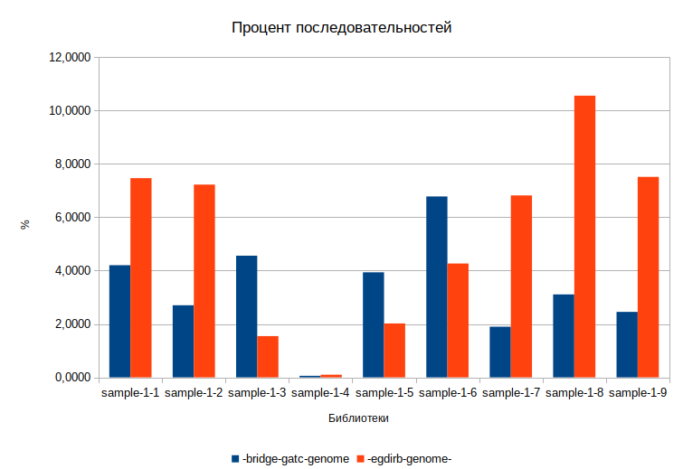

Таблица ODS, [если понадобится](./scripts_results/libs_mask_190902.ods).

## Результаты по dangling ends

| Sample        | bgg, %  | eg, %   |
|---------------|---------|---------|
| s3_FR_RF_0_R1 | 7.7267  | 3.0258  |
| s3_FR_RF_0_R2 | 8.2358  | 2.5066  |
| s5_FR_RF_0_R1 | 6.7543  | 3.4842  |
| s5_FR_RF_0_R2 | 7.2160  | 2.6680  |
| s7_FR_RF_0_R1 | 3.42313 | 15.3723 |
| s7_FR_RF_0_R2 | 3.8473  | 17.6244 |
| s8_FR_RF_0_R1 | 4.1313  | 19.8681 |
| s8_FR_RF_0_R2 | 5.1396  | 23.2775 |

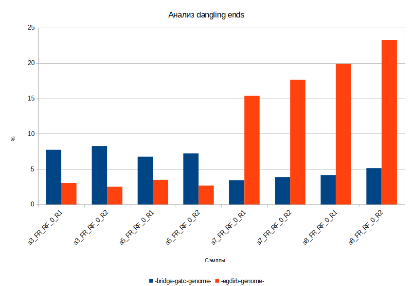

Таблица ODS, [если понадобится](./scripts_results/dangling_ends_190905.ods).

Полные результаты ([.zip](./scripts_results/dangling_1m.zip)):

<details> 
<summary>s3_FR_RF_0_R1</summary>
<pre>
35.4861		-genome-
3.9546		-bridge--gatc--genome-
2.5855		-genome--gatc--egdirb--[1]--gatc--genome-
2.4103		-genome--egdirb--genome-
2.3251		-genome--bridge--genome-
1.7727		-genome--gatc--[3]--
1.7401		-genome--gatc--[1]--
1.7186		-genome--gatc--[4]--
1.7105		-genome--gatc--[6]--
1.693		-genome--gatc--[2]--
1.6781		-genome--gatc--[5]--
1.5134		-genome--gatc--[7]--
1.4355		-genome--gatc--[8]--
1.3908		-genome--gatc--[9]--
1.3224		-genome--gatc--[10]--
0.8905		-egdirb--genome-
0.6503		-egdirb--bridge--gatc--egdirb--genome-
0.6231		-genome--egdirb--[1]--gatc--genome-
0.6195		-bridge--genome-
0.5867		-genome--bridge--[6]--gatc--genome-
0.5728		-egdirb--bridge--gatc--genome-
0.5601		-genome--gatc--[6]--egdirb--genome-
0.5155		--[6]--gatc--genome-
0.4498		-genome--bridge--[1]--gatc--genome-
0.3887		--[5]--gatc--genome-
0.3838		-bridge--gatc--egdirb--genome-
0.3593		-genome--gatc--egdirb--bridge--[1]--gatc--genome-
0.3589		-genome--bridge--gatc--egdirb--[1]--gatc--genome-
0.3318		-genome--gatc--[7]--gatc--genome-
0.3289		-genome--bridge--gatc--egdirb--bridge--[1]--gatc--genome-
0.3157		-genome--egdirb--bridge--[1]--gatc--genome-
0.3066		--[3]--gatc--genome-
0.2875		-genome--gatc--[6]--gatc--genome-
0.2696		-genome--gatc--[4]--gatc--genome-
0.2633		-genome--gatc--egdirb-
0.2568		-genome--gatc--egdirb--[3]--
0.2411		-genome--gatc--egdirb--[4]--
0.2367		--[1]--gatc--genome-
0.2309		--[4]--gatc--genome-
0.2283		-genome--gatc--egdirb--[1]--gatc-
0.2207		-genome--bridge--gatc--egdirb--genome-
0.22		-genome--gatc--egdirb--[1]--gatc--[1]--
0.2139		-bridge--gatc--genome--gatc--[1]--
0.2128		-genome--gatc--egdirb--[1]--gatc--[2]--
0.2085		-bridge--gatc--genome--gatc--[2]--
0.208		--[7]--gatc--genome-
0.2077		-genome--gatc--egdirb--[1]--gatc--[3]--
0.207		-genome--gatc--egdirb--[1]--gatc--[4]--
0.2033		-bridge--gatc--genome--bridge--genome-
0.2008		-genome--gatc--[2]--gatc--genome-
0.1987		-bridge--gatc--genome--gatc--[4]--
0.1986		-bridge--gatc--genome--gatc--[5]--
0.1982		-bridge--gatc--genome--gatc--[3]--
0.1912		-genome--gatc--egdirb--[1]--gatc--[6]--
0.1875		-genome--gatc--[5]--gatc--genome-
0.1874		-genome--gatc--egdirb--[1]--gatc--[5]--
0.1837		-genome--gatc--[8]--gatc--genome-
0.1821		-bridge--gatc--genome--gatc--[6]--
0.1807		--[2]--gatc--genome-
0.1802		-genome--gatc--egdirb--[1]--gatc--[7]--
0.1766		-genome--gatc--egdirb--[1]--gatc--[8]--
0.1766		-bridge--gatc--genome--gatc--[7]--
0.1707		-genome--gatc--egdirb--[1]--gatc--[9]--
0.1682		-bridge--gatc--genome--gatc--[8]--
0.1659		-genome--bridge--gatc--genome-
0.1605		-genome--gatc--[3]--gatc--genome-
0.1554		-bridge--gatc--genome--gatc--[9]--
0.1545		-genome--gatc--egdirb--[1]--gatc--[10]--
0.1541		-bridge--gatc--genome--gatc--[10]--
0.1532		-bridge--gatc--genome--egdirb--genome-
0.1435		-genome--gatc--[1]--gatc--genome-
0.135		-genome--bridge--genome--gatc--[1]--
0.1334		--[10]--gatc--genome-
0.1331		-genome--egdirb--genome--gatc--[1]--
0.1279		-genome--bridge--genome--gatc--[3]--
0.1271		-genome--bridge--genome--gatc--[2]--
0.1258		-genome--egdirb--genome--gatc--[4]--
0.1258		--[8]--gatc--genome-
0.1242		-genome--bridge--genome--gatc--[4]--
0.1238		-genome--bridge--genome--gatc--[6]--
0.1234		-genome--egdirb--genome--gatc--[6]--
0.1226		-genome--egdirb--genome--gatc--[3]--
0.1198		-genome--gatc--[9]--gatc--genome-
0.1195		--[9]--gatc--genome-
0.119		-genome--bridge--genome--gatc--[5]--
0.1186		-genome--gatc--egdirb--[1]--
0.1174		-genome--egdirb--genome--gatc--[2]--
0.1159		-genome--gatc--egdirb--genome-
0.1141		-genome--egdirb--genome--gatc--[5]--
0.11		-genome--bridge--genome--gatc--[7]--
0.1099		-genome--gatc--[10]--gatc--genome-
0.1063		-egdirb--bridge--genome-
0.1053		-genome--egdirb--genome--gatc--[7]--
0.1053		-genome--egdirb--genome--gatc--egdirb--[1]--gatc--genome-
0.1051		-genome--egdirb--genome--gatc--[8]--
0.104		-genome--bridge--genome--gatc--[9]--
0.1027		-genome--bridge--genome--gatc--[8]--
0.1014		-genome--egdirb--genome--gatc--[9]--
</pre>
</details>

<details> 
<summary>s3_FR_RF_0_R2</summary>
<pre>
32.3263		-genome-
3.9066		-bridge--gatc--genome-
2.2017		-genome--bridge--genome-
2.1541		-genome--gatc--egdirb--[1]--gatc--genome-
2.1463		-genome--gatc--[1]--
2.1299		-genome--gatc--[3]--
2.1144		-genome--egdirb--genome-
2.0749		-genome--gatc--[2]--
2.0684		-genome--gatc--[4]--
2.0078		-genome--gatc--[6]--
1.9839		-genome--gatc--[5]--
1.8048		-genome--gatc--[7]--
1.7337		-genome--gatc--[8]--
1.6659		-genome--gatc--[9]--
1.588		-genome--gatc--[10]--
0.8991		-bridge--genome-
0.6254		-genome--bridge--[1]--gatc--genome-
0.6057		-egdirb--bridge--gatc--genome-
0.5513		-genome--bridge--[6]--gatc--genome-
0.5355		-egdirb--genome-
0.4984		-genome--gatc--[6]--egdirb--genome-
0.4946		-genome--bridge--gatc--egdirb--bridge--[1]--gatc--genome-
0.4529		--[6]--gatc--genome-
0.422		-bridge--gatc--egdirb--genome-
0.3783		-egdirb--bridge--genome-
0.3644		-egdirb--bridge--gatc--egdirb--genome-
0.3429		-genome--egdirb--[1]--gatc--genome-
0.3127		-genome--gatc--[7]--gatc--genome-
0.3108		-genome--gatc--[6]--gatc--genome-
0.2977		-genome--gatc--egdirb--bridge--[1]--gatc--genome-
0.2871		--[5]--gatc--genome-
0.2679		--[3]--gatc--genome-
0.2652		-genome--bridge--gatc--egdirb--[1]--gatc--genome-
0.2589		-bridge--gatc--genome--gatc--[1]--
0.2532		-genome--gatc--[4]--gatc--genome-
0.248		-bridge--gatc--genome--gatc--[2]--
0.2458		-bridge--gatc--genome--gatc--[4]--
0.2446		-genome--gatc--egdirb-
0.2444		-bridge--gatc--genome--gatc--[3]--
0.2425		-genome--gatc--egdirb--[3]--
0.235		--[7]--gatc--genome-
0.235		-genome--gatc--egdirb--[4]--
0.2189		-genome--gatc--egdirb--[1]--gatc-
0.2177		-bridge--gatc--genome--gatc--[5]--
0.2165		-bridge--gatc--genome--gatc--[6]--
0.2082		--[4]--gatc--genome-
0.2076		-genome--gatc--egdirb--[1]--gatc--[1]--
0.2069		--[1]--gatc--genome-
0.2065		-bridge--gatc--genome--gatc--[7]--
0.204		-bridge--gatc--genome--bridge--genome-
0.2005		-genome--gatc--egdirb--[1]--gatc--[2]--
0.2003		-genome--bridge--gatc--egdirb--genome-
0.1982		-bridge--gatc--genome--gatc--[8]--
0.1925		-genome--gatc--egdirb--[1]--gatc--[5]--
0.1922		-bridge--gatc--genome--gatc--[9]--
0.1904		-genome--gatc--egdirb--[1]--gatc--[4]--
0.1898		-genome--gatc--egdirb--[1]--gatc--[3]--
0.1888		-genome--gatc--[2]--gatc--genome-
0.1765		-bridge--gatc--genome--gatc--[10]--
0.1744		-genome--gatc--egdirb--[1]--gatc--[6]--
0.1742		-genome--gatc--egdirb--genome-
0.1717		-genome--gatc--[5]--gatc--genome-
0.1707		--[2]--gatc--genome-
0.1699		-genome--gatc--egdirb--[1]--gatc--[7]--
0.1631		-genome--gatc--egdirb--[1]--gatc--[8]--
0.1602		-genome--egdirb--genome--gatc--[1]--
0.1585		-genome--bridge--genome--gatc--[1]--
0.1567		-genome--gatc--[8]--gatc--genome-
0.1518		-genome--egdirb--genome--gatc--[3]--
0.1499		-genome--gatc--egdirb--[1]--gatc--[9]--
0.1489		-genome--gatc--egdirb--[1]--gatc--[10]--
0.1475		-genome--egdirb--genome--gatc--[2]--
0.1473		-genome--egdirb--genome--gatc--[6]--
0.1466		-bridge--gatc--genome--egdirb--genome-
0.1456		-genome--egdirb--genome--gatc--[4]--
0.1441		-genome--bridge--genome--gatc--[4]--
0.1436		-genome--bridge--genome--gatc--[3]--
0.1425		-genome--bridge--genome--gatc--[2]--
0.1409		-genome--gatc--[3]--gatc--genome-
0.14		-genome--egdirb--genome--gatc--[5]--
0.138		-genome--bridge--genome--gatc--[6]--
0.1358		-genome--bridge--genome--gatc--[5]--
0.1277		-genome--egdirb--genome--gatc--[7]--
0.1263		-genome--gatc--[1]--gatc--genome-
0.1242		--[10]--gatc--genome-
0.1241		-genome--bridge--genome--gatc--[8]--
0.1236		-genome--bridge--genome--gatc--[7]--
0.1201		-genome--egdirb--genome--gatc--[9]--
0.1197		-genome--egdirb--genome--gatc--[8]--
0.1179		-genome--bridge--genome--gatc--[9]--
0.1167		--[8]--gatc--genome-
0.1147		--[9]--gatc--genome-
0.1112		-genome--bridge--genome--gatc--[10]--
0.1101		-genome--gatc--egdirb--[1]--
0.1085		-genome--gatc--[9]--gatc--genome-
0.1081		-genome--egdirb--genome--gatc--[10]--
</pre>
</details>

<details> 
<summary>s5_FR_RF_0_R1</summary>
<pre>
37.6075		-genome-
3.3242		-bridge--gatc--genome-
3.1741		-genome--egdirb--genome-
3.0687		-genome--bridge--genome-
2.5383		-genome--gatc--egdirb--[1]--gatc--genome-
1.3784		-genome--gatc--[6]--
1.3736		-genome--gatc--[4]--
1.3678		-genome--gatc--[3]--
1.361		-genome--gatc--[5]--
1.357		-genome--gatc--[1]--
1.3334		-genome--gatc--[2]--
1.2839		-genome--gatc--[7]--
1.2445		-genome--gatc--[8]--
1.2366		-genome--gatc--[9]--
1.234		-egdirb--bridge--gatc--egdirb--genome-
1.1955		-genome--gatc--[10]--
0.8039		-egdirb--genome-
0.7101		-egdirb--bridge--gatc--genome-
0.6937		-genome--bridge--[6]--gatc--genome-
0.672		-genome--gatc--[6]--egdirb--genome-
0.6123		-genome--gatc--egdirb--bridge--[1]--gatc--genome-
0.5464		-genome--egdirb--[1]--gatc--genome-
0.54		-genome--bridge--gatc--egdirb--bridge--[1]--gatc--genome-
0.5102		-genome--bridge--gatc--egdirb--genome-
0.497		-bridge--genome-
0.4503		--[6]--gatc--genome-
0.4441		-genome--bridge--[1]--gatc--genome-
0.3694		-genome--bridge--gatc--egdirb--[1]--gatc--genome-
0.335		-bridge--gatc--egdirb--genome-
0.3291		-genome--gatc--[7]--gatc--genome-
0.327		--[5]--gatc--genome-
0.3117		-genome--egdirb--bridge--[1]--gatc--genome-
0.285		-genome--gatc--[6]--gatc--genome-
0.2822		--[3]--gatc--genome-
0.2598		-genome--gatc--[4]--gatc--genome-
0.2405		--[1]--gatc--genome-
0.2155		-genome--gatc--[2]--gatc--genome-
0.1955		--[4]--gatc--genome-
0.1942		-bridge--gatc--genome--bridge--genome-
0.1881		--[7]--gatc--genome-
0.1862		-genome--bridge--gatc--genome-
0.1815		-genome--gatc--[8]--gatc--genome-
0.1811		-genome--gatc--[5]--gatc--genome-
0.1629		-bridge--gatc--genome--egdirb--genome-
0.1579		-genome--gatc--egdirb-
0.1539		--[2]--gatc--genome-
0.1528		-genome--gatc--egdirb--[3]--
0.1515		-genome--gatc--[3]--gatc--genome-
0.1479		-bridge--gatc--genome--gatc--[3]--
0.1466		-bridge--gatc--genome--gatc--[1]--
0.1459		-genome--gatc--[1]--gatc--genome-
0.1453		-genome--gatc--egdirb--[4]--
0.1414		-bridge--gatc--genome--gatc--[4]--
0.1401		-bridge--gatc--genome--gatc--[2]--
0.1394		--[10]--gatc--genome-
0.1391		-genome--gatc--egdirb--[1]--gatc--[2]--
0.1384		-genome--gatc--egdirb--[1]--gatc-
0.1382		-genome--gatc--egdirb--[1]--gatc--[1]--
0.138		-genome--gatc--egdirb--[1]--gatc--[5]--
0.1372		-genome--gatc--egdirb--[1]--gatc--[4]--
0.1363		-genome--gatc--egdirb--[1]--gatc--[3]--
0.1358		-bridge--gatc--genome--gatc--[5]--
0.1355		-genome--egdirb--genome--gatc--egdirb--[1]--gatc--genome-
0.135		-genome--bridge--genome--gatc--[2]--
0.1331		-genome--gatc--egdirb--[1]--gatc--[6]--
0.1318		-genome--egdirb--genome--gatc--[6]--
0.1317		-genome--egdirb--genome--gatc--[4]--
0.1312		-genome--bridge--genome--gatc--[3]--
0.1311		-genome--bridge--genome--gatc--[5]--
0.1297		-genome--gatc--[9]--gatc--genome-
0.129		-genome--egdirb--genome--gatc--[1]--
0.1281		-genome--bridge--genome--gatc--[6]--
0.1279		-genome--bridge--genome--gatc--[4]--
0.1278		-genome--egdirb--genome--gatc--[3]--
0.1278		-genome--bridge--genome--gatc--[1]--
0.1274		-bridge--gatc--genome--gatc--[8]--
0.1273		-bridge--gatc--genome--gatc--[6]--
0.1273		-genome--gatc--egdirb--[1]--gatc--[7]--
0.1257		--[2]--egdirb--genome-
0.1257		-genome--gatc--egdirb--[1]--gatc--[9]--
0.1252		-genome--egdirb--genome--gatc--[2]--
0.1246		-genome--egdirb--genome--gatc--[5]--
0.1242		-genome--bridge--genome--gatc--[7]--
0.1238		--[9]--gatc--genome-
0.1238		-bridge--gatc--genome--gatc--[7]--
0.1232		-genome--bridge--genome--gatc--[8]--
0.1213		-genome--gatc--egdirb--[1]--gatc--[8]--
0.121		--[8]--gatc--genome-
0.1199		-genome--bridge--genome--gatc--egdirb--[1]--gatc--genome-
0.1197		-genome--gatc--egdirb--[1]--gatc--[10]--
0.1192		-genome--bridge--genome--gatc--[10]--
0.1186		-genome--gatc--egdirb--genome-
0.1184		-genome--bridge--genome--gatc--[9]--
0.118		-bridge--gatc--genome--gatc--[9]--
0.1178		-genome--egdirb--genome--gatc--[8]--
0.1167		-genome--gatc--[10]--gatc--genome-
0.1161		-bridge--gatc--genome--gatc--[10]--
0.1159		-genome--egdirb--genome--gatc--[7]--
0.1134		-genome--egdirb--genome--gatc--[9]--
0.1129		-genome--egdirb--genome--gatc--[10]--
0.1095		--[6]--bridge--gatc--egdirb--genome-
0.105		-genome--egdirb--[7]--gatc--genome-
0.1048		-egdirb--bridge--genome-
</pre>
</details>

<details> 
<summary>s5_FR_RF_0_R2</summary>
<pre>
33.64		-genome-
3.1329		-bridge--gatc--genome-
2.8365		-genome--bridge--genome-
2.7239		-genome--egdirb--genome-
2.0835		-genome--gatc--egdirb--[1]--gatc--genome-
1.8592		-genome--gatc--[1]--
1.8157		-genome--gatc--[3]--
1.814		-genome--gatc--[2]--
1.8017		-genome--gatc--[4]--
1.7818		-genome--gatc--[5]--
1.7581		-genome--gatc--[6]--
1.6684		-genome--gatc--[7]--
1.6101		-genome--gatc--[8]--
1.5759		-genome--gatc--[9]--
1.5311		-genome--gatc--[10]--
1.0232		-genome--bridge--gatc--egdirb--bridge--[1]--gatc--genome-
0.7977		-egdirb--bridge--gatc--genome-
0.6703		-bridge--genome-
0.6456		-genome--bridge--[6]--gatc--genome-
0.6098		-genome--bridge--[1]--gatc--genome-
0.5722		-genome--gatc--[6]--egdirb--genome-
0.5463		-egdirb--bridge--gatc--egdirb--genome-
0.4749		-genome--bridge--gatc--egdirb--genome-
0.4725		-egdirb--genome-
0.4315		-genome--gatc--egdirb--bridge--[1]--gatc--genome-
0.396		-bridge--gatc--egdirb--genome-
0.369		--[6]--gatc--genome-
0.339		-egdirb--bridge--genome-
0.3215		-genome--egdirb--[1]--gatc--genome-
0.3166		-genome--gatc--[7]--gatc--genome-
0.2858		-genome--gatc--[6]--gatc--genome-
0.2688		-genome--gatc--[4]--gatc--genome-
0.2479		--[5]--gatc--genome-
0.247		-genome--bridge--gatc--egdirb--[1]--gatc--genome-
0.2172		--[3]--gatc--genome-
0.2112		-genome--gatc--[2]--gatc--genome-
0.2004		-genome--gatc--egdirb--genome-
0.1968		-bridge--gatc--genome--bridge--genome-
0.1954		--[1]--gatc--genome-
0.1891		--[7]--gatc--genome-
0.1812		-bridge--gatc--genome--gatc--[2]--
0.1809		-bridge--gatc--genome--gatc--[1]--
0.1783		-bridge--gatc--genome--gatc--[4]--
0.174		-bridge--gatc--genome--gatc--[3]--
0.1732		--[4]--gatc--genome-
0.1709		-genome--egdirb--genome--gatc--[1]--
0.1705		-genome--egdirb--genome--gatc--[2]--
0.1697		-bridge--gatc--genome--gatc--[5]--
0.1676		-genome--bridge--genome--gatc--[1]--
0.167		-genome--egdirb--genome--gatc--[3]--
0.1666		-genome--bridge--genome--gatc--[2]--
0.166		-genome--bridge--genome--gatc--[3]--
0.1649		-genome--gatc--[5]--gatc--genome-
0.1647		-genome--egdirb--genome--gatc--[5]--
0.1619		-genome--egdirb--genome--gatc--[6]--
0.1616		-bridge--gatc--genome--gatc--[6]--
0.1613		-genome--egdirb--genome--gatc--[4]--
0.1613		-genome--bridge--genome--gatc--[6]--
0.1612		-genome--bridge--genome--gatc--[4]--
0.1582		-genome--bridge--genome--gatc--[5]--
0.1566		-genome--gatc--egdirb-
0.1561		-genome--gatc--[8]--gatc--genome-
0.155		-bridge--gatc--genome--gatc--[7]--
0.1534		-genome--egdirb--genome--gatc--[8]--
0.1515		-genome--bridge--genome--gatc--[8]--
0.151		-genome--gatc--egdirb--[3]--
0.1506		-genome--egdirb--genome--gatc--[7]--
0.1484		-bridge--gatc--genome--egdirb--genome-
0.148		-bridge--gatc--genome--gatc--[9]--
0.1477		-bridge--gatc--genome--gatc--[8]--
0.1472		-genome--egdirb--genome--gatc--[9]--
0.1468		-genome--gatc--egdirb--[4]--
0.146		-genome--bridge--genome--gatc--[7]--
0.1446		-bridge--gatc--genome--gatc--[10]--
0.1443		-genome--egdirb--genome--gatc--[10]--
0.1433		-genome--bridge--genome--gatc--[9]--
0.1426		-genome--gatc--egdirb--[1]--gatc--[3]--
0.1424		-genome--gatc--egdirb--[1]--gatc--[1]--
0.1398		-genome--bridge--genome--gatc--[10]--
0.1385		--[2]--gatc--genome-
0.1384		-genome--gatc--egdirb--[1]--gatc-
0.1361		-genome--gatc--egdirb--[1]--gatc--[4]--
0.1344		-genome--gatc--egdirb--[1]--gatc--[2]--
0.1343		-genome--gatc--[1]--gatc--genome-
0.131		-genome--gatc--[3]--gatc--genome-
0.1287		-genome--gatc--egdirb--[1]--gatc--[5]--
0.1225		--[10]--gatc--genome-
0.1223		-genome--gatc--egdirb--[1]--gatc--[8]--
0.122		-genome--gatc--egdirb--[1]--gatc--[6]--
0.1205		-genome--gatc--egdirb--[1]--gatc--[7]--
0.1144		-genome--gatc--egdirb--[1]--gatc--[9]--
0.1128		-genome--gatc--egdirb--[1]--gatc--[10]--
0.1126		--[8]--gatc--genome-
0.1121		-genome--gatc--[9]--gatc--genome-
0.1076		--[9]--gatc--genome-
0.1058		-genome--gatc--[10]--gatc--genome-
0.1034		-genome--bridge--genome--gatc--egdirb--[1]--gatc--genome-
0.1017		-genome--egdirb--genome--gatc--egdirb--[1]--gatc--genome-
</pre>
</details>

<details> 
<summary>s7_FR_RF_0_R1</summary>
<pre>
17.6591		-genome--gatc--[1]--gatc--genome-
6.9857		-genome-
5.3348		-genome--bridge--gatc--egdirb--bridge--[1]--gatc--genome--gatc--[1]--gatc--genome-
4.4239		-egdirb--bridge--gatc--egdirb--genome--gatc--[1]--gatc--genome-
2.328		-genome--bridge--gatc--egdirb--[1]--gatc--genome--gatc--[1]--gatc--genome-
1.9771		-bridge--gatc--egdirb--genome--gatc--[1]--gatc--genome-
1.8497		-genome--bridge--gatc--egdirb--bridge--[1]--gatc--genome-
1.8428		-egdirb--bridge--gatc--egdirb--genome-
0.9296		-genome--gatc--egdirb--[1]--gatc--genome--gatc--[1]--gatc--genome-
0.8911		-bridge--gatc--genome--gatc--[1]--gatc--genome-
0.8193		-genome--egdirb--genome--gatc--[1]--gatc--genome-
0.8092		-genome--bridge--genome--gatc--[1]--gatc--genome-
0.754		-bridge--gatc--egdirb--genome-
0.731		-genome--bridge--gatc--egdirb--[1]--gatc--genome-
0.6409		-bridge--gatc--genome-
0.6267		-genome--egdirb--genome-
0.615		-genome--bridge--genome-
0.614		-genome--bridge--gatc--egdirb--genome--gatc--[1]--gatc--genome-
0.6107		-genome--bridge--gatc--egdirb--[7]--gatc--genome--gatc--[1]--gatc--genome-
0.5276		-genome--gatc--egdirb--[1]--gatc--genome-
0.5186		--[6]--bridge--gatc--egdirb--genome--gatc--[1]--gatc--genome-
0.5165		-genome--gatc--egdirb--bridge--[1]--gatc--genome--gatc--[1]--gatc--genome-
0.5099		-genome--gatc--[4]--
0.4933		-genome--gatc--[1]--
0.4837		-genome--gatc--[2]--
0.4835		-genome--gatc--[3]--
0.3512		-genome--gatc--[1]--gatc--[9]--
0.3498		-genome--gatc--[1]--gatc--[10]--
0.3435		-genome--gatc--[1]--gatc--[8]--
0.339		-genome--gatc--[1]--gatc--[5]--
0.3364		-genome--gatc--[1]--gatc--[6]--
0.3345		-genome--gatc--[1]--gatc--[3]--
0.3332		-genome--gatc--[1]--gatc--[7]--
0.3332		-genome--gatc--[1]--gatc--[4]--
0.3214		-genome--gatc--[1]--gatc--[2]--
0.3123		-genome--gatc--[1]--gatc--[1]--
0.3099		-egdirb--bridge--gatc--genome--gatc--[1]--gatc--genome-
0.307		-genome--gatc--[1]--gatc-
0.2609		-genome--bridge--gatc--egdirb--genome-
0.2459		-genome--gatc--egdirb--bridge--[1]--gatc--genome-
0.2248		-genome--gatc--[9]--
0.2201		-genome--egdirb--[1]--gatc--genome--gatc--[1]--gatc--genome-
0.2168		-genome--gatc--[10]--
0.2119		-genome--bridge--[6]--gatc--genome--gatc--[1]--gatc--genome-
0.2117		-genome--gatc--[5]--
0.2112		-genome--gatc--[8]--
0.2097		-genome--gatc--[6]--
0.2042		-genome--gatc--[7]--
0.2015		-genome--bridge--gatc--egdirb--[7]--gatc--genome-
0.1946		--[6]--bridge--gatc--egdirb--genome-
0.1907		-egdirb--bridge--gatc--genome-
0.188		-genome--bridge--gatc--[7]--gatc--genome--gatc--[1]--gatc--genome-
0.1852		-genome--gatc--[6]--egdirb--genome--gatc--[1]--gatc--genome-
0.166		-bridge--genome--gatc--[1]--gatc--genome-
0.1626		-genome--egdirb--bridge--[1]--gatc--genome--gatc--[1]--gatc--genome-
0.1597		-genome--gatc--[7]--gatc--genome--gatc--[1]--gatc--genome-
0.1591		--[6]--gatc--genome--gatc--[1]--gatc--genome-
0.1509		--[6]--gatc--egdirb--genome--gatc--[1]--gatc--genome-
0.1509		-genome--bridge--[1]--gatc--genome--gatc--[1]--gatc--genome-
0.1494		-genome--gatc--[4]--gatc--genome--gatc--[1]--gatc--genome-
0.1398		-egdirb--bridge--gatc--egdirb--genome--gatc--[4]--
0.1327		--[3]--gatc--genome--gatc--[1]--gatc--genome-
0.1321		-genome--egdirb--[1]--gatc--genome-
0.1309		-egdirb--bridge--gatc--egdirb--genome--gatc--[2]--
0.1306		-egdirb--bridge--gatc--egdirb--genome--gatc--[3]--
0.1301		-genome--bridge--gatc--egdirb--[8]--gatc--genome--gatc--[1]--gatc--genome-
0.1289		-egdirb--bridge--gatc--egdirb--bridge--gatc--egdirb--genome-
0.1285		-egdirb--bridge--gatc--egdirb--genome--gatc--[1]--
0.1283		-genome--gatc--[6]--gatc--genome--gatc--[1]--gatc--genome-
0.1254		-genome--bridge--gatc--egdirb--bridge--[1]--gatc--genome--gatc--[1]--gatc--[9]--
0.1232		-genome--bridge--gatc--egdirb--bridge--[1]--gatc--genome--gatc--[1]--gatc--[8]--
0.1225		-egdirb--genome--gatc--[1]--gatc--genome-
0.1213		-genome--bridge--[6]--gatc--genome-
0.1201		-genome--bridge--gatc--egdirb--bridge--[1]--gatc--genome--gatc--[1]--gatc--[7]--
0.1199		--[7]--bridge--gatc--egdirb--genome--gatc--[1]--gatc--genome-
0.1188		-egdirb--bridge--gatc--egdirb--bridge--gatc--egdirb--genome--gatc--[1]--gatc--genome-
0.1181		-genome--bridge--gatc--egdirb--bridge--gatc--egdirb--bridge--[1]--gatc--genome--gatc--[1]--gatc--genome-
0.1177		-genome--gatc--[6]--egdirb--genome-
0.1166		-genome--bridge--gatc--egdirb--bridge--[1]--gatc--genome--gatc--[1]--gatc--[5]--
0.1165		-genome--bridge--gatc--egdirb--bridge--[1]--gatc--genome--gatc--[1]--gatc--[2]--
0.1154		-genome--bridge--gatc--egdirb--bridge--[1]--gatc--genome--gatc--[1]--gatc--[6]--
0.1154		-genome--bridge--gatc--egdirb--bridge--[1]--gatc--genome--gatc--[1]--gatc--[10]--
0.1153		-bridge--genome-
0.114		-genome--bridge--[3]--gatc--genome--gatc--[1]--gatc--genome-
0.114		-genome--bridge--gatc--genome-
0.1129		-genome--gatc--[2]--gatc--genome--gatc--[1]--gatc--genome-
0.1119		-genome--bridge--gatc--egdirb--bridge--[1]--gatc--genome--gatc--[1]--gatc--[3]--
0.1113		-genome--bridge--gatc--egdirb--bridge--[1]--gatc--genome--gatc--[4]--
0.1112		-genome--bridge--gatc--egdirb--bridge--gatc--egdirb--bridge--[1]--gatc--genome-
0.1109		-genome--bridge--gatc--egdirb--bridge--[1]--gatc--genome--gatc--[1]--gatc--[4]--
0.1097		--[2]--egdirb--genome--gatc--[1]--gatc--genome-
0.1089		-genome--bridge--gatc--egdirb--bridge--[1]--gatc--genome--gatc--[1]--gatc-
0.1085		-egdirb--bridge--gatc--egdirb--genome--gatc--[1]--gatc--[10]--
0.1084		--[5]--gatc--genome--gatc--[1]--gatc--genome-
0.1082		-genome--bridge--gatc--egdirb--bridge--[1]--gatc--genome--gatc--[3]--
0.108		-egdirb--bridge--gatc--egdirb--genome--gatc--[1]--gatc--[9]--
0.1064		-genome--bridge--gatc--egdirb--bridge--[1]--gatc--genome--gatc--[2]--
0.1063		-genome--bridge--gatc--egdirb--bridge--[1]--gatc--genome--gatc--[1]--gatc--[1]--
0.1047		-egdirb--bridge--gatc--egdirb--genome--gatc--[1]--gatc--[8]--
0.1044		--[1]--gatc--genome--gatc--[1]--gatc--genome-
0.1037		-genome--bridge--gatc--egdirb--bridge--[1]--gatc--genome--gatc--[1]--
0.1029		-egdirb--bridge--gatc--egdirb--genome--gatc--[1]--gatc--[7]--
0.1026		-genome--egdirb--[7]--gatc--genome--gatc--[1]--gatc--genome-
</pre>
</details>

<details> 
<summary>s7_FR_RF_0_R2</summary>
<pre>
26.1869		-genome-
8.0218		-egdirb--bridge--gatc--egdirb--genome-
6.4276		-genome--bridge--gatc--egdirb--bridge--[1]--gatc--genome-
3.3536		-bridge--gatc--egdirb--genome-
2.8211		-genome--bridge--gatc--egdirb--[1]--gatc--genome-
1.6501		-bridge--gatc--genome-
1.5762		-genome--bridge--genome-
1.5675		-genome--egdirb--genome-
1.5579		-genome--gatc--egdirb--[1]--gatc--genome-
0.9513		-genome--bridge--gatc--egdirb--genome-
0.903		--[6]--bridge--gatc--egdirb--genome-
0.8329		-egdirb--bridge--gatc--genome-
0.7356		-genome--bridge--gatc--egdirb--[7]--gatc--genome-
0.5981		-genome--gatc--[9]--
0.5962		-genome--gatc--[10]--
0.588		-genome--gatc--[8]--
0.5742		-genome--gatc--[5]--
0.5686		-genome--gatc--[6]--
0.5686		-genome--gatc--[4]--
0.5668		-genome--gatc--[7]--
0.5586		-genome--gatc--[1]--
0.5464		-genome--gatc--[2]--
0.5439		-genome--gatc--[3]--
0.5347		-genome--gatc--egdirb--bridge--[1]--gatc--genome-
0.3981		-bridge--genome-
0.3835		-genome--bridge--[6]--gatc--genome-
0.3057		-genome--gatc--[6]--egdirb--genome-
0.3		-genome--egdirb--[1]--gatc--genome-
0.2826		-egdirb--bridge--gatc--egdirb--bridge--gatc--egdirb--genome-
0.2785		-egdirb--bridge--genome-
0.2754		--[6]--gatc--egdirb--genome-
0.259		-genome--gatc--[7]--gatc--genome-
0.2531		--[6]--gatc--genome-
0.252		-genome--bridge--gatc--egdirb--bridge--gatc--egdirb--bridge--[1]--gatc--genome-
0.2276		-genome--gatc--[4]--gatc--genome-
0.2232		-genome--bridge--gatc--[7]--gatc--genome-
0.2193		-genome--gatc--egdirb--genome-
0.2163		-egdirb--genome-
0.2045		--[7]--bridge--gatc--egdirb--genome-
0.2043		-genome--gatc--[6]--gatc--genome-
0.2042		-egdirb--bridge--gatc--egdirb--genome--egdirb--genome-
0.2003		-egdirb--bridge--gatc--egdirb--genome--bridge--genome-
0.1965		--[3]--gatc--genome-
0.1833		-egdirb--bridge--gatc--egdirb--genome--gatc--[7]--
0.1804		-egdirb--bridge--gatc--egdirb--genome--gatc--[10]--
0.1795		--[5]--gatc--genome-
0.1774		-egdirb--bridge--gatc--egdirb--genome--gatc--[9]--
0.1767		-egdirb--bridge--gatc--egdirb--genome--gatc--[6]--
0.1757		-egdirb--bridge--gatc--egdirb--genome--gatc--[8]--
0.1756		-genome--bridge--[1]--gatc--genome-
0.1739		-egdirb--bridge--gatc--egdirb--genome--gatc--[5]--
0.1714		-egdirb--bridge--gatc--egdirb--genome--gatc--[4]--
0.1711		-egdirb--bridge--gatc--egdirb--genome--gatc--[3]--
0.1695		-genome--gatc--[2]--gatc--genome-
0.167		-egdirb--bridge--gatc--egdirb--genome--gatc--[2]--
0.162		-egdirb--bridge--gatc--egdirb--genome--gatc--[1]--
0.1584		-egdirb--bridge--gatc--egdirb--genome--bridge--[1]--gatc--genome-
0.1562		--[2]--egdirb--genome-
0.1541		-genome--bridge--[3]--gatc--genome-
0.1537		-genome--bridge--gatc--egdirb--[8]--gatc--genome-
0.152		-genome--egdirb--genome--bridge--gatc--egdirb--bridge--[1]--gatc--genome-
0.1514		--[1]--gatc--genome-
0.1466		-genome--bridge--genome--bridge--gatc--egdirb--bridge--[1]--gatc--genome-
0.1386		-genome--gatc--[5]--gatc--genome-
0.1376		-egdirb--genome--bridge--gatc--egdirb--bridge--[1]--gatc--genome-
0.1369		-genome--bridge--gatc--genome-
0.132		--[6]--bridge--genome-
0.1281		--[7]--gatc--genome-
0.1263		--[4]--gatc--genome-
0.1219		-bridge--gatc--egdirb--genome--bridge--genome-
0.1208		-genome--gatc--[1]--gatc--genome-
0.1191		-genome--egdirb--bridge--[1]--gatc--genome-
0.1187		--[2]--egdirb--bridge--gatc--egdirb--genome-
0.115		--[1]--bridge--gatc--egdirb--genome-
0.1146		-genome--gatc--[8]--gatc--genome-
0.1112		--[10]--gatc--genome-
0.11		-genome--bridge--gatc--egdirb--bridge--[1]--gatc--genome--gatc--[7]--
0.1092		-bridge--gatc--egdirb--genome--egdirb--genome-
0.1087		-genome--bridge--gatc--egdirb--bridge--[1]--gatc--genome--gatc--[6]--
0.1084		-genome--bridge--gatc--egdirb--bridge--[1]--gatc--genome--gatc--[4]--
0.1082		-genome--egdirb--[7]--gatc--genome-
0.1075		-genome--gatc--[3]--gatc--genome-
0.1052		-genome--bridge--gatc--egdirb--bridge--[1]--gatc--genome--gatc--[8]--
0.1043		-genome--bridge--gatc--egdirb--bridge--[1]--gatc--genome--gatc--[2]--
0.1041		-genome--bridge--gatc--egdirb--bridge--[1]--gatc--genome--gatc--[9]--
0.104		-genome--bridge--gatc--egdirb--bridge--[1]--gatc--genome--gatc--[10]--
0.1036		-genome--bridge--gatc--egdirb--bridge--[1]--gatc--genome--gatc--[5]--
0.103		-genome--bridge--gatc--egdirb--bridge--genome-
0.1024		-genome--bridge--gatc--egdirb--bridge--[1]--gatc--genome--gatc--[3]--
0.1017		-genome--bridge--gatc--egdirb--bridge--[1]--gatc--genome--gatc--[1]--
0.1015		--[2]--gatc--genome-
0.1004		-genome--egdirb--genome--bridge--gatc--egdirb--[1]--gatc--genome-
</pre>
</details>

<details> 
<summary>s8_FR_RF_0_R1</summary>
<pre>
18.4222		-genome-
9.9512		-genome--bridge--gatc--egdirb--bridge--[1]--gatc--genome-
8.2244		-egdirb--bridge--gatc--egdirb--genome-
5.9642		-genome--bridge--gatc--egdirb--[1]--gatc--genome-
5.2495		-bridge--gatc--egdirb--genome-
1.9002		-genome--gatc--egdirb--[1]--gatc--genome-
1.806		-bridge--gatc--genome-
1.6771		-genome--gatc--egdirb--bridge--[1]--gatc--genome-
1.5609		-genome--bridge--gatc--egdirb--[7]--gatc--genome-
1.3415		--[6]--bridge--gatc--egdirb--genome-
1.2204		-genome--bridge--genome-
1.2196		-genome--egdirb--genome-
1.0643		-egdirb--bridge--gatc--genome-
0.7495		-genome--bridge--gatc--egdirb--genome-
0.6236		-egdirb--bridge--gatc--egdirb--bridge--gatc--egdirb--genome-
0.5502		-genome--bridge--gatc--egdirb--bridge--gatc--egdirb--bridge--[1]--gatc--genome-
0.5045		-genome--egdirb--bridge--[1]--gatc--genome-
0.405		-genome--bridge--gatc--[7]--gatc--genome-
0.3778		-genome--egdirb--[1]--gatc--genome-
0.3487		-bridge--gatc--egdirb--bridge--gatc--egdirb--genome-
0.3247		-genome--bridge--[1]--gatc--genome-
0.3181		-bridge--genome-
0.2874		-genome--bridge--[6]--gatc--genome-
0.2711		-genome--bridge--genome--bridge--gatc--egdirb--bridge--[1]--gatc--genome-
0.2676		-genome--egdirb--genome--bridge--gatc--egdirb--bridge--[1]--gatc--genome-
0.2631		-genome--gatc--[6]--egdirb--genome-
0.2535		--[6]--gatc--egdirb--genome-
0.2527		-egdirb--bridge--gatc--egdirb--genome--egdirb--genome-
0.2523		-genome--bridge--gatc--egdirb--bridge--gatc--egdirb--[1]--gatc--genome-
0.2448		-genome--bridge--genome--bridge--gatc--egdirb--[1]--gatc--genome-
0.244		-bridge--gatc--egdirb--genome--egdirb--genome-
0.2436		-egdirb--bridge--gatc--egdirb--genome--bridge--genome-
0.2388		-genome--gatc--[7]--gatc--genome-
0.2374		--[6]--gatc--genome-
0.2365		-egdirb--bridge--genome-
0.2339		-genome--egdirb--genome--bridge--gatc--egdirb--[1]--gatc--genome-
0.2292		-genome--bridge--gatc--egdirb--[8]--gatc--genome-
0.2256		-bridge--gatc--egdirb--genome--bridge--genome-
0.2033		-egdirb--genome--bridge--gatc--egdirb--bridge--[1]--gatc--genome-
0.199		-genome--gatc--egdirb--[7]--gatc--genome-
0.1979		-genome--bridge--gatc--egdirb--[2]--gatc--genome-
0.1965		--[7]--bridge--gatc--egdirb--genome-
0.1947		-egdirb--genome-
0.1905		-genome--gatc--[6]--
0.1898		-genome--gatc--[10]--
0.1854		--[1]--bridge--gatc--egdirb--genome-
0.1776		-genome--gatc--[9]--
0.1757		-genome--gatc--[8]--
0.1754		--[1]--gatc--egdirb--bridge--gatc--egdirb--genome-
0.1716		-genome--gatc--[5]--
0.1713		-genome--gatc--[7]--
0.1701		-genome--bridge--gatc--genome-
0.169		-genome--gatc--[1]--
0.1688		-genome--gatc--[3]--
0.1685		-genome--gatc--[4]--
0.1676		-genome--gatc--[6]--gatc--genome-
0.1675		-egdirb--bridge--gatc--egdirb--genome--bridge--[1]--gatc--genome-
0.1664		-genome--gatc--[2]--
0.1594		-genome--gatc--[4]--gatc--genome-
0.1552		--[5]--gatc--genome-
0.151		--[2]--bridge--gatc--egdirb--genome-
0.1493		-egdirb--genome--bridge--gatc--egdirb--[1]--gatc--genome-
0.1457		-genome--bridge--gatc--egdirb--bridge--genome-
0.1444		-genome--egdirb--bridge--gatc--egdirb--[1]--gatc--genome-
0.1432		--[3]--gatc--genome-
0.1425		-bridge--gatc--egdirb--genome--bridge--[1]--gatc--genome-
0.1252		-gatc--egdirb--bridge--gatc--egdirb--genome-
0.1246		-genome--egdirb--genome--gatc--egdirb--bridge--[1]--gatc--genome-
0.1226		-genome--egdirb--[7]--gatc--genome-
0.1182		-genome--bridge--gatc--egdirb--bridge--gatc--[2]--gatc--genome-
0.1162		--[6]--bridge--gatc--genome-
0.1161		--[3]--bridge--gatc--egdirb--genome-
0.1158		-genome--egdirb--genome--gatc--egdirb--[1]--gatc--genome-
0.1146		-genome--bridge--gatc--egdirb--[3]--gatc--genome-
0.1139		-genome--gatc--[8]--gatc--genome-
0.1129		-genome--gatc--[2]--gatc--genome-
0.1094		-bridge--gatc--genome--bridge--genome-
0.1093		-bridge--gatc--egdirb--bridge--genome-
0.1092		--[1]--gatc--genome-
0.1065		--[2]--gatc--egdirb--bridge--gatc--egdirb--genome-
0.1053		-genome--bridge--gatc--[7]--bridge--[1]--gatc--genome-
0.1048		-genome--gatc--egdirb--genome-
0.1024		-genome--gatc--egdirb--bridge--gatc--egdirb--[1]--gatc--genome-
0.102		--[6]--bridge--gatc--egdirb--bridge--gatc--egdirb--genome-
0.1008		--[4]--gatc--genome-
</pre>
</details>

<details> 
<summary>s8_FR_RF_0_R2</summary>
<pre>
16.1334		-genome-
8.9737		-egdirb--bridge--gatc--egdirb--genome-
6.7608		-genome--bridge--gatc--egdirb--bridge--[1]--gatc--genome-
5.3214		-bridge--gatc--egdirb--genome-
4.351		-genome--bridge--gatc--egdirb--[1]--gatc--genome-
1.6822		-bridge--gatc--genome-
1.4624		-egdirb--bridge--gatc--genome-
1.4487		-genome--gatc--egdirb--[1]--gatc--genome-
1.4035		--[6]--bridge--gatc--egdirb--genome-
1.1229		-genome--bridge--gatc--egdirb--[7]--gatc--genome-
1.0621		-genome--egdirb--genome-
1.045		-genome--bridge--genome-
0.8891		-genome--gatc--egdirb--bridge--[1]--gatc--genome-
0.6492		-genome--bridge--gatc--egdirb--genome-
0.5153		-egdirb--bridge--gatc--egdirb--bridge--gatc--egdirb--genome-
0.4752		-genome--bridge--gatc--egdirb--bridge--gatc--egdirb--bridge--[1]--gatc--genome-
0.4589		-egdirb--bridge--genome-
0.4357		-genome--gatc--[10]--
0.424		-genome--gatc--[8]--
0.4204		-genome--gatc--[6]--
0.4182		-genome--gatc--[9]--
0.4087		-genome--gatc--[4]--
0.4079		-genome--gatc--[7]--
0.4034		-genome--gatc--[5]--
0.4006		-genome--gatc--[1]--
0.4		-genome--gatc--[2]--
0.3992		-genome--gatc--[3]--
0.3685		--[6]--gatc--egdirb--genome-
0.3392		-bridge--genome-
0.3014		-egdirb--genome-
0.2622		-genome--bridge--gatc--egdirb--bridge--gatc--egdirb--[1]--gatc--genome-
0.2608		-genome--egdirb--[1]--gatc--genome-
0.248		-egdirb--bridge--gatc--egdirb--genome--egdirb--genome-
0.2475		-genome--bridge--[6]--gatc--genome-
0.2452		-egdirb--bridge--gatc--egdirb--genome--bridge--genome-
0.2383		-bridge--gatc--egdirb--bridge--gatc--egdirb--genome-
0.2254		--[7]--bridge--gatc--egdirb--genome-
0.2223		-bridge--gatc--egdirb--genome--egdirb--genome-
0.2181		-egdirb--bridge--gatc--egdirb--genome--gatc--[8]--
0.2146		-egdirb--bridge--gatc--egdirb--genome--gatc--[7]--
0.213		--[6]--gatc--genome-
0.2074		-genome--bridge--gatc--[7]--gatc--genome-
0.2072		-egdirb--bridge--gatc--egdirb--genome--gatc--[10]--
0.2072		-bridge--gatc--egdirb--genome--bridge--genome-
0.2072		-genome--gatc--[6]--egdirb--genome-
0.2043		-egdirb--bridge--gatc--egdirb--genome--gatc--[5]--
0.2042		-egdirb--bridge--gatc--egdirb--genome--gatc--[9]--
0.204		-egdirb--bridge--gatc--egdirb--genome--gatc--[6]--
0.2011		-egdirb--bridge--gatc--egdirb--genome--gatc--[4]--
0.1976		-genome--egdirb--bridge--[1]--gatc--genome-
0.1969		-genome--gatc--[7]--gatc--genome-
0.1923		-egdirb--bridge--gatc--egdirb--genome--gatc--[1]--
0.1899		-egdirb--bridge--gatc--egdirb--genome--gatc--[2]--
0.1893		-genome--gatc--egdirb--genome-
0.1893		-egdirb--bridge--gatc--egdirb--genome--gatc--[3]--
0.1775		-genome--bridge--genome--bridge--gatc--egdirb--[1]--gatc--genome-
0.1759		--[1]--bridge--gatc--egdirb--genome-
0.1745		-egdirb--bridge--gatc--egdirb--genome--bridge--[1]--gatc--genome-
0.1727		-genome--bridge--genome--bridge--gatc--egdirb--bridge--[1]--gatc--genome-
0.1712		-genome--egdirb--genome--bridge--gatc--egdirb--bridge--[1]--gatc--genome-
0.1703		--[6]--bridge--gatc--genome-
0.1684		-genome--bridge--gatc--egdirb--[2]--gatc--genome-
0.168		-genome--bridge--[1]--gatc--genome-
0.1652		-genome--egdirb--genome--bridge--gatc--egdirb--[1]--gatc--genome-
0.1608		-genome--bridge--gatc--egdirb--[8]--gatc--genome-
0.1526		-genome--bridge--gatc--egdirb--bridge--gatc--[2]--gatc--genome-
0.1463		-genome--gatc--[6]--gatc--genome-
0.1437		-genome--gatc--[4]--gatc--genome-
0.1408		-egdirb--genome--bridge--gatc--egdirb--bridge--[1]--gatc--genome-
0.1333		-genome--bridge--gatc--egdirb--[3]--gatc--genome-
0.1326		-bridge--gatc--egdirb--genome--gatc--[7]--
0.1319		-bridge--gatc--egdirb--genome--gatc--[6]--
0.1307		-bridge--gatc--egdirb--genome--gatc--[10]--
0.1306		--[5]--gatc--genome-
0.1286		-bridge--gatc--egdirb--bridge--genome-
0.1283		-bridge--gatc--egdirb--genome--gatc--[9]--
0.1273		-bridge--gatc--egdirb--genome--bridge--[1]--gatc--genome-
0.1262		-bridge--gatc--egdirb--genome--gatc--[8]--
0.1254		-bridge--gatc--egdirb--genome--gatc--[5]--
0.1227		--[3]--gatc--genome-
0.1225		-bridge--gatc--egdirb--genome--gatc--[3]--
0.1213		-bridge--gatc--egdirb--genome--gatc--[1]--
0.1208		-genome--bridge--gatc--egdirb--bridge--genome-
0.1205		-bridge--gatc--egdirb--genome--gatc--[2]--
0.1187		-genome--bridge--gatc--egdirb--bridge--[1]--gatc--genome--gatc--[9]--
0.1184		-egdirb--genome--bridge--gatc--egdirb--[1]--gatc--genome-
0.1176		-bridge--gatc--egdirb--genome--gatc--[4]--
0.1158		-genome--bridge--gatc--egdirb--bridge--[1]--gatc--genome--gatc--[8]--
0.1144		--[1]--gatc--egdirb--bridge--gatc--egdirb--genome-
0.1128		-genome--bridge--gatc--egdirb--bridge--[1]--gatc--genome--gatc--[7]--
0.1113		-genome--bridge--gatc--egdirb--bridge--[1]--gatc--genome--gatc--[4]--
0.1107		-genome--bridge--gatc--egdirb--bridge--[1]--gatc--genome--gatc--[10]--
0.1103		-genome--bridge--gatc--egdirb--bridge--gatc--[1]--gatc--genome-
0.1103		-egdirb--bridge--gatc--genome--bridge--genome-
0.1079		-genome--bridge--gatc--egdirb--bridge--[1]--gatc--genome--gatc--[6]--
0.1063		-genome--bridge--gatc--egdirb--bridge--[1]--gatc--genome--gatc--[5]--
0.1063		-genome--bridge--gatc--egdirb--bridge--[1]--gatc--genome--gatc--[3]--
0.1057		-genome--bridge--gatc--egdirb--bridge--[1]--gatc--genome--gatc--[2]--
0.1057		-genome--bridge--gatc--egdirb--[4]--gatc--genome-
0.1051		-genome--bridge--gatc--egdirb--bridge--[1]--gatc--genome--gatc--[1]--
0.1034		-egdirb--[7]--gatc--egdirb--genome-
0.1028		-genome--bridge--gatc--genome-
0.1024		--[7]--gatc--egdirb--genome-
0.1016		--[2]--bridge--gatc--egdirb--genome-
0.1008		--[7]--gatc--genome-
0.1004		-genome--gatc--[2]--gatc--genome-
0.1003		--[6]--bridge--genome-
</pre>
</details>

## Результаты для образцов 7 и 8

<details> 
<summary>sample-1-7_R1_001</summary>
<pre>
15.9871		-genome--bridge--gatc--egdirb--genome-
6.9857		-genome--bridge--gatc--egdirb--genome--gatc--[1]--gatc--genome-
6.8935		-genome-
4.861		-genome--gatc--[1]--gatc--genome-
1.5513		-genome--bridge--gatc--egdirb--bridge--[1]--gatc--genome--gatc--[1]--gatc--genome-
1.4508		-genome--gatc--egdirb--genome-
1.4223		-genome--bridge--gatc--genome-
1.3376		-egdirb--bridge--gatc--egdirb--genome--gatc--[1]--gatc--genome-
0.9939		-egdirb--bridge--gatc--egdirb--genome-
0.759		-genome--egdirb--genome-
0.7369		-genome--bridge--gatc--egdirb--[1]--gatc--genome--gatc--[1]--gatc--genome-
0.6649		-genome--bridge--gatc--egdirb--genome--gatc--[3]--
0.6636		-genome--gatc--egdirb--genome--gatc--[1]--gatc--genome-
0.6614		-genome--bridge--gatc--egdirb--genome--gatc--[1]--
0.6586		-genome--bridge--gatc--egdirb--genome--gatc--[4]--
0.6575		-genome--bridge--gatc--egdirb--genome--gatc--[2]--
0.6537		-genome--bridge--gatc--egdirb--bridge--[1]--gatc--genome-
0.6499		-genome--bridge--genome-
0.6068		-genome--bridge--gatc--genome--gatc--[1]--gatc--genome-
0.595		-bridge--gatc--egdirb--genome--gatc--[1]--gatc--genome-
0.4605		-bridge--gatc--genome-
0.435		-genome--egdirb--bridge--gatc--egdirb--genome-
0.4194		-bridge--gatc--egdirb--genome-
0.3772		-genome--bridge--gatc--egdirb--genome--gatc--[1]--gatc--[3]--
0.3719		-genome--bridge--gatc--egdirb--genome--gatc--[1]--gatc-
0.3698		-genome--bridge--gatc--egdirb--genome--gatc--[1]--gatc--[1]--
0.3676		-genome--bridge--gatc--egdirb--genome--bridge--genome-
0.3642		-genome--egdirb--genome--bridge--gatc--egdirb--genome-
0.3634		-genome--bridge--gatc--egdirb--genome--gatc--[1]--gatc--[5]--
0.3629		-genome--bridge--gatc--egdirb--genome--gatc--[1]--gatc--[2]--
0.3613		-genome--egdirb--genome--gatc--[1]--gatc--genome-
0.3565		-genome--bridge--gatc--egdirb--bridge--gatc--genome-
0.3555		-genome--bridge--gatc--egdirb--genome--gatc--[1]--gatc--[4]--
0.3509		-genome--bridge--gatc--egdirb--genome--gatc--[1]--gatc--[7]--
0.346		-genome--bridge--gatc--egdirb--genome--gatc--[1]--gatc--[6]--
0.346		-genome--bridge--gatc--egdirb--genome--egdirb--genome-
0.3441		-genome--bridge--gatc--egdirb--bridge--genome-
0.343		-genome--bridge--[4]--egdirb--genome-
0.3429		-genome--gatc--egdirb--[1]--gatc--genome--gatc--[1]--gatc--genome-
0.3425		-egdirb--genome--bridge--gatc--egdirb--genome-
0.341		-genome--gatc--egdirb--bridge--gatc--egdirb--genome-
0.3384		-genome--bridge--gatc--egdirb--genome--gatc--[1]--gatc--[10]--
0.3372		-genome--bridge--genome--bridge--gatc--egdirb--genome-
0.3329		-genome--bridge--gatc--egdirb--genome--gatc--[10]--
0.3326		-genome--bridge--gatc--egdirb--genome--gatc--[1]--gatc--[9]--
0.3315		-genome--bridge--gatc--egdirb--genome--gatc--[9]--
0.328		-genome--bridge--gatc--egdirb--genome--gatc--[1]--gatc--[8]--
0.3274		-genome--bridge--gatc--egdirb--[1]--gatc--genome-
0.3193		-bridge--gatc--genome--gatc--[1]--gatc--genome-
0.3142		-genome--bridge--gatc--egdirb--genome--gatc--[8]--
0.3111		-genome--bridge--gatc--egdirb--genome--gatc--[6]--
0.3078		-genome--bridge--gatc--egdirb--genome--gatc--[7]--
0.2966		-genome--bridge--genome--gatc--[1]--gatc--genome-
0.2948		-genome--bridge--gatc--egdirb--genome--gatc--[5]--
0.2794		-genome--gatc--egdirb--bridge--[1]--gatc--genome--gatc--[1]--gatc--genome-
0.1977		-genome--bridge--gatc--egdirb--genome--bridge--[1]--gatc--genome-
0.1971		-egdirb--bridge--gatc--genome-
0.1931		-genome--gatc--egdirb--[1]--gatc--genome-
0.191		-genome--bridge--gatc--egdirb--[7]--gatc--genome--gatc--[1]--gatc--genome-
0.1895		-egdirb--bridge--gatc--genome--gatc--[1]--gatc--genome-
0.1786		-genome--gatc--[4]--
0.1688		-genome--gatc--[3]--
0.1678		-genome--gatc--[1]--
0.1656		-genome--egdirb--bridge--gatc--egdirb--genome--gatc--[1]--gatc--genome-
0.1598		-genome--gatc--[2]--
0.1546		--[6]--bridge--gatc--egdirb--genome--gatc--[1]--gatc--genome-
0.153		-genome--gatc--egdirb--bridge--[1]--gatc--genome-
0.1285		-genome--bridge--gatc--egdirb--bridge--gatc--egdirb--genome-
0.1252		-genome--bridge--gatc--egdirb--[7]--gatc--genome-
0.1209		-genome--bridge--gatc--egdirb--bridge--genome--gatc--[1]--gatc--genome-
0.1183		-genome--bridge--gatc--egdirb--genome--bridge--[1]--gatc--genome--gatc--[1]--gatc--genome-
0.1116		--[6]--gatc--genome-
0.1099		-genome--bridge--gatc--egdirb--bridge--gatc--genome--gatc--[1]--gatc--genome-
0.1052		--[6]--bridge--gatc--egdirb--genome-
0.1039		-genome--gatc--egdirb--bridge--gatc--egdirb--genome--gatc--[1]--gatc--genome-
0.1017		-genome--bridge--gatc--[5]--bridge--genome-
</pre>
</details>

<details> 
<summary>sample-1-7_R2_001</summary>
<pre>
24.254		-genome--bridge--gatc--egdirb--genome-
12.5739		-genome-
2.8341		-egdirb--bridge--gatc--egdirb--genome-
2.296		-genome--bridge--gatc--genome-
2.2842		-genome--gatc--egdirb--genome-
2.0219		-genome--bridge--gatc--egdirb--bridge--[1]--gatc--genome-
1.2282		-bridge--gatc--egdirb--genome-
1.2148		-genome--bridge--genome-
1.0946		-genome--egdirb--genome-
0.977		-genome--bridge--gatc--egdirb--[1]--gatc--genome-
0.7777		-bridge--gatc--genome-
0.6979		-genome--bridge--gatc--egdirb--genome--gatc--[8]--
0.6873		-genome--bridge--gatc--egdirb--genome--gatc--[10]--
0.6844		-genome--bridge--gatc--egdirb--genome--gatc--[9]--
0.6798		-genome--bridge--gatc--egdirb--genome--gatc--[6]--
0.6793		-genome--bridge--gatc--egdirb--genome--gatc--[7]--
0.6728		-genome--bridge--gatc--egdirb--genome--gatc--[5]--
0.671		-genome--bridge--gatc--egdirb--genome--gatc--[3]--
0.6692		-genome--bridge--gatc--egdirb--genome--gatc--[1]--
0.6679		-genome--bridge--gatc--egdirb--bridge--genome-
0.6668		-genome--bridge--gatc--egdirb--genome--gatc--[2]--
0.6648		-genome--bridge--gatc--egdirb--genome--gatc--[4]--
0.5734		-egdirb--bridge--gatc--genome-
0.5447		-genome--gatc--egdirb--[1]--gatc--genome-
0.5326		-egdirb--genome--bridge--gatc--egdirb--genome-
0.5068		-genome--gatc--egdirb--bridge--gatc--egdirb--genome-
0.4862		-genome--bridge--gatc--egdirb--bridge--gatc--genome-
0.4696		-genome--bridge--[4]--egdirb--genome-
0.4396		-genome--egdirb--bridge--gatc--egdirb--genome-
0.4295		-genome--bridge--gatc--egdirb--genome--bridge--genome-
0.4131		-genome--egdirb--genome--bridge--gatc--egdirb--genome-
0.3869		-genome--bridge--genome--bridge--gatc--egdirb--genome-
0.3754		-genome--bridge--gatc--egdirb--genome--egdirb--genome-
0.3102		--[6]--bridge--gatc--egdirb--genome-
0.3088		-genome--gatc--egdirb--bridge--[1]--gatc--genome-
0.3004		-genome--bridge--gatc--egdirb--[7]--gatc--genome-
0.2948		-genome--bridge--gatc--egdirb--genome--bridge--[1]--gatc--genome-
0.2038		-genome--gatc--[4]--
0.2029		-genome--gatc--[6]--
0.1949		-genome--gatc--[5]--
0.194		-genome--gatc--[8]--
0.1896		-genome--gatc--[9]--
0.1889		-genome--gatc--[3]--
0.1879		-genome--gatc--[10]--
0.1865		-genome--gatc--[1]--
0.1851		-genome--gatc--[7]--
0.1837		-genome--gatc--[2]--
0.1783		--[6]--gatc--genome-
0.1728		-bridge--genome-
0.169		-egdirb--bridge--genome-
0.1595		-genome--bridge--[6]--gatc--genome-
0.157		-genome--bridge--gatc--[5]--bridge--genome-
0.1502		-genome--bridge--gatc--egdirb--bridge--gatc--egdirb--genome-
0.1323		-egdirb--bridge--gatc--egdirb--bridge--gatc--egdirb--genome-
0.1293		-genome--gatc--[6]--egdirb--genome-
0.1238		-genome--gatc--[7]--gatc--genome-
0.1236		-genome--bridge--gatc--egdirb--[3]--gatc--genome-
0.1197		-egdirb--genome-
0.1192		-genome--bridge--gatc--egdirb--[6]--gatc--genome-
0.101		-genome--bridge--gatc--egdirb--[8]--gatc--genome-
</pre>
</details>

<details> 
<summary>sample-1-8_R1_001</summary>
<pre>
20.5913		-genome--bridge--gatc--egdirb--genome-
11.9517		-genome-
3.8539		-genome--bridge--gatc--egdirb--bridge--[1]--gatc--genome-
3.7772		-egdirb--bridge--gatc--egdirb--genome-
2.4935		-bridge--gatc--egdirb--genome-
2.4203		-genome--bridge--gatc--egdirb--[1]--gatc--genome-
1.848		-genome--gatc--egdirb--genome-
1.7017		-genome--bridge--gatc--genome-
1.223		-genome--gatc--egdirb--bridge--[1]--gatc--genome-
1.1021		-bridge--gatc--genome-
1.022		-genome--egdirb--genome-
0.9883		-egdirb--bridge--gatc--genome-
0.976		-genome--bridge--genome-
0.929		-genome--bridge--gatc--egdirb--bridge--gatc--genome-
0.8716		-genome--egdirb--bridge--gatc--egdirb--genome-
0.8668		-genome--gatc--egdirb--[1]--gatc--genome-
0.8525		-genome--gatc--egdirb--bridge--gatc--egdirb--genome-
0.7517		-genome--bridge--gatc--egdirb--bridge--genome-
0.7068		-genome--bridge--gatc--egdirb--[7]--gatc--genome-
0.6044		--[6]--bridge--gatc--egdirb--genome-
0.4968		-genome--bridge--gatc--egdirb--bridge--gatc--egdirb--genome-
0.4581		-egdirb--genome--bridge--gatc--egdirb--genome-
0.3524		-genome--egdirb--genome--bridge--gatc--egdirb--genome-
0.3467		-genome--bridge--gatc--egdirb--genome--bridge--genome-
0.3457		-genome--bridge--gatc--egdirb--genome--egdirb--genome-
0.343		-egdirb--bridge--gatc--egdirb--bridge--gatc--egdirb--genome-
0.3364		-genome--bridge--[4]--egdirb--genome-
0.3282		-genome--bridge--gatc--egdirb--genome--bridge--[1]--gatc--genome-
0.3214		-genome--bridge--genome--bridge--gatc--egdirb--genome-
0.311		-genome--egdirb--bridge--[1]--gatc--genome-
0.2321		--[6]--gatc--genome-
0.2279		-genome--bridge--gatc--egdirb--genome--gatc--[10]--
0.2271		-genome--bridge--gatc--egdirb--genome--gatc--[8]--
0.2268		-genome--bridge--gatc--egdirb--genome--gatc--[9]--
0.2238		-genome--bridge--gatc--egdirb--genome--gatc--[7]--
0.22		-genome--bridge--gatc--egdirb--genome--gatc--[5]--
0.2178		-genome--bridge--gatc--egdirb--genome--gatc--[6]--
0.2164		-genome--bridge--gatc--egdirb--genome--gatc--[4]--
0.2089		-genome--bridge--gatc--egdirb--genome--gatc--[2]--
0.2046		-genome--bridge--gatc--egdirb--genome--gatc--[3]--
0.2029		-genome--bridge--gatc--egdirb--bridge--gatc--egdirb--bridge--[1]--gatc--genome-
0.2026		-genome--bridge--gatc--egdirb--genome--gatc--[1]--
0.2008		-bridge--gatc--egdirb--bridge--gatc--egdirb--genome-
0.1911		-genome--egdirb--bridge--gatc--egdirb--[1]--gatc--genome-
0.1852		-egdirb--bridge--genome-
0.177		-bridge--genome-
0.1668		-egdirb--genome-
0.1621		-bridge--gatc--egdirb--bridge--genome-
0.1608		-genome--egdirb--[1]--gatc--genome-
0.1598		-genome--bridge--gatc--[7]--gatc--genome-
0.157		-bridge--gatc--egdirb--bridge--gatc--genome-
0.15		-genome--gatc--[7]--gatc--genome-
0.1485		-genome--bridge--[1]--gatc--genome-
0.1483		-genome--gatc--egdirb--bridge--gatc--egdirb--[1]--gatc--genome-
0.145		-genome--bridge--gatc--egdirb--[8]--gatc--genome-
0.1439		-egdirb--bridge--gatc--egdirb--genome--egdirb--genome-
0.1423		-genome--bridge--[6]--gatc--genome-
0.1393		-genome--gatc--[6]--egdirb--genome-
0.1304		-genome--bridge--gatc--[5]--bridge--genome-
0.1288		-egdirb--bridge--gatc--egdirb--genome--bridge--genome-
0.1282		-genome--gatc--egdirb--[7]--gatc--genome-
0.1239		-bridge--gatc--egdirb--genome--egdirb--genome-
0.1234		-genome--bridge--gatc--egdirb--[6]--gatc--genome-
0.1212		-genome--bridge--gatc--egdirb--[3]--gatc--genome-
0.1205		-bridge--gatc--egdirb--genome--bridge--genome-
0.1169		-genome--bridge--genome--bridge--gatc--egdirb--bridge--[1]--gatc--genome-
0.1158		--[6]--gatc--egdirb--genome-
0.1155		-genome--egdirb--genome--bridge--gatc--egdirb--bridge--[1]--gatc--genome-
0.114		-genome--gatc--egdirb--bridge--gatc--genome-
0.1081		-genome--bridge--gatc--egdirb--[2]--gatc--genome-
0.1028		--[5]--gatc--genome-
0.1017		-genome--egdirb--genome--bridge--gatc--egdirb--[1]--gatc--genome-
</pre>
</details>

<details> 
<summary>sample-1-8_R2_001</summary>
<pre>
17.4854		-genome--bridge--gatc--egdirb--genome-
11.5315		-genome-
4.0515		-egdirb--bridge--gatc--egdirb--genome-
2.5882		-genome--bridge--gatc--egdirb--bridge--[1]--gatc--genome-
2.5153		-bridge--gatc--egdirb--genome-
1.7479		-genome--bridge--gatc--egdirb--[1]--gatc--genome-
1.6747		-genome--bridge--gatc--genome-
1.6432		-genome--gatc--egdirb--genome-
1.2807		-egdirb--bridge--gatc--genome-
1.0419		-bridge--gatc--genome-
0.9849		-genome--egdirb--genome-
0.968		-genome--bridge--genome-
0.8073		-genome--gatc--egdirb--bridge--gatc--egdirb--genome-
0.77		-genome--bridge--gatc--egdirb--bridge--genome-
0.727		-genome--bridge--gatc--egdirb--bridge--gatc--genome-
0.6551		-genome--gatc--egdirb--bridge--[1]--gatc--genome-
0.6465		--[6]--bridge--gatc--egdirb--genome-
0.6336		-genome--gatc--egdirb--[1]--gatc--genome-
0.568		-genome--egdirb--bridge--gatc--egdirb--genome-
0.4984		-genome--bridge--gatc--egdirb--[7]--gatc--genome-
0.4833		-genome--bridge--gatc--egdirb--genome--gatc--[7]--
0.4799		-genome--bridge--gatc--egdirb--genome--gatc--[10]--
0.4795		-genome--bridge--gatc--egdirb--genome--gatc--[8]--
0.4783		-genome--bridge--gatc--egdirb--genome--gatc--[5]--
0.4709		-genome--bridge--gatc--egdirb--genome--gatc--[4]--
0.4708		-genome--bridge--gatc--egdirb--genome--gatc--[9]--
0.4694		-genome--bridge--gatc--egdirb--genome--gatc--[6]--
0.4688		-genome--bridge--gatc--egdirb--genome--gatc--[2]--
0.467		-genome--bridge--gatc--egdirb--genome--gatc--[3]--
0.4641		-genome--bridge--gatc--egdirb--genome--gatc--[1]--
0.4495		-genome--bridge--gatc--egdirb--bridge--gatc--egdirb--genome-
0.4358		-egdirb--genome--bridge--gatc--egdirb--genome-
0.3377		-egdirb--bridge--genome-
0.3307		-genome--bridge--[4]--egdirb--genome-
0.3124		-egdirb--bridge--gatc--egdirb--bridge--gatc--egdirb--genome-
0.3094		-genome--bridge--gatc--egdirb--genome--bridge--genome-
0.2932		-genome--bridge--genome--bridge--gatc--egdirb--genome-
0.2929		-genome--egdirb--genome--bridge--gatc--egdirb--genome-
0.2747		-genome--bridge--gatc--egdirb--genome--egdirb--genome-
0.226		-egdirb--genome-
0.2192		-genome--bridge--gatc--egdirb--genome--bridge--[1]--gatc--genome-
0.2118		-bridge--genome-
0.2049		--[6]--gatc--genome-
0.196		-genome--bridge--gatc--egdirb--bridge--gatc--egdirb--bridge--[1]--gatc--genome-
0.1866		-bridge--gatc--egdirb--bridge--genome-
0.1795		-genome--gatc--[5]--
0.1762		-genome--gatc--[3]--
0.1737		-genome--gatc--[4]--
0.1735		-genome--gatc--[2]--
0.1727		-genome--gatc--[10]--
0.1704		-genome--gatc--[6]--
0.1704		-genome--gatc--[1]--
0.1701		-genome--gatc--[7]--
0.1682		-genome--gatc--[8]--
0.1629		--[6]--gatc--egdirb--genome-
0.1619		-genome--gatc--[9]--
0.1566		-bridge--gatc--egdirb--bridge--gatc--genome-
0.1475		-bridge--gatc--egdirb--bridge--gatc--egdirb--genome-
0.1414		--[7]--bridge--gatc--egdirb--genome-
0.1369		-genome--bridge--[6]--gatc--genome-
0.1362		-egdirb--bridge--gatc--egdirb--genome--egdirb--genome-
0.1356		-egdirb--bridge--gatc--egdirb--genome--bridge--genome-
0.1215		--[6]--bridge--gatc--genome-
0.119		-genome--egdirb--bridge--gatc--egdirb--[1]--gatc--genome-
0.118		-genome--gatc--[7]--gatc--genome-
0.1175		-genome--egdirb--bridge--[1]--gatc--genome-
0.1173		-bridge--gatc--egdirb--genome--egdirb--genome-
0.1144		-bridge--gatc--egdirb--genome--bridge--genome-
0.1138		-genome--gatc--egdirb--bridge--gatc--egdirb--[1]--gatc--genome-
0.1113		-genome--bridge--gatc--egdirb--[3]--gatc--genome-
0.1101		-genome--bridge--gatc--[5]--bridge--genome-
0.1099		-genome--gatc--[6]--egdirb--genome-
0.1093		-genome--bridge--gatc--egdirb--[8]--gatc--genome-
0.1052		-genome--egdirb--[1]--gatc--genome-
0.1036		-genome--bridge--gatc--egdirb--bridge--gatc--egdirb--[1]--gatc--genome-
0.1025		--[7]--gatc--genome-
</pre>
</details>

## Неизвестная буква рядом с GATC

Обработка производилась модифицированным скриптом *anal_seqs_char.py*.

<details> 
<summary>s3_FR_RF_0_R1</summary>
<pre>
35.4861		-genome-
3.9546		-bridge--gatc--genome-
2.582		-genome--gatc--egdirb--[a]--gatc--genome-
2.4103		-genome--egdirb--genome-
2.3251		-genome--bridge--genome-
1.7727		-genome--gatc--[3]--
1.7186		-genome--gatc--[4]--
1.7105		-genome--gatc--[6]--
1.7043		-genome--gatc--[g]--
1.693		-genome--gatc--[2]--
1.6781		-genome--gatc--[5]--
1.5134		-genome--gatc--[7]--
1.4355		-genome--gatc--[8]--
1.3908		-genome--gatc--[9]--
1.3224		-genome--gatc--[10]--
0.8905		-egdirb--genome-
0.6503		-egdirb--bridge--gatc--egdirb--genome-
0.62		-genome--egdirb--[a]--gatc--genome-
0.6195		-bridge--genome-
0.5867		-genome--bridge--[6]--gatc--genome-
0.5728		-egdirb--bridge--gatc--genome-
0.5601		-genome--gatc--[6]--egdirb--genome-
0.5155		--[6]--gatc--genome-
0.4467		-genome--bridge--[a]--gatc--genome-
0.3887		--[5]--gatc--genome-
0.3838		-bridge--gatc--egdirb--genome-
0.3586		-genome--bridge--gatc--egdirb--[a]--gatc--genome-
0.3563		-genome--gatc--egdirb--bridge--[a]--gatc--genome-
0.3318		-genome--gatc--[7]--gatc--genome-
0.3182		-genome--bridge--gatc--egdirb--bridge--[a]--gatc--genome-
0.3144		-genome--egdirb--bridge--[a]--gatc--genome-
0.3066		--[3]--gatc--genome-
0.2875		-genome--gatc--[6]--gatc--genome-
0.2696		-genome--gatc--[4]--gatc--genome-
0.2633		-genome--gatc--egdirb-
0.2568		-genome--gatc--egdirb--[3]--
0.2411		-genome--gatc--egdirb--[4]--
0.2309		--[4]--gatc--genome-
0.2276		-genome--gatc--egdirb--[a]--gatc-
0.2207		-genome--bridge--gatc--egdirb--genome-
0.2199		-genome--gatc--egdirb--[a]--gatc--[g]--
0.2127		-genome--gatc--egdirb--[a]--gatc--[2]--
0.2104		-bridge--gatc--genome--gatc--[g]--
0.2085		-bridge--gatc--genome--gatc--[2]--
0.208		--[7]--gatc--genome-
0.2076		-genome--gatc--egdirb--[a]--gatc--[3]--
0.2069		-genome--gatc--egdirb--[a]--gatc--[4]--
0.2033		-bridge--gatc--genome--bridge--genome-
0.2008		-genome--gatc--[2]--gatc--genome-
0.1987		-bridge--gatc--genome--gatc--[4]--
0.1986		-bridge--gatc--genome--gatc--[5]--
0.1982		-bridge--gatc--genome--gatc--[3]--
0.1907		-genome--gatc--egdirb--[a]--gatc--[6]--
0.1875		-genome--gatc--[5]--gatc--genome-
0.1868		-genome--gatc--egdirb--[a]--gatc--[5]--
0.1837		-genome--gatc--[8]--gatc--genome-
0.1821		-bridge--gatc--genome--gatc--[6]--
0.1807		--[2]--gatc--genome-
0.18		-genome--gatc--egdirb--[a]--gatc--[7]--
0.1766		-bridge--gatc--genome--gatc--[7]--
0.1764		-genome--gatc--egdirb--[a]--gatc--[8]--
0.1702		-genome--gatc--egdirb--[a]--gatc--[9]--
0.1682		-bridge--gatc--genome--gatc--[8]--
0.1659		-genome--bridge--gatc--genome-
0.1605		-genome--gatc--[3]--gatc--genome-
0.1554		-bridge--gatc--genome--gatc--[9]--
0.1541		-bridge--gatc--genome--gatc--[10]--
0.1541		-genome--gatc--egdirb--[a]--gatc--[10]--
0.1532		-bridge--gatc--genome--egdirb--genome-
0.1341		-genome--gatc--[a]--gatc--genome-
0.1335		-genome--bridge--genome--gatc--[g]--
0.1334		--[10]--gatc--genome-
0.1307		-genome--egdirb--genome--gatc--[g]--
0.1279		-genome--bridge--genome--gatc--[3]--
0.1271		-genome--bridge--genome--gatc--[2]--
0.1258		--[8]--gatc--genome-
0.1258		-genome--egdirb--genome--gatc--[4]--
0.1242		-genome--bridge--genome--gatc--[4]--
0.1238		-genome--bridge--genome--gatc--[6]--
0.1234		-genome--egdirb--genome--gatc--[6]--
0.1226		-genome--egdirb--genome--gatc--[3]--
0.1198		-genome--gatc--[9]--gatc--genome-
0.1195		--[9]--gatc--genome-
0.119		-genome--bridge--genome--gatc--[5]--
0.1174		-genome--egdirb--genome--gatc--[2]--
0.1159		-genome--gatc--egdirb--genome-
0.1141		-genome--egdirb--genome--gatc--[5]--
0.11		-genome--bridge--genome--gatc--[7]--
0.1099		-genome--gatc--[10]--gatc--genome-
0.1086		-genome--gatc--egdirb--[a]--
0.1063		-egdirb--bridge--genome-
0.1053		-genome--egdirb--genome--gatc--[7]--
0.1051		-genome--egdirb--genome--gatc--[8]--
0.1051		-genome--egdirb--genome--gatc--egdirb--[a]--gatc--genome-
0.104		-genome--bridge--genome--gatc--[9]--
0.1027		-genome--bridge--genome--gatc--[8]--
0.1014		-genome--egdirb--genome--gatc--[9]--
</pre>
</details>

<details> 
<summary>s3_FR_RF_0_R2</summary>
<pre>
32.3263		-genome-
3.9066		-bridge--gatc--genome-
2.2017		-genome--bridge--genome-
2.1517		-genome--gatc--egdirb--[a]--gatc--genome-
2.1299		-genome--gatc--[3]--
2.1144		-genome--egdirb--genome-
2.0749		-genome--gatc--[2]--
2.0684		-genome--gatc--[4]--
2.0078		-genome--gatc--[6]--
1.9839		-genome--gatc--[5]--
1.8048		-genome--gatc--[7]--
1.7337		-genome--gatc--[8]--
1.7135		-genome--gatc--[g]--
1.6659		-genome--gatc--[9]--
1.588		-genome--gatc--[10]--
0.8991		-bridge--genome-
0.622		-genome--bridge--[a]--gatc--genome-
0.6057		-egdirb--bridge--gatc--genome-
0.5513		-genome--bridge--[6]--gatc--genome-
0.5355		-egdirb--genome-
0.4984		-genome--gatc--[6]--egdirb--genome-
0.4936		-genome--bridge--gatc--egdirb--bridge--[a]--gatc--genome-
0.4529		--[6]--gatc--genome-
0.422		-bridge--gatc--egdirb--genome-
0.4016		-genome--gatc--[t]--
0.3783		-egdirb--bridge--genome-
0.3644		-egdirb--bridge--gatc--egdirb--genome-
0.339		-genome--egdirb--[a]--gatc--genome-
0.3127		-genome--gatc--[7]--gatc--genome-
0.3108		-genome--gatc--[6]--gatc--genome-
0.297		-genome--gatc--egdirb--bridge--[a]--gatc--genome-
0.2871		--[5]--gatc--genome-
0.2679		--[3]--gatc--genome-
0.2644		-genome--bridge--gatc--egdirb--[a]--gatc--genome-
0.2532		-genome--gatc--[4]--gatc--genome-
0.248		-bridge--gatc--genome--gatc--[2]--
0.2458		-bridge--gatc--genome--gatc--[4]--
0.2446		-genome--gatc--egdirb-
0.2444		-bridge--gatc--genome--gatc--[3]--
0.2425		-genome--gatc--egdirb--[3]--
0.235		--[7]--gatc--genome-
0.235		-genome--gatc--egdirb--[4]--
0.222		-bridge--gatc--genome--gatc--[g]--
0.2186		-genome--gatc--egdirb--[a]--gatc-
0.2177		-bridge--gatc--genome--gatc--[5]--
0.2165		-bridge--gatc--genome--gatc--[6]--
0.2082		--[4]--gatc--genome-
0.2075		-genome--gatc--egdirb--[a]--gatc--[g]--
0.2065		-bridge--gatc--genome--gatc--[7]--
0.204		-bridge--gatc--genome--bridge--genome-
0.2005		-genome--gatc--egdirb--[a]--gatc--[2]--
0.2003		-genome--bridge--gatc--egdirb--genome-
0.1982		-bridge--gatc--genome--gatc--[8]--
0.1922		-bridge--gatc--genome--gatc--[9]--
0.1917		-genome--gatc--egdirb--[a]--gatc--[5]--
0.1904		-genome--gatc--egdirb--[a]--gatc--[4]--
0.1897		-genome--gatc--egdirb--[a]--gatc--[3]--
0.1888		-genome--gatc--[2]--gatc--genome-
0.1765		-bridge--gatc--genome--gatc--[10]--
0.1742		-genome--gatc--egdirb--genome-
0.1741		-genome--gatc--egdirb--[a]--gatc--[6]--
0.1717		-genome--gatc--[5]--gatc--genome-
0.1707		--[2]--gatc--genome-
0.1696		-genome--gatc--egdirb--[a]--gatc--[7]--
0.1629		-genome--gatc--egdirb--[a]--gatc--[8]--
0.1567		-genome--gatc--[8]--gatc--genome-
0.1518		-genome--egdirb--genome--gatc--[3]--
0.1496		-genome--gatc--egdirb--[a]--gatc--[9]--
0.1487		-genome--gatc--egdirb--[a]--gatc--[10]--
0.1475		-genome--egdirb--genome--gatc--[2]--
0.1473		-genome--egdirb--genome--gatc--[6]--
0.1466		-bridge--gatc--genome--egdirb--genome-
0.1456		-genome--egdirb--genome--gatc--[4]--
0.1441		-genome--bridge--genome--gatc--[4]--
0.1436		-genome--bridge--genome--gatc--[3]--
0.1425		-genome--bridge--genome--gatc--[2]--
0.1409		-genome--gatc--[3]--gatc--genome-
0.14		-genome--egdirb--genome--gatc--[5]--
0.138		-genome--bridge--genome--gatc--[6]--
0.1358		-genome--bridge--genome--gatc--[5]--
0.1317		-genome--egdirb--genome--gatc--[g]--
0.1304		-genome--bridge--genome--gatc--[g]--
0.1277		-genome--egdirb--genome--gatc--[7]--
0.1242		--[10]--gatc--genome-
0.1241		-genome--bridge--genome--gatc--[8]--
0.1236		-genome--bridge--genome--gatc--[7]--
0.1201		-genome--egdirb--genome--gatc--[9]--
0.1197		-genome--egdirb--genome--gatc--[8]--
0.1179		-genome--bridge--genome--gatc--[9]--
0.1171		-genome--gatc--[a]--gatc--genome-
0.1167		--[8]--gatc--genome-
0.1147		--[9]--gatc--genome-
0.1112		-genome--bridge--genome--gatc--[10]--
0.1085		-genome--gatc--[9]--gatc--genome-
0.1081		-genome--egdirb--genome--gatc--[10]--
0.1017		-genome--gatc--egdirb--[a]--
</pre>
</details>

<details> 
<summary>s5_FR_RF_0_R1</summary>
<pre>
37.6075		-genome-
3.3242		-bridge--gatc--genome-
3.1741		-genome--egdirb--genome-
3.0687		-genome--bridge--genome-
2.5356		-genome--gatc--egdirb--[a]--gatc--genome-
1.3784		-genome--gatc--[6]--
1.3736		-genome--gatc--[4]--
1.3678		-genome--gatc--[3]--
1.361		-genome--gatc--[5]--
1.3334		-genome--gatc--[2]--
1.3287		-genome--gatc--[g]--
1.2839		-genome--gatc--[7]--
1.2445		-genome--gatc--[8]--
1.2366		-genome--gatc--[9]--
1.234		-egdirb--bridge--gatc--egdirb--genome-
1.1955		-genome--gatc--[10]--
0.8039		-egdirb--genome-
0.7101		-egdirb--bridge--gatc--genome-
0.6937		-genome--bridge--[6]--gatc--genome-
0.672		-genome--gatc--[6]--egdirb--genome-
0.6086		-genome--gatc--egdirb--bridge--[a]--gatc--genome-
0.5411		-genome--egdirb--[a]--gatc--genome-
0.5323		-genome--bridge--gatc--egdirb--bridge--[a]--gatc--genome-
0.5102		-genome--bridge--gatc--egdirb--genome-
0.497		-bridge--genome-
0.4503		--[6]--gatc--genome-
0.4408		-genome--bridge--[a]--gatc--genome-
0.3683		-genome--bridge--gatc--egdirb--[a]--gatc--genome-
0.335		-bridge--gatc--egdirb--genome-
0.3291		-genome--gatc--[7]--gatc--genome-
0.327		--[5]--gatc--genome-
0.3103		-genome--egdirb--bridge--[a]--gatc--genome-
0.285		-genome--gatc--[6]--gatc--genome-
0.2822		--[3]--gatc--genome-
0.2598		-genome--gatc--[4]--gatc--genome-
0.2155		-genome--gatc--[2]--gatc--genome-
0.1955		--[4]--gatc--genome-
0.1942		-bridge--gatc--genome--bridge--genome-
0.1881		--[7]--gatc--genome-
0.1862		-genome--bridge--gatc--genome-
0.1815		-genome--gatc--[8]--gatc--genome-
0.1811		-genome--gatc--[5]--gatc--genome-
0.1629		-bridge--gatc--genome--egdirb--genome-
0.1579		-genome--gatc--egdirb-
0.1539		--[2]--gatc--genome-
0.1528		-genome--gatc--egdirb--[3]--
0.1515		-genome--gatc--[3]--gatc--genome-
0.1479		-bridge--gatc--genome--gatc--[3]--
0.1453		-genome--gatc--egdirb--[4]--
0.1446		-bridge--gatc--genome--gatc--[g]--
0.1414		-bridge--gatc--genome--gatc--[4]--
0.1401		-bridge--gatc--genome--gatc--[2]--
0.1394		--[10]--gatc--genome-
0.1391		-genome--gatc--egdirb--[a]--gatc--[2]--
0.1382		-genome--gatc--egdirb--[a]--gatc--[g]--
0.1381		-genome--gatc--egdirb--[a]--gatc-
0.1379		-genome--gatc--egdirb--[a]--gatc--[5]--
0.1372		-genome--gatc--egdirb--[a]--gatc--[4]--
0.1363		-genome--gatc--egdirb--[a]--gatc--[3]--
0.1361		-genome--gatc--[a]--gatc--genome-
0.1358		-bridge--gatc--genome--gatc--[5]--
0.1353		-genome--egdirb--genome--gatc--egdirb--[a]--gatc--genome-
0.135		-genome--bridge--genome--gatc--[2]--
0.1329		-genome--gatc--egdirb--[a]--gatc--[6]--
0.1318		-genome--egdirb--genome--gatc--[6]--
0.1317		-genome--egdirb--genome--gatc--[4]--
0.1312		-genome--bridge--genome--gatc--[3]--
0.1311		-genome--bridge--genome--gatc--[5]--
0.1297		-genome--gatc--[9]--gatc--genome-
0.1281		-genome--bridge--genome--gatc--[6]--
0.1279		-genome--bridge--genome--gatc--[4]--
0.1278		-genome--egdirb--genome--gatc--[3]--
0.1274		-bridge--gatc--genome--gatc--[8]--
0.1273		-bridge--gatc--genome--gatc--[6]--
0.1272		-genome--egdirb--genome--gatc--[g]--
0.1271		-genome--gatc--egdirb--[a]--gatc--[7]--
0.1268		-genome--bridge--genome--gatc--[g]--
0.1257		--[2]--egdirb--genome-
0.1256		-genome--gatc--egdirb--[a]--gatc--[9]--
0.1252		-genome--egdirb--genome--gatc--[2]--
0.1246		-genome--egdirb--genome--gatc--[5]--
0.1242		-genome--bridge--genome--gatc--[7]--
0.1238		--[9]--gatc--genome-
0.1238		-bridge--gatc--genome--gatc--[7]--
0.1232		-genome--bridge--genome--gatc--[8]--
0.1212		-genome--gatc--egdirb--[a]--gatc--[8]--
0.121		--[8]--gatc--genome-
0.1198		-genome--bridge--genome--gatc--egdirb--[a]--gatc--genome-
0.1197		-genome--gatc--egdirb--[a]--gatc--[10]--
0.1192		-genome--bridge--genome--gatc--[10]--
0.1186		-genome--gatc--egdirb--genome-
0.1184		-genome--bridge--genome--gatc--[9]--
0.118		-bridge--gatc--genome--gatc--[9]--
0.1178		-genome--egdirb--genome--gatc--[8]--
0.1167		-genome--gatc--[10]--gatc--genome-
0.1161		-bridge--gatc--genome--gatc--[10]--
0.1159		-genome--egdirb--genome--gatc--[7]--
0.1134		-genome--egdirb--genome--gatc--[9]--
0.1129		-genome--egdirb--genome--gatc--[10]--
0.1095		--[6]--bridge--gatc--egdirb--genome-
0.1058		--[t]--gatc--genome-
0.105		-genome--egdirb--[7]--gatc--genome-
0.1048		-egdirb--bridge--genome-
</pre>
</details>

<details> 
<summary>s5_FR_RF_0_R2</summary>
<pre>
33.64		-genome-
3.1329		-bridge--gatc--genome-
2.8365		-genome--bridge--genome-
2.7239		-genome--egdirb--genome-
2.0787		-genome--gatc--egdirb--[a]--gatc--genome-
1.8157		-genome--gatc--[3]--
1.814		-genome--gatc--[2]--
1.8017		-genome--gatc--[4]--
1.7818		-genome--gatc--[5]--
1.7581		-genome--gatc--[6]--
1.6684		-genome--gatc--[7]--
1.6101		-genome--gatc--[8]--
1.5759		-genome--gatc--[9]--
1.5311		-genome--gatc--[10]--
1.3329		-genome--gatc--[g]--
1.0214		-genome--bridge--gatc--egdirb--bridge--[a]--gatc--genome-
0.7977		-egdirb--bridge--gatc--genome-
0.6703		-bridge--genome-
0.6456		-genome--bridge--[6]--gatc--genome-
0.6057		-genome--bridge--[a]--gatc--genome-
0.5722		-genome--gatc--[6]--egdirb--genome-
0.5463		-egdirb--bridge--gatc--egdirb--genome-
0.5001		-genome--gatc--[t]--
0.4749		-genome--bridge--gatc--egdirb--genome-
0.4725		-egdirb--genome-
0.4308		-genome--gatc--egdirb--bridge--[a]--gatc--genome-
0.396		-bridge--gatc--egdirb--genome-
0.369		--[6]--gatc--genome-
0.339		-egdirb--bridge--genome-
0.3179		-genome--egdirb--[a]--gatc--genome-
0.3166		-genome--gatc--[7]--gatc--genome-
0.2858		-genome--gatc--[6]--gatc--genome-
0.2688		-genome--gatc--[4]--gatc--genome-
0.2479		--[5]--gatc--genome-
0.2461		-genome--bridge--gatc--egdirb--[a]--gatc--genome-
0.2172		--[3]--gatc--genome-
0.2112		-genome--gatc--[2]--gatc--genome-
0.2004		-genome--gatc--egdirb--genome-
0.1968		-bridge--gatc--genome--bridge--genome-
0.1891		--[7]--gatc--genome-
0.1812		-bridge--gatc--genome--gatc--[2]--
0.1783		-bridge--gatc--genome--gatc--[4]--
0.174		-bridge--gatc--genome--gatc--[3]--
0.1732		--[4]--gatc--genome-
0.1705		-genome--egdirb--genome--gatc--[2]--
0.1697		-bridge--gatc--genome--gatc--[5]--
0.167		-genome--egdirb--genome--gatc--[3]--
0.1666		-genome--bridge--genome--gatc--[2]--
0.166		-genome--bridge--genome--gatc--[3]--
0.1649		-genome--gatc--[5]--gatc--genome-
0.1647		-genome--egdirb--genome--gatc--[5]--
0.1619		-genome--egdirb--genome--gatc--[6]--
0.1616		-bridge--gatc--genome--gatc--[6]--
0.1613		-genome--bridge--genome--gatc--[6]--
0.1613		-genome--egdirb--genome--gatc--[4]--
0.1612		-genome--bridge--genome--gatc--[4]--
0.1582		-genome--bridge--genome--gatc--[5]--
0.1566		-genome--gatc--egdirb-
0.1561		-genome--gatc--[8]--gatc--genome-
0.155		-bridge--gatc--genome--gatc--[7]--
0.1534		-genome--egdirb--genome--gatc--[8]--
0.1515		-genome--bridge--genome--gatc--[8]--
0.151		-genome--gatc--egdirb--[3]--
0.1506		-genome--egdirb--genome--gatc--[7]--
0.1484		-bridge--gatc--genome--egdirb--genome-
0.148		-bridge--gatc--genome--gatc--[9]--
0.1477		-bridge--gatc--genome--gatc--[8]--
0.1472		-genome--egdirb--genome--gatc--[9]--
0.1468		-genome--gatc--egdirb--[4]--
0.146		-genome--bridge--genome--gatc--[7]--
0.1446		-bridge--gatc--genome--gatc--[10]--
0.1443		-genome--egdirb--genome--gatc--[10]--
0.1433		-genome--bridge--genome--gatc--[9]--
0.1426		-genome--gatc--egdirb--[a]--gatc--[3]--
0.1424		-genome--gatc--egdirb--[a]--gatc--[g]--
0.1398		-genome--bridge--genome--gatc--[10]--
0.1385		--[2]--gatc--genome-
0.1381		-genome--gatc--egdirb--[a]--gatc-
0.1375		-bridge--gatc--genome--gatc--[g]--
0.136		-genome--gatc--egdirb--[a]--gatc--[4]--
0.1344		-genome--gatc--egdirb--[a]--gatc--[2]--
0.131		-genome--gatc--[3]--gatc--genome-
0.1287		-genome--gatc--egdirb--[a]--gatc--[5]--
0.1277		-genome--bridge--genome--gatc--[g]--
0.1271		-genome--egdirb--genome--gatc--[g]--
0.1261		-genome--gatc--[a]--gatc--genome-
0.1225		--[10]--gatc--genome-
0.1222		-genome--gatc--egdirb--[a]--gatc--[8]--
0.1218		-genome--gatc--egdirb--[a]--gatc--[6]--
0.1201		-genome--gatc--egdirb--[a]--gatc--[7]--
0.1141		-genome--gatc--egdirb--[a]--gatc--[9]--
0.1127		-genome--gatc--egdirb--[a]--gatc--[10]--
0.1126		--[8]--gatc--genome-
0.1121		-genome--gatc--[9]--gatc--genome-
</pre>
</details>

<details> 
<summary>s7_FR_RF_0_R1</summary>
<pre>
17.6275		-genome--gatc--[a]--gatc--genome-
6.9857		-genome-
5.319		-genome--bridge--gatc--egdirb--bridge--[a]--gatc--genome--gatc--[a]--gatc--genome-
4.4178		-egdirb--bridge--gatc--egdirb--genome--gatc--[a]--gatc--genome-
2.3227		-genome--bridge--gatc--egdirb--[a]--gatc--genome--gatc--[a]--gatc--genome-
1.974		-bridge--gatc--egdirb--genome--gatc--[a]--gatc--genome-
1.8428		-egdirb--bridge--gatc--egdirb--genome-
1.8415		-genome--bridge--gatc--egdirb--bridge--[a]--gatc--genome-
0.9281		-genome--gatc--egdirb--[a]--gatc--genome--gatc--[a]--gatc--genome-
0.8895		-bridge--gatc--genome--gatc--[a]--gatc--genome-
0.818		-genome--egdirb--genome--gatc--[a]--gatc--genome-
0.8082		-genome--bridge--genome--gatc--[a]--gatc--genome-
0.754		-bridge--gatc--egdirb--genome-
0.7291		-genome--bridge--gatc--egdirb--[a]--gatc--genome-
0.6409		-bridge--gatc--genome-
0.6267		-genome--egdirb--genome-
0.615		-genome--bridge--genome-
0.6128		-genome--bridge--gatc--egdirb--genome--gatc--[a]--gatc--genome-
0.61		-genome--bridge--gatc--egdirb--[7]--gatc--genome--gatc--[a]--gatc--genome-
0.5266		-genome--gatc--egdirb--[a]--gatc--genome-
0.5182		--[6]--bridge--gatc--egdirb--genome--gatc--[a]--gatc--genome-
0.5135		-genome--gatc--egdirb--bridge--[a]--gatc--genome--gatc--[a]--gatc--genome-
0.5099		-genome--gatc--[4]--
0.4837		-genome--gatc--[2]--
0.4835		-genome--gatc--[3]--
0.3502		-genome--gatc--[a]--gatc--[9]--
0.3491		-genome--gatc--[a]--gatc--[10]--
0.3424		-genome--gatc--[a]--gatc--[8]--
0.3381		-genome--gatc--[a]--gatc--[5]--
0.3355		-genome--gatc--[a]--gatc--[6]--
0.3335		-genome--gatc--[a]--gatc--[3]--
0.3324		-genome--gatc--[a]--gatc--[4]--
0.3321		-genome--gatc--[a]--gatc--[7]--
0.3204		-genome--gatc--[a]--gatc--[2]--
0.3129		-genome--gatc--[a]--
0.3092		-egdirb--bridge--gatc--genome--gatc--[a]--gatc--genome-
0.306		-genome--gatc--[a]--gatc-
0.2873		-genome--gatc--[a]--gatc--[t]--
0.2609		-genome--bridge--gatc--egdirb--genome-
0.2437		-genome--gatc--egdirb--bridge--[a]--gatc--genome-
0.2248		-genome--gatc--[9]--
0.2178		-genome--egdirb--[a]--gatc--genome--gatc--[a]--gatc--genome-
0.2168		-genome--gatc--[10]--
0.2117		-genome--gatc--[5]--
0.2117		-genome--bridge--[6]--gatc--genome--gatc--[a]--gatc--genome-
0.2112		-genome--gatc--[8]--
0.2097		-genome--gatc--[6]--
0.2042		-genome--gatc--[7]--
0.2015		-genome--bridge--gatc--egdirb--[7]--gatc--genome-
0.1946		--[6]--bridge--gatc--egdirb--genome-
0.1907		-egdirb--bridge--gatc--genome-
0.1876		-genome--bridge--gatc--[7]--gatc--genome--gatc--[a]--gatc--genome-
0.1851		-genome--gatc--[6]--egdirb--genome--gatc--[a]--gatc--genome-
0.1752		-genome--gatc--[g]--
0.1659		-bridge--genome--gatc--[a]--gatc--genome-
0.1617		-genome--egdirb--bridge--[a]--gatc--genome--gatc--[a]--gatc--genome-
0.1596		-genome--gatc--[7]--gatc--genome--gatc--[a]--gatc--genome-
0.159		--[6]--gatc--genome--gatc--[a]--gatc--genome-
0.1504		--[6]--gatc--egdirb--genome--gatc--[a]--gatc--genome-
0.15		-genome--bridge--[a]--gatc--genome--gatc--[a]--gatc--genome-
0.1491		-genome--gatc--[4]--gatc--genome--gatc--[a]--gatc--genome-
0.1398		-egdirb--bridge--gatc--egdirb--genome--gatc--[4]--
0.1324		--[3]--gatc--genome--gatc--[a]--gatc--genome-
0.1309		-egdirb--bridge--gatc--egdirb--genome--gatc--[2]--
0.1307		-genome--egdirb--[a]--gatc--genome-
0.1306		-egdirb--bridge--gatc--egdirb--genome--gatc--[3]--
0.1298		-genome--bridge--gatc--egdirb--[8]--gatc--genome--gatc--[a]--gatc--genome-
0.1289		-egdirb--bridge--gatc--egdirb--bridge--gatc--egdirb--genome-
0.1281		-genome--gatc--[6]--gatc--genome--gatc--[a]--gatc--genome-
0.1252		-genome--bridge--gatc--egdirb--bridge--[a]--gatc--genome--gatc--[a]--gatc--[9]--
0.123		-genome--bridge--gatc--egdirb--bridge--[a]--gatc--genome--gatc--[a]--gatc--[8]--
0.1222		-egdirb--genome--gatc--[a]--gatc--genome-
0.1213		-genome--bridge--[6]--gatc--genome-
0.1196		-genome--bridge--gatc--egdirb--bridge--[a]--gatc--genome--gatc--[a]--gatc--[7]--
0.1195		--[7]--bridge--gatc--egdirb--genome--gatc--[a]--gatc--genome-
0.1184		-egdirb--bridge--gatc--egdirb--bridge--gatc--egdirb--genome--gatc--[a]--gatc--genome-
0.1177		-genome--gatc--[6]--egdirb--genome-
0.1168		-genome--bridge--gatc--egdirb--bridge--gatc--egdirb--bridge--[a]--gatc--genome--gatc--[a]--gatc--genome-
0.1158		-genome--bridge--gatc--egdirb--bridge--[a]--gatc--genome--gatc--[a]--gatc--[5]--
0.1158		-genome--bridge--gatc--egdirb--bridge--[a]--gatc--genome--gatc--[a]--gatc--[2]--
0.1153		-bridge--genome-
0.115		-genome--bridge--gatc--egdirb--bridge--[a]--gatc--genome--gatc--[a]--gatc--[10]--
0.1148		-genome--bridge--gatc--egdirb--bridge--[a]--gatc--genome--gatc--[a]--gatc--[6]--
0.114		-genome--bridge--gatc--genome-
0.1138		-genome--bridge--[3]--gatc--genome--gatc--[a]--gatc--genome-
0.1128		-genome--gatc--[2]--gatc--genome--gatc--[a]--gatc--genome-
0.1115		-genome--bridge--gatc--egdirb--bridge--[a]--gatc--genome--gatc--[a]--gatc--[3]--
0.1109		-genome--bridge--gatc--egdirb--bridge--[a]--gatc--genome--gatc--[4]--
0.1105		-genome--bridge--gatc--egdirb--bridge--[a]--gatc--genome--gatc--[a]--gatc--[4]--
0.1097		--[2]--egdirb--genome--gatc--[a]--gatc--genome-
0.1091		-genome--bridge--gatc--egdirb--bridge--gatc--egdirb--bridge--[a]--gatc--genome-
0.1084		-genome--bridge--gatc--egdirb--bridge--[a]--gatc--genome--gatc--[a]--gatc-
0.1083		-egdirb--bridge--gatc--egdirb--genome--gatc--[a]--gatc--[10]--
0.1082		--[5]--gatc--genome--gatc--[a]--gatc--genome-
0.1078		-egdirb--bridge--gatc--egdirb--genome--gatc--[a]--gatc--[9]--
0.1076		-genome--bridge--gatc--egdirb--bridge--[a]--gatc--genome--gatc--[3]--
0.1059		-genome--bridge--gatc--egdirb--bridge--[a]--gatc--genome--gatc--[2]--
0.1044		-egdirb--bridge--gatc--egdirb--genome--gatc--[a]--gatc--[8]--
0.1027		-egdirb--bridge--gatc--egdirb--genome--gatc--[a]--gatc--[7]--
0.1021		-genome--bridge--gatc--egdirb--bridge--[a]--gatc--genome--gatc--[a]--
0.102		-genome--egdirb--[7]--gatc--genome--gatc--[a]--gatc--genome-
</pre>
</details>

<details> 
<summary>s7_FR_RF_0_R2</summary>
<pre>
26.1869		-genome-
8.0218		-egdirb--bridge--gatc--egdirb--genome-
6.4183		-genome--bridge--gatc--egdirb--bridge--[a]--gatc--genome-
3.3536		-bridge--gatc--egdirb--genome-
2.8175		-genome--bridge--gatc--egdirb--[a]--gatc--genome-
1.6501		-bridge--gatc--genome-
1.5762		-genome--bridge--genome-
1.5675		-genome--egdirb--genome-
1.5556		-genome--gatc--egdirb--[a]--gatc--genome-
0.9513		-genome--bridge--gatc--egdirb--genome-
0.903		--[6]--bridge--gatc--egdirb--genome-
0.8329		-egdirb--bridge--gatc--genome-
0.7356		-genome--bridge--gatc--egdirb--[7]--gatc--genome-
0.5981		-genome--gatc--[9]--
0.5962		-genome--gatc--[10]--
0.588		-genome--gatc--[8]--
0.5742		-genome--gatc--[5]--
0.5686		-genome--gatc--[4]--
0.5686		-genome--gatc--[6]--
0.5668		-genome--gatc--[7]--
0.5464		-genome--gatc--[2]--
0.5439		-genome--gatc--[3]--
0.5312		-genome--gatc--egdirb--bridge--[a]--gatc--genome-
0.3981		-bridge--genome-
0.3835		-genome--bridge--[6]--gatc--genome-
0.3366		-genome--gatc--[t]--
0.3057		-genome--gatc--[6]--egdirb--genome-
0.2972		-genome--egdirb--[a]--gatc--genome-
0.2826		-egdirb--bridge--gatc--egdirb--bridge--gatc--egdirb--genome-
0.2785		-egdirb--bridge--genome-
0.2754		--[6]--gatc--egdirb--genome-
0.259		-genome--gatc--[7]--gatc--genome-
0.2531		--[6]--gatc--genome-
0.2514		-genome--bridge--gatc--egdirb--bridge--gatc--egdirb--bridge--[a]--gatc--genome-
0.2276		-genome--gatc--[4]--gatc--genome-
0.2232		-genome--bridge--gatc--[7]--gatc--genome-
0.2193		-genome--gatc--egdirb--genome-
0.2163		-egdirb--genome-
0.2045		--[7]--bridge--gatc--egdirb--genome-
0.2043		-genome--gatc--[6]--gatc--genome-
0.2042		-egdirb--bridge--gatc--egdirb--genome--egdirb--genome-
0.2003		-egdirb--bridge--gatc--egdirb--genome--bridge--genome-
0.1965		--[3]--gatc--genome-
0.1945		-genome--gatc--[g]--
0.1833		-egdirb--bridge--gatc--egdirb--genome--gatc--[7]--
0.1804		-egdirb--bridge--gatc--egdirb--genome--gatc--[10]--
0.1795		--[5]--gatc--genome-
0.1774		-egdirb--bridge--gatc--egdirb--genome--gatc--[9]--
0.1767		-egdirb--bridge--gatc--egdirb--genome--gatc--[6]--
0.1757		-egdirb--bridge--gatc--egdirb--genome--gatc--[8]--
0.1743		-genome--bridge--[a]--gatc--genome-
0.1739		-egdirb--bridge--gatc--egdirb--genome--gatc--[5]--
0.1714		-egdirb--bridge--gatc--egdirb--genome--gatc--[4]--
0.1711		-egdirb--bridge--gatc--egdirb--genome--gatc--[3]--
0.1695		-genome--gatc--[2]--gatc--genome-
0.167		-egdirb--bridge--gatc--egdirb--genome--gatc--[2]--
0.1581		-egdirb--bridge--gatc--egdirb--genome--bridge--[a]--gatc--genome-
0.1562		--[2]--egdirb--genome-
0.1541		-genome--bridge--[3]--gatc--genome-
0.1537		-genome--bridge--gatc--egdirb--[8]--gatc--genome-
0.1517		-genome--egdirb--genome--bridge--gatc--egdirb--bridge--[a]--gatc--genome-
0.1465		-genome--bridge--genome--bridge--gatc--egdirb--bridge--[a]--gatc--genome-
0.1386		-genome--gatc--[5]--gatc--genome-
0.1373		-egdirb--genome--bridge--gatc--egdirb--bridge--[a]--gatc--genome-
0.1369		-genome--bridge--gatc--genome-
0.132		--[6]--bridge--genome-
0.1281		--[7]--gatc--genome-
0.1263		--[4]--gatc--genome-
0.1219		-bridge--gatc--egdirb--genome--bridge--genome-
0.119		-genome--egdirb--bridge--[a]--gatc--genome-
0.1187		--[2]--egdirb--bridge--gatc--egdirb--genome-
0.1146		-genome--gatc--[8]--gatc--genome-
0.1134		-genome--gatc--[a]--gatc--genome-
0.1112		--[10]--gatc--genome-
0.11		-genome--bridge--gatc--egdirb--bridge--[a]--gatc--genome--gatc--[7]--
0.1095		-egdirb--bridge--gatc--egdirb--genome--gatc--[t]--
0.1092		-bridge--gatc--egdirb--genome--egdirb--genome-
0.1083		-genome--bridge--gatc--egdirb--bridge--[a]--gatc--genome--gatc--[6]--
0.1082		-genome--egdirb--[7]--gatc--genome-
0.108		-genome--bridge--gatc--egdirb--bridge--[a]--gatc--genome--gatc--[4]--
0.1075		-genome--gatc--[3]--gatc--genome-
0.1051		-genome--bridge--gatc--egdirb--bridge--[a]--gatc--genome--gatc--[8]--
0.1041		-genome--bridge--gatc--egdirb--bridge--[a]--gatc--genome--gatc--[2]--
0.1037		-genome--bridge--gatc--egdirb--bridge--[a]--gatc--genome--gatc--[9]--
0.1035		-genome--bridge--gatc--egdirb--bridge--[a]--gatc--genome--gatc--[10]--
0.1034		-genome--bridge--gatc--egdirb--bridge--[a]--gatc--genome--gatc--[5]--
0.103		-genome--bridge--gatc--egdirb--bridge--genome-
0.1022		-genome--bridge--gatc--egdirb--bridge--[a]--gatc--genome--gatc--[3]--
0.1015		--[2]--gatc--genome-
0.1004		-genome--egdirb--genome--bridge--gatc--egdirb--[a]--gatc--genome-
</pre>
</details>

<details> 
<summary>s8_FR_RF_0_R1</summary>
<pre>
18.4222		-genome-
9.9218		-genome--bridge--gatc--egdirb--bridge--[a]--gatc--genome-
8.2244		-egdirb--bridge--gatc--egdirb--genome-
5.9566		-genome--bridge--gatc--egdirb--[a]--gatc--genome-
5.2495		-bridge--gatc--egdirb--genome-
1.8963		-genome--gatc--egdirb--[a]--gatc--genome-
1.806		-bridge--gatc--genome-
1.6705		-genome--gatc--egdirb--bridge--[a]--gatc--genome-
1.5609		-genome--bridge--gatc--egdirb--[7]--gatc--genome-
1.3415		--[6]--bridge--gatc--egdirb--genome-
1.2204		-genome--bridge--genome-
1.2196		-genome--egdirb--genome-
1.0643		-egdirb--bridge--gatc--genome-
0.7495		-genome--bridge--gatc--egdirb--genome-
0.6236		-egdirb--bridge--gatc--egdirb--bridge--gatc--egdirb--genome-
0.5432		-genome--bridge--gatc--egdirb--bridge--gatc--egdirb--bridge--[a]--gatc--genome-
0.5028		-genome--egdirb--bridge--[a]--gatc--genome-
0.405		-genome--bridge--gatc--[7]--gatc--genome-
0.3747		-genome--egdirb--[a]--gatc--genome-
0.3487		-bridge--gatc--egdirb--bridge--gatc--egdirb--genome-
0.323		-genome--bridge--[a]--gatc--genome-
0.3181		-bridge--genome-
0.2874		-genome--bridge--[6]--gatc--genome-
0.2704		-genome--bridge--genome--bridge--gatc--egdirb--bridge--[a]--gatc--genome-
0.2667		-genome--egdirb--genome--bridge--gatc--egdirb--bridge--[a]--gatc--genome-
0.2631		-genome--gatc--[6]--egdirb--genome-
0.2535		--[6]--gatc--egdirb--genome-
0.2527		-egdirb--bridge--gatc--egdirb--genome--egdirb--genome-
0.252		-genome--bridge--gatc--egdirb--bridge--gatc--egdirb--[a]--gatc--genome-
0.2444		-genome--bridge--genome--bridge--gatc--egdirb--[a]--gatc--genome-
0.244		-bridge--gatc--egdirb--genome--egdirb--genome-
0.2436		-egdirb--bridge--gatc--egdirb--genome--bridge--genome-
0.2388		-genome--gatc--[7]--gatc--genome-
0.2374		--[6]--gatc--genome-
0.2365		-egdirb--bridge--genome-
0.2337		-genome--egdirb--genome--bridge--gatc--egdirb--[a]--gatc--genome-
0.2292		-genome--bridge--gatc--egdirb--[8]--gatc--genome-
0.2256		-bridge--gatc--egdirb--genome--bridge--genome-
0.2022		-egdirb--genome--bridge--gatc--egdirb--bridge--[a]--gatc--genome-
0.199		-genome--gatc--egdirb--[7]--gatc--genome-
0.1979		-genome--bridge--gatc--egdirb--[2]--gatc--genome-
0.1965		--[7]--bridge--gatc--egdirb--genome-
0.1947		-egdirb--genome-
0.1905		-genome--gatc--[6]--
0.1898		-genome--gatc--[10]--
0.1776		-genome--gatc--[9]--
0.1757		-genome--gatc--[8]--
0.1727		--[g]--gatc--egdirb--bridge--gatc--egdirb--genome-
0.1716		-genome--gatc--[5]--
0.1713		-genome--gatc--[7]--
0.1701		-genome--bridge--gatc--genome-
0.1688		-genome--gatc--[3]--
0.1685		-genome--gatc--[4]--
0.1676		-genome--gatc--[6]--gatc--genome-
0.1666		-egdirb--bridge--gatc--egdirb--genome--bridge--[a]--gatc--genome-
0.1664		-genome--gatc--[2]--
0.1594		-genome--gatc--[4]--gatc--genome-
0.1552		--[5]--gatc--genome-
0.1521		-genome--gatc--[g]--
0.151		--[2]--bridge--gatc--egdirb--genome-
0.1491		-egdirb--genome--bridge--gatc--egdirb--[a]--gatc--genome-
0.1457		-genome--bridge--gatc--egdirb--bridge--genome-
0.1439		-genome--egdirb--bridge--gatc--egdirb--[a]--gatc--genome-
0.1432		--[3]--gatc--genome-
0.1417		-bridge--gatc--egdirb--genome--bridge--[a]--gatc--genome-
0.1252		-gatc--egdirb--bridge--gatc--egdirb--genome-
0.124		-genome--egdirb--genome--gatc--egdirb--bridge--[a]--gatc--genome-
0.1226		-genome--egdirb--[7]--gatc--genome-
0.1182		-genome--bridge--gatc--egdirb--bridge--gatc--[2]--gatc--genome-
0.1162		--[6]--bridge--gatc--genome-
0.1161		--[3]--bridge--gatc--egdirb--genome-
0.1157		-genome--egdirb--genome--gatc--egdirb--[a]--gatc--genome-
0.1146		-genome--bridge--gatc--egdirb--[3]--gatc--genome-
0.1139		-genome--gatc--[8]--gatc--genome-
0.1129		-genome--gatc--[2]--gatc--genome-
0.1094		-bridge--gatc--genome--bridge--genome-
0.1093		-bridge--gatc--egdirb--bridge--genome-
0.1069		--[c]--bridge--gatc--egdirb--genome-
0.1065		--[2]--gatc--egdirb--bridge--gatc--egdirb--genome-
0.1048		-genome--gatc--egdirb--genome-
0.1027		-genome--bridge--gatc--[7]--bridge--[a]--gatc--genome-
0.1023		-genome--gatc--egdirb--bridge--gatc--egdirb--[a]--gatc--genome-
0.102		--[6]--bridge--gatc--egdirb--bridge--gatc--egdirb--genome-
0.1008		--[4]--gatc--genome-
</pre>
</details>

<details> 
<summary>s8_FR_RF_0_R2</summary>
<pre>
16.1334		-genome-
8.9737		-egdirb--bridge--gatc--egdirb--genome-
6.7494		-genome--bridge--gatc--egdirb--bridge--[a]--gatc--genome-
5.3214		-bridge--gatc--egdirb--genome-
4.3463		-genome--bridge--gatc--egdirb--[a]--gatc--genome-
1.6822		-bridge--gatc--genome-
1.4624		-egdirb--bridge--gatc--genome-
1.4458		-genome--gatc--egdirb--[a]--gatc--genome-
1.4035		--[6]--bridge--gatc--egdirb--genome-
1.1229		-genome--bridge--gatc--egdirb--[7]--gatc--genome-
1.0621		-genome--egdirb--genome-
1.045		-genome--bridge--genome-
0.8849		-genome--gatc--egdirb--bridge--[a]--gatc--genome-
0.6492		-genome--bridge--gatc--egdirb--genome-
0.5153		-egdirb--bridge--gatc--egdirb--bridge--gatc--egdirb--genome-
0.4733		-genome--bridge--gatc--egdirb--bridge--gatc--egdirb--bridge--[a]--gatc--genome-
0.4589		-egdirb--bridge--genome-
0.4357		-genome--gatc--[10]--
0.424		-genome--gatc--[8]--
0.4204		-genome--gatc--[6]--
0.4182		-genome--gatc--[9]--
0.4087		-genome--gatc--[4]--
0.4079		-genome--gatc--[7]--
0.4034		-genome--gatc--[5]--
0.4		-genome--gatc--[2]--
0.3992		-genome--gatc--[3]--
0.3685		--[6]--gatc--egdirb--genome-
0.3392		-bridge--genome-
0.3014		-egdirb--genome-
0.2618		-genome--bridge--gatc--egdirb--bridge--gatc--egdirb--[a]--gatc--genome-
0.2591		-genome--egdirb--[a]--gatc--genome-
0.248		-egdirb--bridge--gatc--egdirb--genome--egdirb--genome-
0.2475		-genome--bridge--[6]--gatc--genome-
0.2452		-egdirb--bridge--gatc--egdirb--genome--bridge--genome-
0.2383		-bridge--gatc--egdirb--bridge--gatc--egdirb--genome-
0.2283		-genome--gatc--[t]--
0.2254		--[7]--bridge--gatc--egdirb--genome-
0.2223		-bridge--gatc--egdirb--genome--egdirb--genome-
0.2181		-egdirb--bridge--gatc--egdirb--genome--gatc--[8]--
0.2146		-egdirb--bridge--gatc--egdirb--genome--gatc--[7]--
0.213		--[6]--gatc--genome-
0.2074		-genome--bridge--gatc--[7]--gatc--genome-
0.2072		-bridge--gatc--egdirb--genome--bridge--genome-
0.2072		-egdirb--bridge--gatc--egdirb--genome--gatc--[10]--
0.2072		-genome--gatc--[6]--egdirb--genome-
0.2043		-egdirb--bridge--gatc--egdirb--genome--gatc--[5]--
0.2042		-egdirb--bridge--gatc--egdirb--genome--gatc--[9]--
0.204		-egdirb--bridge--gatc--egdirb--genome--gatc--[6]--
0.2011		-egdirb--bridge--gatc--egdirb--genome--gatc--[4]--
0.197		-genome--egdirb--bridge--[a]--gatc--genome-
0.1969		-genome--gatc--[7]--gatc--genome-
0.1899		-egdirb--bridge--gatc--egdirb--genome--gatc--[2]--
0.1893		-egdirb--bridge--gatc--egdirb--genome--gatc--[3]--
0.1893		-genome--gatc--egdirb--genome-
0.1774		-genome--bridge--genome--bridge--gatc--egdirb--[a]--gatc--genome-
0.1742		-egdirb--bridge--gatc--egdirb--genome--bridge--[a]--gatc--genome-
0.1726		-genome--bridge--genome--bridge--gatc--egdirb--bridge--[a]--gatc--genome-
0.1708		-genome--egdirb--genome--bridge--gatc--egdirb--bridge--[a]--gatc--genome-
0.1703		--[6]--bridge--gatc--genome-
0.1684		-genome--bridge--gatc--egdirb--[2]--gatc--genome-
0.1668		-genome--bridge--[a]--gatc--genome-
0.1649		-genome--egdirb--genome--bridge--gatc--egdirb--[a]--gatc--genome-
0.1608		-genome--bridge--gatc--egdirb--[8]--gatc--genome-
0.1551		-genome--gatc--[g]--
0.1526		-genome--bridge--gatc--egdirb--bridge--gatc--[2]--gatc--genome-
0.1463		-genome--gatc--[6]--gatc--genome-
0.1437		-genome--gatc--[4]--gatc--genome-
0.1405		-egdirb--genome--bridge--gatc--egdirb--bridge--[a]--gatc--genome-
0.1333		-genome--bridge--gatc--egdirb--[3]--gatc--genome-
0.1326		-bridge--gatc--egdirb--genome--gatc--[7]--
0.1319		-bridge--gatc--egdirb--genome--gatc--[6]--
0.1307		-bridge--gatc--egdirb--genome--gatc--[10]--
0.1306		--[5]--gatc--genome-
0.1286		-bridge--gatc--egdirb--bridge--genome-
0.1283		-bridge--gatc--egdirb--genome--gatc--[9]--
0.1271		-bridge--gatc--egdirb--genome--bridge--[a]--gatc--genome-
0.1262		-bridge--gatc--egdirb--genome--gatc--[8]--
0.1254		-bridge--gatc--egdirb--genome--gatc--[5]--
0.1246		-egdirb--bridge--gatc--egdirb--genome--gatc--[t]--
0.1227		--[3]--gatc--genome-
0.1225		-bridge--gatc--egdirb--genome--gatc--[3]--
0.1208		-genome--bridge--gatc--egdirb--bridge--genome-
0.1205		-bridge--gatc--egdirb--genome--gatc--[2]--
0.1185		-genome--bridge--gatc--egdirb--bridge--[a]--gatc--genome--gatc--[9]--
0.1184		-egdirb--genome--bridge--gatc--egdirb--[a]--gatc--genome-
0.1176		-bridge--gatc--egdirb--genome--gatc--[4]--
0.1155		-genome--bridge--gatc--egdirb--bridge--[a]--gatc--genome--gatc--[8]--
0.1124		-genome--bridge--gatc--egdirb--bridge--[a]--gatc--genome--gatc--[7]--
0.1112		--[g]--gatc--egdirb--bridge--gatc--egdirb--genome-
0.1109		-genome--bridge--gatc--egdirb--bridge--[a]--gatc--genome--gatc--[4]--
0.1103		-egdirb--bridge--gatc--genome--bridge--genome-
0.1102		-genome--bridge--gatc--egdirb--bridge--gatc--[a]--gatc--genome-
0.1101		-genome--bridge--gatc--egdirb--bridge--[a]--gatc--genome--gatc--[10]--
0.1077		-genome--bridge--gatc--egdirb--bridge--[a]--gatc--genome--gatc--[6]--
0.1059		-genome--bridge--gatc--egdirb--bridge--[a]--gatc--genome--gatc--[3]--
0.1058		-genome--bridge--gatc--egdirb--bridge--[a]--gatc--genome--gatc--[5]--
0.1057		-genome--bridge--gatc--egdirb--[4]--gatc--genome-
0.1056		-genome--bridge--gatc--egdirb--bridge--[a]--gatc--genome--gatc--[2]--
0.1034		-egdirb--[7]--gatc--egdirb--genome-
0.1028		-genome--bridge--gatc--genome-
0.1024		--[7]--gatc--egdirb--genome-
0.1016		--[2]--bridge--gatc--egdirb--genome-
0.1008		--[7]--gatc--genome-
0.1004		-genome--gatc--[2]--gatc--genome-
0.1003		--[6]--bridge--genome-
</pre>
</details>

## Анализ спаренных ридов в dangling ends #7

| count, % | mask_r1 | mask_r2 |
|---|---|---|
| 10.457 | -genome--bridge--gatc--egdirb--genome- | -genome--bridge--gatc--egdirb--genome- |
| 5.676 | -genome--bridge--gatc--egdirb--genome--gatc--[1]--gatc--genome- | -genome--bridge--gatc--egdirb--genome- |
| 4.806 | -genome--gatc--[1]--gatc--genome- | -genome- |
| 4.792 | -genome- | -genome- |
| 1.214 | -genome--bridge--gatc--egdirb--bridge--[1]--gatc--genome--gatc--[1]--gatc--genome- | -egdirb--bridge--gatc--egdirb--genome- |
| 1.045 | -egdirb--bridge--gatc--egdirb--genome--gatc--[1]--gatc--genome- | -genome--bridge--gatc--egdirb--bridge--[1]--gatc--genome- |
| 0.935 | -genome--gatc--egdirb--genome- | -genome--bridge--gatc--genome- |
| 0.924 | -genome--bridge--gatc--genome- | -genome--gatc--egdirb--genome- |
| 0.81 | -genome--bridge--gatc--egdirb--genome- | -genome- |
| 0.592 | -genome--bridge--gatc--egdirb--genome- | -genome--gatc--egdirb--genome- |
| 0.566 | -genome--bridge--gatc--egdirb--[1]--gatc--genome--gatc--[1]--gatc--genome- | -bridge--gatc--egdirb--genome- |
| 0.539 | -genome--gatc--egdirb--genome--gatc--[1]--gatc--genome- | -genome--bridge--gatc--genome- |
| 0.525 | -genome--bridge--gatc--genome--gatc--[1]--gatc--genome- | -genome--gatc--egdirb--genome- |
| 0.506 | -bridge--gatc--egdirb--genome--gatc--[1]--gatc--genome- | -genome--bridge--gatc--egdirb--[1]--gatc--genome- |
| 0.473 | -genome--bridge--gatc--egdirb--genome--gatc--[2]-- | -genome--bridge--gatc--egdirb--genome--gatc--[2]-- |
| 0.468 | -genome--bridge--gatc--egdirb--genome- | -genome--bridge--gatc--genome- |
| 0.464 | -genome--bridge--gatc--egdirb--genome--gatc--[3]-- | -genome--bridge--gatc--egdirb--genome--gatc--[3]-- |
| 0.448 | -genome--bridge--gatc--egdirb--bridge--[1]--gatc--genome- | -egdirb--bridge--gatc--egdirb--genome- |
| 0.444 | -genome--bridge--gatc--egdirb--genome--gatc--[4]-- | -genome--bridge--gatc--egdirb--genome--gatc--[4]-- |
| 0.443 | -genome--egdirb--genome- | -genome--bridge--genome- |
| 0.422 | -genome--bridge--gatc--egdirb--genome--gatc--[1]-- | -genome--bridge--gatc--egdirb--genome--gatc--[1]-- |
| 0.416 | -genome--bridge--gatc--egdirb--genome- | -genome--bridge--[4]--egdirb--genome- |
| 0.409 | -genome--gatc--egdirb--genome- | -genome--bridge--gatc--egdirb--genome- |
| 0.407 | -genome- | -genome--bridge--gatc--egdirb--genome- |
| 0.394 | -egdirb--bridge--gatc--egdirb--genome- | -genome--bridge--gatc--egdirb--bridge--[1]--gatc--genome- |
| 0.357 | -genome--bridge--genome- | -genome--egdirb--genome- |
| 0.318 | -genome--egdirb--genome--gatc--[1]--gatc--genome- | -genome--bridge--genome- |
| 0.302 | -bridge--gatc--genome--gatc--[1]--gatc--genome- | -genome--gatc--egdirb--[1]--gatc--genome- |
| 0.286 | -genome--gatc--egdirb--[1]--gatc--genome--gatc--[1]--gatc--genome- | -bridge--gatc--genome- |
| 0.28 | -genome--bridge--gatc--egdirb--genome--gatc--[1]--gatc--[3]-- | -genome--bridge--gatc--egdirb--genome--gatc--[8]-- |
| 0.275 | -genome--bridge--[4]--egdirb--genome- | -genome--bridge--gatc--egdirb--genome- |
| 0.273 | -genome--bridge--gatc--egdirb--genome--gatc--[1]--gatc--[10]-- | -genome--bridge--gatc--egdirb--genome- |
| 0.271 | -genome--bridge--gatc--egdirb--genome--gatc--[1]--gatc--[7]-- | -genome--bridge--gatc--egdirb--genome- |
| 0.271 | -genome--egdirb--bridge--gatc--egdirb--genome- | -genome--bridge--gatc--egdirb--bridge--genome- |
| 0.263 | -genome--bridge--genome--gatc--[1]--gatc--genome- | -genome--egdirb--genome- |
| 0.259 | -genome--bridge--gatc--egdirb--genome--gatc--[1]--gatc--[1]-- | -genome--bridge--gatc--egdirb--genome--gatc--[6]-- |
| 0.259 | -genome--bridge--gatc--egdirb--genome--gatc--[1]--gatc--[6]-- | -genome--bridge--gatc--egdirb--genome- |
| 0.259 | -genome--bridge--gatc--egdirb--genome--gatc--[1]--gatc--[2]-- | -genome--bridge--gatc--egdirb--genome--gatc--[7]-- |
| 0.258 | -genome--bridge--gatc--egdirb--genome--gatc--[1]--gatc--[5]-- | -genome--bridge--gatc--egdirb--genome--gatc--[10]-- |
| 0.249 | -genome--bridge--gatc--egdirb--genome--gatc--[1]--gatc--[8]-- | -genome--bridge--gatc--egdirb--genome- |
| 0.248 | -genome--bridge--gatc--egdirb--genome--gatc--[1]--gatc--[4]-- | -genome--bridge--gatc--egdirb--genome--gatc--[9]-- |
| 0.245 | -genome--bridge--gatc--genome- | -genome--bridge--gatc--egdirb--genome- |
| 0.245 | -genome--bridge--gatc--egdirb--genome--gatc--[1]--gatc--[9]-- | -genome--bridge--gatc--egdirb--genome- |
| 0.24 | -genome--bridge--gatc--egdirb--genome--gatc--[10]-- | -genome--bridge--gatc--egdirb--genome--gatc--[10]-- |
| 0.224 | -genome--bridge--gatc--genome- | -genome- |
| 0.224 | -genome--bridge--gatc--egdirb--genome--gatc--[6]-- | -genome--bridge--gatc--egdirb--genome--gatc--[6]-- |
| 0.223 | -genome--bridge--gatc--egdirb--genome--gatc--[1]--gatc- | -genome--bridge--gatc--egdirb--genome--gatc--[5]-- |
| 0.223 | -genome--egdirb--genome--bridge--gatc--egdirb--genome- | -genome--bridge--gatc--egdirb--genome--bridge--genome- |
| 0.221 | -genome--bridge--gatc--egdirb--genome--gatc--[9]-- | -genome--bridge--gatc--egdirb--genome--gatc--[9]-- |
| 0.219 | -genome--gatc--egdirb--bridge--[1]--gatc--genome--gatc--[1]--gatc--genome- | -egdirb--bridge--gatc--genome- |
| 0.215 | -genome--gatc--egdirb--genome- | -genome- |
| 0.213 | -genome--bridge--gatc--egdirb--genome--gatc--[8]-- | -genome--bridge--gatc--egdirb--genome--gatc--[8]-- |
| 0.195 | -genome--gatc--egdirb--bridge--gatc--egdirb--genome- | -genome--bridge--gatc--egdirb--bridge--gatc--genome- |
| 0.192 | -genome--bridge--gatc--egdirb--[1]--gatc--genome- | -bridge--gatc--egdirb--genome- |
| 0.191 | -genome--bridge--gatc--egdirb--genome--bridge--genome- | -genome--egdirb--genome--bridge--gatc--egdirb--genome- |
| 0.186 | -bridge--gatc--genome- | -genome- |
| 0.184 | -genome--bridge--gatc--egdirb--genome--gatc--[7]-- | -genome--bridge--gatc--egdirb--genome--gatc--[7]-- |
| 0.182 | -bridge--gatc--egdirb--genome- | -genome--bridge--gatc--egdirb--[1]--gatc--genome- |
| 0.179 | -egdirb--bridge--gatc--egdirb--genome- | -genome- |
| 0.177 | -genome--bridge--genome--bridge--gatc--egdirb--genome- | -genome--bridge--gatc--egdirb--genome--egdirb--genome- |
| 0.175 | -genome--bridge--gatc--egdirb--bridge--genome- | -genome--egdirb--bridge--gatc--egdirb--genome- |
| 0.175 | -genome--bridge--gatc--egdirb--genome--gatc--[5]-- | -genome--bridge--gatc--egdirb--genome--gatc--[5]-- |
| 0.169 | -genome--bridge--gatc--egdirb--genome--egdirb--genome- | -genome--bridge--genome--bridge--gatc--egdirb--genome- |
| 0.167 | -genome--bridge--gatc--egdirb--bridge--gatc--genome- | -genome--gatc--egdirb--bridge--gatc--egdirb--genome- |
| 0.159 | -genome--gatc--egdirb--[1]--gatc--genome- | -bridge--gatc--genome- |
| 0.157 | -genome--bridge--gatc--egdirb--genome- | -genome--bridge--genome- |
| 0.151 | -egdirb--bridge--gatc--genome--gatc--[1]--gatc--genome- | -genome--gatc--egdirb--bridge--[1]--gatc--genome- |
| 0.148 | -genome--gatc--egdirb--genome--gatc--[1]--gatc--genome- | -genome--bridge--gatc--egdirb--genome- |
| 0.145 | -genome--bridge--gatc--egdirb--genome--bridge--[1]--gatc--genome- | -egdirb--genome--bridge--gatc--egdirb--genome- |
| 0.144 | -genome--gatc--[4]-- | -genome--gatc--[4]-- |
| 0.143 | -genome--bridge--gatc--egdirb--[7]--gatc--genome--gatc--[1]--gatc--genome- | --[6]--bridge--gatc--egdirb--genome- |
| 0.139 | -genome- | -genome--gatc--egdirb--genome- |
| 0.138 | -genome--bridge--[4]--egdirb--genome- | -genome--bridge--[4]--egdirb--genome- |
| 0.135 | -bridge--gatc--genome- | -genome--gatc--egdirb--[1]--gatc--genome- |
| 0.135 | -genome--egdirb--genome- | -genome- |
| 0.134 | -genome--egdirb--bridge--gatc--egdirb--genome--gatc--[1]--gatc--genome- | -genome--bridge--gatc--egdirb--bridge--genome- |
| 0.131 | -genome--bridge--gatc--egdirb--genome- | -genome--egdirb--genome- |
| 0.127 | -genome- | -bridge--gatc--genome- |
| 0.123 | -genome--gatc--egdirb--bridge--[1]--gatc--genome- | -egdirb--bridge--gatc--genome- |
| 0.122 | -genome--gatc--[3]-- | -genome--gatc--[3]-- |
| 0.122 | -genome--bridge--gatc--egdirb--genome--gatc--[1]--gatc--genome- | -genome--gatc--egdirb--genome- |
| 0.12 | -genome--gatc--[1]-- | -genome--gatc--[1]-- |
| 0.117 | -genome- | -genome--bridge--gatc--genome- |
| 0.117 | --[6]--bridge--gatc--egdirb--genome--gatc--[1]--gatc--genome- | -genome--bridge--gatc--egdirb--[7]--gatc--genome- |
| 0.116 | -genome--bridge--[4]--egdirb--genome--gatc--[1]--gatc--genome- | -genome--bridge--gatc--egdirb--genome- |
| 0.11 | -genome- | -genome--egdirb--genome- |
| 0.108 | -genome- | -egdirb--bridge--gatc--egdirb--genome- |
| 0.107 | -genome--gatc--[2]-- | -genome--gatc--[2]-- |
| 0.105 | -egdirb--genome--bridge--gatc--egdirb--genome- | -genome--bridge--gatc--egdirb--genome--bridge--[1]--gatc--genome- |
| 0.103 | -egdirb--genome--bridge--gatc--egdirb--genome- | -genome--bridge--gatc--egdirb--genome- |
| 0.102 | -genome- | -genome--bridge--genome- |
| 0.101 | -genome--gatc--[1]--gatc--[9]-- | -genome- |
| 0.101 | -genome--bridge--gatc--egdirb--genome--bridge--[1]--gatc--genome--gatc--[1]--gatc--genome- | -egdirb--genome--bridge--gatc--egdirb--genome- |
| 0.1 | -genome--bridge--genome- | -genome- |

## Неудалённые адаптеры

Была выдвинута гипотеза, что GATCAGATC в седьмом образце язвляются остатками адаптера Illumina.
Было принято решение расширить поиск *anal_seqs.py*, введя ещё одну последовательность -- адаптер.

Были подсчитаны результаты встречаемости начальной части адаптера и его реверс-комплемента:

```
$ zcat ./s7_FR_RF_0_R1.fastq.gz | grep GATCGGAAGAGC | wc -l # 8705225
$ zcat ./s7_FR_RF_0_R2.fastq.gz | grep GATCGGAAGAGC | wc -l # 8693102
$ zcat ./s7_FR_RF_0_R1.fastq.gz | grep GCTCTTCCGATC | wc -l # 29
$ zcat ./s7_FR_RF_0_R2.fastq.gz | grep GCTCTTCCGATC | wc -l # 8
```

Как видно из результатов, реверс-комплемент почти не встречается, и искать его нет смысла.

Результаты скрипта представлены ниже.
В R1 очень часто встречается последовательность **adapt--genome--gatc--[1]--gatc**, расположенная на краю рида (справа от неё идут либо genome, либо короткие последовательности).
В R2 в основном наблюдаются комбинации **adapt--genome** и **genome--adapt**, примыкание adapt к bridge-конкатомерам встречается в форме **bridge--[1]--adapt** и **egdirb--[1]--adapt** (~7 и 4% соответственно).

<details> 
<summary>s7_FR_RF_0_R1</summary>
<pre>
17.3402		-genome--adapt--genome--gatc--[1]--gatc--genome-
5.28		-genome--bridge--gatc--egdirb--bridge--[1]--adapt--genome--gatc--[1]--gatc--genome-
4.3434		-egdirb--bridge--gatc--egdirb--genome--adapt--genome--gatc--[1]--gatc--genome-
4.3384		-genome--adapt--genome-
2.3024		-genome--bridge--gatc--egdirb--[1]--adapt--genome--gatc--[1]--gatc--genome-
1.9425		-bridge--gatc--egdirb--genome--adapt--genome--gatc--[1]--gatc--genome-
1.3351		-genome--bridge--gatc--egdirb--bridge--[1]--adapt--genome-
1.1811		-egdirb--bridge--gatc--egdirb--genome--adapt--genome-
0.9198		-genome--gatc--egdirb--[1]--adapt--genome--gatc--[1]--gatc--genome-
0.915		-genome-
0.8784		-bridge--gatc--genome--adapt--genome--gatc--[1]--gatc--genome-
0.8026		-genome--egdirb--genome--adapt--genome--gatc--[1]--gatc--genome-
0.794		-genome--bridge--genome--adapt--genome--gatc--[1]--gatc--genome-
0.6039		-genome--bridge--gatc--egdirb--[7]--adapt--genome--gatc--[1]--gatc--genome-
0.5905		-genome--bridge--gatc--egdirb--genome--adapt--genome--gatc--[1]--gatc--genome-
0.5309		-genome--bridge--gatc--egdirb--[1]--adapt--genome-
0.5097		-genome--gatc--egdirb--bridge--[1]--adapt--genome--gatc--[1]--gatc--genome-
0.5093		--[6]--bridge--gatc--egdirb--genome--adapt--genome--gatc--[1]--gatc--genome-
0.4839		-bridge--gatc--egdirb--genome--adapt--genome-
0.3843		-genome--egdirb--genome--adapt--genome-
0.3761		-genome--bridge--genome--adapt--genome-
0.3705		-bridge--gatc--genome--adapt--genome-
0.3607		-genome--gatc--egdirb--[1]--adapt--genome-
0.3447		-genome--adapt--genome--gatc--[1]--gatc--[9]--
0.3435		-genome--adapt--genome--gatc--[1]--gatc--[10]--
0.3371		-genome--adapt--genome--gatc--[1]--gatc--[8]--
0.3321		-genome--adapt--genome--gatc--[1]--gatc--[5]--
0.3294		-genome--adapt--genome--gatc--[1]--gatc--[6]--
0.328		-genome--adapt--genome--gatc--[1]--gatc--[7]--
0.327		-genome--adapt--genome--gatc--[1]--gatc--[3]--
0.3261		-genome--adapt--genome--gatc--[1]--gatc--[4]--
0.3153		-genome--adapt--genome--gatc--[4]--
0.3144		-genome--adapt--genome--gatc--[1]--gatc--[2]--
0.309		-genome--adapt--genome--gatc--[1]--
0.3061		-genome--adapt--genome--gatc--[1]--gatc--[1]--
0.3041		-egdirb--bridge--gatc--genome--adapt--genome--gatc--[1]--gatc--genome-
0.3024		-genome--adapt--genome--gatc--[2]--
0.301		-genome--adapt--genome--gatc--[1]--gatc-
0.2984		-genome--adapt--genome--gatc--[3]--
0.2579		-genome--gatc--[1]--gatc--genome-
0.2403		-egdirb--bridge--gatc--egdirb--genome-
0.2271		-genome--adapt--[9]--
0.2251		-genome--adapt--[8]--
0.2241		-genome--adapt--[10]--
0.2222		-genome--adapt--[7]--
0.2181		-genome--adapt--[6]--
0.2155		-genome--egdirb--[1]--adapt--genome--gatc--[1]--gatc--genome-
0.2116		-genome--adapt--[5]--
0.2051		-genome--adapt--[4]--
0.2029		-genome--gatc--[5]--
0.2028		-genome--adapt--[1]--
0.2015		-genome--gatc--[6]--
0.1984		-genome--adapt--[2]--
0.1977		-genome--adapt--[3]--
0.1949		-genome--gatc--[7]--
0.1946		-genome--gatc--[4]--
0.1922		-genome--adapt-
0.1851		-genome--bridge--gatc--[7]--adapt--genome--gatc--[1]--gatc--genome-
0.1851		-genome--gatc--[3]--
0.1843		-genome--gatc--[1]--
0.1821		-genome--gatc--[6]--egdirb--genome--adapt--genome--gatc--[1]--gatc--genome-
0.1812		-genome--gatc--[2]--
0.177		-genome--gatc--egdirb--bridge--[1]--adapt--genome-
0.1676		-genome--bridge--[6]--gatc--genome--adapt--genome--gatc--[1]--gatc--genome-
0.1633		-bridge--genome--adapt--genome--gatc--[1]--gatc--genome-
0.1608		-genome--egdirb--bridge--[1]--adapt--genome--gatc--[1]--gatc--genome-
0.159		-genome--bridge--gatc--egdirb--genome--adapt--genome-
0.1569		--[6]--gatc--genome--adapt--genome--gatc--[1]--gatc--genome-
0.1554		-genome--gatc--[7]--adapt--genome--gatc--[1]--gatc--genome-
0.1496		-genome--bridge--[1]--adapt--genome--gatc--[1]--gatc--genome-
0.1481		--[6]--gatc--egdirb--genome--adapt--genome--gatc--[1]--gatc--genome-
0.1453		-genome--bridge--gatc--egdirb--[7]--adapt--genome-
0.1305		--[3]--gatc--genome--adapt--genome--gatc--[1]--gatc--genome-
0.128		-genome--gatc--[4]--adapt--genome--gatc--[1]--gatc--genome-
0.1254		-genome--bridge--gatc--egdirb--[8]--adapt--genome--gatc--[1]--gatc--genome-
0.1247		-genome--bridge--gatc--egdirb--bridge--[1]--adapt--genome--gatc--[1]--gatc--[9]--
0.1245		--[6]--bridge--gatc--egdirb--genome--adapt--genome-
0.1218		-genome--bridge--gatc--egdirb--bridge--[1]--adapt--genome--gatc--[1]--gatc--[8]--
0.1195		-egdirb--genome--adapt--genome--gatc--[1]--gatc--genome-
0.1189		-genome--bridge--gatc--egdirb--bridge--[1]--adapt--genome--gatc--[1]--gatc--[7]--
0.1165		--[7]--bridge--gatc--egdirb--genome--adapt--genome--gatc--[1]--gatc--genome-
0.1158		-egdirb--bridge--gatc--egdirb--bridge--gatc--egdirb--genome--adapt--genome--gatc--[1]--gatc--genome-
0.1158		-genome--bridge--gatc--egdirb--bridge--gatc--egdirb--bridge--[1]--adapt--genome--gatc--[1]--gatc--genome-
0.1156		-genome--bridge--gatc--egdirb--bridge--[1]--adapt--genome--gatc--[1]--gatc--[5]--
0.115		-genome--bridge--gatc--egdirb--bridge--[1]--adapt--genome--gatc--[1]--gatc--[2]--
0.1143		-genome--bridge--gatc--egdirb--bridge--[1]--adapt--genome--gatc--[1]--gatc--[6]--
0.1141		-genome--bridge--gatc--egdirb--bridge--[1]--adapt--genome--gatc--[1]--gatc--[10]--
0.1124		-genome--bridge--[3]--adapt--genome--gatc--[1]--gatc--genome-
0.112		-egdirb--bridge--gatc--genome--adapt--genome-
0.1109		-genome--bridge--gatc--egdirb--bridge--[1]--adapt--genome--gatc--[1]--gatc--[3]--
0.1101		-genome--bridge--gatc--egdirb--bridge--[1]--adapt--genome--gatc--[4]--
0.1096		-genome--gatc--[6]--adapt--genome--gatc--[1]--gatc--genome-
0.1093		-genome--bridge--gatc--egdirb--bridge--[1]--adapt--genome--gatc--[1]--gatc--[4]--
0.1078		-genome--bridge--gatc--egdirb--bridge--[1]--adapt--genome--gatc--[1]--gatc-
0.1078		--[2]--egdirb--genome--adapt--genome--gatc--[1]--gatc--genome-
0.107		-genome--bridge--gatc--egdirb--bridge--[1]--adapt--genome--gatc--[3]--
0.1067		--[5]--gatc--genome--adapt--genome--gatc--[1]--gatc--genome-
0.1059		-egdirb--bridge--gatc--egdirb--genome--adapt--genome--gatc--[1]--gatc--[10]--
0.1053		-egdirb--bridge--gatc--egdirb--genome--adapt--genome--gatc--[1]--gatc--[9]--
0.105		-genome--gatc--[2]--adapt--genome--gatc--[1]--gatc--genome-
0.105		-genome--bridge--gatc--egdirb--bridge--[1]--adapt--genome--gatc--[2]--
0.1048		-genome--bridge--gatc--egdirb--bridge--[1]--adapt--genome--gatc--[1]--gatc--[1]--
0.1039		-bridge--gatc--genome-
0.1032		--[1]--gatc--genome--adapt--genome--gatc--[1]--gatc--genome-
0.1023		-genome--bridge--gatc--egdirb--bridge--[1]--adapt--genome--gatc--[1]--
0.1019		-egdirb--bridge--gatc--egdirb--genome--adapt--genome--gatc--[1]--gatc--[8]--
0.1012		-genome--egdirb--[7]--adapt--genome--gatc--[1]--gatc--genome-
0.1004		-egdirb--bridge--gatc--egdirb--genome--adapt--genome--gatc--[1]--gatc--[7]--
</pre>
</details>

<details> 
<summary>s7_FR_RF_0_R2</summary>
<pre>
23.1611		-genome--adapt--genome-
7.1985		-egdirb--bridge--gatc--egdirb--genome--adapt--genome-
5.9548		-genome--bridge--gatc--egdirb--bridge--[1]--adapt--genome-
3.0228		-bridge--gatc--egdirb--genome--adapt--genome-
2.616		-genome--bridge--gatc--egdirb--[1]--adapt--genome-
1.3739		-bridge--gatc--genome--adapt--genome-
1.3707		-genome--gatc--egdirb--[1]--adapt--genome-
1.3007		-genome--bridge--genome--adapt--genome-
1.2908		-genome--egdirb--genome--adapt--genome-
1.2775		-genome-
0.8264		-genome--bridge--gatc--egdirb--genome--adapt--genome-
0.8181		--[6]--bridge--gatc--egdirb--genome--adapt--genome-
0.7181		-egdirb--bridge--gatc--genome--adapt--genome-
0.6801		-genome--bridge--gatc--egdirb--[7]--adapt--genome-
0.478		-genome--gatc--egdirb--bridge--[1]--adapt--genome-
0.3764		-genome--adapt--genome--gatc--[10]--
0.3758		-genome--adapt--genome--gatc--[8]--
0.3734		-genome--adapt--genome--gatc--[9]--
0.3707		-genome--adapt--genome--gatc--[1]--
0.3694		-genome--adapt--genome--gatc--[4]--
0.3631		-genome--adapt--genome--gatc--[7]--
0.3606		-genome--adapt--genome--gatc--[2]--
0.3602		-genome--adapt--genome--gatc--[6]--
0.3594		-genome--adapt--genome--gatc--[5]--
0.3556		-genome--adapt--genome--gatc--[3]--
0.329		-egdirb--bridge--gatc--egdirb--genome-
0.3273		-bridge--genome--adapt--genome-
0.2828		-genome--bridge--[6]--gatc--genome--adapt--genome-
0.2617		-genome--gatc--[6]--egdirb--genome--adapt--genome-
0.2583		-genome--egdirb--[1]--adapt--genome-
0.247		--[6]--gatc--egdirb--genome--adapt--genome-
0.2358		-egdirb--bridge--genome--adapt--genome-
0.2302		-egdirb--bridge--gatc--egdirb--bridge--gatc--egdirb--genome--adapt--genome-
0.2263		-genome--gatc--[7]--adapt--genome-
0.2247		-genome--adapt--[8]--
0.223		-genome--adapt--[9]--
0.2223		-genome--adapt--[10]--
0.2196		-genome--bridge--gatc--egdirb--bridge--gatc--egdirb--bridge--[1]--adapt--genome-
0.2194		-genome--adapt--[6]--
0.2185		-genome--adapt--[7]--
0.216		--[6]--gatc--genome--adapt--genome-
0.2148		-genome--gatc--[5]--
0.2114		-genome--adapt--[5]--
0.2087		-genome--bridge--gatc--[7]--adapt--genome-
0.2082		-genome--gatc--[6]--
0.2063		-genome--adapt--[4]--
0.2036		-genome--gatc--[7]--
0.2031		-genome--adapt--[1]--
0.1993		-genome--adapt--[2]--
0.199		-genome--gatc--[4]--
0.1967		-genome--adapt--[3]--
0.1911		-egdirb--genome--adapt--genome-
0.1901		-genome--adapt-
0.1881		-genome--gatc--[3]--
0.1875		-genome--gatc--[1]--
0.1858		-genome--gatc--[2]--
0.179		--[7]--bridge--gatc--egdirb--genome--adapt--genome-
0.1742		-genome--gatc--[4]--adapt--genome-
0.1717		--[3]--gatc--genome--adapt--genome-
0.1608		-genome--bridge--[1]--adapt--genome-
0.154		--[5]--gatc--genome--adapt--genome-
0.1536		-genome--gatc--[6]--adapt--genome-
0.1528		-egdirb--bridge--gatc--egdirb--genome--bridge--genome--adapt--genome-
0.1508		-egdirb--bridge--gatc--egdirb--genome--egdirb--genome--adapt--genome-
0.1456		-genome--gatc--egdirb--genome--adapt--genome-
0.1449		-egdirb--bridge--gatc--egdirb--genome--bridge--[1]--adapt--genome-
0.1417		--[2]--egdirb--genome--adapt--genome-
0.1416		-genome--bridge--[3]--adapt--genome-
0.1415		-genome--gatc--[2]--adapt--genome-
0.1405		-bridge--gatc--egdirb--genome-
0.137		--[1]--gatc--genome--adapt--genome-
0.1361		-genome--bridge--gatc--egdirb--[8]--adapt--genome-
0.1304		-egdirb--bridge--gatc--egdirb--genome--adapt--genome--gatc--[7]--
0.128		-egdirb--bridge--gatc--egdirb--genome--adapt--genome--gatc--[10]--
0.1257		-egdirb--genome--bridge--gatc--egdirb--bridge--[1]--adapt--genome-
0.1243		-egdirb--bridge--gatc--egdirb--genome--adapt--genome--gatc--[3]--
0.1239		--[6]--bridge--genome--adapt--genome-
0.1237		-egdirb--bridge--gatc--egdirb--genome--adapt--genome--gatc--[5]--
0.1234		-genome--egdirb--genome--bridge--gatc--egdirb--bridge--[1]--adapt--genome-
0.1232		-egdirb--bridge--gatc--egdirb--genome--adapt--genome--gatc--[4]--
0.123		-egdirb--bridge--gatc--egdirb--genome--adapt--genome--gatc--[6]--
0.1228		-bridge--gatc--genome-
0.1227		-egdirb--bridge--gatc--egdirb--genome--adapt--genome--gatc--[8]--
0.1225		-egdirb--bridge--gatc--egdirb--genome--adapt--genome--gatc--[9]--
0.1219		-genome--bridge--genome--bridge--gatc--egdirb--bridge--[1]--adapt--genome-
0.1205		-egdirb--bridge--gatc--egdirb--genome--adapt--genome--gatc--[2]--
0.1198		-egdirb--bridge--gatc--egdirb--genome--adapt--genome--gatc--[1]--
0.1145		-genome--gatc--[5]--adapt--genome-
0.1089		--[2]--egdirb--bridge--gatc--egdirb--genome--adapt--genome-
0.1088		-genome--egdirb--genome-
0.1084		--[7]--gatc--genome--adapt--genome-
0.1084		-genome--bridge--gatc--egdirb--bridge--[1]--adapt--genome--gatc--[7]--
0.1078		--[4]--gatc--genome--adapt--genome-
0.1073		-genome--bridge--gatc--egdirb--bridge--[1]--adapt--genome--gatc--[4]--
0.1071		-genome--bridge--gatc--egdirb--bridge--[1]--adapt--genome--gatc--[6]--
0.1051		-genome--bridge--genome-
0.104		-genome--bridge--gatc--egdirb--bridge--[1]--adapt--genome--gatc--[8]--
0.104		-genome--egdirb--[7]--adapt--genome-
0.1039		--[1]--bridge--gatc--egdirb--genome--adapt--genome-
0.1036		-genome--egdirb--bridge--[1]--adapt--genome-
0.1033		-genome--bridge--gatc--egdirb--bridge--[1]--adapt--genome--gatc--[2]--
0.1026		-genome--bridge--gatc--egdirb--bridge--[1]--adapt--genome--gatc--[10]--
0.1024		-genome--bridge--gatc--egdirb--bridge--[1]--adapt--genome--gatc--[9]--
0.102		-genome--bridge--gatc--egdirb--bridge--[1]--adapt--genome--gatc--[5]--
0.1012		-genome--bridge--gatc--egdirb--bridge--[1]--adapt--genome--gatc--[3]--
0.1012		-genome--gatc--[1]--adapt--genome-
0.1005		-genome--bridge--gatc--egdirb--bridge--[1]--adapt--genome--gatc--[1]--
</pre>
</details>

## Данные с обрезанными адаптерами

Полные данные доступны в виде [.zip](./scripts_results/AS[1M]_dang-libs-iless.zip).
Таблица [ODS](./scripts_results/bgg-eg_190906.ods) по статистике.

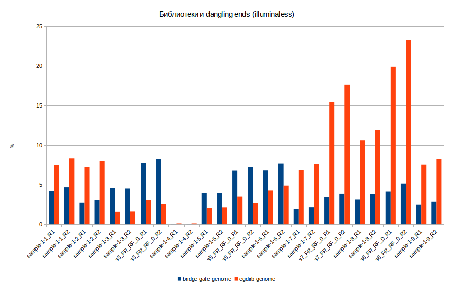

## Данные из статьи китайцев

Результаты FastQC: [раз](http://htmlpreview.github.io/?https://github.com/regnveig/labjournal/blob/master/labjournal/FastQC_results/chinese/bat-Hi-C_mES_alu1_1_10M_fastqc.html), [два](http://htmlpreview.github.io/?https://github.com/regnveig/labjournal/blob/master/labjournal/FastQC_results/chinese/bat-Hi-C_mES_alu1_2_10M_fastqc.html).

Общие впечатления:

1. Мусор есть, но его:
	1. немного (~0.1-1%);
	2. он разнородный, в отличие от наших данных (не все К-меры можно составить в одну последовательность);
	3. только в начале (первые 8-10 букв).
2. Есть адаптеры (Nextera Transposase Sequence).

Были проверены на короткие адаптеры - `CGGTGGC` и `GCCACCG`.
Результат cutadapt:

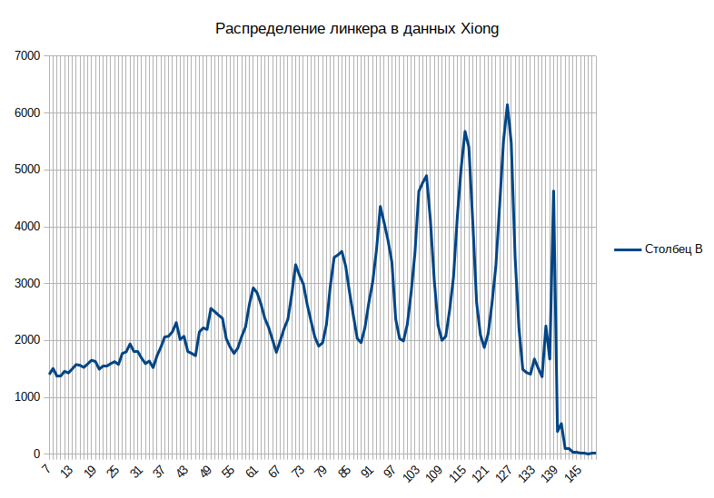

Результаты проверки скриптом anal_seqs: [раз](./scripts_results/chinese_anal_1_191030.csv), [два](./scripts_results/chinese_anal_2_191030.csv).

Проверка моим скриптом:

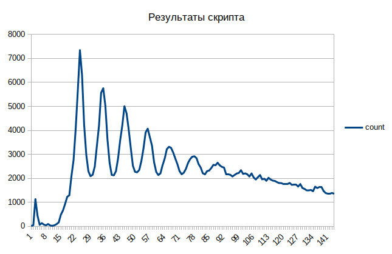

### Анализ контекста букв

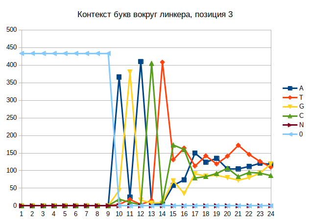
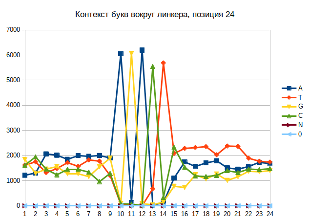
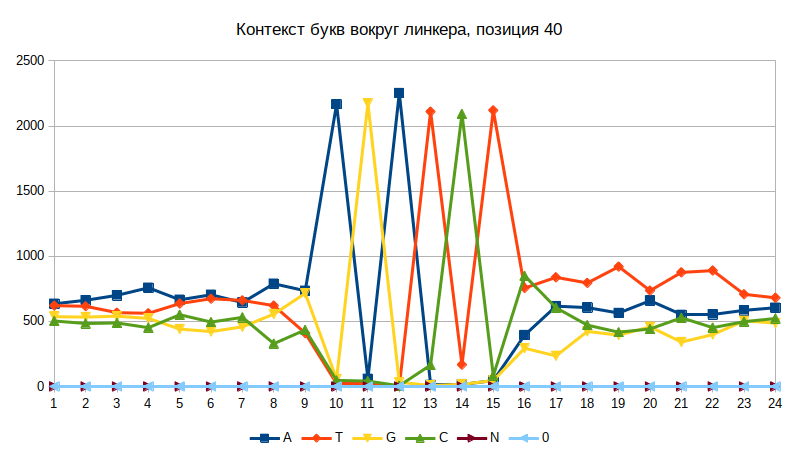
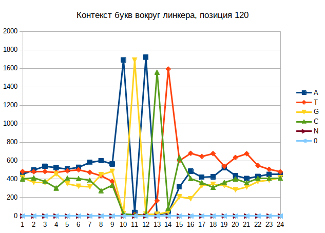

Проверка частоты последовательностей:

| Seq       | Rate |
|:----------|:----:|
| ACGGTGGC  | 32,3 |
| CGGTGGC   | 32,9 |
| CGGTGGCT  | 29,7 |
| ACGGTGGCT | 29.2 |

## Данные Циньхуа

Просмотр производился с помощью cutadapt, `-e 0.2 --overlap [length - 1]`.

| Access Code | GEO Code   | Sample | Adapter            | Rate, % |
|:-----------|:------------|:-------|:-------------------|:-------:|
| SRR5195151 | GSM2465022  | BL01   | CGCGATATCTTATCTGAC | 15.5    |
| SRR5195154 | GSM2465023  | BL02   | CGCGATATCTTATCTGAC | 12.4    |
| SRR5195155 | GSM2465024  | BL03   | CGCGATATCTTATCTGAC | 20.3    |
| SRR5195156 | GSM2465025  | BL04   | CGCGATATCTTATCTGAC | 21.0    |
| SRR5195157 | GSM2465026  | BL05   | CGCGATATCTTATCTGAC | 20.0    |
| SRR5878212 | GSM2721788  | BL06   | CGCGATATCTTATCTGAC | 21.2    |
| SRR5878213 | GSM2721789  | BL07   | -                  | -       |
| SRR5878214 | GSM2721790  | BL08   | -                  | -       |
| SRR5878215 | GSM2721791  | BL09   | -                  | -       |
| SRR5878216 | GSM2721792  | BL10   | GCTGAGG            | 75.0    |
| SRR5878217 | GSM2721793  | BL11   | -                  | -       |
| SRR5878218 | GSM2721794  | BL12   | -                  | -       |
| SRR5878219 | GSM2721795  | BL13   | -                  | -       |

Команда:

```bash
SEQ1="CGCGATATCTTATCTGAC"; SEQ2="GCTGAGG"; LENGTH=$(echo "print(len(\""$SEQ1"\") - 2)" | python3); OUTPUT_FOLDER="/dev/datasets/FairWind/_results/check"; for fn in SRR5195151; do cutadapt -j 10 -b $SEQ1 -O $LENGTH -e 0.2 -o /dev/null /dev/datasets/ngs_data/Maria_ligata/"$fn"_1M.fastq.gz > $OUTPUT_FOLDER/"$fn"_1M_cutadapt.txt; done;
```

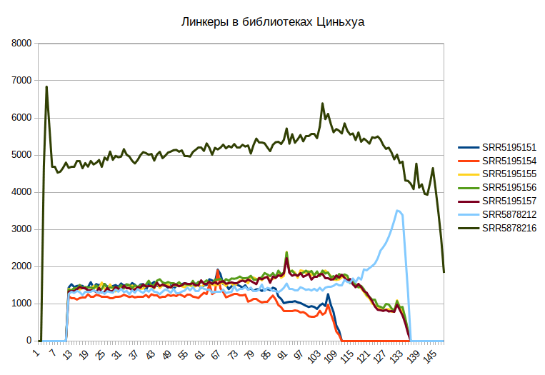

Таблица ODS, [если понадобится](./scripts_results/qinghua_data_191105.ods).

## Дополнительные данные по протоколу Ma et al.

| Access Code | GEO Code  | Data Type              | Species                    | BGG    | EG     | ASv3   |
|:-----------|:-----------|:-----------------------|:---------------------------|:------:|:------:|:-------|
| SRR5063167 | GSM2410309 | Naïve DNase-HiC rep1   | Homo sapiens               | 0.0386 | 5.2030 | [ссылка](./scripts_results/SRR5063167_1M_stat.csv) |
| SRR2033054 | GSM1689794 | DNaseHiC-WG-brain-rep1 | Mus musculus x Mus spretus | 2.7464 | 6.9858 | [ссылка](./scripts_results/SRR2033054_1M_stat.csv) |
