# Поиск вариантов в экзомных данных

## AB matches (with Illumina adapters)

|                                                                                    |                                                                                    |
|:----------------------------------------------------------------------------------:|:----------------------------------------------------------------------------------:|
| 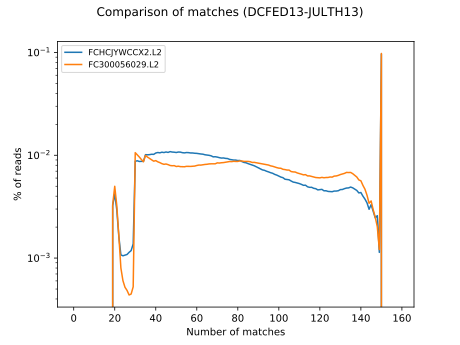 | 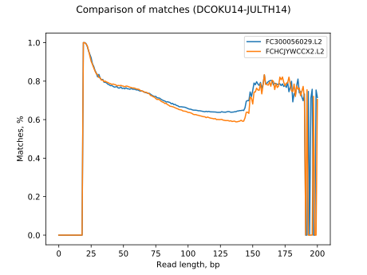 |
| 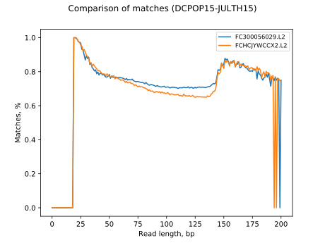 | 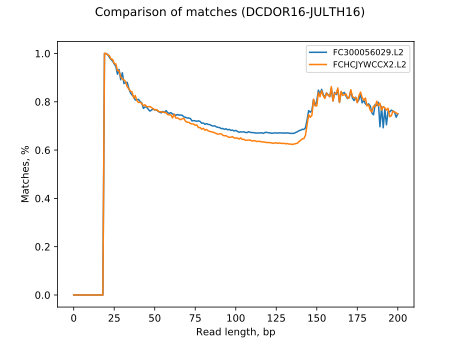 |
| 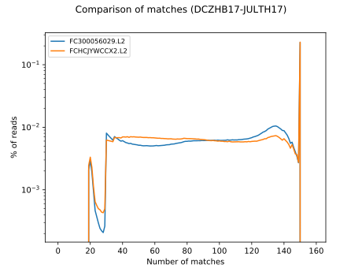 | 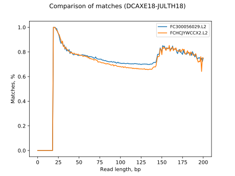 |
| 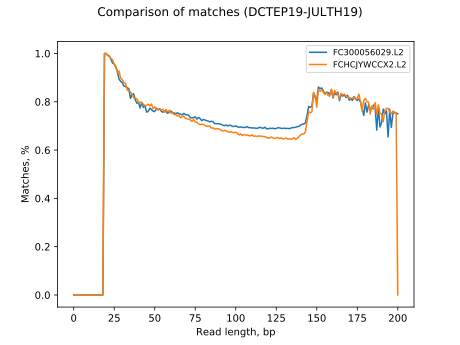 | 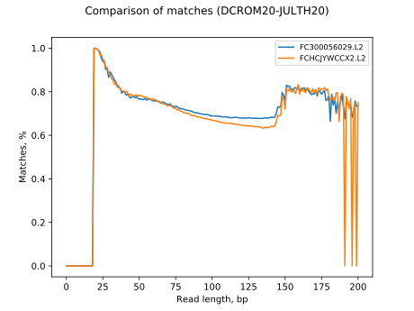 |
| 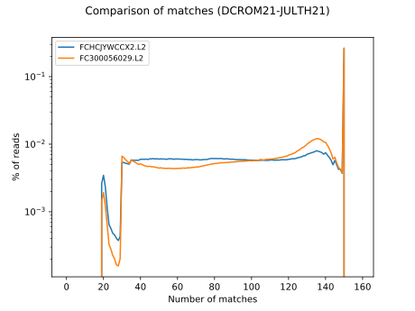 | 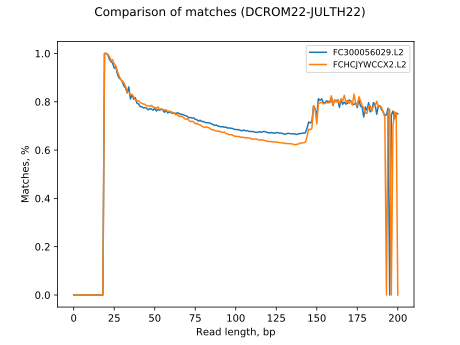 |
| 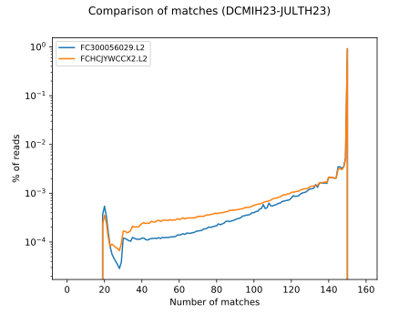 |                                                                                    |

## K562
