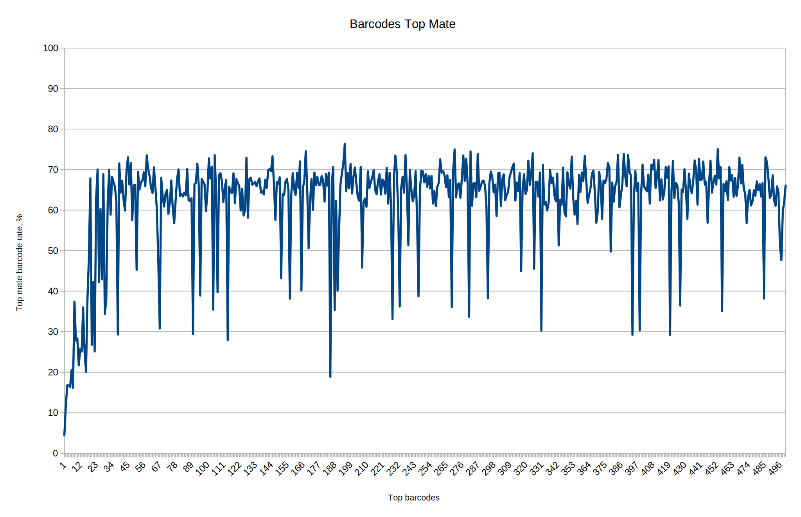
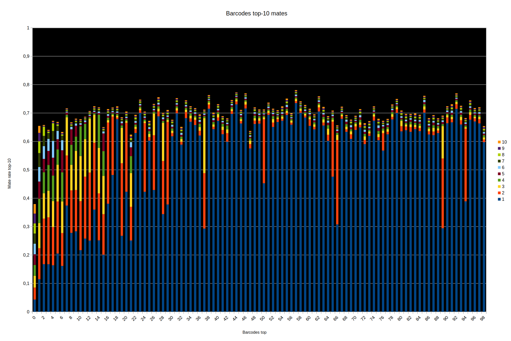
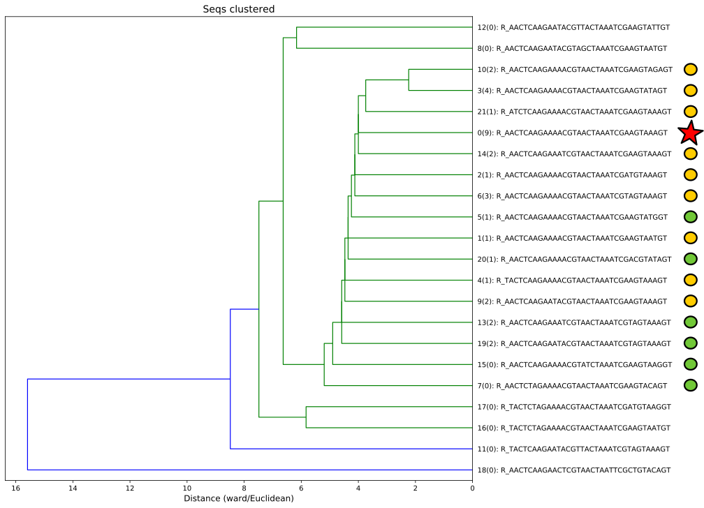

# Barracuda

## Сравнение Cutadapt и BWA

Cutadapt: 

| Metrics | Sequence Not Found | F Only Found | R Only Found | Both Found |
|:---|:---|:---|:---|:---|
| % | 7,75 | 18,08 | 13,11 | 61,04 |

BWA: 

| Metrics | Pair Unmapped | Pair Misplaced | F Mapped Properly, Mate Unmapped | R Mapped Properly, Mate Unmapped | F Mapped Properly, Mate Misplaced | R Mapped Properly, Mate Misplaced | Both Mapped Properly |
|:---|:---|:---|:---|:---|:---|:---|:---|
| % | 4,42 | 4,75 | 8,28 | 4,88 | 7,25 | 3,06 | 67,36 |

## Пары топовых баркодов

## Кластерный анализ первых 23 баркодов (R)

